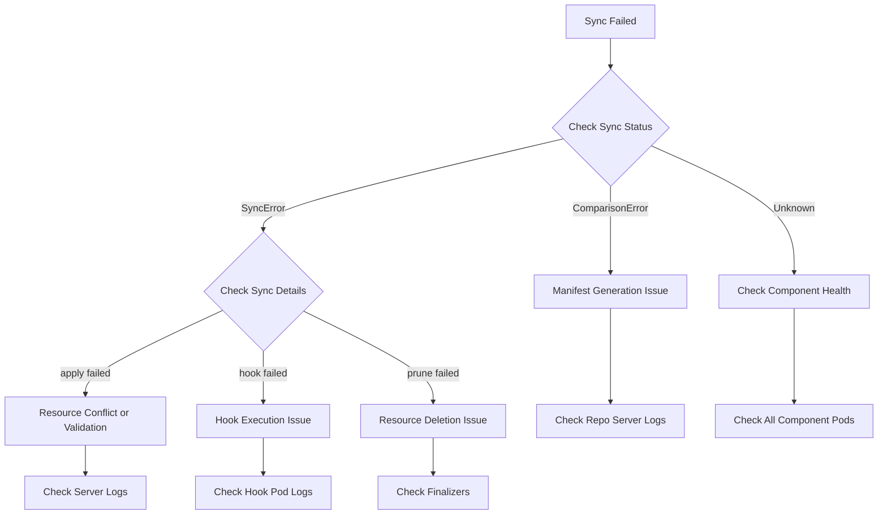

# How to Debug ArgoCD Application Sync Failures Step by Step

Author: [nawazdhandala](https://github.com/nawazdhandala)

Tags: ArgoCD, GitOps, Kubernetes, Troubleshooting, Debugging

Description: A systematic step-by-step guide to debugging ArgoCD application sync failures, covering manifest generation errors, resource conflicts, RBAC issues, and hook failures.

---

Application sync failures in ArgoCD can come from dozens of different root causes. Instead of guessing, you need a systematic approach that narrows down the problem quickly. This guide gives you a repeatable debugging workflow that works for any sync failure.

## The Debugging Flowchart



## Step 1: Get the Sync Status Details

Start by getting the full picture of what went wrong:

```bash
# Get detailed application status
argocd app get my-app

# Get the sync result with details
argocd app get my-app -o json | jq '.status.operationState'

# Get the specific sync error message
argocd app get my-app -o json | jq '.status.operationState.message'

# Get resource-level sync results
argocd app get my-app -o json | jq '.status.operationState.syncResult.resources[] | select(.status != "Synced")'
```

The sync result tells you exactly which resources failed and why. Always start here.

## Step 2: Check for Manifest Generation Errors

If the sync status shows "ComparisonError," the problem is in generating manifests from your source.

```bash
# Try generating manifests locally
argocd app manifests my-app --source live
argocd app manifests my-app --source git

# Check the repo server logs for generation errors
kubectl logs -n argocd deploy/argocd-repo-server --tail=100 | grep -i "error\|fail"
```

Common manifest generation issues:

### Helm Template Errors

```bash
# Check if the Helm chart renders correctly
# Pull the chart and test locally
helm template my-release ./chart/ --values values.yaml

# Check for missing values
argocd app get my-app -o json | jq '.spec.source.helm'
```

### Kustomize Build Errors

```bash
# Test Kustomize build locally
kustomize build ./overlays/production/

# Common error: missing bases or resources
# Check if all referenced files exist in the repo
```

### Missing Files or Wrong Paths

```bash
# Verify the path exists in the repository
argocd app get my-app -o json | jq '{repoURL: .spec.source.repoURL, path: .spec.source.path, targetRevision: .spec.source.targetRevision}'

# Clone and check manually
git clone <repo-url>
ls -la <path>
```

## Step 3: Check for Resource Apply Errors

If manifests generate fine but resources fail to apply, check the specific resource errors:

```bash
# Get failed resources
argocd app get my-app -o json | jq '
  .status.operationState.syncResult.resources[] |
  select(.status == "SyncFailed") |
  {kind: .kind, name: .name, namespace: .namespace, message: .message}
'
```

### Validation Errors

```bash
# Common: immutable field changes
# Error: "field is immutable"
# Fix: Delete and recreate the resource, or use Replace sync strategy

# In the application spec, add:
# syncPolicy:
#   syncOptions:
#     - Replace=true  # Use with caution
```

### Resource Conflicts

```bash
# Check if another controller manages the resource
kubectl get deployment my-deployment -n my-namespace -o jsonpath='{.metadata.annotations}' | jq .

# Check for FailOnSharedResource
argocd app get my-app -o json | jq '.spec.syncPolicy.syncOptions'
```

### RBAC Permission Errors

```bash
# Check if ArgoCD has permission to create/update the resource
kubectl auth can-i create deployments --as=system:serviceaccount:argocd:argocd-application-controller -n target-namespace

# Check cluster role bindings for ArgoCD
kubectl get clusterrolebinding | grep argocd
```

## Step 4: Check for Hook Failures

If the sync fails during PreSync, Sync, or PostSync hooks:

```bash
# List hook resources
argocd app get my-app -o json | jq '
  .status.operationState.syncResult.resources[] |
  select(.hookType != null) |
  {kind: .kind, name: .name, hookType: .hookType, hookPhase: .hookPhase, status: .status, message: .message}
'

# Check hook pod logs
kubectl get pods -n my-namespace -l argocd.argoproj.io/hook
kubectl logs -n my-namespace <hook-pod-name>
```

Common hook issues:
- Job fails because the container exits with non-zero code
- Hook cannot pull the container image
- Hook times out (default is 2 hours for sync operations)
- Hook has wrong RBAC to perform its task

## Step 5: Check Prune Failures

If pruning fails during sync:

```bash
# Check if resources have finalizers blocking deletion
kubectl get <resource-type> <resource-name> -n <namespace> -o jsonpath='{.metadata.finalizers}'

# Check for protection annotations
kubectl get <resource-type> <resource-name> -n <namespace> -o jsonpath='{.metadata.annotations}'
```

Resources with `argocd.argoproj.io/sync-options: Prune=false` will not be pruned even with auto-prune enabled.

## Step 6: Check ArgoCD Component Health

Sometimes sync failures are caused by ArgoCD infrastructure problems:

```bash
# Check all ArgoCD pods
kubectl get pods -n argocd

# Check controller health - this is the component that does syncing
kubectl logs -n argocd deploy/argocd-application-controller --tail=100 | grep -i "error\|fail\|oom"

# Check repo server - this generates manifests
kubectl logs -n argocd deploy/argocd-repo-server --tail=100 | grep -i "error\|fail"

# Check resource usage
kubectl top pods -n argocd
```

## Step 7: Compare Live vs Desired State

When sync keeps failing silently, compare what ArgoCD wants to apply versus what is in the cluster:

```bash
# Show the diff
argocd app diff my-app

# Show the diff with full resource details
argocd app diff my-app --local ./path/to/manifests

# Check for ignored differences that might be causing issues
argocd app get my-app -o json | jq '.spec.ignoreDifferences'
```

## Step 8: Force a Fresh Sync

Sometimes stale cache causes phantom failures:

```bash
# Hard refresh to clear manifest cache
argocd app get my-app --hard-refresh

# Force a sync with prune and retry
argocd app sync my-app --force --prune --retry-limit 3

# If a sync is stuck, terminate it first
argocd app terminate-op my-app
argocd app sync my-app
```

## Step 9: Check Network and Connectivity

```bash
# Verify repo server can reach the Git repository
kubectl exec -n argocd deploy/argocd-repo-server -- \
  git ls-remote https://github.com/your-org/your-repo.git HEAD

# Verify the controller can reach the target cluster
kubectl exec -n argocd deploy/argocd-application-controller -- \
  curl -sk https://kubernetes.default.svc/version
```

## The Complete Debug Script

```bash
#!/bin/bash
# sync-debug.sh - Debug ArgoCD sync failures
# Usage: ./sync-debug.sh <app-name>

APP=${1:?"Usage: $0 <app-name>"}
NS="argocd"

echo "========================================="
echo "Debugging sync failure for: $APP"
echo "========================================="

# Get sync status
echo -e "\n--- Sync Status ---"
argocd app get $APP 2>&1 | head -20

# Get sync error
echo -e "\n--- Sync Error ---"
argocd app get $APP -o json 2>/dev/null | jq -r '.status.operationState.message // "No error message"'

# Get failed resources
echo -e "\n--- Failed Resources ---"
argocd app get $APP -o json 2>/dev/null | jq '
  .status.operationState.syncResult.resources[]? |
  select(.status != "Synced") |
  "\(.kind)/\(.name): \(.status) - \(.message)"
' 2>/dev/null || echo "Could not get resource details"

# Check conditions
echo -e "\n--- Application Conditions ---"
argocd app get $APP -o json 2>/dev/null | jq '.status.conditions[]?' 2>/dev/null || echo "No conditions"

# Check component health
echo -e "\n--- ArgoCD Component Health ---"
kubectl get pods -n $NS --no-headers | while read line; do
    echo "  $line"
done

# Recent controller errors
echo -e "\n--- Recent Controller Errors ---"
kubectl logs -n $NS deploy/argocd-application-controller --tail=30 2>/dev/null | \
  grep -i "error.*$APP\|$APP.*error" || echo "No recent controller errors for $APP"

# Recent repo server errors
echo -e "\n--- Recent Repo Server Errors ---"
kubectl logs -n $NS deploy/argocd-repo-server --tail=30 2>/dev/null | \
  grep -i "error" || echo "No recent repo server errors"

echo -e "\n========================================="
echo "Debug complete for: $APP"
echo "========================================="
```

## Common Sync Failure Quick Fixes

| Symptom | Quick Fix |
|---------|-----------|
| "field is immutable" | Use `Replace=true` sync option or delete resource first |
| "already exists" | Check if another app manages the resource |
| "hook failed" | Check hook pod logs for exit code |
| "timeout" | Increase sync timeout or check slow resources |
| "permission denied" | Fix ArgoCD ClusterRole/ClusterRoleBinding |
| "failed to generate manifests" | Check repo server logs and manifest source |

## Summary

Debugging ArgoCD sync failures follows a predictable pattern: check the sync result for specific error messages, trace the error to the right component (repo server for generation, controller for apply, hooks for pre/post sync), examine logs for details, and then fix the root cause. The debug script above automates most of this process. For ongoing monitoring of sync failures, set up alerts on the `argocd_app_sync_total{phase="Error"}` Prometheus metric with [OneUptime](https://oneuptime.com).
