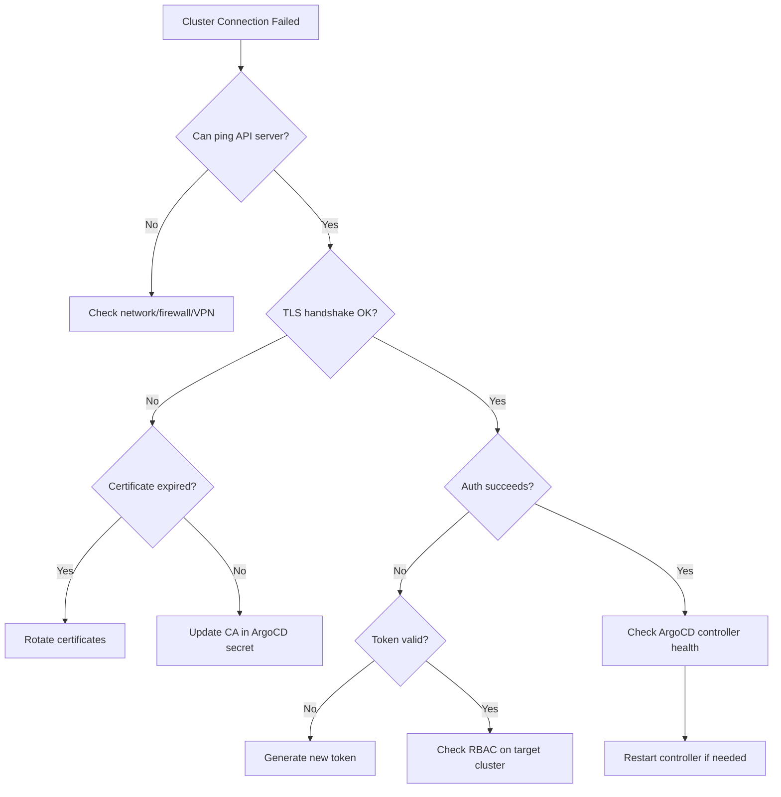

# How to Debug Cluster Connection Issues in ArgoCD

Author: [nawazdhandala](https://github.com/nawazdhandala)

Tags: ArgoCD, GitOps, Kubernetes, Troubleshooting, Debugging

Description: A practical guide to diagnosing and fixing cluster connection issues in ArgoCD, covering TLS errors, authentication failures, network problems, and timeout issues.

---

Cluster connection failures are one of the most common ArgoCD problems in production. When ArgoCD cannot reach a managed cluster, every application in that cluster shows "Unknown" status, and no syncs can happen. This guide provides a systematic approach to diagnosing and fixing these issues.

## Symptoms of Cluster Connection Problems

Before diving into debugging, recognize the symptoms:

```bash
# Check cluster connection status
argocd cluster list

# Output showing a disconnected cluster:
# SERVER                          NAME        STATUS      MESSAGE
# https://10.1.0.1:6443          production  Unknown     dial tcp 10.1.0.1:6443: i/o timeout
# https://kubernetes.default.svc  in-cluster  Successful
```

Applications in the affected cluster will display:

```text
ComparisonError: failed to load cluster information: Get "https://10.1.0.1:6443/api?timeout=30s": dial tcp 10.1.0.1:6443: i/o timeout
```

## Step 1: Check ArgoCD Controller Logs

The application controller logs are your first source of truth:

```bash
# Get recent controller logs filtered for cluster errors
kubectl logs deployment/argocd-application-controller -n argocd \
  --since=10m | grep -E "cluster|connection|x509|unauthorized|timeout"

# For more detailed logs, increase verbosity
kubectl logs deployment/argocd-application-controller -n argocd \
  --since=10m | grep -i "error\|fail\|warn"
```

Common error patterns you will see:

| Error Message | Likely Cause |
|---|---|
| `x509: certificate signed by unknown authority` | CA certificate mismatch or rotation |
| `x509: certificate has expired` | Cluster or client certificate expired |
| `dial tcp: i/o timeout` | Network connectivity issue |
| `dial tcp: connection refused` | API server down or wrong port |
| `Unauthorized` | Token expired or invalid credentials |
| `forbidden` | RBAC permissions insufficient |
| `EOF` | Connection dropped mid-request |

## Step 2: Verify Network Connectivity

Test if the ArgoCD pods can actually reach the cluster API server:

```bash
# Run a debug pod in the argocd namespace with the same network context
kubectl run debug-net --rm -it \
  --namespace=argocd \
  --image=nicolaka/netshoot \
  --restart=Never \
  --overrides='{"spec": {"serviceAccountName": "argocd-application-controller"}}' \
  -- bash

# Inside the debug pod:

# Test TCP connectivity
nc -zv 10.1.0.1 6443
# Expected: Connection to 10.1.0.1 6443 port [tcp/*] succeeded!

# Test HTTPS endpoint
curl -sk https://10.1.0.1:6443/healthz
# Expected: ok

# Test DNS resolution (if using hostname)
nslookup api.production.example.com

# Check routing
traceroute -T -p 6443 10.1.0.1

# Check if there are network policies blocking egress
# (exit the pod first, then check)
```

```bash
# Check network policies in the argocd namespace
kubectl get networkpolicies -n argocd

# If there are egress policies, verify they allow traffic to the cluster
kubectl describe networkpolicy -n argocd
```

## Step 3: Inspect the Cluster Secret

Verify the cluster credentials stored in ArgoCD:

```bash
# List all cluster secrets
kubectl get secrets -n argocd -l argocd.argoproj.io/secret-type=cluster

# Decode and inspect a specific cluster config
kubectl get secret <cluster-secret-name> -n argocd \
  -o jsonpath='{.data.config}' | base64 -d | jq .
```

The config JSON should contain valid credentials. Check these fields:

```json
{
  "bearerToken": "eyJhbGciOiJSUzI1NiI...",
  "tlsClientConfig": {
    "insecure": false,
    "caData": "LS0tLS1CRUdJTi...",
    "certData": "LS0tLS1CRUdJTi...",
    "keyData": "LS0tLS1CRUdJTi..."
  }
}
```

Validate the CA certificate:

```bash
# Extract and check the CA certificate
kubectl get secret <cluster-secret-name> -n argocd \
  -o jsonpath='{.data.config}' | base64 -d | \
  jq -r '.tlsClientConfig.caData' | base64 -d | \
  openssl x509 -text -noout

# Check expiry
kubectl get secret <cluster-secret-name> -n argocd \
  -o jsonpath='{.data.config}' | base64 -d | \
  jq -r '.tlsClientConfig.caData' | base64 -d | \
  openssl x509 -noout -enddate
```

## Step 4: Test Authentication Directly

Use the stored credentials to make a direct API call:

```bash
# Extract the bearer token
TOKEN=$(kubectl get secret <cluster-secret-name> -n argocd \
  -o jsonpath='{.data.config}' | base64 -d | jq -r '.bearerToken')

# Extract the CA cert
kubectl get secret <cluster-secret-name> -n argocd \
  -o jsonpath='{.data.config}' | base64 -d | \
  jq -r '.tlsClientConfig.caData' | base64 -d > /tmp/ca.crt

# Test the connection
curl -s --cacert /tmp/ca.crt \
  -H "Authorization: Bearer $TOKEN" \
  "https://10.1.0.1:6443/api/v1/namespaces" | jq .kind

# Expected: "NamespaceList"
# If you get "Status" with a "Forbidden" message, it is an RBAC issue
# If the connection times out, it is a network issue
# If you get a TLS error, it is a certificate issue
```

## Step 5: Fix Common Issues

### Fix: Certificate Signed by Unknown Authority

The CA certificate in ArgoCD does not match the cluster's current CA:

```bash
# Get the correct CA from the target cluster
kubectl config view --raw -o jsonpath='{.clusters[?(@.name=="production")].cluster.certificate-authority-data}' \
  --kubeconfig=/path/to/target-kubeconfig

# Remove and re-add the cluster
argocd cluster rm https://10.1.0.1:6443
argocd cluster add production-context \
  --kubeconfig /path/to/target-kubeconfig
```

### Fix: Unauthorized or Token Expired

Service account tokens can expire or be revoked:

```bash
# On the target cluster, check the ArgoCD service account
kubectl get serviceaccount argocd-manager -n kube-system

# Create a new token
kubectl create token argocd-manager \
  -n kube-system \
  --duration=8760h  # 1 year

# Or create a long-lived secret-based token
cat <<EOF | kubectl apply -f -
apiVersion: v1
kind: Secret
metadata:
  name: argocd-manager-token
  namespace: kube-system
  annotations:
    kubernetes.io/service-account.name: argocd-manager
type: kubernetes.io/service-account-token
EOF

# Get the new token
kubectl get secret argocd-manager-token -n kube-system \
  -o jsonpath='{.data.token}' | base64 -d
```

Update the cluster secret in ArgoCD with the new token.

### Fix: Connection Timeout

```bash
# Check if the API server is reachable from outside the cluster
curl -sk --connect-timeout 5 https://10.1.0.1:6443/healthz

# If using a load balancer, check its health
# AWS
aws elbv2 describe-target-health \
  --target-group-arn arn:aws:elasticloadbalancing:...:targetgroup/...

# Check if the API server pods are running on the target cluster
kubectl get pods -n kube-system -l component=kube-apiserver
```

### Fix: RBAC Permission Denied

```bash
# On the target cluster, verify the ArgoCD service account has proper permissions
kubectl auth can-i '*' '*' \
  --as=system:serviceaccount:kube-system:argocd-manager \
  --all-namespaces

# If not, apply the proper ClusterRole
cat <<EOF | kubectl apply -f -
apiVersion: rbac.authorization.k8s.io/v1
kind: ClusterRole
metadata:
  name: argocd-manager-role
rules:
  - apiGroups: ["*"]
    resources: ["*"]
    verbs: ["*"]
---
apiVersion: rbac.authorization.k8s.io/v1
kind: ClusterRoleBinding
metadata:
  name: argocd-manager-role-binding
subjects:
  - kind: ServiceAccount
    name: argocd-manager
    namespace: kube-system
roleRef:
  apiGroup: rbac.authorization.k8s.io
  kind: ClusterRole
  name: argocd-manager-role
EOF
```

## Step 6: Force Refresh Cluster Connection

After fixing the underlying issue, force ArgoCD to refresh its cluster connection:

```bash
# Restart the application controller to pick up new credentials
kubectl rollout restart deployment/argocd-application-controller -n argocd

# Or use the CLI to force a refresh
argocd cluster get https://10.1.0.1:6443

# Verify the connection is restored
argocd cluster list
```

## Debugging Flow Diagram



## Preventive Measures

1. **Monitor cluster connections**: Set up alerts when any cluster transitions to "Unknown" status
2. **Use long-lived authentication**: Prefer IAM-based auth over token-based auth for cloud clusters
3. **Automate certificate updates**: Use CronJobs to refresh credentials before they expire
4. **Test connectivity regularly**: Run automated health checks from within the ArgoCD namespace
5. **Keep ArgoCD updated**: Newer versions have improved error messages and connection handling

For ongoing monitoring of ArgoCD cluster connections, consider using [OneUptime](https://oneuptime.com) to set up alerts on ArgoCD metrics and detect connection issues before they impact your deployment pipeline.
