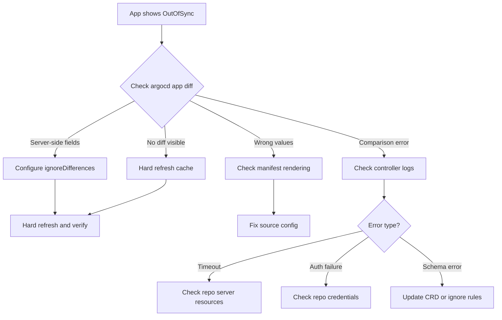

# How to Debug Comparison Result Issues in ArgoCD

Author: [nawazdhandala](https://github.com/nawazdhandala)

Tags: ArgoCD, GitOps, Kubernetes, Troubleshooting

Description: Learn how to debug and resolve ArgoCD comparison result issues including persistent OutOfSync status, phantom diffs, incorrect health assessments, and comparison performance problems.

---

You have set up ArgoCD, deployed your applications, and everything works - until one day an application stubbornly refuses to show as "Synced" no matter how many times you hit the sync button. Comparison result issues are among the most common problems ArgoCD operators face. This guide provides a systematic approach to diagnosing and fixing them.

## The Debugging Mindset

ArgoCD comparison issues fall into a few categories:

- **Persistent OutOfSync** - The application never shows as Synced despite no intentional changes
- **Phantom diffs** - The diff shows changes that do not make sense
- **Flip-flopping sync status** - The application alternates between Synced and OutOfSync
- **Missing diffs** - ArgoCD shows Synced but the cluster state has clearly drifted
- **Comparison errors** - The controller fails to compute the diff entirely

Each category has different root causes and diagnostic steps. Let us walk through them.

## Step 1: Inspect the Raw Diff

Start by examining exactly what ArgoCD thinks is different:

```bash
# View the diff summary
argocd app diff my-app

# View diff with full context
argocd app diff my-app --local ./path/to/manifests

# Export the diff as JSON for detailed analysis
argocd app get my-app -o json | jq '.status.resources[] | select(.status == "OutOfSync")'
```

In the ArgoCD UI, click on the application, then click on any resource showing as OutOfSync. The "Diff" tab shows exactly which fields differ between desired and live state.

Pay attention to the type of difference:

- **Fields present in live but not in desired** - Server-side injection (webhooks, controllers)
- **Fields present in desired but not in live** - Apply failure or incorrect manifest path
- **Fields with different values** - Actual drift or defaulting issues

## Step 2: Check for Server-Side Mutations

The most common cause of persistent OutOfSync is server-side field injection. Identify what is mutating your resources:

```bash
# Check field managers on a resource
kubectl get deployment my-app -n production -o json | \
  jq '.metadata.managedFields[] | {manager: .manager, operation: .operation, time: .time}'

# Check if mutating webhooks exist
kubectl get mutatingwebhookconfigurations

# Check specific webhook configurations
kubectl get mutatingwebhookconfigurations -o json | \
  jq '.items[] | {name: .metadata.name, webhooks: [.webhooks[].name]}'
```

Common mutating agents:

```bash
# Istio sidecar injector
kubectl get mutatingwebhookconfigurations istio-sidecar-injector -o yaml

# Cert-manager webhook
kubectl get mutatingwebhookconfigurations cert-manager-webhook -o yaml

# Cloud provider webhooks (AWS, GCP, Azure)
kubectl get mutatingwebhookconfigurations -l app.kubernetes.io/managed-by
```

## Step 3: Verify Manifest Rendering

Sometimes the issue is not with comparison but with how ArgoCD renders your manifests:

```bash
# See what ArgoCD renders from your source
argocd app manifests my-app --source git

# Compare with what is in the cluster
argocd app manifests my-app --source live

# If using Helm, check rendered output
helm template my-app ./chart -f values.yaml -f values-production.yaml

# If using Kustomize, check built output
kustomize build ./overlays/production
```

Common rendering issues:

- **Helm value override ordering** - Values files and parameters are applied in a specific order
- **Kustomize patch failures** - A patch that does not match creates an empty diff
- **Jsonnet import errors** - Missing libraries or incorrect import paths
- **Environment-specific values** - Wrong values file being used for the target environment

## Step 4: Check for Normalization Issues

ArgoCD normalizes resources before comparison. Sometimes this normalization itself causes issues:

```bash
# Check if resource normalization is configured
kubectl get cm argocd-cm -n argocd -o yaml | grep -A 10 "resource.customizations"

# Check for known normalization bugs in your ArgoCD version
argocd version
```

Common normalization problems:

### Integer vs String Type Mismatches

Kubernetes sometimes converts between integer and string representations:

```yaml
# Your manifest says
replicas: 3

# Live state might show
replicas: "3"  # String instead of integer
```

### Null vs Missing Fields

```yaml
# Your manifest has
spec:
  selector: null

# Live state might omit the field entirely
spec: {}
```

### Array Ordering

Some resources have arrays that Kubernetes sorts differently:

```yaml
# Your manifest
env:
  - name: B_VAR
    value: "b"
  - name: A_VAR
    value: "a"

# Live state (sorted by controller)
env:
  - name: A_VAR
    value: "a"
  - name: B_VAR
    value: "b"
```

## Step 5: Examine Controller Logs

The ArgoCD application controller logs contain detailed information about comparison operations:

```bash
# Get recent controller logs
kubectl logs -n argocd deployment/argocd-application-controller \
  --tail=100 | grep "my-app"

# Filter for comparison-related messages
kubectl logs -n argocd deployment/argocd-application-controller \
  --tail=200 | grep -i "compari\|diff\|sync.*status\|reconcil"

# Check for errors during comparison
kubectl logs -n argocd deployment/argocd-application-controller \
  --tail=500 | grep -i "error\|warn\|fail" | grep "my-app"

# Increase log verbosity temporarily
kubectl patch deployment argocd-application-controller -n argocd \
  --type='json' -p='[{"op": "replace", "path": "/spec/template/spec/containers/0/command", "value": ["argocd-application-controller", "--loglevel", "debug"]}]'
```

Look for these log patterns:

- `Comparison error` - The diff calculation failed entirely
- `Unable to load resource` - ArgoCD cannot fetch the live resource
- `Manifest generation error` - Source rendering failed
- `Resource not found` - The resource was deleted from the cluster

## Step 6: Hard Refresh and Cache Issues

ArgoCD caches manifest generation results and comparison outcomes. Stale caches cause incorrect sync status:

```bash
# Hard refresh - forces re-fetch from Git and re-comparison
argocd app get my-app --hard-refresh

# Invalidate the repo server cache
kubectl delete pod -n argocd -l app.kubernetes.io/name=argocd-repo-server

# Clear the Redis cache (nuclear option)
kubectl exec -n argocd deployment/argocd-redis -- redis-cli FLUSHALL
```

Cache-related symptoms:

- Sync status does not update after pushing to Git
- Old manifest versions are being compared
- Application shows Synced immediately after a breaking change

## Step 7: Check Resource Tracking

ArgoCD tracks which resources belong to which application using labels or annotations. Tracking issues cause resources to be missed or double-counted:

```bash
# Check tracking method
kubectl get cm argocd-cm -n argocd -o yaml | grep "application.resourceTrackingMethod"

# Verify resource has correct tracking label/annotation
kubectl get deployment my-app -n production -o json | \
  jq '{labels: .metadata.labels, annotations: .metadata.annotations}' | \
  grep -i "argocd\|app.kubernetes.io"
```

If resources are not tracked correctly, ArgoCD might compare against the wrong live resource or miss resources entirely.

## Step 8: Validate Ignore Rules

If you have configured `ignoreDifferences` and they are not working:

```bash
# Check the Application spec for ignore rules
argocd app get my-app -o yaml | grep -A 30 ignoreDifferences

# Check system-level ignore rules
kubectl get cm argocd-cm -n argocd -o yaml | grep -A 20 ignoreDifferences

# Validate JQ expressions locally
echo '{"metadata":{"annotations":{"test":"value"}}}' | \
  jq '.metadata.annotations["test"]'

# Validate JSON pointers
# /spec/replicas -> correct
# spec.replicas -> WRONG (dots not slashes)
# /spec/replicas/ -> WRONG (trailing slash)
```

Common ignore rule mistakes:

- Using dots instead of slashes in JSON pointers
- Forgetting to escape slashes in key names (`~1` for `/`)
- Wrong API group in ignore rules (`apps/v1` instead of `apps`)
- JQ expression syntax errors that fail silently

## Debugging Workflow Diagram



## Performance Issues in Comparison

Large applications with hundreds of resources can experience slow comparison:

```bash
# Check comparison duration in metrics
kubectl port-forward -n argocd svc/argocd-metrics 8082:8082

# Query comparison latency
curl -s localhost:8082/metrics | grep argocd_app_reconcile

# Check resource count per application
argocd app get my-app -o json | jq '.status.resources | length'
```

If comparison is slow:

1. **Split large applications** into smaller, focused applications
2. **Increase controller resources** if CPU is the bottleneck
3. **Enable server-side diff** which can be faster for large resource sets
4. **Reduce sync frequency** for non-critical applications

## Quick Reference Checklist

When debugging comparison issues, work through this checklist:

1. Run `argocd app diff my-app` to see the actual difference
2. Check if the diff is from server-side mutations (webhooks, controllers)
3. Verify manifest rendering with `argocd app manifests my-app --source git`
4. Hard refresh with `argocd app get my-app --hard-refresh`
5. Check controller logs for errors
6. Validate any ignore rules are syntactically correct
7. Verify resource tracking labels and annotations
8. Check ArgoCD version for known comparison bugs

Most comparison issues resolve at step 2 or 3. If you find yourself at step 8, you may be dealing with a genuine ArgoCD bug - check the GitHub issues and consider upgrading. For details on configuring ignore rules, see [How to Override Default Compare Behavior](https://oneuptime.com/blog/post/2026-02-26-argocd-override-default-compare-behavior/view).
