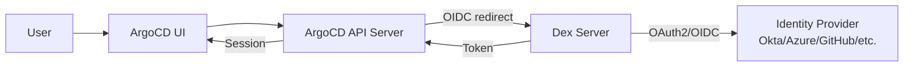

# How to Debug ArgoCD Dex Server Issues

Author: [nawazdhandala](https://github.com/nawazdhandala)

Tags: ArgoCD, GitOps, Kubernetes, Dex, Authentication

Description: Learn how to debug ArgoCD Dex server issues including connector failures, OIDC errors, token problems, and CrashLoopBackOff with practical diagnostic commands and solutions.

---

Dex is the OIDC identity broker that ArgoCD uses for SSO authentication. When Dex breaks, no one can log in through SSO, and the error messages are often confusing. This guide covers every common Dex issue from startup failures to connector misconfigurations.

## How Dex Fits Into ArgoCD



Dex runs as a separate deployment and serves two main functions:
1. Acts as an OIDC provider for ArgoCD (port 5556 for HTTP, 5557 for gRPC)
2. Proxies authentication to external identity providers via connectors

## Step 1: Check Dex Pod Health

```bash
# Get Dex pod status
kubectl get pods -n argocd -l app.kubernetes.io/name=argocd-dex-server -o wide

# Check for restarts and crash reasons
kubectl describe pods -n argocd -l app.kubernetes.io/name=argocd-dex-server | \
  grep -A10 "State:\|Last State:\|Events:"

# Check resource usage
kubectl top pods -n argocd -l app.kubernetes.io/name=argocd-dex-server
```

## Step 2: Check Dex Logs

```bash
# Recent Dex logs
kubectl logs -n argocd deploy/argocd-dex-server --tail=100

# Error logs
kubectl logs -n argocd deploy/argocd-dex-server --tail=200 | grep -i "error\|fail\|panic"

# Connector-related logs
kubectl logs -n argocd deploy/argocd-dex-server --tail=200 | grep -i "connector"

# Previous container logs (if Dex crashed)
kubectl logs -n argocd deploy/argocd-dex-server --previous --tail=100
```

## Issue: Dex CrashLoopBackOff

The most common Dex startup failure is invalid configuration.

```bash
# Check the exit code
kubectl get pods -n argocd -l app.kubernetes.io/name=argocd-dex-server -o json | \
  jq '.items[].status.containerStatuses[] | {
    restartCount,
    state: .state,
    lastTermination: .lastState.terminated
  }'

# Get the actual error from logs
kubectl logs -n argocd -l app.kubernetes.io/name=argocd-dex-server --previous --tail=50
```

Common causes of CrashLoopBackOff:

### Invalid Dex Configuration YAML

```bash
# Extract and validate the Dex config
kubectl get configmap argocd-cm -n argocd -o jsonpath='{.data.dex\.config}' | \
  python3 -c "import yaml, sys; yaml.safe_load(sys.stdin); print('Valid YAML')"
```

### Missing Client Secret

```bash
# Check if Dex secrets are in argocd-secret
kubectl get secret argocd-secret -n argocd -o json | \
  python3 -c "
import sys, json, base64
data = json.load(sys.stdin)['data']
dex_keys = [k for k in data if 'dex' in k.lower()]
print('Dex secrets found:', dex_keys if dex_keys else 'NONE')
"
```

### ArgoCD URL Not Set

Dex derives its issuer URL from the ArgoCD URL. If it is not set, Dex crashes:

```bash
# Check ArgoCD URL
kubectl get configmap argocd-cm -n argocd -o jsonpath='{.data.url}'
```

If empty, set it:

```bash
kubectl patch configmap argocd-cm -n argocd --type merge -p '{
  "data": {
    "url": "https://argocd.example.com"
  }
}'
kubectl rollout restart deployment argocd-dex-server -n argocd
```

## Issue: "Connector Not Found" During Login

```bash
# List configured connectors
kubectl get configmap argocd-cm -n argocd -o jsonpath='{.data.dex\.config}' | \
  grep -E "type:|id:|name:"

# Verify the connector ID matches what the UI sends
# The Dex discovery endpoint shows available connectors
kubectl exec -n argocd deploy/argocd-dex-server -- \
  curl -s http://localhost:5556/dex/.well-known/openid-configuration 2>/dev/null
```

Example of a properly configured connector:

```yaml
dex.config: |
  connectors:
    - type: github
      id: github          # This ID must be consistent
      name: GitHub
      config:
        clientID: your-client-id
        clientSecret: $dex.github.clientSecret
        orgs:
          - name: your-org
```

## Issue: OIDC Discovery Failed

Dex cannot reach the upstream identity provider:

```bash
# Test OIDC discovery endpoint from Dex pod
kubectl exec -n argocd deploy/argocd-dex-server -- \
  wget -qO- https://accounts.google.com/.well-known/openid-configuration 2>&1 | head -5

# For Okta
kubectl exec -n argocd deploy/argocd-dex-server -- \
  wget -qO- https://your-org.okta.com/.well-known/openid-configuration 2>&1 | head -5
```

If the OIDC endpoint is unreachable:
- Check network policies
- Check if the Dex pod can reach the internet
- Check proxy configuration

```bash
# Check if Dex needs a proxy
kubectl get deploy argocd-dex-server -n argocd -o json | \
  jq '.spec.template.spec.containers[0].env[] | select(.name | test("proxy"; "i"))'

# Set proxy if needed
kubectl set env deployment/argocd-dex-server -n argocd \
  HTTPS_PROXY=http://proxy.example.com:3128 \
  NO_PROXY=argocd-server,argocd-redis,kubernetes.default.svc
```

## Issue: "Invalid Grant" or "Token Exchange Failed"

This typically means the authorization code has expired or was already used:

```bash
# Check Dex logs for token exchange errors
kubectl logs -n argocd deploy/argocd-dex-server --tail=100 | grep -i "token\|grant\|exchange"
```

Common causes:
- Clock skew between Dex and the identity provider
- Authorization code used twice (user double-clicked or hit back)
- Token signing key mismatch after Dex restart

Fix clock skew:

```bash
# Check time on Dex pod
kubectl exec -n argocd deploy/argocd-dex-server -- date

# Compare with your identity provider's expected time
date -u
```

## Issue: Groups Not Coming Through

Users can log in but group claims are empty, so RBAC does not work:

```bash
# Check Dex logs for group information
kubectl logs -n argocd deploy/argocd-dex-server --tail=200 | grep -i "group"
```

Make sure your connector requests group scopes:

```yaml
dex.config: |
  connectors:
    - type: oidc
      id: okta
      name: Okta
      config:
        issuer: https://your-org.okta.com
        clientID: your-client-id
        clientSecret: $dex.okta.clientSecret
        # These settings are critical for groups
        insecureEnableGroups: true
        scopes:
          - openid
          - profile
          - email
          - groups
        # For some providers, you need to specify the groups claim
        getUserInfo: true
```

For GitHub, make sure orgs are configured:

```yaml
dex.config: |
  connectors:
    - type: github
      id: github
      name: GitHub
      config:
        clientID: your-client-id
        clientSecret: $dex.github.clientSecret
        orgs:
          - name: your-org
        # Load teams as groups
        loadAllGroups: true
        teamNameField: slug
```

## Issue: Dex Cannot Read Secrets

```bash
# Check the Dex RBAC
kubectl get role argocd-dex-server -n argocd -o yaml
kubectl get rolebinding argocd-dex-server -n argocd -o yaml

# Check if the service account exists
kubectl get serviceaccount argocd-dex-server -n argocd
```

## Testing Dex Endpoints

```bash
# Check Dex health
kubectl exec -n argocd deploy/argocd-dex-server -- \
  wget -qO- http://localhost:5556/dex/healthz 2>&1

# Check gRPC health (used by ArgoCD server)
kubectl exec -n argocd deploy/argocd-server -- \
  curl -s http://argocd-dex-server:5557/healthz 2>/dev/null

# Check OIDC discovery
kubectl exec -n argocd deploy/argocd-dex-server -- \
  wget -qO- http://localhost:5556/dex/.well-known/openid-configuration 2>&1
```

## Complete Debug Script

```bash
#!/bin/bash
# dex-debug.sh

NS="argocd"
echo "=== ArgoCD Dex Server Debug ==="

echo -e "\n--- Pod Status ---"
kubectl get pods -n $NS -l app.kubernetes.io/name=argocd-dex-server -o wide

echo -e "\n--- Restart Info ---"
kubectl get pods -n $NS -l app.kubernetes.io/name=argocd-dex-server -o json | \
  jq '.items[].status.containerStatuses[] | {restarts: .restartCount, lastTermination: .lastState.terminated.reason}'

echo -e "\n--- ArgoCD URL ---"
kubectl get configmap argocd-cm -n $NS -o jsonpath='{.data.url}'
echo ""

echo -e "\n--- Dex Config Present ---"
CONFIG=$(kubectl get configmap argocd-cm -n $NS -o jsonpath='{.data.dex\.config}')
if [ -z "$CONFIG" ]; then
    echo "WARNING: No dex.config found"
else
    echo "Connectors configured:"
    echo "$CONFIG" | grep -E "type:|id:" | sed 's/^/  /'
fi

echo -e "\n--- Dex Secrets ---"
kubectl get secret argocd-secret -n $NS -o json 2>/dev/null | \
  python3 -c "
import sys, json
try:
    data = json.load(sys.stdin)['data']
    dex_keys = [k for k in data if 'dex' in k.lower()]
    print('Keys:', dex_keys if dex_keys else 'NONE')
except: print('Could not read secrets')
" 2>/dev/null

echo -e "\n--- Dex Health ---"
kubectl exec -n $NS deploy/argocd-dex-server -- \
  wget -qO- http://localhost:5556/dex/healthz 2>&1 || echo "Health check failed"

echo -e "\n--- Recent Errors ---"
kubectl logs -n $NS deploy/argocd-dex-server --tail=30 | \
  grep -i "error\|fail\|panic" | tail -10
```

## Summary

Dex issues in ArgoCD usually fall into three categories: configuration errors (invalid YAML, missing secrets, wrong connector settings), network issues (cannot reach the identity provider), and token/session problems (clock skew, expired codes). Always start by checking if Dex is running, then examine the configuration in `argocd-cm`, verify secrets in `argocd-secret`, and test connectivity to your identity provider. For ongoing monitoring of authentication health, set up alerts on Dex pod restarts and login failure rates with [OneUptime](https://oneuptime.com).
