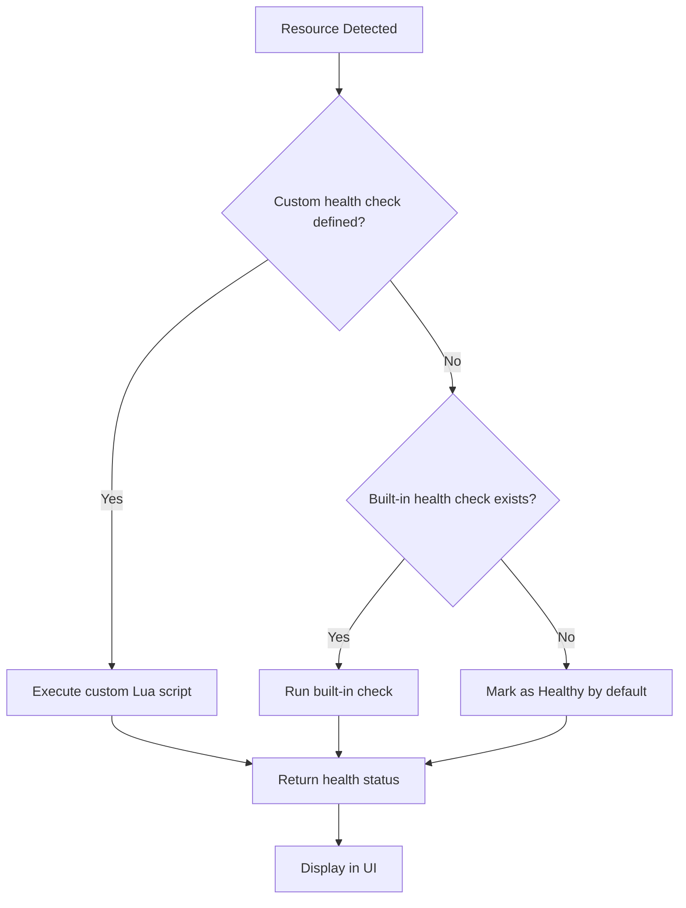

# How to Debug Health Check Failures in ArgoCD

Author: [nawazdhandala](https://github.com/nawazdhandala)

Tags: ArgoCD, GitOps, Kubernetes, Troubleshooting

Description: Learn how to diagnose and fix health check failures in ArgoCD, including built-in check issues, custom Lua script errors, and common health status problems across different resource types.

---

When an ArgoCD application shows a "Degraded" or perpetually "Progressing" health status, figuring out why can be frustrating. The health check system involves built-in checks for standard Kubernetes resources, custom Lua scripts for CRDs, and the interaction between resource status fields and ArgoCD's health assessment logic. Problems can come from any of these layers.

This guide covers a systematic approach to debugging health check failures so you can quickly identify and fix the root cause.

## Understanding the Health Check Pipeline

Before diving into debugging, it helps to understand how ArgoCD evaluates resource health. The process follows this order:



ArgoCD first checks if you have defined a custom health check in `argocd-cm` for the resource's group and kind. If yes, it runs your Lua script. If not, it falls back to built-in checks for standard Kubernetes resources (Deployment, Service, Ingress, etc.). If neither exists, the resource is considered healthy by default.

## Step 1: Identify Which Health Check Is Running

The first thing to determine is whether your resource is using a custom health check, a built-in one, or none at all.

Check the `argocd-cm` ConfigMap for custom checks:

```bash
# List all custom health checks configured
kubectl get configmap argocd-cm -n argocd -o yaml | grep "resource.customizations.health"
```

If your resource type is not listed there, ArgoCD is using either a built-in check or the default "always healthy" behavior.

## Step 2: Check the Resource Status Directly

The most common cause of health check failures is the underlying resource actually being unhealthy. Check the resource status in Kubernetes:

```bash
# Get the full resource with status
kubectl get <resource-type> <resource-name> -n <namespace> -o yaml

# For example, check a Deployment's conditions
kubectl get deployment my-app -n default -o jsonpath='{.status.conditions[*]}'

# Check pod status if the deployment is unhealthy
kubectl get pods -n default -l app=my-app
kubectl describe pod <pod-name> -n default
```

Compare what you see in the resource status with what ArgoCD is reporting. If the resource is genuinely unhealthy, fix the underlying issue rather than the health check.

## Step 3: Test Custom Lua Scripts

If you have a custom Lua health check that is not working as expected, you need to test the script. ArgoCD does not provide a built-in way to test Lua scripts in isolation, but you can use the ArgoCD CLI to inspect what the health check returns.

```bash
# Get the application resource tree with health info
argocd app resources my-app --output json

# Force a refresh to re-evaluate health
argocd app get my-app --refresh --hard-refresh
```

### Common Lua Script Errors

**Nil reference errors**: The most frequent Lua error in health checks is trying to access a field on a nil object.

Bad:
```lua
-- This will crash if obj.status is nil
if obj.status.phase == "Running" then
```

Good:
```lua
-- Always check for nil first
if obj.status ~= nil and obj.status.phase == "Running" then
```

**Missing return statement**: Every code path must return the `hs` table.

Bad:
```lua
hs = {}
if obj.status ~= nil then
  if obj.status.phase == "Running" then
    hs.status = "Healthy"
    hs.message = "Running"
    return hs
  end
  -- Missing return for other phases
end
-- Missing return when status is nil
```

Good:
```lua
hs = {}
if obj.status ~= nil and obj.status.phase == "Running" then
  hs.status = "Healthy"
  hs.message = "Running"
else
  hs.status = "Progressing"
  hs.message = "Waiting for resource"
end
return hs
```

**Wrong field names**: Lua is case-sensitive and Kubernetes field names are camelCase.

```lua
-- Wrong - Lua is case-sensitive
if obj.status.Phase == "Running" then

-- Correct
if obj.status.phase == "Running" then
```

**String comparison issues**: Status values might have unexpected whitespace or casing.

```lua
-- Use tostring() for safety and trim if needed
local phase = tostring(obj.status.phase)
if phase == "Running" then
```

## Step 4: Check ArgoCD Controller Logs

The application controller is responsible for running health checks. If a Lua script has syntax errors or runtime failures, you will see errors in the controller logs.

```bash
# Check application controller logs for health check errors
kubectl logs -n argocd deployment/argocd-application-controller | grep -i "health"

# Look for Lua-specific errors
kubectl logs -n argocd deployment/argocd-application-controller | grep -i "lua"

# Check for specific resource errors
kubectl logs -n argocd deployment/argocd-application-controller | grep "my-resource-name"
```

Common error messages you might see:

- `lua: runtime error` - Your Lua script has a bug
- `failed to get resource health` - ArgoCD could not evaluate health for a resource
- `health check timed out` - The health check script took too long

## Step 5: Validate the ConfigMap Key Format

A subtle but common issue is getting the ConfigMap key format wrong. The key must follow this exact pattern:

```
resource.customizations.health.<group>_<kind>
```

For example:
- `resource.customizations.health.apps_Deployment` - for Deployment in the apps group
- `resource.customizations.health.velero.io_Backup` - for Velero Backup
- `resource.customizations.health.serving.knative.dev_Service` - for Knative Service

Common mistakes:

```yaml
# Wrong - using / instead of _
resource.customizations.health.velero.io/Backup: |

# Wrong - lowercase kind
resource.customizations.health.velero.io_backup: |

# Wrong - including version in group
resource.customizations.health.velero.io/v1_Backup: |

# Correct
resource.customizations.health.velero.io_Backup: |
```

## Step 6: Check for Conflicting Health Checks

If you have both a wildcard and specific health check defined, the specific one takes precedence. But sometimes this leads to unexpected behavior.

```yaml
# This generic check matches all Crossplane resources
resource.customizations.health.*.crossplane.io_*: |
  -- generic check

# This specific check overrides for S3 Bucket
resource.customizations.health.s3.aws.crossplane.io_Bucket: |
  -- specific check
```

Verify that the right check is being applied by temporarily adding a distinctive message to your health check script and checking what appears in the ArgoCD UI.

## Step 7: Handle Special Health Status Cases

### Resources Stuck in "Progressing"

If a resource is permanently showing "Progressing", either the health check never transitions to another state, or the resource genuinely never reaches a ready state.

```bash
# Check if the resource is actually stuck
kubectl get <resource> -n <namespace> -w

# Check events for clues
kubectl events -n <namespace> --for=<resource-type>/<resource-name>
```

### Resources Showing "Missing"

"Missing" means ArgoCD expects a resource that does not exist in the cluster. This is not a health check issue but rather a sync issue. The resource is in your Git repo but not deployed.

```bash
# Check if the resource actually exists
kubectl get <resource> -n <namespace>

# Check sync status
argocd app get my-app
```

### Resources Always Showing "Healthy"

If a CRD always shows as healthy regardless of its actual state, there is probably no custom health check defined for it. ArgoCD defaults to "Healthy" for unknown resource types.

```bash
# Verify no health check exists for this type
kubectl get configmap argocd-cm -n argocd -o yaml | grep "resource.customizations.health.<your-group>"
```

## Step 8: Restart After Changes

After modifying health check configurations in `argocd-cm`, ArgoCD should pick up changes automatically. However, if changes are not taking effect, try restarting the application controller:

```bash
# Restart the application controller to pick up new health checks
kubectl rollout restart deployment argocd-application-controller -n argocd

# Wait for the rollout to complete
kubectl rollout status deployment argocd-application-controller -n argocd

# Force refresh all applications
argocd app list -o name | xargs -I {} argocd app get {} --hard-refresh
```

## Quick Debugging Checklist

1. Is the resource genuinely healthy? Check `kubectl get` and `kubectl describe`.
2. Is a custom health check defined? Check `argocd-cm`.
3. Is the ConfigMap key formatted correctly? Check group and kind naming.
4. Does the Lua script handle nil values? Check every field access.
5. Does every code path return the `hs` table? Trace through all branches.
6. Are there Lua errors in the controller logs? Check `kubectl logs`.
7. Did the ConfigMap change get picked up? Restart the controller if needed.

For more on writing custom health checks, see [how to write custom health check scripts in Lua](https://oneuptime.com/blog/post/2026-02-26-argocd-custom-health-check-lua-scripts/view). For monitoring degraded resources, check out [how to monitor degraded resources in ArgoCD](https://oneuptime.com/blog/post/2026-02-26-argocd-monitor-degraded-resources/view).
