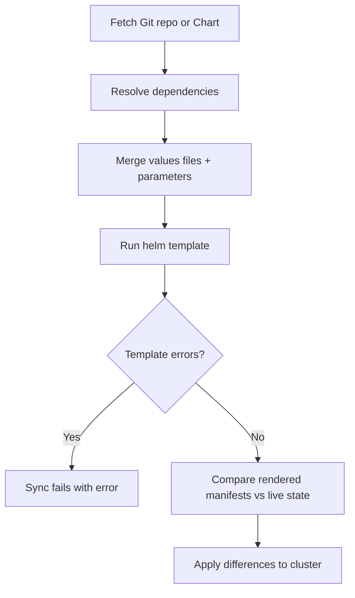

# How to Debug Helm Template Rendering Issues in ArgoCD

Author: [nawazdhandala](https://github.com/nawazdhandala)

Tags: ArgoCD, GitOps, Kubernetes, Helm, Troubleshooting

Description: Learn how to debug Helm template rendering issues in ArgoCD with practical techniques for identifying and fixing common template errors and sync failures.

---

When ArgoCD fails to sync a Helm-based application, the problem often traces back to template rendering. Helm templates can fail for many reasons - invalid YAML, missing values, incorrect function usage, type mismatches, or dependency resolution failures. Debugging these issues requires understanding how ArgoCD renders Helm charts and knowing which tools and techniques to use.

This guide walks through a systematic approach to debugging Helm template rendering in ArgoCD, covering the most common issues and their solutions.

## Understanding the Rendering Pipeline

When ArgoCD syncs a Helm application, it goes through these steps:



Rendering failures happen at step D. The error messages from `helm template` are passed through to ArgoCD's sync status.

## Step 1: Check the Sync Error Message

The first place to look is the application's sync status:

```bash
# Get the sync status and any error messages
argocd app get my-app

# For more detail, check the conditions
argocd app get my-app -o json | jq '.status.conditions'

# Check the operation state for sync errors
argocd app get my-app -o json | jq '.status.operationState.message'
```

In the ArgoCD UI, click on the application and look at the "Sync Status" section. Error messages from Helm rendering appear here.

## Step 2: Preview the Rendered Manifests

Try to render the manifests to see what ArgoCD is working with:

```bash
# Attempt to render manifests through ArgoCD
argocd app manifests my-app

# If this fails, the error message tells you what went wrong
```

If the above fails, try rendering locally:

```bash
# Clone the repo and render locally
git clone https://github.com/myorg/my-charts.git
cd my-charts/charts/my-app

# Build dependencies first
helm dependency update

# Render with the same values ArgoCD uses
helm template my-app . \
  -f values.yaml \
  -f values-prod.yaml \
  --set image.tag=v2.0.0 \
  --debug
```

The `--debug` flag shows more detailed error information.

## Step 3: Use Helm Lint

Helm's lint command catches many template issues:

```bash
# Lint the chart
helm lint charts/my-app -f values.yaml -f values-prod.yaml

# Lint with strict mode (catches more issues)
helm lint charts/my-app -f values.yaml -f values-prod.yaml --strict
```

Common lint findings:
- Missing required values
- Chart.yaml issues
- Template syntax errors
- YAML formatting problems

## Common Rendering Issues and Solutions

### Issue 1: nil Pointer / Missing Values

**Error**: `nil pointer evaluating interface {}.tag` or `can't evaluate field tag in type interface {}`

**Cause**: A template references a value that does not exist.

```yaml
# Template with the error
image: {{ .Values.image.repository }}:{{ .Values.image.tag }}

# But values.yaml does not have the 'image' key at all
```

**Solution**: Add default values or use the `default` function:

```yaml
# Safe template with defaults
image: {{ .Values.image.repository | default "myorg/my-app" }}:{{ .Values.image.tag | default "latest" }}

# Or use 'with' for optional blocks
{{- with .Values.image }}
image: {{ .repository }}:{{ .tag }}
{{- end }}
```

In ArgoCD, make sure your values files provide all required values:

```yaml
helm:
  values: |
    image:
      repository: myorg/my-app
      tag: v2.0.0
```

### Issue 2: YAML Indentation Errors

**Error**: `error converting YAML to JSON: yaml: line X: did not find expected key`

**Cause**: Helm's template rendering produced invalid YAML, usually due to incorrect indentation in templates.

```yaml
# Bad template - indentation is wrong
spec:
  containers:
{{ toYaml .Values.containers | indent 4 }}  # Should be indent 4, not indent 2
```

**Solution**: Fix the `indent` or `nindent` value in the template, or if you are overriding values, make sure your YAML is properly formatted:

```yaml
# Correct values format
helm:
  values: |
    containers:
      - name: my-app
        image: myorg/my-app:v2.0.0
        ports:
          - containerPort: 8080
```

### Issue 3: Type Mismatch

**Error**: `error calling eq: incompatible types for comparison`

**Cause**: Helm parameter values are always strings, but the template expects a different type.

```yaml
# Template expects a number
replicas: {{ .Values.replicaCount }}

# But the parameter passes a string
parameters:
  - name: replicaCount
    value: "3"  # This is a string
```

**Solution**: Use `int` or `float64` conversion in templates:

```yaml
replicas: {{ int .Values.replicaCount }}
```

Or use `forceString: false` (the default) and pass numeric values without quotes in the ArgoCD spec.

### Issue 4: Chart Dependency Resolution Failure

**Error**: `Error: chart requires dependency X which was not found`

**Cause**: ArgoCD cannot download chart dependencies.

**Solution**: Register the dependency repository in ArgoCD:

```bash
argocd repo add https://charts.bitnami.com/bitnami --type helm --name bitnami
```

Or pre-build dependencies and commit them:

```bash
helm dependency update charts/my-app
git add charts/my-app/charts/ charts/my-app/Chart.lock
git commit -m "Update helm dependencies"
```

### Issue 5: Values File Not Found

**Error**: `open values-prod.yaml: no such file or directory`

**Cause**: The values file referenced in the Application spec does not exist at the expected path.

**Solution**: Check the file path. Values file paths are relative to the chart directory:

```yaml
# If your chart is at charts/my-app/
# And values-prod.yaml is at charts/my-app/values-prod.yaml
helm:
  valueFiles:
    - values-prod.yaml  # Relative to charts/my-app/

# If values-prod.yaml is at environments/production/values.yaml
helm:
  valueFiles:
    - ../../environments/production/values.yaml  # Relative path
```

### Issue 6: Helm Version Incompatibility

**Error**: `apiVersion 'v2' is not valid` or template functions not recognized

**Cause**: The chart requires a Helm version that ArgoCD's repo-server does not support.

**Solution**: Check the Helm version ArgoCD is using:

```bash
# Check ArgoCD's Helm version
kubectl exec -it deployment/argocd-repo-server -n argocd -- helm version
```

## Advanced Debugging Techniques

### Rendering with Debug Output

```bash
# Render with maximum verbosity locally
helm template my-app charts/my-app \
  -f values.yaml \
  -f values-prod.yaml \
  --debug \
  --dry-run 2>&1 | head -100
```

### Checking ArgoCD Repo Server Logs

The repo-server is where template rendering happens:

```bash
# Check repo-server logs for rendering errors
kubectl logs deployment/argocd-repo-server -n argocd --tail=100

# Filter for specific app
kubectl logs deployment/argocd-repo-server -n argocd | grep "my-app"
```

### Using argocd app diff

```bash
# Show what would change without syncing
argocd app diff my-app

# If diff fails, the rendering has an issue
```

### Comparing Local vs ArgoCD Rendering

Sometimes the chart renders fine locally but fails in ArgoCD. Check for environment differences:

```bash
# Check Helm version locally
helm version

# Check Helm version in ArgoCD
kubectl exec deployment/argocd-repo-server -n argocd -- helm version

# Check if ArgoCD has access to all required repos
argocd repo list
```

### Force Refreshing the Cache

ArgoCD caches rendered manifests. If you have fixed an issue but ArgoCD still shows the old error:

```bash
# Hard refresh to clear the cache
argocd app get my-app --hard-refresh

# Or delete the app from the ArgoCD cache
argocd app get my-app --refresh
```

## Preventing Rendering Issues

1. **Use helm lint in CI**: Run `helm lint` in your CI pipeline before merging changes.
2. **Test rendering in CI**: Run `helm template` in your CI to catch rendering issues early.
3. **Use schema validation**: Add `values.schema.json` to your chart to validate values at render time.
4. **Pin chart versions**: Avoid using floating chart versions that might introduce breaking template changes.

```yaml
# CI pipeline step
- name: Validate Helm chart
  run: |
    helm dependency update charts/my-app
    helm lint charts/my-app -f values.yaml -f values-prod.yaml --strict
    helm template my-app charts/my-app -f values.yaml -f values-prod.yaml > /dev/null
```

## Summary

Debugging Helm template rendering in ArgoCD follows a systematic approach: check the sync error, try to render manifests, lint the chart, and investigate specific error types. Most issues come down to missing values, YAML formatting, type mismatches, or dependency resolution failures. Use `helm template --debug` locally to reproduce issues, check the ArgoCD repo-server logs for server-side errors, and implement CI validation to catch problems before they reach ArgoCD. For related Helm configuration topics, see our guides on [Helm values files](https://oneuptime.com/blog/post/2026-02-26-argocd-helm-values-files/view) and [Helm chart dependencies](https://oneuptime.com/blog/post/2026-02-26-argocd-helm-chart-dependencies/view).
