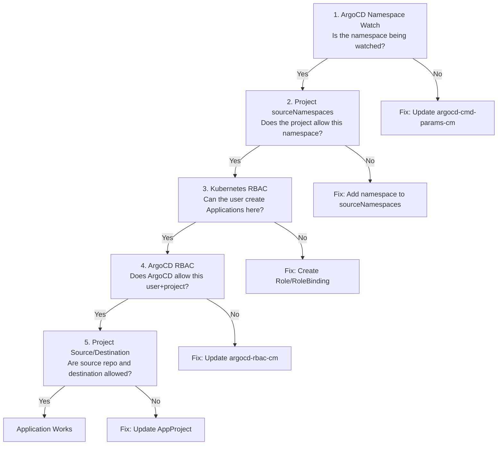

# How to Debug Namespace Permission Issues for Applications in ArgoCD

Author: [nawazdhandala](https://github.com/nawazdhandala)

Tags: ArgoCD, GitOps, Kubernetes, Debugging, Permissions

Description: A troubleshooting guide for diagnosing and fixing namespace permission issues when using ArgoCD applications in any namespace, covering common errors and solutions.

---

When using applications in any namespace in ArgoCD, permission issues are the most common source of problems. You create an Application resource in a team namespace, but nothing happens. Or you get cryptic error messages about projects, namespaces, or RBAC. This guide walks through systematic troubleshooting for every permission layer involved.

## The Permission Stack

ArgoCD namespace permissions involve multiple layers. A failure at any layer prevents the application from working:



Let us troubleshoot each layer systematically.

## Issue 1: Application Resource Ignored

**Symptom**: You create an Application resource in a team namespace, but it does not appear in ArgoCD UI or CLI. ArgoCD does not process it at all.

**Cause**: ArgoCD is not configured to watch that namespace.

**Diagnosis**:

```bash
# Check which namespaces ArgoCD watches
kubectl get configmap argocd-cmd-params-cm -n argocd \
  -o jsonpath='{.data.application\.namespaces}'
echo  # newline

# Expected: should include your namespace
# If empty, ArgoCD only watches the argocd namespace
```

**Fix**:

```yaml
# Update argocd-cmd-params-cm to include the namespace
apiVersion: v1
kind: ConfigMap
metadata:
  name: argocd-cmd-params-cm
  namespace: argocd
data:
  application.namespaces: "team-a, team-b, team-c"  # Add missing namespace
```

Then restart ArgoCD components:

```bash
kubectl apply -f argocd-cmd-params-cm.yaml
kubectl rollout restart deployment/argocd-server -n argocd
kubectl rollout restart statefulset/argocd-application-controller -n argocd
```

**Verification**:

```bash
# Check controller logs for namespace watch initialization
kubectl logs -n argocd -l app.kubernetes.io/name=argocd-application-controller \
  --tail=50 | grep -i "watch\|namespace\|informer"
```

## Issue 2: Project Does Not Allow Namespace

**Symptom**: The Application appears in ArgoCD but shows an error like "application 'X' in namespace 'Y' is not permitted in project 'Z'".

**Cause**: The AppProject does not include the namespace in `sourceNamespaces`.

**Diagnosis**:

```bash
# Check the project's sourceNamespaces
kubectl get appproject team-a -n argocd \
  -o jsonpath='{.spec.sourceNamespaces}'
echo

# Check what project the Application references
kubectl get application my-app -n team-a \
  -o jsonpath='{.spec.project}'
echo
```

**Fix**:

```yaml
# Add the namespace to the project's sourceNamespaces
apiVersion: argoproj.io/v1alpha1
kind: AppProject
metadata:
  name: team-a
  namespace: argocd
spec:
  sourceNamespaces:
    - team-a          # Add the missing namespace
  sourceRepos:
    - 'https://github.com/myorg/*'
  destinations:
    - server: https://kubernetes.default.svc
      namespace: '*'
```

**Verification**:

```bash
# Check the application status after fixing
argocd app get my-app --app-namespace team-a
```

## Issue 3: Cannot Create Application Resource

**Symptom**: `kubectl apply` returns "forbidden" when trying to create an Application resource in the team namespace.

**Cause**: The user does not have Kubernetes RBAC permission to create Application resources in that namespace.

**Diagnosis**:

```bash
# Check if the user can create Application resources
kubectl auth can-i create applications.argoproj.io \
  -n team-a \
  --as your-username@example.com

# Check existing Roles and RoleBindings
kubectl get roles -n team-a
kubectl get rolebindings -n team-a -o wide
```

**Fix**:

```yaml
# Create Role and RoleBinding for Application management
apiVersion: rbac.authorization.k8s.io/v1
kind: Role
metadata:
  name: argocd-application-manager
  namespace: team-a
rules:
  - apiGroups: ['argoproj.io']
    resources: ['applications']
    verbs: ['get', 'list', 'watch', 'create', 'update', 'patch', 'delete']
---
apiVersion: rbac.authorization.k8s.io/v1
kind: RoleBinding
metadata:
  name: team-a-argocd-apps
  namespace: team-a
roleRef:
  apiGroup: rbac.authorization.k8s.io
  kind: Role
  name: argocd-application-manager
subjects:
  - kind: Group
    name: team-a-members
    apiGroup: rbac.authorization.k8s.io
```

**Verification**:

```bash
kubectl auth can-i create applications.argoproj.io -n team-a --as your-username@example.com
# Should return: yes
```

## Issue 4: ArgoCD RBAC Denying Access

**Symptom**: The Application resource exists and ArgoCD sees it, but operations (sync, delete, etc.) fail with "permission denied" in the ArgoCD UI or CLI.

**Cause**: ArgoCD's internal RBAC does not grant the user access to applications in this project.

**Diagnosis**:

```bash
# Test ArgoCD RBAC policy
argocd admin settings rbac can \
  --policy-file argocd-rbac-cm.yaml \
  your-username \
  sync \
  applications \
  team-a/my-app

# Check the current RBAC policy
kubectl get configmap argocd-rbac-cm -n argocd -o yaml
```

**Fix**:

```yaml
apiVersion: v1
kind: ConfigMap
metadata:
  name: argocd-rbac-cm
  namespace: argocd
data:
  policy.default: role:readonly

  policy.csv: |
    # Grant team-a-members access to their project's applications
    p, role:team-a, applications, *, team-a/*, allow
    p, role:team-a, logs, get, team-a/*, allow
    g, team-a-members, role:team-a
```

**Verification**:

```bash
# Test the RBAC policy again
argocd admin settings rbac can \
  --policy-file argocd-rbac-cm.yaml \
  team-a-members \
  sync \
  applications \
  team-a/my-app
```

## Issue 5: Source Repository Not Allowed

**Symptom**: Application shows error "application repo X is not permitted in project Y".

**Diagnosis**:

```bash
# Check the project's sourceRepos
kubectl get appproject team-a -n argocd \
  -o jsonpath='{.spec.sourceRepos}'

# Check the application's source
kubectl get application my-app -n team-a \
  -o jsonpath='{.spec.source.repoURL}'
```

**Fix**: Add the repository to the project's `sourceRepos`:

```yaml
spec:
  sourceRepos:
    - 'https://github.com/myorg/team-a-*'  # Wildcard pattern
    # Or specific repo:
    - 'https://github.com/myorg/specific-repo.git'
```

## Issue 6: Destination Not Allowed

**Symptom**: Application shows "application destination {server}/{namespace} is not permitted in project".

**Diagnosis**:

```bash
# Check the project's destinations
kubectl get appproject team-a -n argocd \
  -o jsonpath='{.spec.destinations}' | jq .

# Check the application's destination
kubectl get application my-app -n team-a \
  -o jsonpath='{.spec.destination}' | jq .
```

**Fix**: Add the destination to the project:

```yaml
spec:
  destinations:
    - server: https://kubernetes.default.svc
      namespace: team-a-production
    - server: https://kubernetes.default.svc
      namespace: team-a-staging
```

## Issue 7: Controller Cannot Manage Applications Across Namespaces

**Symptom**: Applications in team namespaces are never synced, and controller logs show RBAC errors.

**Cause**: ArgoCD's service account lacks cluster-level permissions to manage Application resources outside its own namespace.

**Diagnosis**:

```bash
# Check if the controller can list Applications in team namespaces
kubectl auth can-i list applications.argoproj.io \
  -n team-a \
  --as system:serviceaccount:argocd:argocd-application-controller
```

**Fix**:

```yaml
apiVersion: rbac.authorization.k8s.io/v1
kind: ClusterRole
metadata:
  name: argocd-controller-apps-in-any-namespace
rules:
  - apiGroups: ['argoproj.io']
    resources: ['applications', 'applicationsets', 'applications/finalizers']
    verbs: ['*']
---
apiVersion: rbac.authorization.k8s.io/v1
kind: ClusterRoleBinding
metadata:
  name: argocd-controller-apps-in-any-namespace
roleRef:
  apiGroup: rbac.authorization.k8s.io
  kind: ClusterRole
  name: argocd-controller-apps-in-any-namespace
subjects:
  - kind: ServiceAccount
    name: argocd-application-controller
    namespace: argocd
  - kind: ServiceAccount
    name: argocd-server
    namespace: argocd
```

## Comprehensive Debugging Script

Save this script to quickly diagnose namespace permission issues:

```bash
#!/bin/bash
# debug-namespace-perms.sh
# Usage: ./debug-namespace-perms.sh <app-namespace> <app-name> <project-name>

NAMESPACE=$1
APP_NAME=$2
PROJECT=$3

echo "=== Checking namespace watch configuration ==="
WATCHED=$(kubectl get configmap argocd-cmd-params-cm -n argocd -o jsonpath='{.data.application\.namespaces}' 2>/dev/null)
echo "Watched namespaces: ${WATCHED:-'(not configured - only argocd namespace)'}"

echo ""
echo "=== Checking Application resource ==="
kubectl get application "$APP_NAME" -n "$NAMESPACE" -o jsonpath='{.metadata.name}: project={.spec.project}' 2>/dev/null || echo "Application not found in $NAMESPACE"

echo ""
echo "=== Checking project sourceNamespaces ==="
kubectl get appproject "$PROJECT" -n argocd -o jsonpath="sourceNamespaces: {.spec.sourceNamespaces}" 2>/dev/null || echo "Project $PROJECT not found"

echo ""
echo "=== Checking controller RBAC ==="
kubectl auth can-i list applications.argoproj.io -n "$NAMESPACE" \
  --as system:serviceaccount:argocd:argocd-application-controller

echo ""
echo "=== Checking project sourceRepos ==="
kubectl get appproject "$PROJECT" -n argocd -o jsonpath='{.spec.sourceRepos}' 2>/dev/null

echo ""
echo "=== Checking project destinations ==="
kubectl get appproject "$PROJECT" -n argocd -o jsonpath='{.spec.destinations}' 2>/dev/null

echo ""
echo "=== Controller logs (last 20 lines mentioning namespace) ==="
kubectl logs -n argocd -l app.kubernetes.io/name=argocd-application-controller \
  --tail=100 2>/dev/null | grep -i "$NAMESPACE" | tail -20
```

Run it:

```bash
chmod +x debug-namespace-perms.sh
./debug-namespace-perms.sh team-a my-app team-a
```

This systematically checks every permission layer and outputs the results, making it easy to identify which layer is failing.

When debugging namespace permission issues, always work through the layers from top to bottom: watch configuration, project sourceNamespaces, Kubernetes RBAC, ArgoCD RBAC, and finally project source/destination restrictions. Fixing the topmost failing layer usually resolves the issue. For the complete setup guide, see [enabling applications in any namespace](https://oneuptime.com/blog/post/2026-02-26-argocd-enable-applications-any-namespace/view).
