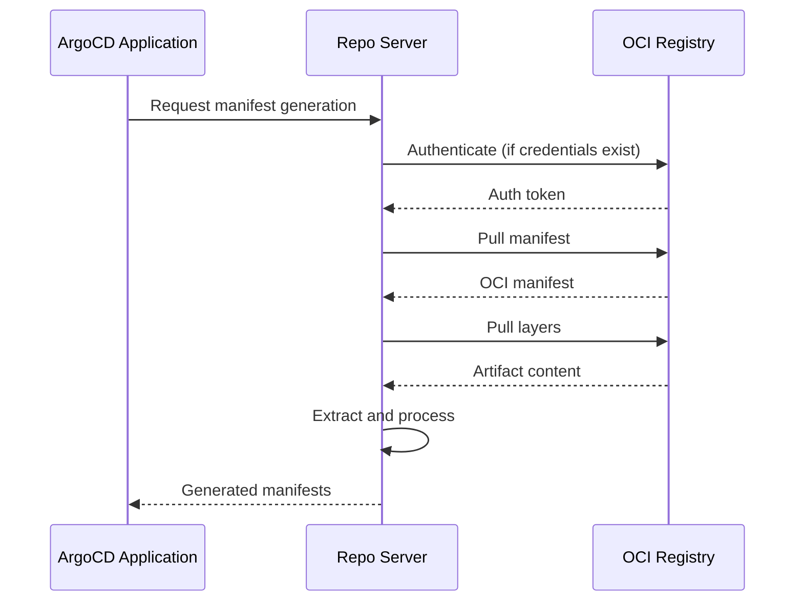

# How to Debug OCI Pull Errors in ArgoCD

Author: [nawazdhandala](https://github.com/nawazdhandala)

Tags: ArgoCD, GitOps, Kubernetes, OCI, Troubleshooting

Description: A practical troubleshooting guide for diagnosing and fixing OCI pull errors in ArgoCD, covering authentication failures, network issues, manifest problems, and registry-specific quirks.

---

OCI-based sources in ArgoCD are powerful but can be frustrating to debug when things go wrong. Unlike Git-based sources where error messages tend to be clear, OCI pull failures often produce cryptic errors that do not immediately tell you what is broken. This guide covers the most common OCI pull errors you will encounter with ArgoCD and how to fix each one systematically.

## Understanding the OCI Pull Flow

Before diving into troubleshooting, it helps to understand how ArgoCD pulls OCI artifacts. The flow looks like this:



Problems can occur at any step in this chain. Let's work through them.

## Error: "rpc error: code = Unknown desc = repository not accessible"

This is the most common error. It means ArgoCD's repo-server cannot reach or authenticate with the OCI registry.

### Step 1: Verify Repository Configuration

```bash
# List configured repositories
argocd repo list

# Check if the OCI repository is listed and shows as "Successful"
argocd repo get <registry-url>
```

If the repository is not listed or shows an error status, re-add it:

```bash
argocd repo add myregistry.example.com \
  --type helm \
  --name my-oci-registry \
  --enable-oci \
  --username myuser \
  --password mytoken
```

### Step 2: Check the Secret

```bash
# List ArgoCD repository secrets
kubectl get secrets -n argocd -l argocd.argoproj.io/secret-type=repository

# Inspect the specific secret (check for encoding issues)
kubectl get secret -n argocd <secret-name> -o jsonpath='{.data}' | \
  python3 -c "import sys,json,base64; d=json.load(sys.stdin); print({k:base64.b64decode(v).decode() for k,v in d.items()})"
```

Common issues with secrets:

- `enableOCI` must be the string `"true"`, not a boolean
- URL should not include `oci://` prefix (just `myregistry.example.com`)
- Type must be `helm` for OCI Helm charts

### Step 3: Test from Inside the Cluster

```bash
# Exec into the repo-server pod
kubectl exec -it -n argocd deployment/argocd-repo-server -- /bin/sh

# Try to resolve the registry DNS
nslookup myregistry.example.com

# Test HTTPS connectivity
wget -q --spider https://myregistry.example.com/v2/ && echo "OK" || echo "FAILED"
```

## Error: "unauthorized: authentication required"

This means ArgoCD reached the registry but failed to authenticate.

### Verify Credentials

```bash
# Test credentials manually using curl
# Step 1: Get an auth token
TOKEN=$(curl -s -u "username:password" \
  "https://myregistry.example.com/v2/token?service=myregistry&scope=repository:my-chart:pull" | \
  jq -r '.token')

# Step 2: Use the token to list tags
curl -s -H "Authorization: Bearer $TOKEN" \
  https://myregistry.example.com/v2/my-chart/tags/list
```

### Common Authentication Issues

**Expired tokens or passwords**: Service principal secrets, PATs, and robot accounts expire. Check the expiration date.

```bash
# For Azure ACR service principals
az ad sp credential list --id <app-id> --query "[].endDateTime"

# For GitHub PATs - check in GitHub Settings > Developer settings
```

**Wrong username format**: Different registries expect different username formats:

| Registry | Username Format |
|---|---|
| Docker Hub | Docker Hub username |
| GHCR | GitHub username |
| ACR | Service principal App ID |
| ECR | AWS (literal string) |
| GCR/GAR | _json_key or oauth2accesstoken |
| Harbor | robot$accountname |

**Insufficient permissions**: The credential might authenticate but lack pull permissions:

```bash
# For ACR, verify role assignment
az role assignment list --assignee <sp-app-id> --scope <acr-resource-id>

# For GHCR, ensure PAT has read:packages scope
```

## Error: "manifest unknown" or "not found"

This means authentication succeeded but the specified chart or version does not exist.

### Verify the Artifact Exists

```bash
# For Helm charts, check available tags
helm show chart oci://myregistry.example.com/my-chart --version 1.0.0

# Using crane (a lightweight OCI tool)
crane ls myregistry.example.com/my-chart

# Using curl with authentication
curl -s -H "Authorization: Bearer $TOKEN" \
  https://myregistry.example.com/v2/my-chart/tags/list | jq
```

### Check the Chart Path

A frequent mistake is getting the chart path wrong. The `chart` field in ArgoCD's application spec must match the repository path exactly:

```yaml
# If you pushed with:
# helm push my-chart-1.0.0.tgz oci://myregistry.example.com/charts

# Then the ArgoCD application needs:
source:
  chart: charts/my-chart      # Include the full path
  repoURL: myregistry.example.com
  targetRevision: 1.0.0
```

### Check Version Format

ArgoCD expects the `targetRevision` to match an OCI tag exactly:

```yaml
# These are different tags:
targetRevision: "1.0.0"     # Matches tag: 1.0.0
targetRevision: "v1.0.0"    # Matches tag: v1.0.0

# They are NOT interchangeable
```

## Error: "tls: failed to verify certificate"

This occurs when the OCI registry uses a self-signed certificate or a certificate from a private CA.

### Add Custom CA Certificate

```bash
# Create a ConfigMap with your CA certificate
kubectl create configmap argocd-tls-certs-cm \
  -n argocd \
  --from-file=myregistry.example.com=/path/to/ca.crt
```

Or configure it in the ArgoCD Helm values:

```yaml
configs:
  tls:
    certificates:
      myregistry.example.com: |
        -----BEGIN CERTIFICATE-----
        MIIDxTCCAq2gAwIBAgI...
        -----END CERTIFICATE-----
```

### Disable TLS Verification (Development Only)

For testing with self-signed certificates:

```yaml
apiVersion: v1
kind: Secret
metadata:
  name: my-oci-repo
  namespace: argocd
  labels:
    argocd.argoproj.io/secret-type: repository
type: Opaque
stringData:
  type: helm
  url: myregistry.example.com
  enableOCI: "true"
  username: "myuser"
  password: "mypassword"
  insecure: "true"
```

Never use `insecure: "true"` in production.

## Error: "context deadline exceeded" or "timeout"

Network connectivity issues between the ArgoCD repo-server and the OCI registry.

### Check Network Policies

```bash
# Check if network policies are blocking egress from the argocd namespace
kubectl get networkpolicies -n argocd

# Check if the repo-server pod can reach the registry
kubectl exec -it -n argocd deployment/argocd-repo-server -- \
  wget -q --timeout=5 --spider https://myregistry.example.com/v2/ \
  && echo "Reachable" || echo "Blocked"
```

### Check Proxy Configuration

If your cluster uses an HTTP proxy:

```yaml
# In the repo-server deployment, add proxy environment variables
env:
  - name: HTTPS_PROXY
    value: "http://proxy.example.com:8080"
  - name: NO_PROXY
    value: "kubernetes.default.svc,.cluster.local"
```

### Check DNS Resolution

```bash
# Verify DNS resolution from inside the cluster
kubectl run -it --rm dns-test --image=busybox --restart=Never -- \
  nslookup myregistry.example.com
```

## Error: "OCI helm chart version could not be determined"

ArgoCD could not resolve the specified version constraint against available tags.

```bash
# List available tags to see what versions exist
crane ls myregistry.example.com/my-chart

# Or using Helm
helm search repo my-chart --versions
```

Make sure your `targetRevision` matches an existing tag. If you are using semver constraints, ensure tags follow semantic versioning.

## Checking ArgoCD Logs

The repo-server logs are your best friend for OCI debugging:

```bash
# Follow repo-server logs, filtering for OCI-related messages
kubectl logs -n argocd deployment/argocd-repo-server -f | grep -i "oci\|helm\|registry\|auth\|pull"

# Increase log verbosity for more detail
# Edit the argocd-cmd-params-cm ConfigMap
kubectl edit configmap argocd-cmd-params-cm -n argocd
# Add: reposerver.log.level: debug
```

After changing the log level, restart the repo-server:

```bash
kubectl rollout restart deployment/argocd-repo-server -n argocd
```

## Registry-Specific Quirks

### AWS ECR

ECR tokens expire every 12 hours. Use the ECR credential helper or a CronJob to refresh tokens:

```bash
# ECR token refresh
aws ecr get-login-password --region us-east-1
```

### Docker Hub

Use `registry-1.docker.io` as the URL, not `docker.io`.

### Harbor

Harbor requires the project name in the chart path: `project/chart-name`.

### ACR

When using managed identity, ensure the `--attach-acr` command was run or the identity has `AcrPull` role.

## Systematic Debugging Checklist

When you hit an OCI pull error, work through this checklist:

1. Can the repo-server resolve the registry DNS?
2. Can the repo-server reach the registry on port 443?
3. Does the TLS certificate validate?
4. Do the credentials authenticate successfully?
5. Does the authenticated identity have pull permissions?
6. Does the chart path match the repository structure?
7. Does the target version/tag exist?
8. Is the OCI artifact a valid Helm chart or Kustomize directory?

## Summary

OCI pull errors in ArgoCD usually fall into three categories: authentication failures, network issues, or artifact path problems. Start by checking the repo-server logs with debug logging enabled, verify credentials work outside of ArgoCD using curl or Helm CLI, and confirm the artifact exists at the expected path and version. Most issues can be traced back to credential configuration or chart path mismatches.
