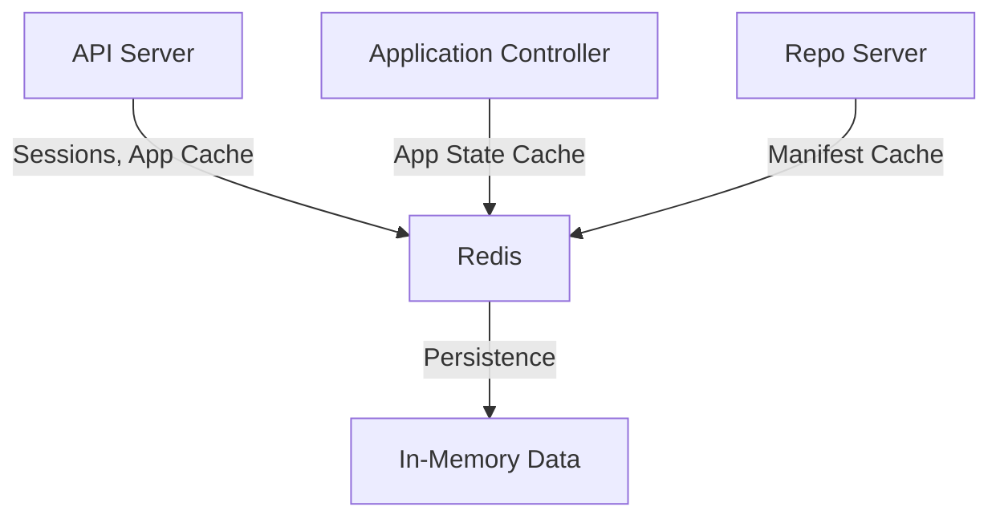

# How to Debug ArgoCD Redis Issues

Author: [nawazdhandala](https://github.com/nawazdhandala)

Tags: ArgoCD, GitOps, Kubernetes, Redis, Troubleshooting

Description: Learn how to debug ArgoCD Redis issues including connection failures, high memory usage, eviction policies, and sentinel configuration problems that cause slow UI and sync issues.

---

Redis is the caching layer that ArgoCD depends on for session management, application state caching, and inter-component communication. When Redis has problems, you will see slow UI loading, failed logins, and degraded performance across all ArgoCD operations. This guide covers how to diagnose and fix every common Redis issue.

## How ArgoCD Uses Redis



ArgoCD uses Redis for:
- User session storage (login tokens)
- Application state caching (reduces Kubernetes API calls)
- Manifest cache (avoids re-generating manifests)
- Rate limiting data
- Cache for repository information

## Step 1: Check Redis Pod Health

```bash
# Get Redis pod status
kubectl get pods -n argocd -l app.kubernetes.io/name=argocd-redis -o wide

# Check for restarts
kubectl describe pods -n argocd -l app.kubernetes.io/name=argocd-redis | \
  grep -A5 "State:\|Last State:\|Restart Count:"

# Check resource usage
kubectl top pods -n argocd -l app.kubernetes.io/name=argocd-redis
```

## Step 2: Check Redis Logs

```bash
# Recent Redis logs
kubectl logs -n argocd deploy/argocd-redis --tail=100

# Look for memory warnings
kubectl logs -n argocd deploy/argocd-redis --tail=100 | grep -i "memory\|oom\|maxmemory"

# Look for connection issues
kubectl logs -n argocd deploy/argocd-redis --tail=100 | grep -i "connection\|refused\|error"
```

## Issue: Redis Connection Errors

Other ArgoCD components cannot connect to Redis.

```bash
# Check Redis service
kubectl get svc argocd-redis -n argocd

# Check Redis endpoints
kubectl get endpoints argocd-redis -n argocd

# Test Redis connectivity from the API server
kubectl exec -n argocd deploy/argocd-server -- \
  sh -c 'redis-cli -h argocd-redis -p 6379 ping' 2>/dev/null

# Test from the controller
kubectl exec -n argocd deploy/argocd-application-controller -- \
  sh -c 'redis-cli -h argocd-redis -p 6379 ping' 2>/dev/null
```

If Redis is unreachable, check:

```bash
# Check if Redis is listening on the expected port
kubectl exec -n argocd deploy/argocd-redis -- \
  redis-cli ping

# Check network policies that might block traffic
kubectl get networkpolicies -n argocd

# Check if DNS resolution works
kubectl exec -n argocd deploy/argocd-server -- \
  nslookup argocd-redis.argocd.svc.cluster.local
```

## Issue: Redis High Memory Usage

```bash
# Check Redis memory usage
kubectl exec -n argocd deploy/argocd-redis -- \
  redis-cli info memory

# Key metrics from the output:
# used_memory_human - Current memory usage
# used_memory_peak_human - Peak memory usage
# maxmemory_human - Maximum allowed memory
# maxmemory_policy - Eviction policy

# Get detailed memory stats
kubectl exec -n argocd deploy/argocd-redis -- \
  redis-cli memory stats
```

Fix high memory usage:

```bash
# Check what is using the most memory
kubectl exec -n argocd deploy/argocd-redis -- \
  redis-cli --bigkeys

# Flush the cache if needed (will cause temporary performance degradation)
kubectl exec -n argocd deploy/argocd-redis -- \
  redis-cli flushall

# Set a memory limit in the Redis configuration
kubectl exec -n argocd deploy/argocd-redis -- \
  redis-cli config set maxmemory 256mb

# Set eviction policy
kubectl exec -n argocd deploy/argocd-redis -- \
  redis-cli config set maxmemory-policy allkeys-lru
```

For a permanent fix, update the Redis deployment:

```yaml
apiVersion: apps/v1
kind: Deployment
metadata:
  name: argocd-redis
  namespace: argocd
spec:
  template:
    spec:
      containers:
        - name: redis
          resources:
            requests:
              cpu: 100m
              memory: 128Mi
            limits:
              cpu: 500m
              memory: 512Mi
          args:
            - --maxmemory
            - 256mb
            - --maxmemory-policy
            - allkeys-lru
```

## Issue: Redis OOMKilled

```bash
# Check if Redis was OOMKilled
kubectl get pods -n argocd -l app.kubernetes.io/name=argocd-redis -o json | \
  jq '.items[].status.containerStatuses[] | {
    restartCount,
    terminationReason: .lastState.terminated.reason
  }'

# Increase memory limits
kubectl patch deployment argocd-redis -n argocd --type json -p '[
  {
    "op": "replace",
    "path": "/spec/template/spec/containers/0/resources/limits/memory",
    "value": "1Gi"
  }
]'
```

## Issue: Redis Sentinel Problems (HA Setup)

In HA mode, ArgoCD uses Redis Sentinel for failover:

```bash
# Check Sentinel pods
kubectl get pods -n argocd -l app.kubernetes.io/name=argocd-redis-ha

# Check Sentinel logs
kubectl logs -n argocd -l app.kubernetes.io/name=argocd-redis-ha-haproxy --tail=100

# Check the Sentinel configuration
kubectl exec -n argocd deploy/argocd-redis-ha -- \
  redis-cli -p 26379 sentinel masters

# Check which Redis instance is the master
kubectl exec -n argocd deploy/argocd-redis-ha -- \
  redis-cli -p 26379 sentinel get-master-addr-by-name argocd
```

Common Sentinel issues:
- Split-brain: Two Redis instances think they are master
- Failover loops: Master keeps changing
- Quorum not met: Not enough Sentinels are reachable

## Issue: Session Loss (Users Logged Out)

If users keep getting logged out, Redis is likely losing session data:

```bash
# Check if sessions exist in Redis
kubectl exec -n argocd deploy/argocd-redis -- \
  redis-cli keys 'session:*' | head -20

# Check session TTL
kubectl exec -n argocd deploy/argocd-redis -- \
  redis-cli ttl 'session:some-session-key'

# Check if Redis is evicting keys
kubectl exec -n argocd deploy/argocd-redis -- \
  redis-cli info stats | grep evicted_keys
```

If `evicted_keys` is non-zero, Redis is running out of memory and evicting session keys. Increase the memory limit or reduce the session duration.

## Issue: Slow Redis Performance

```bash
# Check Redis latency
kubectl exec -n argocd deploy/argocd-redis -- \
  redis-cli --latency

# Check slow log (commands that took too long)
kubectl exec -n argocd deploy/argocd-redis -- \
  redis-cli slowlog get 10

# Check connected clients
kubectl exec -n argocd deploy/argocd-redis -- \
  redis-cli info clients

# Check command stats
kubectl exec -n argocd deploy/argocd-redis -- \
  redis-cli info commandstats
```

## Issue: Redis Data Persistence

By default, ArgoCD Redis does not persist data to disk. If Redis restarts, all cached data is lost. This is usually fine because ArgoCD rebuilds the cache, but it causes a temporary performance hit.

If you need persistence:

```yaml
# Redis with persistence (optional)
apiVersion: apps/v1
kind: Deployment
metadata:
  name: argocd-redis
  namespace: argocd
spec:
  template:
    spec:
      containers:
        - name: redis
          args:
            - --save
            - "60"
            - "1000"
            - --appendonly
            - "yes"
          volumeMounts:
            - mountPath: /data
              name: redis-data
      volumes:
        - name: redis-data
          persistentVolumeClaim:
            claimName: argocd-redis-pvc
```

## Using External Redis

For production environments, consider using an external managed Redis:

```bash
# Configure ArgoCD to use external Redis
kubectl patch configmap argocd-cmd-params-cm -n argocd --type merge -p '{
  "data": {
    "redis.server": "your-redis.example.com:6379"
  }
}'

# If Redis requires authentication
kubectl patch secret argocd-secret -n argocd --type merge -p '{
  "stringData": {
    "redis.password": "your-redis-password"
  }
}'

# Restart all components that use Redis
kubectl rollout restart deployment -n argocd \
  argocd-server argocd-application-controller argocd-repo-server
```

## Complete Debug Script

```bash
#!/bin/bash
# redis-debug.sh

NS="argocd"
echo "=== ArgoCD Redis Debug ==="

echo -e "\n--- Pod Status ---"
kubectl get pods -n $NS -l app.kubernetes.io/name=argocd-redis -o wide

echo -e "\n--- Resource Usage ---"
kubectl top pods -n $NS -l app.kubernetes.io/name=argocd-redis 2>/dev/null

echo -e "\n--- Redis Info ---"
kubectl exec -n $NS deploy/argocd-redis -- redis-cli info server 2>/dev/null | head -10

echo -e "\n--- Memory Stats ---"
kubectl exec -n $NS deploy/argocd-redis -- redis-cli info memory 2>/dev/null | \
  grep -E "used_memory_human|maxmemory_human|maxmemory_policy"

echo -e "\n--- Key Count ---"
kubectl exec -n $NS deploy/argocd-redis -- redis-cli dbsize 2>/dev/null

echo -e "\n--- Client Connections ---"
kubectl exec -n $NS deploy/argocd-redis -- redis-cli info clients 2>/dev/null | \
  grep "connected_clients"

echo -e "\n--- Evicted Keys ---"
kubectl exec -n $NS deploy/argocd-redis -- redis-cli info stats 2>/dev/null | \
  grep "evicted_keys"

echo -e "\n--- Connectivity Test ---"
kubectl exec -n $NS deploy/argocd-server -- \
  sh -c 'redis-cli -h argocd-redis ping' 2>/dev/null || echo "Cannot reach Redis from API server"
```

## Summary

ArgoCD Redis issues manifest as slow UI, lost sessions, and degraded performance across all components. Start debugging by checking Redis pod health, then examine memory usage and eviction stats. For production environments, use an external managed Redis with proper memory limits and monitoring. Most Redis issues in ArgoCD come down to insufficient memory - the cache grows with the number of applications and repositories, so plan accordingly. Monitor Redis metrics through [OneUptime](https://oneuptime.com) to catch memory pressure before it causes outages.
