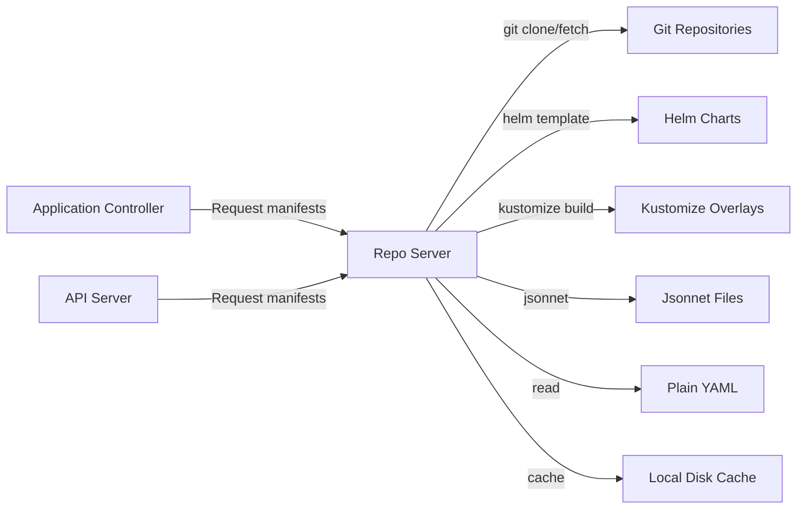

# How to Debug ArgoCD Repo Server Issues

Author: [nawazdhandala](https://github.com/nawazdhandala)

Tags: ArgoCD, GitOps, Kubernetes, Repo Server, Troubleshooting

Description: Learn how to debug ArgoCD repo server issues including Git clone failures, manifest generation errors, high memory usage, and slow Helm or Kustomize rendering.

---

The ArgoCD repo server is responsible for cloning Git repositories and generating Kubernetes manifests from Helm charts, Kustomize overlays, Jsonnet files, and plain YAML. When it fails, applications get stuck with "ComparisonError" and cannot sync. This guide covers debugging every common repo server issue.

## What the Repo Server Does



## Step 1: Check Repo Server Health

```bash
# Pod status
kubectl get pods -n argocd -l app.kubernetes.io/name=argocd-repo-server -o wide

# Resource usage
kubectl top pods -n argocd -l app.kubernetes.io/name=argocd-repo-server

# Check for restarts
kubectl describe pods -n argocd -l app.kubernetes.io/name=argocd-repo-server | \
  grep -A5 "State:\|Last State:\|Restart Count:"
```

## Step 2: Check Repo Server Logs

```bash
# Recent errors
kubectl logs -n argocd deploy/argocd-repo-server --tail=200 | \
  grep -E 'level=(error|fatal|warning)'

# Git-related errors
kubectl logs -n argocd deploy/argocd-repo-server --tail=200 | \
  grep -i 'git\|clone\|fetch\|ssh\|auth'

# Manifest generation errors
kubectl logs -n argocd deploy/argocd-repo-server --tail=200 | \
  grep -i 'helm\|kustomize\|jsonnet\|manifest\|generate'
```

## Issue: "Failed to generate manifests"

This is the most common repo server error. The cause depends on the application source type.

### Helm Template Failures

```bash
# Check what Helm error the repo server reports
kubectl logs -n argocd deploy/argocd-repo-server --tail=200 | \
  grep -A5 "helm template"

# Common causes:
# - Missing values files
# - Invalid Helm chart
# - Missing chart dependencies
# - Template syntax errors
```

Debug Helm rendering locally:

```bash
# Clone the repo and try to render locally
git clone https://github.com/your-org/your-repo.git
cd your-repo/charts/my-chart

# Update dependencies
helm dependency update .

# Test template rendering
helm template my-release . --values values.yaml --debug
```

### Kustomize Build Failures

```bash
# Check Kustomize errors
kubectl logs -n argocd deploy/argocd-repo-server --tail=200 | \
  grep -A5 "kustomize build"

# Test locally
kustomize build ./overlays/production/ 2>&1
```

Common Kustomize issues:
- Missing base references
- Invalid patch files
- Remote resource URLs unreachable from the repo server

### Path Not Found

```bash
# Verify the application path
argocd app get my-app -o json | \
  jq '{repoURL: .spec.source.repoURL, path: .spec.source.path, targetRevision: .spec.source.targetRevision}'

# Check if the path exists in the repo
kubectl exec -n argocd deploy/argocd-repo-server -- \
  git ls-tree -r --name-only HEAD -- path/to/manifests 2>/dev/null
```

## Issue: Git Clone/Fetch Failures

```bash
# Check for authentication errors
kubectl logs -n argocd deploy/argocd-repo-server --tail=100 | \
  grep -i "authentication\|permission\|denied\|forbidden"

# Check for network errors
kubectl logs -n argocd deploy/argocd-repo-server --tail=100 | \
  grep -i "timeout\|connection\|refused\|unreachable"

# Test Git connectivity from within the repo server
kubectl exec -n argocd deploy/argocd-repo-server -- \
  git ls-remote https://github.com/your-org/your-repo.git HEAD
```

Fix authentication issues:

```bash
# Verify repository credentials
argocd repo list
argocd repo get https://github.com/your-org/your-repo.git

# Re-add repository with credentials
argocd repo add https://github.com/your-org/your-repo.git \
  --username your-username \
  --password your-token
```

For SSH-based repos:

```bash
# Check SSH known hosts
kubectl get configmap argocd-ssh-known-hosts-cm -n argocd -o yaml

# Test SSH connectivity
kubectl exec -n argocd deploy/argocd-repo-server -- \
  ssh -T git@github.com 2>&1
```

## Issue: Repo Server OOMKilled

Large repositories and complex Helm charts can cause memory exhaustion:

```bash
# Check for OOM events
kubectl get pods -n argocd -l app.kubernetes.io/name=argocd-repo-server -o json | \
  jq '.items[].status.containerStatuses[] | {
    restartCount,
    terminationReason: .lastState.terminated.reason
  }'

# Increase memory
kubectl patch deployment argocd-repo-server -n argocd --type json -p '[
  {
    "op": "replace",
    "path": "/spec/template/spec/containers/0/resources",
    "value": {
      "requests": {
        "cpu": "500m",
        "memory": "1Gi"
      },
      "limits": {
        "cpu": "2",
        "memory": "4Gi"
      }
    }
  }
]'
```

## Issue: Slow Manifest Generation

```bash
# Check manifest generation times in logs
kubectl logs -n argocd deploy/argocd-repo-server --tail=500 | \
  grep -i "generated\|duration\|manifest"

# Check disk space (manifest cache)
kubectl exec -n argocd deploy/argocd-repo-server -- df -h /tmp
```

Speed up manifest generation:

```bash
# Increase repo server parallelism
kubectl patch configmap argocd-cmd-params-cm -n argocd --type merge -p '{
  "data": {
    "reposerver.parallelism.limit": "10"
  }
}'

# Scale repo server replicas
kubectl scale deployment argocd-repo-server -n argocd --replicas=3

# Configure generation timeout
kubectl patch configmap argocd-cm -n argocd --type merge -p '{
  "data": {
    "timeout.hard.reconciliation": "0s"
  }
}'

kubectl rollout restart deployment argocd-repo-server -n argocd
```

## Issue: Disk Space Exhaustion

The repo server caches Git repositories on disk. With many repos, disk can fill up:

```bash
# Check disk usage
kubectl exec -n argocd deploy/argocd-repo-server -- df -h

# Check the repo cache size
kubectl exec -n argocd deploy/argocd-repo-server -- du -sh /tmp/_argocd-repo/ 2>/dev/null

# Check individual repo sizes
kubectl exec -n argocd deploy/argocd-repo-server -- \
  du -sh /tmp/_argocd-repo/*/ 2>/dev/null | sort -rh | head -10
```

Fix disk space issues:

```yaml
# Add an emptyDir volume with a size limit
apiVersion: apps/v1
kind: Deployment
metadata:
  name: argocd-repo-server
  namespace: argocd
spec:
  template:
    spec:
      containers:
        - name: argocd-repo-server
          volumeMounts:
            - mountPath: /tmp
              name: tmp
      volumes:
        - name: tmp
          emptyDir:
            sizeLimit: 10Gi
```

## Issue: Config Management Plugin Failures

If you use custom plugins (CMP) with the repo server:

```bash
# Check sidecar container logs
kubectl logs -n argocd deploy/argocd-repo-server -c your-plugin-container --tail=100

# List all containers in the repo server pod
kubectl get pods -n argocd -l app.kubernetes.io/name=argocd-repo-server \
  -o jsonpath='{.items[0].spec.containers[*].name}'

# Check plugin discovery
kubectl logs -n argocd deploy/argocd-repo-server --tail=100 | grep -i "plugin\|cmp"
```

## Repo Server Metrics

```bash
# Port-forward to metrics endpoint
kubectl port-forward -n argocd deploy/argocd-repo-server 8084:8084 &

# Check key metrics
curl -s localhost:8084/metrics | grep -E "argocd_git|argocd_repo"

# Key metrics:
# argocd_git_request_total - Git operation counts
# argocd_git_request_duration_seconds - Git operation duration
# argocd_repo_pending_request_total - Queued requests
```

## Complete Debug Script

```bash
#!/bin/bash
# repo-server-debug.sh

NS="argocd"
echo "=== ArgoCD Repo Server Debug ==="

echo -e "\n--- Pod Status ---"
kubectl get pods -n $NS -l app.kubernetes.io/name=argocd-repo-server -o wide

echo -e "\n--- Resource Usage ---"
kubectl top pods -n $NS -l app.kubernetes.io/name=argocd-repo-server 2>/dev/null

echo -e "\n--- Disk Usage ---"
kubectl exec -n $NS deploy/argocd-repo-server -- df -h /tmp 2>/dev/null

echo -e "\n--- Restart Info ---"
kubectl get pods -n $NS -l app.kubernetes.io/name=argocd-repo-server -o json | \
  jq '.items[].status.containerStatuses[] | {name: .name, restarts: .restartCount, lastTermination: .lastState.terminated.reason}'

echo -e "\n--- Recent Errors ---"
kubectl logs -n $NS deploy/argocd-repo-server --tail=50 | \
  grep -E 'level=(error|fatal)' | tail -10

echo -e "\n--- Git Errors ---"
kubectl logs -n $NS deploy/argocd-repo-server --tail=100 | \
  grep -i 'git.*error\|authentication\|timeout' | tail -5

echo -e "\n--- Repository List ---"
argocd repo list 2>/dev/null || echo "ArgoCD CLI not available"
```

## Summary

The ArgoCD repo server handles all Git operations and manifest generation. Debug it when you see "ComparisonError" on applications, slow manifest generation, or Git clone failures. Check logs for specific error messages, verify Git connectivity and credentials, ensure sufficient disk space and memory, and scale horizontally for large installations. For monitoring repo server performance over time, track Git operation durations and pending request counts with [OneUptime](https://oneuptime.com).
