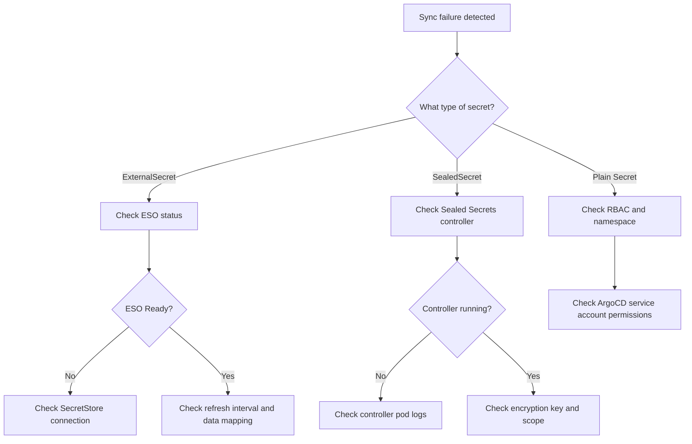

# How to Debug Secret-Related Sync Failures in ArgoCD

Author: [nawazdhandala](https://github.com/nawazdhandala)

Tags: ArgoCD, GitOps, Kubernetes, Secret, Troubleshooting

Description: A practical troubleshooting guide for diagnosing and fixing secret-related sync failures in ArgoCD, covering common error patterns, ESO issues, Sealed Secrets problems, and RBAC misconfigurations.

---

Secret-related sync failures are among the most frustrating issues in ArgoCD. The error messages are often cryptic, secrets are redacted in logs for security, and the problem could be in ArgoCD, the secret management tool, Vault, or the Kubernetes API itself. In this guide, I will walk you through a systematic approach to diagnosing and fixing these failures.

## Common Symptoms

Before we dig into specific issues, here are the symptoms you might see:

- Application stuck in "Syncing" or "OutOfSync" state
- Sync errors mentioning "secret not found" or "forbidden"
- ExternalSecret showing "SecretSyncedError" status
- SealedSecret not producing a corresponding Secret
- Pods in CrashLoopBackOff because of missing secret references
- ArgoCD showing "ComparisonError" for secret resources

## Diagnostic Workflow

Follow this systematic approach:



## Issue 1: ExternalSecret Not Syncing

### Check ExternalSecret status

```bash
# Get the ExternalSecret status
kubectl get externalsecret -n production app-secrets -o yaml

# Look for the status section
# status:
#   conditions:
#   - lastTransitionTime: "2026-02-26T10:00:00Z"
#     message: "could not get provider client: error getting secret store..."
#     reason: SecretSyncedError
#     status: "False"
#     type: Ready
```

### Check the SecretStore or ClusterSecretStore

```bash
# Verify the SecretStore exists and is ready
kubectl get secretstore -n production
kubectl get clustersecretstore

# Check SecretStore status
kubectl get clustersecretstore vault-store -o yaml

# Common error: SecretStore not found
# Fix: ensure the SecretStore name in ExternalSecret matches
```

### Check ESO operator logs

```bash
# Get ESO controller logs
kubectl logs -n external-secrets \
  -l app.kubernetes.io/name=external-secrets \
  --tail=100

# Look for errors like:
# "could not get provider client"
# "failed to get secret"
# "access denied"
# "connection refused"
```

### Common ESO fixes

```yaml
# Fix 1: Wrong secretStoreRef name
apiVersion: external-secrets.io/v1beta1
kind: ExternalSecret
spec:
  secretStoreRef:
    name: vault-store          # Must match exactly
    kind: ClusterSecretStore   # Must match the kind

# Fix 2: Wrong remoteRef key path
  data:
    - secretKey: password
      remoteRef:
        key: secret/data/production/db  # v2 KV needs "data" in path
        property: password               # Must match the key in Vault

# Fix 3: Missing property field
  data:
    - secretKey: password
      remoteRef:
        key: database/creds/myapp  # Dynamic secrets use different path
        # No property needed for dynamic secrets - use dataFrom instead
```

## Issue 2: SealedSecret Not Decrypting

### Check Sealed Secrets controller

```bash
# Is the controller running?
kubectl get pods -n kube-system -l app.kubernetes.io/name=sealed-secrets

# Check controller logs
kubectl logs -n kube-system -l app.kubernetes.io/name=sealed-secrets --tail=50

# Common errors:
# "no key could decrypt secret"
# "failed to unseal"
```

### Verify the sealing key

```bash
# List available keys
kubectl get secret -n kube-system -l sealedsecrets.bitnami.com/sealed-secrets-key

# If no keys exist, the controller needs to be restarted
# or you need to restore from backup

# Check if the SealedSecret was sealed with the correct cluster's key
kubeseal --validate < sealed-secret.yaml \
  --controller-name=sealed-secrets-controller \
  --controller-namespace=kube-system
```

### Common Sealed Secrets fixes

```bash
# Fix 1: Re-seal with the correct public key
kubeseal --fetch-cert \
  --controller-name=sealed-secrets-controller \
  --controller-namespace=kube-system > current-cert.pem

kubeseal --cert current-cert.pem \
  --format yaml < original-secret.yaml > sealed-secret.yaml

# Fix 2: Scope mismatch - check annotations
kubectl get sealedsecret my-secret -n production -o yaml | grep -A 3 annotations
# If scope is "strict", name AND namespace must match exactly

# Fix 3: Namespace mismatch
# SealedSecrets sealed for namespace "default" will not decrypt in "production"
# Re-seal with the correct namespace
kubectl create secret generic my-secret \
  --from-literal=key=value \
  --namespace=production \
  --dry-run=client -o yaml | \
  kubeseal --cert current-cert.pem --format yaml > sealed-secret.yaml
```

## Issue 3: ArgoCD RBAC Blocking Secret Operations

### Check ArgoCD service account permissions

```bash
# What service account does ArgoCD use?
kubectl get sa -n argocd argocd-application-controller -o yaml

# Check ClusterRole bindings
kubectl get clusterrolebinding | grep argocd

# Check if the role has secret permissions
kubectl get clusterrole argocd-application-controller -o yaml | grep -A 5 secrets
```

### Fix RBAC for secrets

```yaml
# If ArgoCD cannot create/update secrets
apiVersion: rbac.authorization.k8s.io/v1
kind: ClusterRole
metadata:
  name: argocd-application-controller
rules:
  - apiGroups: [""]
    resources: ["secrets"]
    verbs: ["get", "list", "watch", "create", "update", "patch", "delete"]
  - apiGroups: ["bitnami.com"]
    resources: ["sealedsecrets"]
    verbs: ["get", "list", "watch", "create", "update", "patch", "delete"]
  - apiGroups: ["external-secrets.io"]
    resources: ["externalsecrets", "secretstores", "clustersecretstores"]
    verbs: ["get", "list", "watch", "create", "update", "patch", "delete"]
```

## Issue 4: Secret Not Found by Pods

When pods fail because they reference a secret that does not exist yet:

```bash
# Check if the secret exists
kubectl get secret -n production app-secrets

# If it doesn't exist, check what should create it
# - Is the ExternalSecret/SealedSecret deployed?
# - Is the controller that creates the secret running?

# Check pod events
kubectl describe pod -n production myapp-pod | grep -A 10 Events

# Common error:
# Warning  FailedMount  secret "app-secrets" not found
```

### Fix with sync waves

Ensure the secret is created before the Deployment that uses it:

```yaml
# ExternalSecret deploys first
apiVersion: external-secrets.io/v1beta1
kind: ExternalSecret
metadata:
  name: app-secrets
  annotations:
    argocd.argoproj.io/sync-wave: "-2"

---
# Secret store config deploys even earlier
apiVersion: external-secrets.io/v1beta1
kind: ClusterSecretStore
metadata:
  name: vault-store
  annotations:
    argocd.argoproj.io/sync-wave: "-3"

---
# Deployment deploys after secrets exist
apiVersion: apps/v1
kind: Deployment
metadata:
  name: myapp
  annotations:
    argocd.argoproj.io/sync-wave: "0"
```

## Issue 5: Base64 Encoding Problems

A common gotcha is double-encoding or wrong encoding of secret data:

```bash
# Check what's actually in the secret
kubectl get secret -n production app-secrets -o jsonpath='{.data.password}' | base64 -d

# If you get garbled output, the value might be double-encoded
# This happens when you base64-encode a value that's already base64-encoded

# Use stringData instead of data to avoid encoding issues
```

```yaml
# Wrong: double-encoded
apiVersion: v1
kind: Secret
data:
  password: YzNWd1pYSnpaV055ZEE9PQ==  # base64(base64("supersecret"))

# Correct: use stringData for plaintext
apiVersion: v1
kind: Secret
stringData:
  password: supersecret
```

## Issue 6: ArgoCD Diff Shows Constant Changes

When ArgoCD keeps showing a Secret as OutOfSync:

```bash
# View the diff
argocd app diff myapp --resource :Secret:app-secrets

# If the diff shows metadata fields changing:
# - resourceVersion
# - uid
# - creationTimestamp
# These are server-generated and should be ignored
```

```yaml
# Add ignoreDifferences
spec:
  ignoreDifferences:
    - group: ""
      kind: Secret
      jsonPointers:
        - /data
        - /metadata/annotations
        - /metadata/labels
        - /metadata/resourceVersion
        - /metadata/uid
```

## Issue 7: Vault Connection Problems

```bash
# Test Vault connectivity from inside the cluster
kubectl run vault-test --rm -it --image=curlimages/curl -- \
  curl -k https://vault.example.com/v1/sys/health

# Check Vault seal status
kubectl exec -n vault vault-0 -- vault status

# Test authentication
kubectl exec -n vault vault-0 -- vault login -method=kubernetes \
  role=external-secrets \
  jwt=$(cat /var/run/secrets/kubernetes.io/serviceaccount/token)
```

## Debugging Checklist

When you hit a secret-related sync failure, go through this checklist:

```bash
# 1. Check ArgoCD application status
argocd app get myapp

# 2. Check for sync errors
argocd app get myapp --show-conditions

# 3. Check resource health
argocd app resources myapp | grep -i secret

# 4. Check ESO status (if applicable)
kubectl get externalsecrets -A -o wide

# 5. Check Sealed Secrets (if applicable)
kubectl get sealedsecrets -A

# 6. Check actual secrets
kubectl get secrets -n production

# 7. Check controller logs
kubectl logs -n external-secrets deploy/external-secrets --tail=50
kubectl logs -n kube-system deploy/sealed-secrets-controller --tail=50

# 8. Check ArgoCD controller logs
kubectl logs -n argocd deploy/argocd-application-controller --tail=50 | grep -i error

# 9. Check events
kubectl get events -n production --sort-by='.lastTimestamp' | tail -20
```

## Summary

Debugging secret-related sync failures in ArgoCD requires understanding the full chain: ArgoCD syncs manifests from Git, secret management tools (ESO, Sealed Secrets) process those manifests into actual Kubernetes Secrets, and applications consume those secrets. The failure could be at any point in this chain. Start by identifying which tool is responsible for the secret, check its status and logs, verify connectivity and permissions, and use sync waves to ensure proper ordering. For more on ArgoCD debugging in general, see our [ArgoCD debugging guide](https://oneuptime.com/blog/post/2026-02-02-argocd-debugging/view).
