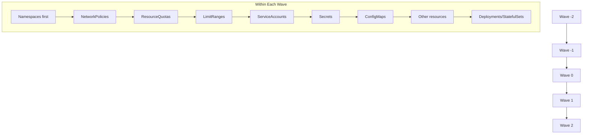

# How to Debug Sync Wave Ordering Issues in ArgoCD

Author: [nawazdhandala](https://github.com/nawazdhandala)

Tags: ArgoCD, GitOps, Kubernetes, Sync Waves, Debugging

Description: A practical guide to debugging ArgoCD sync wave ordering issues, including wrong wave assignments, stuck waves, health check failures, and resources deploying out of order.

---

Sync waves look simple on paper: assign a number, resources deploy in order. In practice, things go wrong. Resources deploy out of order, waves get stuck, health checks fail and block subsequent waves, or the annotations are silently ignored. This guide covers the most common sync wave ordering issues and how to diagnose and fix each one.

## Verifying Sync Wave Assignments

The first step in debugging is confirming that ArgoCD actually sees your sync wave annotations. A typo in the annotation key means ArgoCD treats the resource as wave 0.

```bash
# List all resources in an application with their sync wave numbers
argocd app get my-app --show-operation

# Get detailed resource information including waves
argocd app resources my-app
```

You can also check directly in the ArgoCD UI. Navigate to the application, click on a resource, and look at the "Sync Wave" field in the resource details panel.

For a programmatic check, query the ArgoCD API directly.

```bash
# Get the resource tree with sync wave info
argocd app resources my-app --output json | \
  jq '.[] | {kind: .kind, name: .name, namespace: .namespace, syncWave: .syncWave}'
```

If the sync wave shows as `0` for a resource you annotated with a different wave, check for these common mistakes.

Wrong annotation key:
```yaml
# WRONG - missing the full annotation key
metadata:
  annotations:
    sync-wave: "1"  # ArgoCD ignores this

# CORRECT
metadata:
  annotations:
    argocd.argoproj.io/sync-wave: "1"
```

Wrong value type:
```yaml
# WRONG - must be a string, not an integer
metadata:
  annotations:
    argocd.argoproj.io/sync-wave: 1  # YAML interprets as integer

# CORRECT - quote the number
metadata:
  annotations:
    argocd.argoproj.io/sync-wave: "1"
```

In YAML, unquoted numbers in annotation values might be parsed as integers rather than strings. ArgoCD expects a string value. Always quote sync wave numbers.

## Understanding Wave Execution Order

ArgoCD processes sync waves in ascending numerical order. Within each wave, resources are applied in a specific order based on their kind. ArgoCD has a built-in priority list for resource kinds.



Even without sync waves, ArgoCD has a default ordering within wave 0. Namespaces deploy before ConfigMaps, ConfigMaps before Deployments, and so on. Check the ArgoCD source code for the full priority list if you need exact ordering within a wave.

## Diagnosing Stuck Waves

A wave gets stuck when one or more resources in that wave never become healthy. ArgoCD waits for all resources in a wave to be healthy before moving to the next wave. If a resource stays degraded or progressing, subsequent waves never execute.

```bash
# Check which resources are not healthy
argocd app get my-app --output json | \
  jq '.status.resources[] | select(.health.status != "Healthy") | {kind, name, health: .health}'
```

Common causes of stuck waves:

**Deployment with insufficient resources.** The pod cannot be scheduled because the cluster does not have enough CPU or memory. The Deployment stays in "Progressing" state.

```bash
# Check pod events for scheduling issues
kubectl describe pods -l app=my-app -n production | grep -A5 Events
```

**ImagePullBackOff.** The container image does not exist or credentials are wrong. The Deployment never becomes healthy.

```bash
# Check pod status
kubectl get pods -l app=my-app -n production
kubectl describe pod <pod-name> -n production
```

**Readiness probe failure.** The pod starts but the readiness probe never passes. Kubernetes reports the pod as not ready, and ArgoCD reports the Deployment as Progressing.

```bash
# Check pod readiness
kubectl get pods -l app=my-app -n production -o jsonpath='{.items[*].status.conditions[?(@.type=="Ready")].status}'
```

**CRD not becoming Established.** If a CRD has schema validation errors, it might be created but never reach the Established condition. The wave with the CRD stays stuck.

```bash
# Check CRD status conditions
kubectl get crd mycustomresource.example.com -o jsonpath='{.status.conditions[*]}'
```

## Forcing Past a Stuck Wave

When a wave is stuck and you need to move forward, you have a few options.

Option 1: Fix the stuck resource. This is the right answer in most cases. Figure out why the resource is unhealthy and fix it.

Option 2: Remove the stuck resource from the application. If the resource is optional, remove it from the Git repository and sync again. ArgoCD will prune it and the wave can complete.

Option 3: Skip the health check for that resource type. You can configure ArgoCD to treat certain resource types as always healthy.

```yaml
apiVersion: argoproj.io/v1alpha1
kind: Application
metadata:
  name: my-app
  namespace: argocd
spec:
  project: default
  source:
    repoURL: https://github.com/myorg/app.git
    path: manifests/
    targetRevision: main
  destination:
    server: https://kubernetes.default.svc
    namespace: production
  ignoreDifferences:
    - group: apps
      kind: Deployment
      name: optional-service
      jsonPointers:
        - /spec/replicas
```

For a more targeted approach, you can use a custom health check in the ArgoCD ConfigMap.

```yaml
# In argocd-cm ConfigMap
apiVersion: v1
kind: ConfigMap
metadata:
  name: argocd-cm
  namespace: argocd
data:
  resource.customizations.health.batch_Job: |
    hs = {}
    hs.status = "Healthy"
    hs.message = "Job is always considered healthy for sync wave purposes"
    return hs
```

Be careful with this. Marking resources as always healthy defeats the purpose of sync wave ordering.

## Resources Deploying Out of Expected Order

If resources seem to deploy out of order despite correct sync wave annotations, check these scenarios.

**The application uses auto-sync with self-healing.** Self-healing can trigger a sync for individual resources outside the normal wave ordering. When ArgoCD detects drift on a single resource, it reapplies just that resource without going through the full wave sequence.

**Multiple sync operations overlapping.** If you trigger a manual sync while an auto-sync is in progress, the behavior can be unpredictable. Check the sync history.

```bash
# View sync history
argocd app history my-app
```

**Helm hooks conflicting with sync waves.** If you use Helm charts, Helm hooks have their own ordering mechanism that can conflict with ArgoCD sync waves. ArgoCD maps Helm hooks to ArgoCD hooks, which might not align with your expected wave ordering.

## Debugging with Sync Operation Details

ArgoCD records detailed information about each sync operation. Use this to understand what happened during a sync.

```bash
# Get the last sync operation details
argocd app get my-app --show-operation

# Get sync operation result
argocd app get my-app --output json | \
  jq '.status.operationState'
```

The operation state shows the phase of each resource: which wave it was in, whether it succeeded or failed, and the error message if it failed.

## Using Dry Run to Validate Wave Ordering

Before applying to a real cluster, use ArgoCD's diff feature to see what would happen.

```bash
# Preview what the sync would do
argocd app diff my-app

# See the resource ordering that ArgoCD would use
argocd app sync my-app --dry-run
```

The dry run shows you the order in which resources would be applied. This lets you validate your wave assignments without risking a failed deployment.

## Logging and Events

ArgoCD controller logs contain detailed sync wave processing information.

```bash
# Check ArgoCD application controller logs for sync wave processing
kubectl logs -n argocd deployment/argocd-application-controller | \
  grep -i "sync" | grep "my-app"

# Check Kubernetes events for the target namespace
kubectl get events -n production --sort-by=.metadata.creationTimestamp
```

Look for messages about wave transitions, resource creation order, and health check results.

## Sync Wave Debugging Checklist

When sync waves are not working as expected, work through this checklist.

1. Verify the annotation key is exactly `argocd.argoproj.io/sync-wave`
2. Verify the annotation value is a quoted string
3. Check that ArgoCD sees the correct wave number with `argocd app resources`
4. Verify no resource in a lower wave is stuck in an unhealthy state
5. Check for auto-sync or self-healing operations that bypass wave ordering
6. Look at the ArgoCD controller logs for wave processing messages
7. Confirm Helm hooks are not conflicting with sync wave assignments
8. Test with a dry-run sync to validate ordering before applying

For fundamentals on sync waves, see the [ArgoCD sync waves guide](https://oneuptime.com/blog/post/2026-01-27-argocd-sync-waves/view). For general sync debugging beyond wave ordering, see the [ArgoCD sync debugging guide](https://oneuptime.com/blog/post/2026-02-02-argocd-sync-hooks/view).
