# How to Debug Sync Window Issues in ArgoCD

Author: [nawazdhandala](https://github.com/nawazdhandala)

Tags: ArgoCD, GitOps, Kubernetes, Sync Windows, Debugging

Description: A practical troubleshooting guide for ArgoCD sync window issues, including blocked syncs, unexpected behavior, timezone problems, and configuration mistakes.

---

Sync windows are straightforward in concept but can behave unexpectedly when configuration details are wrong. A sync might be blocked when you expect it to be allowed, or allowed when it should be blocked. This guide covers the most common sync window issues and how to diagnose them.

## Symptom: Sync Blocked When It Should Be Allowed

You triggered a sync but ArgoCD returned an error about the sync window blocking the operation.

### Step 1: Check Active Windows

```bash
# List all sync windows for the project
argocd proj windows list production

# Example output:
# ID  STATUS  KIND   SCHEDULE       DURATION  APPLICATIONS  NAMESPACES  CLUSTERS  MANUALSYNC
# 0   Active  deny   0 9 * * 1-5   8h        *             *           *         true
# 1   Active  allow  0 2 * * *     4h        *             *           *         true
```

Look for active deny windows. If a deny window is active, it blocks syncs regardless of any active allow windows (unless `manualSync: true` and you are doing a manual sync).

### Step 2: Check if the Application Matches the Window

The sync window only affects applications that match its `applications`, `namespaces`, or `clusters` patterns.

```bash
# Get the application details
argocd app get my-app --output json | \
  jq '{
    name: .metadata.name,
    project: .spec.project,
    destinationNamespace: .spec.destination.namespace,
    destinationServer: .spec.destination.server
  }'
```

Compare these values against the window patterns. Common mismatches:

- Application name does not match the glob pattern (e.g., app is `prod-api-v2` but pattern is `production-*`)
- Namespace does not match (e.g., app targets `prod` but pattern is `production`)
- Cluster URL differs from the registered cluster URL

### Step 3: Check Current Time Against Schedule

The sync window uses cron scheduling. Verify the current time matches an active window.

```bash
# Get current UTC time
date -u

# Check if the window should be active right now
# A deny window with schedule '0 9 * * 1-5' and duration 8h
# is active from 9:00 to 17:00 UTC Monday through Friday
```

If you are using the `timeZone` field, make sure you are comparing against the correct timezone, not UTC.

### Step 4: Check manualSync Setting

If you are performing a manual sync and it is blocked, the `manualSync` setting is likely `false`.

```bash
argocd proj windows list production --output json | \
  jq '.[] | {kind, schedule, manualSync}'
```

## Symptom: Sync Allowed When It Should Be Blocked

Automated syncs are happening during a time when the deny window should be blocking them.

### Check 1: Verify the Window is Actually Active

The cron schedule defines when the window starts, and the duration defines how long it lasts. If the current time is past the start + duration, the window is not active.

```text
Schedule: 0 9 * * 1-5 (Monday-Friday at 9 AM)
Duration: 8h
Active period: 9:00 to 17:00 on weekdays
```

If it is 17:01, the window is no longer active.

### Check 2: Application Not Matching the Window

If the application's name, namespace, or cluster does not match the window patterns, the window does not affect it.

```bash
# Does the app name match the window's application pattern?
# Window pattern: 'prod-*'
# App name: 'production-api'
# Result: NO MATCH (prod- is not the same as production-)
```

### Check 3: The Window Is Defined in the Wrong Project

Sync windows are defined per project. If your application is in project `default` but the windows are defined in project `production`, they do not apply.

```bash
# Check which project the application belongs to
argocd app get my-app --output json | jq '.spec.project'

# Check which project has the sync windows
argocd proj windows list default
argocd proj windows list production
```

### Check 4: Window Order and Overlap

If you have both allow and deny windows, check for unintended overlaps.

```yaml
# This configuration might not work as expected:
syncWindows:
  # Allow: 10 PM to 6 AM
  - kind: allow
    schedule: '0 22 * * *'
    duration: 8h
    applications: ['*']
    manualSync: true

  # Deny: 9 AM to 5 PM
  - kind: deny
    schedule: '0 9 * * 1-5'
    duration: 8h
    applications: ['*']
    manualSync: true
```

Between 6 AM and 9 AM on weekdays, no deny window is active and no allow window is active (the allow window ended at 6 AM, the deny does not start until 9 AM). Since allow windows are defined but none is active, syncs are blocked during 6-9 AM. This might be unintended.

```mermaid
gantt
    title Window Gap Analysis (Weekday)
    dateFormat HH:mm
    axisFormat %H:%M

    section Windows
    Allow (10PM-6AM)     :active, 22:00, 8h
    Gap (6-9AM)          :crit, 06:00, 3h
    Deny (9AM-5PM)       :done, 09:00, 8h
    Gap (5-10PM)         :crit, 17:00, 5h
```



The gaps at 6-9 AM and 5-10 PM block syncs because allow windows are defined but no allow window is active during those periods. Fix by extending the allow window or adding additional allow windows.

## Symptom: Timezone Mismatch

Your sync window starts at the wrong time.

### Without timeZone Field (Pre-2.7)

ArgoCD uses UTC by default. If you wrote the schedule thinking in local time, the window is off.

```yaml
# WRONG: You think this is 2 AM Eastern, but it's 2 AM UTC
syncWindows:
  - kind: allow
    schedule: '0 2 * * *'
    duration: 4h
    applications: ['*']
    # No timeZone field = UTC
```

2 AM UTC is 9 PM Eastern (EST) or 10 PM Eastern (EDT). The window is 7 hours off from what you intended.

Fix: Either add the `timeZone` field (ArgoCD 2.7+) or convert to UTC manually.

```yaml
# CORRECT: 2 AM Eastern = 7 AM UTC (EST)
syncWindows:
  - kind: allow
    schedule: '0 7 * * *'
    duration: 4h
    applications: ['*']
```

### With timeZone Field (2.7+)

```yaml
# CORRECT: Explicitly set timezone
syncWindows:
  - kind: allow
    schedule: '0 2 * * *'
    duration: 4h
    applications: ['*']
    timeZone: 'America/New_York'
```

### Daylight Saving Time Issues

If you are converting to UTC manually, remember that UTC offsets change with daylight saving time.

- US Eastern: UTC-5 (EST) or UTC-4 (EDT)
- US Pacific: UTC-8 (PST) or UTC-7 (PDT)
- Central Europe: UTC+1 (CET) or UTC+2 (CEST)

With the `timeZone` field, ArgoCD handles DST automatically.

## Symptom: Sync Window Changes Not Taking Effect

You updated the sync window configuration but the old behavior persists.

### Check 1: AppProject Actually Updated

```bash
# Verify the project in the cluster matches your intended configuration
kubectl get appproject production -n argocd -o yaml | grep -A 20 syncWindows
```

If you edited the YAML in Git but have not synced the ArgoCD project application, the changes are not applied yet.

### Check 2: ArgoCD Controller Cache

ArgoCD caches application and project data. After modifying a project, the controller might take a few seconds to pick up the change.

```bash
# Force refresh the application to pick up project changes
argocd app get my-app --refresh
```

### Check 3: Multiple Sources of Truth

If the AppProject is managed by both an ArgoCD Application and manual kubectl edits, changes might be overwritten. Ensure you update the project in Git (if managed by ArgoCD) rather than editing it directly with kubectl.

## Diagnostic Commands Summary

```bash
# 1. Check project windows
argocd proj windows list PROJECTNAME

# 2. Check application project assignment
argocd app get APPNAME --output json | jq '.spec.project'

# 3. Check application destination
argocd app get APPNAME --output json | \
  jq '{namespace: .spec.destination.namespace, server: .spec.destination.server}'

# 4. Check application conditions for sync window messages
argocd app get APPNAME --output json | \
  jq '.status.conditions'

# 5. Check current UTC time
date -u

# 6. Check ArgoCD server version (for timezone support)
argocd version

# 7. Check project definition in cluster
kubectl get appproject PROJECTNAME -n argocd -o yaml

# 8. Check ArgoCD controller logs for window evaluation
kubectl logs -n argocd deployment/argocd-application-controller | \
  grep -i "sync.*window"
```

## Common Configuration Mistakes

**Wildcard mismatch.** Pattern `prod-*` does not match `production-api`. Use `prod*` to match both `prod-api` and `production-api`.

**Empty fields.** If `applications`, `namespaces`, or `clusters` is empty or omitted, the window may not match any applications.

**Cron expression errors.** Day-of-week 7 is not valid in standard cron (use 0 for Sunday). Month 0 is not valid (months are 1-12).

**Duration too short.** A duration of `30m` on a window scheduled at `0 2 * * *` only covers 2:00 to 2:30 AM. Make sure the duration covers your actual deployment time.

**Mixing UTC and local time.** All cron schedules without a timeZone field are in UTC. Do not mix UTC and local-time assumptions.

For the sync window configuration reference, see the [sync windows guide](https://oneuptime.com/blog/post/2026-02-26-argocd-configure-sync-windows/view). For emergency overrides, check the [override sync windows guide](https://oneuptime.com/blog/post/2026-02-26-argocd-override-sync-windows-emergency/view).
