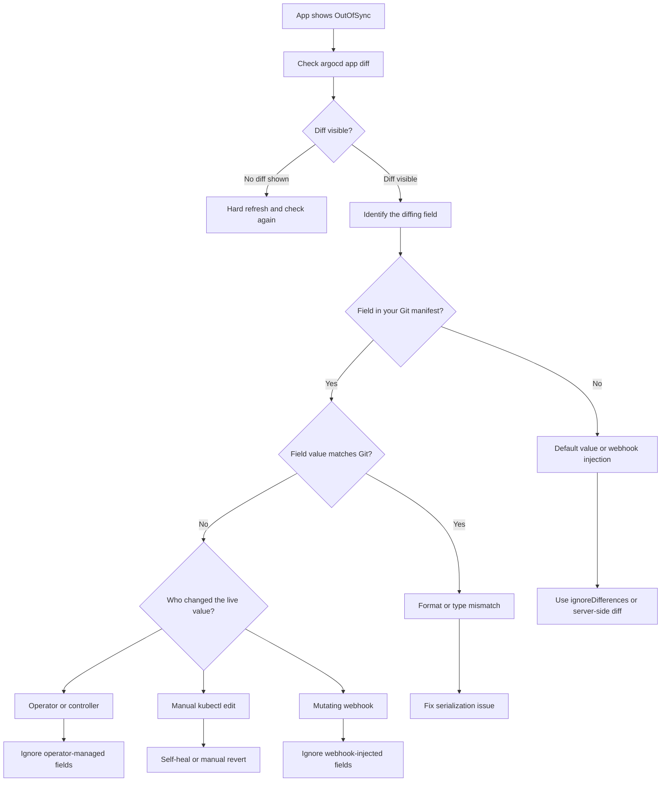

# How to Debug Unexpected Diff Results in ArgoCD

Author: [nawazdhandala](https://github.com/nawazdhandala)

Tags: ArgoCD, GitOps, Kubernetes, Troubleshooting, Debugging

Description: Learn systematic approaches to diagnose and fix unexpected diff results in ArgoCD when applications show OutOfSync for no obvious reason.

---

Your ArgoCD application keeps showing OutOfSync, and you cannot figure out why. You have not changed anything in Git, nobody has touched the cluster, and yet ArgoCD insists there is a difference. This is one of the most frustrating experiences in ArgoCD, but there is always a logical explanation. This guide gives you a systematic debugging process to find and fix it.

## The Debugging Process

Follow this flowchart to systematically identify the source of unexpected diffs:



## Step 1: View the Actual Diff

Start by getting the actual diff output:

```bash
# Basic diff
argocd app diff my-app

# Diff with more detail
argocd app diff my-app --local /path/to/manifests

# Diff in JSON format for easier parsing
argocd app get my-app -o json | jq '.status.resources[] | select(.status == "OutOfSync")'
```

### Using the UI

In the ArgoCD UI:
1. Click on the application
2. Look for resources with a yellow "OutOfSync" badge
3. Click on the resource
4. Open the "Diff" tab
5. The differences are highlighted in yellow

## Step 2: Hard Refresh

ArgoCD caches both the Git state and the live cluster state. A stale cache can show incorrect diffs:

```bash
# Hard refresh clears the cache and re-fetches everything
argocd app get my-app --hard-refresh

# Then check the diff again
argocd app diff my-app
```

If the diff disappears after a hard refresh, the problem was a stale cache. This is common after:
- ArgoCD component restarts
- Network timeouts to Git or the cluster
- Large applications with many resources

## Step 3: Identify the Source of the Diff

### Default Values

If the diff shows fields you did not define in Git:

```bash
# Example: diff shows terminationGracePeriodSeconds: 30
# This is a Kubernetes default value

# Fix: Use server-side diff
kubectl annotate application my-app -n argocd \
  argocd.argoproj.io/compare-options=ServerSideDiff=true --overwrite
argocd app get my-app --hard-refresh
```

For more on default values, see [How to Handle Default Value Diffs in ArgoCD](https://oneuptime.com/blog/post/2026-02-26-argocd-default-value-diffs/view).

### Webhook-Injected Fields

If the diff shows containers, volumes, or annotations you did not define:

```bash
# Check for mutating webhooks
kubectl get mutatingwebhookconfigurations

# Check if the injected field matches a known webhook
# Example: container named "istio-proxy" = Istio sidecar injector
```

See [How to Ignore MutatingWebhook-Injected Fields](https://oneuptime.com/blog/post/2026-02-26-argocd-ignore-mutatingwebhook-fields/view).

### Operator-Modified Fields

If the diff shows a field value different from Git:

```bash
# Check who last modified the field
kubectl get deployment my-app -o json | \
  jq '.metadata.managedFields[] | {manager, operation, time}'

# Common operators that modify fields:
# - kube-controller-manager (HPA modifying replicas)
# - vpa-recommender (VPA modifying resource requests)
# - cert-manager controllers (modifying annotations)
```

### Format or Type Mismatches

Sometimes the value is semantically the same but formatted differently:

```bash
# Example diffs that are format mismatches:
# Git:  cpu: "500m"     Live: cpu: 500m       (quoted vs unquoted)
# Git:  memory: "1Gi"   Live: memory: 1Gi
# Git:  port: "8080"    Live: port: 8080      (string vs integer)
# Git:  replicas: "3"   Live: replicas: 3
```

Fix these by ensuring your Git manifests use the correct YAML types:

```yaml
# Wrong - string value for a numeric field
spec:
  replicas: "3"

# Right - integer value
spec:
  replicas: 3
```

### Helm Rendering Issues

If using Helm, the rendered template may differ from what you expect:

```bash
# Render the Helm chart locally to see the actual output
helm template my-app ./chart --values values.yaml

# Compare with what ArgoCD renders
argocd app manifests my-app --source live > live.yaml
argocd app manifests my-app --source git > git.yaml
diff live.yaml git.yaml
```

### Kustomize Rendering Issues

```bash
# Build the Kustomize output locally
kustomize build /path/to/overlay

# Compare with ArgoCD's rendered output
argocd app manifests my-app --source git
```

## Step 4: Check for Normalization Issues

ArgoCD normalizes manifests before comparing them. Sometimes this normalization causes unexpected results.

### Resource Status

ArgoCD should ignore the `status` field, but custom resources may not have proper status subresource configuration:

```bash
# Check if a CRD has status subresource enabled
kubectl get crd mycrd.example.com -o json | \
  jq '.spec.versions[].subresources'
```

If the status subresource is not enabled, ArgoCD may include status in the diff.

### Empty vs Null vs Missing Fields

Kubernetes treats empty objects `{}`, null values, and missing fields differently:

```yaml
# These are all different to the diff engine:
metadata:
  annotations: {}      # Empty object
  annotations: null    # Null
  # (field missing)    # Not present
```

Fix by being explicit:

```yaml
# If you don't want annotations, omit the field entirely
# Don't use: annotations: {}
```

## Step 5: Use the ArgoCD API for Deeper Inspection

```bash
# Get the full managed resources with diff details
argocd app resources my-app

# Get the resource tree
argocd app resources my-app --tree

# Get detailed status of each resource
argocd app get my-app -o json | \
  jq '.status.resources[] | {kind, name, status, health: .health.status}'
```

## Step 6: Check ArgoCD Controller Logs

The application controller logs contain detailed diff information:

```bash
# Get controller logs filtered for your application
kubectl logs -n argocd deployment/argocd-application-controller | \
  grep "my-app" | tail -50

# Look for comparison or diff-related messages
kubectl logs -n argocd deployment/argocd-application-controller | \
  grep -i "diff\|compare\|normalize" | tail -20
```

## Step 7: Check the Repo Server

If the diff seems wrong, the repo server may be rendering manifests incorrectly:

```bash
# Check repo server logs for errors
kubectl logs -n argocd deployment/argocd-repo-server | tail -50

# Check if the repo server has the correct version of tools
kubectl exec -n argocd deployment/argocd-repo-server -- helm version
kubectl exec -n argocd deployment/argocd-repo-server -- kustomize version
```

## Common Unexpected Diff Scenarios

### Scenario: Diff Appears and Disappears

If the diff fluctuates, it is usually caused by:
- A controller that periodically modifies a field
- Cache timing issues
- Multiple ArgoCD controllers competing (in HA setups)

```bash
# Watch the sync status over time
watch -n 5 'argocd app get my-app -o json | jq .status.sync.status'
```

### Scenario: Diff After Every Sync

If syncing resolves the OutOfSync but it immediately comes back:
- An operator or controller is reverting changes
- A webhook modifies the resource after ArgoCD applies it
- The resource has a finalizer that modifies it

```bash
# Check for recent events on the resource
kubectl events --for deployment/my-app --watch
```

### Scenario: Diff Only on Certain Resources

If only some resources show diffs:

```bash
# List all OutOfSync resources
argocd app get my-app -o json | \
  jq '.status.resources[] | select(.status == "OutOfSync") | {kind, name}'
```

### Scenario: Diff After ArgoCD Upgrade

ArgoCD upgrades can change diff behavior:
- New normalization rules
- Changes to how certain resource types are compared
- Bug fixes that expose previously hidden diffs

Check the ArgoCD release notes for diff-related changes.

## Nuclear Options

When nothing else works:

```bash
# Option 1: Force replace the resource
argocd app sync my-app --resource apps/Deployment/my-app --force

# Option 2: Delete and let ArgoCD recreate
argocd app delete-resource my-app --kind Deployment --resource-name my-app
argocd app sync my-app

# Option 3: Enable server-side diff (often resolves mysterious diffs)
kubectl annotate application my-app -n argocd \
  argocd.argoproj.io/compare-options=ServerSideDiff=true --overwrite
argocd app get my-app --hard-refresh
```

## Building a Diff Debugging Checklist

When you encounter unexpected diffs, run through this checklist:

1. Run `argocd app diff my-app` to see the actual difference
2. Run `argocd app get my-app --hard-refresh` to clear cache
3. Check if the field is in your Git manifest
4. Check if a webhook or operator is modifying the field
5. Check for format/type mismatches in YAML
6. Try enabling server-side diff
7. Check ArgoCD controller and repo server logs
8. Verify your Helm/Kustomize renders correctly locally

Most unexpected diffs fall into one of three categories: default values, operator modifications, or webhook injections. Once you identify the category, the fix is usually straightforward. For persistent, hard-to-diagnose cases, server-side diff is often the silver bullet.
