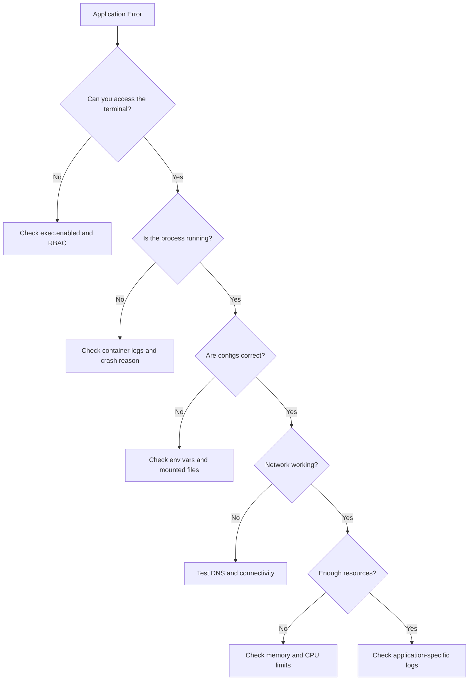

# How to Debug Using ArgoCD Web Terminal

Author: [nawazdhandala](https://github.com/nawazdhandala)

Tags: ArgoCD, GitOps, Kubernetes, Debugging, Troubleshooting

Description: Learn practical debugging techniques using the ArgoCD web-based terminal, including common troubleshooting patterns for network issues, configuration problems, and application errors.

---

The ArgoCD web terminal gives you direct interactive access to running containers from the ArgoCD UI. While enabling it is straightforward, knowing how to use it effectively for real debugging scenarios takes practice. This guide covers practical debugging workflows and techniques you can use from the ArgoCD web terminal.

## Accessing the Terminal

Once the terminal feature is enabled (see our guide on [enabling the web-based terminal in ArgoCD](https://oneuptime.com/blog/post/2026-02-26-argocd-web-based-terminal/view)), you can access it through the UI:

1. Navigate to your application in the ArgoCD UI
2. Click on a Pod in the resource tree
3. Select the **Terminal** tab
4. Choose the target container from the dropdown
5. Select your preferred shell (bash, sh, etc.)
6. Click **Connect**

You will see a terminal prompt and can start running commands.

## Debugging Network Connectivity

One of the most common debugging scenarios is investigating network issues between services.

### Testing Service-to-Service Communication

```bash
# Check if the DNS resolution works for a service
nslookup my-service.my-namespace.svc.cluster.local

# Test TCP connectivity to another service
nc -zv my-service.my-namespace.svc.cluster.local 8080

# If netcat is not available, use /dev/tcp (bash only)
echo > /dev/tcp/my-service.my-namespace.svc.cluster.local/8080 && echo "Connected" || echo "Failed"

# Check HTTP endpoint
curl -v http://my-service.my-namespace.svc.cluster.local:8080/health
```

### Checking DNS Resolution

```bash
# Verify the DNS configuration inside the pod
cat /etc/resolv.conf

# Check if CoreDNS is resolving properly
nslookup kubernetes.default.svc.cluster.local

# Test external DNS resolution
nslookup api.example.com
```

### Inspecting Network Environment

```bash
# Show network interfaces
ip addr show

# Show routing table
ip route show

# Check if iptables rules are affecting traffic
iptables -L -n 2>/dev/null || echo "iptables not available"
```

## Debugging Configuration Issues

Misconfigured environment variables or mounted files are frequent causes of application failures.

### Checking Environment Variables

```bash
# List all environment variables
env | sort

# Check specific variables
echo $DATABASE_URL
echo $API_KEY

# Check if a ConfigMap was mounted correctly
cat /etc/config/application.yaml

# Verify secret mounts
ls -la /etc/secrets/
# Note: do not cat secrets in shared environments
```

### Verifying Mounted Volumes

```bash
# Check all mounted filesystems
df -h

# List mounted volumes
mount | grep -v "proc\|sys\|cgroup"

# Check if a persistent volume has the expected data
ls -la /data/
du -sh /data/*

# Verify file permissions
stat /app/config/settings.json
```

### Checking Process State

```bash
# See what processes are running
ps aux

# Check if the main application process is running
ps aux | grep -i "node\|java\|python\|go"

# Check process resource usage
top -bn1 | head -20

# Check memory usage
free -m

# Check disk space
df -h
```

## Debugging Application Errors

### Reading Application Logs from Inside the Container

While you can view logs through the ArgoCD UI directly, sometimes you need to check log files that are not sent to stdout:

```bash
# Check application log files
tail -100 /var/log/app/error.log

# Follow a log file in real time
tail -f /var/log/app/application.log

# Search for specific error patterns
grep -i "error\|exception\|fatal" /var/log/app/*.log | tail -50

# Check if the application wrote crash dumps
ls -la /tmp/crash-*
```

### Testing Database Connectivity

```bash
# Test PostgreSQL connection
pg_isready -h $DB_HOST -p $DB_PORT -U $DB_USER

# Test MySQL connection
mysql -h $DB_HOST -P $DB_PORT -u $DB_USER -p$DB_PASSWORD -e "SELECT 1;"

# Test Redis connection
redis-cli -h $REDIS_HOST -p $REDIS_PORT ping

# Test MongoDB connection
mongosh $MONGO_URI --eval "db.runCommand({ping: 1})"
```

### Debugging HTTP Endpoints

```bash
# Test the application's health endpoint
curl -s localhost:8080/health | python3 -m json.tool

# Check response headers
curl -I localhost:8080/api/v1/status

# Test with a POST request
curl -X POST localhost:8080/api/v1/test \
  -H "Content-Type: application/json" \
  -d '{"test": true}'

# Check what ports the application is listening on
ss -tlnp
# or if ss is not available
netstat -tlnp 2>/dev/null
```

## Debugging Resource Constraints

### Checking Memory Pressure

```bash
# Check container memory limits from cgroup
cat /sys/fs/cgroup/memory/memory.limit_in_bytes 2>/dev/null
cat /sys/fs/cgroup/memory/memory.usage_in_bytes 2>/dev/null

# For cgroup v2
cat /sys/fs/cgroup/memory.max 2>/dev/null
cat /sys/fs/cgroup/memory.current 2>/dev/null

# Check for OOM kills
dmesg 2>/dev/null | grep -i "oom\|killed"
```

### Checking CPU Throttling

```bash
# Check CPU quota
cat /sys/fs/cgroup/cpu/cpu.cfs_quota_us 2>/dev/null
cat /sys/fs/cgroup/cpu/cpu.cfs_period_us 2>/dev/null

# For cgroup v2
cat /sys/fs/cgroup/cpu.max 2>/dev/null

# Check CPU throttling stats
cat /sys/fs/cgroup/cpu/cpu.stat 2>/dev/null
```

## Working with Minimal Container Images

Many production containers use distroless or minimal Alpine images that lack common debugging tools. Here are workarounds:

### When curl Is Not Available

```bash
# Use wget instead (often available in Alpine)
wget -qO- http://my-service:8080/health

# Use Python if available
python3 -c "import urllib.request; print(urllib.request.urlopen('http://my-service:8080/health').read().decode())"

# Use the /dev/tcp bash built-in for basic connectivity testing
(echo -e "GET /health HTTP/1.1\r\nHost: my-service\r\n\r\n") > /dev/tcp/my-service/8080
```

### When nslookup Is Not Available

```bash
# Use getent for DNS resolution
getent hosts my-service.my-namespace.svc.cluster.local

# Use Python
python3 -c "import socket; print(socket.getaddrinfo('my-service', 8080))"
```

### Installing Debugging Tools on the Fly

If the container runs a package manager, you can temporarily install tools:

```bash
# Alpine-based containers
apk add --no-cache curl nmap net-tools

# Debian/Ubuntu-based containers
apt-get update && apt-get install -y curl netcat-openbsd dnsutils

# RHEL/CentOS-based containers
yum install -y curl nmap-ncat bind-utils
```

Note that any packages installed this way will be lost when the pod restarts, since they are not part of the container image.

## Debugging Workflow Diagram

Here is a systematic approach to debugging with the terminal:



## Tips for Effective Terminal Debugging

**Keep sessions short**: Terminal sessions consume resources on both the ArgoCD server and the target pod. Close sessions when you are done.

**Document findings**: When you find the root cause through terminal debugging, document it so the fix can be made in the GitOps repository rather than applied manually.

**Do not make changes**: Resist the temptation to fix things directly in the terminal. Any changes you make will be lost on pod restart and will cause drift from the desired state in Git. Instead, use what you learn to update your manifests.

**Use ephemeral debug containers**: For Kubernetes 1.23+, consider using ephemeral containers instead of exec for debugging. They let you attach a fully equipped debug container to a running pod without modifying the pod spec.

## Conclusion

The ArgoCD web terminal is a convenient entry point for debugging running applications. By combining network diagnostics, configuration verification, resource constraint checks, and log analysis, you can quickly identify most common issues. Remember to always translate your debugging findings back into GitOps manifests so the fix is permanent and version-controlled.
