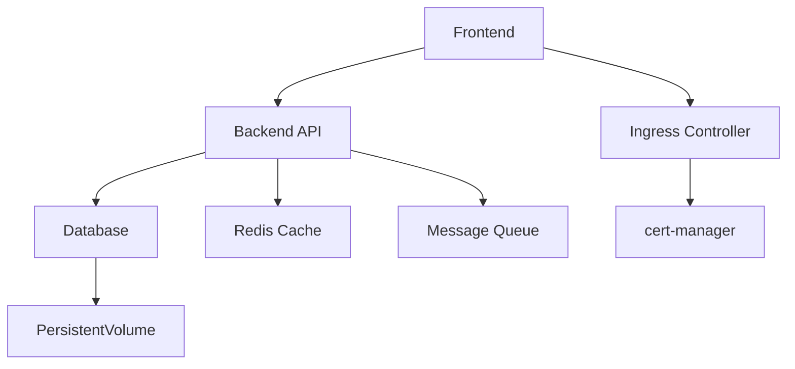

# How to Handle Declarative Application Dependencies in ArgoCD

Author: [nawazdhandala](https://github.com/nawazdhandala)

Tags: ArgoCD, GitOps, Kubernetes, Dependencies, Sync Waves

Description: Learn how to manage dependencies between declarative ArgoCD applications using sync waves, health checks, and ordering strategies for reliable multi-app deployments.

---

When managing multiple applications declaratively in ArgoCD, you frequently encounter dependencies between them. A backend API needs its database to be running. An application needs its namespace and secrets created first. A service mesh sidecar injector must be ready before deploying workloads. ArgoCD does not have built-in dependency resolution between separate Application resources, but there are effective patterns to handle ordering.

## The Dependency Challenge

In a typical microservices architecture, applications have runtime dependencies:



When deploying everything at once (like during cluster bootstrap), the order matters. If the database is not ready when the backend API starts, the API pods crash-loop. If the ingress controller is not deployed when ingress resources are created, those resources sit in a pending state.

## Strategy 1: Sync Waves

Sync waves are the primary mechanism for ordering resources within an ArgoCD Application and across applications managed by the same parent (App-of-Apps).

Assign different sync wave numbers to control deployment order:

```yaml
# infrastructure/cert-manager.yaml - Deploy first
apiVersion: argoproj.io/v1alpha1
kind: Application
metadata:
  name: cert-manager
  namespace: argocd
  annotations:
    argocd.argoproj.io/sync-wave: "-5"
spec:
  project: infrastructure
  source:
    repoURL: https://charts.jetstack.io
    chart: cert-manager
    targetRevision: v1.14.0
    helm:
      values: |
        installCRDs: true
  destination:
    server: https://kubernetes.default.svc
    namespace: cert-manager
  syncPolicy:
    automated:
      prune: true
      selfHeal: true
    syncOptions:
      - CreateNamespace=true
---
# infrastructure/ingress-nginx.yaml - Deploy after cert-manager
apiVersion: argoproj.io/v1alpha1
kind: Application
metadata:
  name: ingress-nginx
  namespace: argocd
  annotations:
    argocd.argoproj.io/sync-wave: "-3"
spec:
  project: infrastructure
  source:
    repoURL: https://kubernetes.github.io/ingress-nginx
    chart: ingress-nginx
    targetRevision: 4.9.0
  destination:
    server: https://kubernetes.default.svc
    namespace: ingress-nginx
  syncPolicy:
    automated:
      prune: true
      selfHeal: true
    syncOptions:
      - CreateNamespace=true
---
# applications/backend-api.yaml - Deploy after infrastructure
apiVersion: argoproj.io/v1alpha1
kind: Application
metadata:
  name: backend-api
  namespace: argocd
  annotations:
    argocd.argoproj.io/sync-wave: "2"
spec:
  project: applications
  source:
    repoURL: https://github.com/myorg/backend-api.git
    path: k8s/overlays/production
  destination:
    server: https://kubernetes.default.svc
    namespace: backend
```

Sync waves work in ascending order. ArgoCD processes wave -5 first, then -3, then 0 (default), then 2. Within each wave, ArgoCD waits for all resources to be healthy before proceeding to the next wave.

### Practical Wave Assignment

A recommended wave numbering scheme:

| Wave | Purpose | Examples |
|------|---------|----------|
| -10 | CRD Definitions | Custom Resource Definitions |
| -5 | Core Infrastructure | cert-manager, storage classes |
| -3 | Networking | Ingress controller, service mesh |
| -1 | Platform Services | Monitoring, logging, secrets management |
| 0 | Databases and Stateful | PostgreSQL, Redis, Kafka |
| 1 | Backend Services | APIs, workers |
| 2 | Frontend Services | Web applications |
| 5 | Post-deploy | Smoke tests, notifications |

## Strategy 2: Health-Based Ordering

Sync waves only work within a single parent application's sync operation. For independent applications, you can rely on Kubernetes-native health checking.

Configure your applications to handle dependencies gracefully with init containers:

```yaml
# In the backend-api Deployment
spec:
  template:
    spec:
      initContainers:
        # Wait for database to be ready
        - name: wait-for-db
          image: busybox:1.36
          command: ['sh', '-c']
          args:
            - |
              until nc -z postgres-service.database.svc.cluster.local 5432; do
                echo "Waiting for database..."
                sleep 2
              done
        # Wait for Redis
        - name: wait-for-redis
          image: busybox:1.36
          command: ['sh', '-c']
          args:
            - |
              until nc -z redis-master.cache.svc.cluster.local 6379; do
                echo "Waiting for Redis..."
                sleep 2
              done
      containers:
        - name: backend-api
          image: myorg/backend-api:v2.3.1
```

This approach makes your application self-healing regardless of deployment order. Even if ArgoCD deploys the API before the database, the init containers hold the API pods until the database is ready.

## Strategy 3: Separate Parent Applications with Order

Create multiple parent applications that you apply in sequence:

```yaml
# root-apps/01-infrastructure.yaml
apiVersion: argoproj.io/v1alpha1
kind: Application
metadata:
  name: infrastructure-apps
  namespace: argocd
  annotations:
    argocd.argoproj.io/sync-wave: "-5"
spec:
  project: default
  source:
    repoURL: https://github.com/myorg/argocd-config.git
    path: applications/infrastructure
  destination:
    server: https://kubernetes.default.svc
    namespace: argocd
---
# root-apps/02-platform.yaml
apiVersion: argoproj.io/v1alpha1
kind: Application
metadata:
  name: platform-apps
  namespace: argocd
  annotations:
    argocd.argoproj.io/sync-wave: "-1"
spec:
  project: default
  source:
    repoURL: https://github.com/myorg/argocd-config.git
    path: applications/platform
  destination:
    server: https://kubernetes.default.svc
    namespace: argocd
---
# root-apps/03-applications.yaml
apiVersion: argoproj.io/v1alpha1
kind: Application
metadata:
  name: workload-apps
  namespace: argocd
  annotations:
    argocd.argoproj.io/sync-wave: "1"
spec:
  project: default
  source:
    repoURL: https://github.com/myorg/argocd-config.git
    path: applications/production
  destination:
    server: https://kubernetes.default.svc
    namespace: argocd
```

Then a root application manages these parent apps:

```yaml
# root-of-roots.yaml
apiVersion: argoproj.io/v1alpha1
kind: Application
metadata:
  name: cluster-root
  namespace: argocd
spec:
  project: default
  source:
    repoURL: https://github.com/myorg/argocd-config.git
    path: root-apps
  destination:
    server: https://kubernetes.default.svc
    namespace: argocd
  syncPolicy:
    automated:
      prune: true
      selfHeal: true
```

## Strategy 4: Custom Health Checks

For CRDs and operators, define custom health checks so ArgoCD knows when they are truly ready:

```yaml
# In argocd-cm ConfigMap
apiVersion: v1
kind: ConfigMap
metadata:
  name: argocd-cm
  namespace: argocd
data:
  resource.customizations.health.cert-manager.io_Certificate: |
    hs = {}
    if obj.status ~= nil then
      if obj.status.conditions ~= nil then
        for i, condition in ipairs(obj.status.conditions) do
          if condition.type == "Ready" and condition.status == "True" then
            hs.status = "Healthy"
            hs.message = condition.message
            return hs
          end
        end
      end
    end
    hs.status = "Progressing"
    hs.message = "Waiting for certificate to be ready"
    return hs
```

With this custom health check, ArgoCD considers a Certificate resource healthy only when its Ready condition is True. Sync waves then correctly wait for certificates to be issued before proceeding to the next wave.

## Handling Circular Dependencies

Sometimes you encounter circular dependencies. Service A needs Service B, and Service B needs Service A. The solution is to make the dependency optional at startup:

```yaml
# Both services start even if the other is unavailable
# Use readiness probes instead of init containers
spec:
  template:
    spec:
      containers:
        - name: service-a
          image: myorg/service-a:v1.0
          readinessProbe:
            httpGet:
              path: /healthz
              port: 8080
            initialDelaySeconds: 5
            periodSeconds: 10
          env:
            # Service gracefully handles missing dependency
            - name: SERVICE_B_URL
              value: "http://service-b.default.svc.cluster.local:8080"
            - name: SERVICE_B_RETRY_ENABLED
              value: "true"
```

Both services start in the same sync wave and use retry logic to handle the startup race condition.

## Debugging Dependency Issues

When sync waves are not working as expected:

```bash
# Check sync wave annotations on all applications
kubectl get applications -n argocd \
  -o custom-columns='NAME:.metadata.name,WAVE:.metadata.annotations.argocd\.argoproj\.io/sync-wave,HEALTH:.status.health\.status,SYNC:.status.sync\.status'

# Check why an application is not healthy (blocking the next wave)
argocd app get my-app --refresh

# View detailed sync status
argocd app sync my-app --dry-run
```

## Best Practices

1. **Combine sync waves with init containers** for defense in depth
2. **Keep wave numbers simple** - use increments of 1 or 5, not arbitrary numbers
3. **Document your wave assignments** in a README alongside your Application manifests
4. **Test the full deployment order** in a clean cluster regularly
5. **Make dependencies optional** where possible to reduce coupling
6. **Use custom health checks** for CRDs and operators so sync waves wait correctly
7. **Avoid deep dependency chains** - more than 5 waves becomes hard to reason about

Handling dependencies properly is what makes the difference between a fragile declarative setup and a robust one. Sync waves give you the ordering primitives, health checks ensure readiness, and init containers provide application-level resilience. Use all three together for reliable multi-application deployments.
