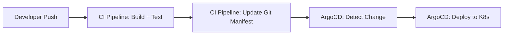

# How to Create Deep Links to CI/CD Pipelines from ArgoCD

Author: [nawazdhandala](https://github.com/nawazdhandala)

Tags: ArgoCD, GitOps, Kubernetes, CI/CD, DevOps

Description: Learn how to configure ArgoCD deep links to CI/CD pipelines in GitHub Actions, GitLab CI, Jenkins, and other systems so your team can trace deployments back to the build that produced them.

---

In a GitOps workflow, ArgoCD handles the deployment side while a separate CI system handles building and testing. When something breaks after a deployment, one of the first questions is "which CI build produced this version?" ArgoCD deep links let you add clickable shortcuts from applications and resources directly to the CI/CD pipeline that built them.

This guide covers setting up deep links to GitHub Actions, GitLab CI, Jenkins, CircleCI, and other CI/CD systems.

## The Deployment Traceability Problem

In a typical GitOps setup, the flow looks like this:



Without deep links, going from ArgoCD back to the CI pipeline that triggered the change requires manually searching through your CI system. Deep links make this a one-click operation.

## Deep Links to GitHub Actions

GitHub Actions URLs follow a predictable pattern. You can link to workflow runs filtered by branch or to the repository's Actions tab:

```yaml
apiVersion: v1
kind: ConfigMap
metadata:
  name: argocd-cm
  namespace: argocd
data:
  application.links: |
    # Link to GitHub Actions runs for the source repository
    - url: {{.spec.source.repoURL | replace ".git" "" | replace "git@github.com:" "https://github.com/"}}/actions?query=branch:{{.spec.source.targetRevision}}
      title: GitHub Actions
      description: View CI pipeline runs for this branch
      icon.class: "fa fa-cogs"

    # Link to the specific commit in GitHub
    - url: {{.spec.source.repoURL | replace ".git" "" | replace "git@github.com:" "https://github.com/"}}/commit/{{.status.sync.revision}}
      title: View Commit
      description: View the deployed commit in GitHub
      icon.class: "fa fa-code-branch"

    # Link to pull requests for the branch
    - url: {{.spec.source.repoURL | replace ".git" "" | replace "git@github.com:" "https://github.com/"}}/pulls?q=is:pr+head:{{.spec.source.targetRevision}}
      title: Pull Requests
      description: View related pull requests
      icon.class: "fa fa-code-branch"
```

### Linking to a Specific Workflow

If you have a specific workflow file name, you can link directly to it:

```yaml
  application.links: |
    # Link to a specific GitHub Actions workflow
    - url: {{.spec.source.repoURL | replace ".git" "" | replace "git@github.com:" "https://github.com/"}}/actions/workflows/deploy.yml?query=branch:{{.spec.source.targetRevision}}
      title: Deploy Pipeline
      description: View deployment pipeline runs
      icon.class: "fa fa-rocket"
```

## Deep Links to GitLab CI/CD

GitLab CI uses a different URL structure:

```yaml
  application.links: |
    # Link to GitLab CI/CD pipelines for the branch
    - url: {{.spec.source.repoURL | replace ".git" ""}}/pipelines?ref={{.spec.source.targetRevision}}
      title: GitLab Pipelines
      description: View CI/CD pipelines for this branch
      icon.class: "fa fa-cogs"

    # Link to the specific commit in GitLab
    - url: {{.spec.source.repoURL | replace ".git" ""}}/commit/{{.status.sync.revision}}
      title: View Commit
      description: View the deployed commit in GitLab
      icon.class: "fa fa-code-branch"

    # Link to merge requests
    - url: {{.spec.source.repoURL | replace ".git" ""}}/merge_requests?scope=all&state=all&search={{.spec.source.targetRevision}}
      title: Merge Requests
      description: View related merge requests
      icon.class: "fa fa-code-branch"
```

### GitLab with Environments

GitLab supports environments natively, so you can link to the environment page:

```yaml
    # Link to GitLab environment
    - url: {{.spec.source.repoURL | replace ".git" ""}}/environments?search={{.spec.destination.namespace}}
      title: GitLab Environment
      description: View environment deployments
      icon.class: "fa fa-server"
```

## Deep Links to Jenkins

Jenkins URLs depend on your Jenkins setup. For multibranch pipelines:

```yaml
  application.links: |
    # Link to Jenkins multibranch pipeline for the branch
    - url: https://jenkins.example.com/job/my-org/job/my-repo/job/{{.spec.source.targetRevision}}/
      title: Jenkins Pipeline
      description: View Jenkins builds for this branch
      icon.class: "fa fa-cogs"

    # Link to Jenkins Blue Ocean view
    - url: https://jenkins.example.com/blue/organizations/jenkins/my-org%2Fmy-repo/activity?branch={{.spec.source.targetRevision}}
      title: Jenkins (Blue Ocean)
      description: View pipeline in Blue Ocean
      icon.class: "fa fa-water"
```

For applications that use annotations to store the Jenkins job URL:

```yaml
  resource.links: |
    # Link using annotation from the deployed resource
    - url: {{.metadata.annotations.jenkins-build-url}}
      title: Jenkins Build
      description: View the Jenkins build that produced this deployment
      icon.class: "fa fa-cogs"
      if: metadata.annotations.jenkins-build-url != nil
```

This approach requires your CI pipeline to add the build URL as an annotation to the Kubernetes manifest before committing it to Git.

## Deep Links to CircleCI

```yaml
  application.links: |
    # Link to CircleCI pipeline runs
    - url: https://app.circleci.com/pipelines/github/my-org/my-repo?branch={{.spec.source.targetRevision}}
      title: CircleCI Pipeline
      description: View CircleCI pipeline runs
      icon.class: "fa fa-circle"
```

## Deep Links to Azure DevOps Pipelines

```yaml
  application.links: |
    # Link to Azure DevOps pipeline runs
    - url: https://dev.azure.com/my-org/my-project/_build?definitionId=1&branchFilter={{.spec.source.targetRevision}}
      title: Azure DevOps Pipeline
      description: View Azure DevOps builds
      icon.class: "fa fa-cogs"

    # Link to the Azure DevOps repository
    - url: https://dev.azure.com/my-org/my-project/_git/my-repo?version=GB{{.spec.source.targetRevision}}
      title: Azure Repos
      description: View source in Azure Repos
      icon.class: "fa fa-code"
```

## Linking Resources to Build Artifacts

You can add deep links to individual resources that link back to the container image build:

```yaml
  resource.links: |
    # Link to the container image in a registry
    # This assumes the image tag is used as the pod label or annotation
    - url: https://hub.docker.com/r/{{.spec.containers[0].image | replace ":" "/tags?name="}}
      title: Docker Hub Image
      description: View the container image on Docker Hub
      icon.class: "fa fa-docker"
      if: kind == "Pod"

    # Link to GitHub Container Registry
    - url: https://github.com/orgs/my-org/packages?query={{.metadata.labels.app}}
      title: Container Image
      description: View container image in GHCR
      icon.class: "fa fa-box"
      if: kind == "Deployment"
```

## Using Annotations for Dynamic CI Links

The most flexible approach is to have your CI pipeline inject the build URL into the Kubernetes manifests as an annotation. Then the deep link simply reads the annotation:

### CI Pipeline (GitHub Actions Example)

```yaml
# .github/workflows/deploy.yml
- name: Update deployment manifest
  run: |
    # Add the build URL as an annotation
    yq eval '.metadata.annotations["ci/build-url"] = "${{ github.server_url }}/${{ github.repository }}/actions/runs/${{ github.run_id }}"' \
      -i k8s/deployment.yaml

    yq eval '.metadata.annotations["ci/commit-sha"] = "${{ github.sha }}"' \
      -i k8s/deployment.yaml

    yq eval '.metadata.annotations["ci/build-number"] = "${{ github.run_number }}"' \
      -i k8s/deployment.yaml
```

### ArgoCD Deep Link Configuration

```yaml
  resource.links: |
    # Dynamic CI link from annotation
    - url: "{{.metadata.annotations.ci/build-url}}"
      title: "CI Build #{{.metadata.annotations.ci/build-number}}"
      description: View the CI build that produced this deployment
      icon.class: "fa fa-cogs"
      if: metadata.annotations.ci/build-url != nil

    # Link to the specific commit
    - url: https://github.com/my-org/my-repo/commit/{{.metadata.annotations.ci/commit-sha}}
      title: Source Commit
      description: View the source commit
      icon.class: "fa fa-code"
      if: metadata.annotations.ci/commit-sha != nil
```

This approach has the advantage of being CI-system agnostic. The deep link configuration stays the same regardless of whether you use GitHub Actions, GitLab CI, or Jenkins.

## Complete Configuration Example

Here is a full configuration that combines CI/CD links with source code links:

```yaml
apiVersion: v1
kind: ConfigMap
metadata:
  name: argocd-cm
  namespace: argocd
data:
  application.links: |
    # Source code links
    - url: {{.spec.source.repoURL | replace ".git" "" | replace "git@github.com:" "https://github.com/"}}/tree/{{.spec.source.targetRevision}}/{{.spec.source.path}}
      title: Source Code
      icon.class: "fa fa-code"

    # CI/CD pipeline link
    - url: {{.spec.source.repoURL | replace ".git" "" | replace "git@github.com:" "https://github.com/"}}/actions?query=branch:{{.spec.source.targetRevision}}
      title: CI Pipeline
      icon.class: "fa fa-cogs"

    # Deployed commit
    - url: {{.spec.source.repoURL | replace ".git" "" | replace "git@github.com:" "https://github.com/"}}/commit/{{.status.sync.revision}}
      title: Deployed Commit
      icon.class: "fa fa-code-branch"

  resource.links: |
    # Annotation-based CI link (works with any CI system)
    - url: "{{.metadata.annotations.ci/build-url}}"
      title: CI Build
      icon.class: "fa fa-cogs"
      if: metadata.annotations.ci/build-url != nil
```

## Conclusion

Deep links from ArgoCD to CI/CD pipelines close the gap between deployment and build traceability. Whether you use a simple URL template based on the repository URL and branch, or a more sophisticated approach using annotations injected by CI, the result is the same: your team can trace any deployment back to the exact CI build and source commit that produced it. For more on integrating ArgoCD with specific CI systems, check our guide on [integrating ArgoCD with GitHub Actions](https://oneuptime.com/blog/post/2026-02-26-argocd-github-actions-integration/view).
