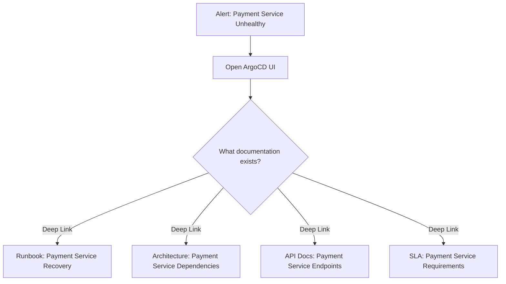

# How to Create Deep Links to Documentation from ArgoCD

Author: [nawazdhandala](https://github.com/nawazdhandala)

Tags: ArgoCD, GitOps, Kubernetes, Documentation, Productivity

Description: Learn how to configure ArgoCD deep links to documentation systems like Confluence, Notion, GitHub Wiki, and internal runbooks so operators can quickly find relevant docs during incidents.

---

During an incident, finding the right runbook or documentation page can make the difference between a five-minute fix and an hour-long scramble. ArgoCD deep links let you embed clickable shortcuts from applications and resources directly to relevant documentation, runbooks, architecture diagrams, and operational guides.

This guide covers how to link ArgoCD to various documentation systems and create a self-documenting deployment dashboard.

## Why Link Documentation to ArgoCD?

Most organizations keep their documentation scattered across multiple systems. Application architecture is in Confluence, runbooks are in a wiki, API docs are in Swagger, and operational procedures are in a shared drive. ArgoCD deep links bring all of these together in one place.

Consider this scenario:



Instead of searching multiple documentation systems, the operator clicks the relevant deep link right from the ArgoCD application page.

## Basic Documentation Deep Links

The simplest approach is to add static documentation links at the application level:

```yaml
apiVersion: v1
kind: ConfigMap
metadata:
  name: argocd-cm
  namespace: argocd
data:
  application.links: |
    # Link to the application's runbook
    - url: https://wiki.example.com/runbooks/{{.metadata.name}}
      title: Runbook
      description: View the operational runbook for this application
      icon.class: "fa fa-book"

    # Link to architecture documentation
    - url: https://wiki.example.com/architecture/{{.metadata.name}}
      title: Architecture Docs
      description: View architecture documentation
      icon.class: "fa fa-sitemap"

    # Link to the README in the source repository
    - url: {{.spec.source.repoURL | replace ".git" "" | replace "git@github.com:" "https://github.com/"}}/blob/{{.spec.source.targetRevision}}/{{.spec.source.path}}/README.md
      title: README
      description: View the application README
      icon.class: "fa fa-file-alt"
```

## Links to Confluence

Confluence uses page IDs and space keys in its URLs:

```yaml
  application.links: |
    # Link to a Confluence space filtered by application name
    - url: https://confluence.example.com/dosearchsite.action?queryString={{.metadata.name}}+runbook&where=TEAM
      title: Search Confluence
      description: Search Confluence for application documentation
      icon.class: "fa fa-search"

    # Link to a specific Confluence space
    - url: https://confluence.example.com/display/DEVOPS/{{.metadata.name}}
      title: Confluence Docs
      description: View application page in Confluence
      icon.class: "fa fa-book"

  project.links: |
    # Link to project-level documentation
    - url: https://confluence.example.com/display/DEVOPS/Project+{{.metadata.name}}
      title: Project Docs
      description: View project documentation in Confluence
      icon.class: "fa fa-book"
```

## Links to Notion

Notion has a different URL pattern. Since Notion page URLs are not as predictable, the best approach is to either search or use a standardized naming convention:

```yaml
  application.links: |
    # Search Notion for application docs
    - url: https://www.notion.so/my-workspace/search?q={{.metadata.name}}
      title: Notion Docs
      description: Search for application docs in Notion
      icon.class: "fa fa-book"
```

For a more reliable approach, store the Notion page URL in an annotation:

```yaml
  resource.links: |
    # Link using a Notion URL stored in an annotation
    - url: "{{.metadata.annotations.docs/notion-url}}"
      title: Notion Page
      description: View documentation in Notion
      icon.class: "fa fa-book"
      if: metadata.annotations.docs/notion-url != nil
```

## Links to GitHub Wiki

If your documentation lives alongside your code in GitHub Wiki:

```yaml
  application.links: |
    # Link to GitHub Wiki home page
    - url: {{.spec.source.repoURL | replace ".git" "" | replace "git@github.com:" "https://github.com/"}}/wiki
      title: GitHub Wiki
      description: View application wiki
      icon.class: "fa fa-wikipedia-w"

    # Link to a specific wiki page (using application name as page title)
    - url: {{.spec.source.repoURL | replace ".git" "" | replace "git@github.com:" "https://github.com/"}}/wiki/{{.metadata.name}}
      title: Wiki: {{.metadata.name}}
      description: View application-specific wiki page
      icon.class: "fa fa-file-alt"
```

## Links to API Documentation

For services with API documentation:

```yaml
  resource.links: |
    # Link to Swagger/OpenAPI docs for a service
    - url: https://{{.metadata.name}}.example.com/swagger-ui/
      title: API Docs
      description: View Swagger API documentation
      icon.class: "fa fa-plug"
      if: kind == "Service"

    # Link to internal API catalog
    - url: https://api-catalog.example.com/services/{{.metadata.name}}
      title: API Catalog
      description: View in API catalog
      icon.class: "fa fa-list"
      if: kind == "Service"

  application.links: |
    # Link to Stoplight or similar API documentation tool
    - url: https://stoplight.example.com/docs/{{.metadata.name}}
      title: API Reference
      description: View API reference documentation
      icon.class: "fa fa-plug"
```

## Annotation-Based Documentation Links

The most flexible approach is to store documentation URLs directly in resource annotations. This keeps documentation links close to the code and makes them manageable by the team that owns the application.

### Add Annotations to Kubernetes Manifests

```yaml
# In your application's deployment.yaml
apiVersion: apps/v1
kind: Deployment
metadata:
  name: payment-service
  namespace: production
  annotations:
    # Documentation links
    docs/runbook: "https://wiki.example.com/runbooks/payment-service"
    docs/architecture: "https://wiki.example.com/arch/payment-service"
    docs/api: "https://api-docs.example.com/payment"
    docs/oncall: "https://pagerduty.example.com/schedules/payment-team"
    docs/sla: "https://wiki.example.com/sla/payment-service"
spec:
  # ...
```

### Configure Deep Links to Read Annotations

```yaml
apiVersion: v1
kind: ConfigMap
metadata:
  name: argocd-cm
  namespace: argocd
data:
  resource.links: |
    # Runbook link from annotation
    - url: "{{.metadata.annotations.docs/runbook}}"
      title: Runbook
      description: View operational runbook
      icon.class: "fa fa-book"
      if: metadata.annotations.docs/runbook != nil

    # Architecture docs from annotation
    - url: "{{.metadata.annotations.docs/architecture}}"
      title: Architecture
      description: View architecture documentation
      icon.class: "fa fa-sitemap"
      if: metadata.annotations.docs/architecture != nil

    # API docs from annotation
    - url: "{{.metadata.annotations.docs/api}}"
      title: API Docs
      description: View API documentation
      icon.class: "fa fa-plug"
      if: metadata.annotations.docs/api != nil

    # On-call schedule
    - url: "{{.metadata.annotations.docs/oncall}}"
      title: On-Call Schedule
      description: View on-call schedule for this service
      icon.class: "fa fa-phone"
      if: metadata.annotations.docs/oncall != nil

    # SLA documentation
    - url: "{{.metadata.annotations.docs/sla}}"
      title: SLA
      description: View SLA requirements
      icon.class: "fa fa-balance-scale"
      if: metadata.annotations.docs/sla != nil
```

This approach has several advantages:
- Documentation links are version-controlled alongside the application
- Each team manages their own documentation links
- Links automatically update when documentation moves
- No centralized ArgoCD configuration changes needed for new apps

## Links to Incident Management

During incidents, quick access to incident management tools is critical:

```yaml
  application.links: |
    # Create a new incident
    - url: https://pagerduty.example.com/incidents/new?service={{.metadata.name}}
      title: Create Incident
      description: Create a PagerDuty incident for this application
      icon.class: "fa fa-exclamation-circle"

    # View recent incidents
    - url: https://pagerduty.example.com/incidents?service={{.metadata.name}}&time_range=past_week
      title: Recent Incidents
      description: View recent incidents
      icon.class: "fa fa-history"

    # Link to OneUptime incident tracking
    - url: https://oneuptime.com/dashboard/project/incidents?search={{.metadata.name}}
      title: OneUptime Incidents
      description: View incidents in OneUptime
      icon.class: "fa fa-fire"
```

## Complete Production Configuration

Here is a comprehensive configuration that combines multiple documentation sources:

```yaml
apiVersion: v1
kind: ConfigMap
metadata:
  name: argocd-cm
  namespace: argocd
data:
  application.links: |
    # Source code and README
    - url: {{.spec.source.repoURL | replace ".git" "" | replace "git@github.com:" "https://github.com/"}}/blob/{{.spec.source.targetRevision}}/{{.spec.source.path}}/README.md
      title: README
      icon.class: "fa fa-file-alt"

    # Wiki
    - url: {{.spec.source.repoURL | replace ".git" "" | replace "git@github.com:" "https://github.com/"}}/wiki
      title: Wiki
      icon.class: "fa fa-wikipedia-w"

    # Search Confluence
    - url: https://confluence.example.com/dosearchsite.action?queryString={{.metadata.name}}
      title: Confluence
      icon.class: "fa fa-search"

  resource.links: |
    # Annotation-driven documentation links
    - url: "{{.metadata.annotations.docs/runbook}}"
      title: Runbook
      icon.class: "fa fa-book"
      if: metadata.annotations.docs/runbook != nil

    - url: "{{.metadata.annotations.docs/architecture}}"
      title: Architecture
      icon.class: "fa fa-sitemap"
      if: metadata.annotations.docs/architecture != nil

    - url: "{{.metadata.annotations.docs/api}}"
      title: API Docs
      icon.class: "fa fa-plug"
      if: metadata.annotations.docs/api != nil

  project.links: |
    # Project documentation
    - url: https://confluence.example.com/display/DEVOPS/{{.metadata.name}}
      title: Project Docs
      icon.class: "fa fa-book"
```

## Best Practices

**Use annotations over hardcoded URLs**: Annotations keep documentation links close to the application code and allow teams to manage their own links without changing ArgoCD configuration.

**Standardize annotation keys**: Define a convention like `docs/runbook`, `docs/architecture`, `docs/api` and enforce it across teams.

**Keep links current**: Stale documentation links are worse than no links. Include documentation link checks in your CI pipeline or code review process.

**Link to search results when specific pages are unpredictable**: If your documentation structure does not follow a pattern, link to a search query instead of a specific page.

## Conclusion

Documentation deep links in ArgoCD create a self-service experience where operators can find the information they need without leaving the deployment dashboard. The annotation-based approach is the most scalable since it distributes the responsibility of maintaining links to the teams that own the applications. Start with runbooks and architecture docs as they are the most commonly needed during incidents, then expand to API docs, SLA pages, and incident management tools as your team finds them useful.
