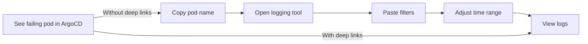

# How to Create Deep Links to Logging Systems from ArgoCD

Author: [nawazdhandala](https://github.com/nawazdhandala)

Tags: ArgoCD, GitOps, Kubernetes, Logging, Observability

Description: Learn how to configure ArgoCD deep links to logging systems like Loki, Elasticsearch, Kibana, CloudWatch, and Splunk for instant access to relevant logs from the deployment UI.

---

When a deployment goes wrong, logs are usually the first place you look. But finding the right logs in the right system for the right pod can take precious minutes during an incident. ArgoCD deep links let you add clickable shortcuts directly on pods, deployments, and other resources that open the correct logging view with all filters pre-configured.

This guide shows you how to set up deep links from ArgoCD to every major logging system.

## The Problem Deep Links Solve

Consider a typical debugging workflow without deep links:

1. Notice an application is unhealthy in ArgoCD
2. Copy the pod name and namespace
3. Open your logging system in a new tab
4. Navigate to the correct data source
5. Paste the namespace and pod name into the search filters
6. Adjust the time range

With deep links, steps 2 through 6 become a single click.



## Deep Links to Grafana Loki

Loki is a popular log aggregation system that pairs with Grafana. The deep link URL uses Grafana's Explore view with a LogQL query:

```yaml
apiVersion: v1
kind: ConfigMap
metadata:
  name: argocd-cm
  namespace: argocd
data:
  resource.links: |
    # Pod logs in Grafana/Loki
    - url: https://grafana.example.com/explore?orgId=1&left={"queries":[{"refId":"A","expr":"{namespace=\"{{.metadata.namespace}}\", pod=\"{{.metadata.name}}\"}","queryType":"range"}],"range":{"from":"now-1h","to":"now"},"datasource":"Loki"}
      title: View Logs (Loki)
      description: View pod logs in Grafana Loki
      icon.class: "fa fa-scroll"
      if: kind == "Pod"

    # Deployment logs in Grafana/Loki (all pods for a deployment)
    - url: https://grafana.example.com/explore?orgId=1&left={"queries":[{"refId":"A","expr":"{namespace=\"{{.metadata.namespace}}\", app=\"{{.metadata.labels.app}}\"}","queryType":"range"}],"range":{"from":"now-1h","to":"now"},"datasource":"Loki"}
      title: View Logs (Loki)
      description: View all pod logs for this deployment
      icon.class: "fa fa-scroll"
      if: kind == "Deployment"
```

### Loki with Log Level Filtering

You can create multiple deep links for different log levels:

```yaml
    # Error logs only
    - url: https://grafana.example.com/explore?orgId=1&left={"queries":[{"refId":"A","expr":"{namespace=\"{{.metadata.namespace}}\", pod=\"{{.metadata.name}}\"} |= \"error\" or \"ERROR\"","queryType":"range"}],"range":{"from":"now-1h","to":"now"},"datasource":"Loki"}
      title: Error Logs (Loki)
      description: View only error-level logs
      icon.class: "fa fa-exclamation-triangle"
      if: kind == "Pod"
```

## Deep Links to Elasticsearch/Kibana

Kibana uses a different URL format with Discover queries:

```yaml
  resource.links: |
    # Pod logs in Kibana Discover
    - url: https://kibana.example.com/app/discover#/?_g=(time:(from:now-1h,to:now))&_a=(query:(language:kuery,query:'kubernetes.namespace:"{{.metadata.namespace}}" AND kubernetes.pod_name:"{{.metadata.name}}"'))
      title: View Logs (Kibana)
      description: View pod logs in Kibana
      icon.class: "fa fa-search"
      if: kind == "Pod"

    # Deployment logs in Kibana
    - url: https://kibana.example.com/app/discover#/?_g=(time:(from:now-1h,to:now))&_a=(query:(language:kuery,query:'kubernetes.namespace:"{{.metadata.namespace}}" AND kubernetes.labels.app:"{{.metadata.labels.app}}"'))
      title: View Logs (Kibana)
      description: View deployment logs in Kibana
      icon.class: "fa fa-search"
      if: kind == "Deployment"
```

### Kibana with Saved Searches

If you have pre-configured saved searches or dashboards:

```yaml
    # Link to a saved Kibana dashboard with filters
    - url: https://kibana.example.com/app/dashboards#/view/k8s-pod-logs?_g=(time:(from:now-1h,to:now))&_a=(filters:!((query:(match_phrase:(kubernetes.namespace:'{{.metadata.namespace}}'))),(query:(match_phrase:(kubernetes.pod_name:'{{.metadata.name}}')))))
      title: Log Dashboard (Kibana)
      description: View pod log dashboard
      icon.class: "fa fa-tachometer-alt"
      if: kind == "Pod"
```

## Deep Links to AWS CloudWatch Logs

CloudWatch URLs are more complex because of AWS's URL encoding requirements:

```yaml
  resource.links: |
    # CloudWatch Logs Insights query for a pod
    - url: https://console.aws.amazon.com/cloudwatch/home?region=us-east-1#logsV2:logs-insights$3FqueryDetail$3D~(editorString~'fields*20*40timestamp*2c*20*40message*0a*7c*20filter*20kubernetes.namespace_name*3d*22{{.metadata.namespace}}*22*0a*7c*20filter*20kubernetes.pod_name*3d*22{{.metadata.name}}*22*0a*7c*20sort*20*40timestamp*20desc*0a*7c*20limit*20200~source~(~'*2faws*2feks*2fcluster*2fcontainer-logs)~timeRange~(~'relative~3600))
      title: CloudWatch Logs
      description: View pod logs in CloudWatch Logs Insights
      icon.class: "fa fa-cloud"
      if: kind == "Pod"
```

A simpler alternative using CloudWatch log groups directly:

```yaml
    # CloudWatch Log Group filtered by pod
    - url: https://console.aws.amazon.com/cloudwatch/home?region=us-east-1#logsV2:log-groups/log-group/$252Faws$252Feks$252Fmy-cluster$252Fcontainers/log-events?filterPattern={{.metadata.name}}
      title: CloudWatch Logs
      description: View filtered CloudWatch logs
      icon.class: "fa fa-cloud"
      if: kind == "Pod"
```

## Deep Links to Splunk

Splunk uses SPL (Search Processing Language) in its URLs:

```yaml
  resource.links: |
    # Splunk search for pod logs
    - url: https://splunk.example.com/en-US/app/search/search?q=search%20index%3Dkubernetes%20namespace%3D%22{{.metadata.namespace}}%22%20pod%3D%22{{.metadata.name}}%22%20earliest%3D-1h%20latest%3Dnow&display.page.search.mode=verbose
      title: View Logs (Splunk)
      description: Search pod logs in Splunk
      icon.class: "fa fa-search"
      if: kind == "Pod"

    # Splunk dashboard for a deployment
    - url: https://splunk.example.com/en-US/app/kubernetes_monitoring/k8s_deployment?form.namespace={{.metadata.namespace}}&form.deployment={{.metadata.name}}&earliest=-1h&latest=now
      title: Deployment Logs (Splunk)
      description: View deployment dashboard in Splunk
      icon.class: "fa fa-chart-bar"
      if: kind == "Deployment"
```

## Deep Links to Google Cloud Logging

For GKE clusters using Google Cloud Logging:

```yaml
  resource.links: |
    # Google Cloud Logging for a pod
    - url: https://console.cloud.google.com/logs/query;query=resource.type%3D%22k8s_container%22%0Aresource.labels.namespace_name%3D%22{{.metadata.namespace}}%22%0Aresource.labels.pod_name%3D%22{{.metadata.name}}%22;timeRange=PT1H?project=my-gcp-project
      title: Cloud Logging
      description: View pod logs in Google Cloud Logging
      icon.class: "fa fa-cloud"
      if: kind == "Pod"

    # Cloud Logging for a deployment's containers
    - url: https://console.cloud.google.com/logs/query;query=resource.type%3D%22k8s_container%22%0Aresource.labels.namespace_name%3D%22{{.metadata.namespace}}%22%0Alabels.k8s-pod%2Fapp%3D%22{{.metadata.labels.app}}%22;timeRange=PT1H?project=my-gcp-project
      title: Cloud Logging
      description: View deployment logs in Google Cloud Logging
      icon.class: "fa fa-cloud"
      if: kind == "Deployment"
```

## Deep Links to Azure Monitor Logs

For AKS clusters using Azure Monitor:

```yaml
  resource.links: |
    # Azure Monitor Log Analytics for a pod
    - url: https://portal.azure.com/#blade/Microsoft_Azure_Monitoring_Logs/DemoLogsBlade/resourceId/%2Fsubscriptions%2FSUB_ID%2FresourceGroups%2FRG_NAME%2Fproviders%2FMicrosoft.ContainerService%2FmanagedClusters%2FCLUSTER_NAME/source/LogsBlade.AnalyticsShareLinkToQuery/q/ContainerLogV2%0A%7C%20where%20PodNamespace%20%3D%3D%20%22{{.metadata.namespace}}%22%0A%7C%20where%20PodName%20%3D%3D%20%22{{.metadata.name}}%22%0A%7C%20project%20TimeGenerated%2C%20LogMessage%0A%7C%20order%20by%20TimeGenerated%20desc/timespan/PT1H
      title: Azure Logs
      description: View pod logs in Azure Monitor
      icon.class: "fa fa-cloud"
      if: kind == "Pod"
```

## Application-Level Logging Links

In addition to resource-level links, configure application-level links that show all logs for an entire application:

```yaml
  application.links: |
    # All logs for the application's namespace in Grafana/Loki
    - url: https://grafana.example.com/explore?orgId=1&left={"queries":[{"refId":"A","expr":"{namespace=\"{{.spec.destination.namespace}}\"}","queryType":"range"}],"range":{"from":"now-1h","to":"now"},"datasource":"Loki"}
      title: All App Logs
      description: View all logs in the application namespace
      icon.class: "fa fa-scroll"

    # Application logs in Kibana
    - url: https://kibana.example.com/app/discover#/?_g=(time:(from:now-1h,to:now))&_a=(query:(language:kuery,query:'kubernetes.namespace:"{{.spec.destination.namespace}}"'))
      title: All App Logs (Kibana)
      description: View all logs for this application
      icon.class: "fa fa-search"
```

## Tips for Effective Log Deep Links

**Match your log labels**: The deep link filters need to match the labels that your logging pipeline actually indexes. Check what labels your Fluentd, Fluent Bit, or Vector configuration adds to log entries.

**Use time ranges**: Always include a time range parameter in your deep link URLs. The default of "last 1 hour" works well for most debugging scenarios.

**Create multiple links per resource**: It is useful to have separate links for "all logs" and "error logs only" to save time during investigations.

**Handle multi-container pods**: If you have sidecar containers, consider adding a container-specific filter. For Loki, this would be `container=\"{{.spec.containers[0].name}}\"`.

**Test with real data**: After configuring deep links, click them from different resource types to verify the filters produce results. Empty results often mean the label names do not match.

## Conclusion

Deep links from ArgoCD to your logging system are one of the highest-impact, lowest-effort improvements you can make to your incident response workflow. Whether you use Grafana Loki, Kibana, CloudWatch, Splunk, or any other logging platform, the pattern is the same: build a URL template that includes the resource's namespace and name, and configure it in the `argocd-cm` ConfigMap. Your team will thank you the next time an alert fires at 2 AM.
