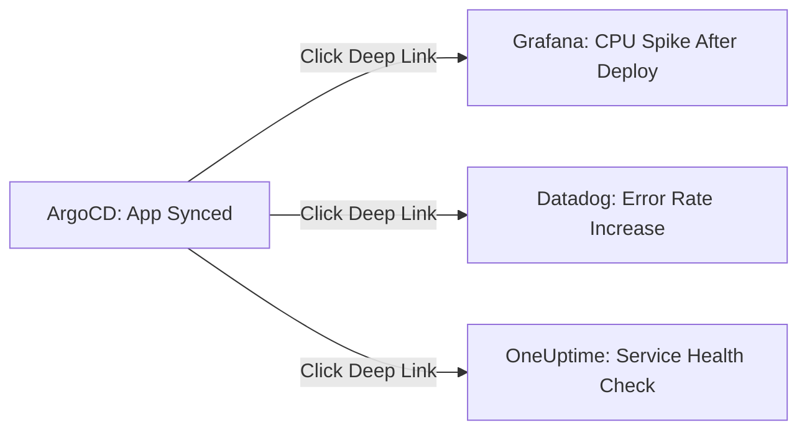

# How to Create Deep Links to External Monitoring Tools from ArgoCD

Author: [nawazdhandala](https://github.com/nawazdhandala)

Tags: ArgoCD, GitOps, Kubernetes, Monitoring, Observability

Description: Learn how to configure ArgoCD deep links to external monitoring tools like Grafana, Datadog, Prometheus, and OneUptime so your team can jump from deployments to dashboards instantly.

---

One of the most time-consuming tasks during incident response is switching between your deployment tool and your monitoring dashboards. ArgoCD deep links solve this by embedding clickable shortcuts directly in the ArgoCD UI that take you to the right monitoring dashboard with the right context already filled in.

This guide covers how to set up deep links from ArgoCD to popular monitoring tools including Grafana, Datadog, Prometheus, New Relic, and OneUptime.

## Why Link ArgoCD to Monitoring Tools?

When something goes wrong after a deployment, the first question is usually "what changed?" and the second is "what does the monitoring say?" Deep links let you answer both questions from the same screen:



Without deep links, you need to manually navigate to your monitoring tool, find the right dashboard, and filter to the correct namespace, service, and time range. Deep links eliminate all of that.

## Deep Links to Grafana

Grafana is the most common monitoring UI in Kubernetes environments. Here are deep link configurations for various Grafana dashboards:

### Pod-Level Metrics

```yaml
apiVersion: v1
kind: ConfigMap
metadata:
  name: argocd-cm
  namespace: argocd
data:
  resource.links: |
    # Link to Grafana pod dashboard with namespace and pod filters
    - url: https://grafana.example.com/d/k8s-pod-metrics/kubernetes-pod-metrics?orgId=1&var-namespace={{.metadata.namespace}}&var-pod={{.metadata.name}}&from=now-1h&to=now
      title: Pod Metrics (Grafana)
      description: View CPU, memory, and network metrics for this pod
      icon.class: "fa fa-chart-line"
      if: kind == "Pod"
```

### Deployment-Level Metrics

```yaml
    # Link to Grafana deployment dashboard
    - url: https://grafana.example.com/d/k8s-deploy-metrics/kubernetes-deployment-metrics?orgId=1&var-namespace={{.metadata.namespace}}&var-deployment={{.metadata.name}}&from=now-1h&to=now
      title: Deployment Metrics (Grafana)
      description: View replica count, restarts, and resource usage
      icon.class: "fa fa-chart-bar"
      if: kind == "Deployment"
```

### Service-Level Metrics

```yaml
    # Link to Grafana service dashboard (using label selectors)
    - url: https://grafana.example.com/d/k8s-service/kubernetes-service-metrics?orgId=1&var-namespace={{.metadata.namespace}}&var-service={{.metadata.name}}&from=now-6h&to=now
      title: Service Metrics (Grafana)
      description: View request rate, latency, and error rate
      icon.class: "fa fa-network-wired"
      if: kind == "Service"
```

### Application-Level Dashboard

```yaml
  application.links: |
    # Link to application overview dashboard in Grafana
    - url: https://grafana.example.com/d/app-overview/application-overview?orgId=1&var-app={{.metadata.name}}&var-namespace={{.spec.destination.namespace}}&from=now-3h&to=now
      title: Application Dashboard (Grafana)
      description: View overall application health and performance
      icon.class: "fa fa-tachometer-alt"
```

## Deep Links to Prometheus

If your team uses Prometheus directly (without Grafana), you can link to Prometheus queries:

```yaml
  resource.links: |
    # Link to Prometheus with a pre-filled query for pod CPU usage
    - url: https://prometheus.example.com/graph?g0.expr=rate(container_cpu_usage_seconds_total{namespace%3D"{{.metadata.namespace}}"%2Cpod%3D"{{.metadata.name}}"}[5m])&g0.tab=0&g0.range_input=1h
      title: CPU Usage (Prometheus)
      description: View container CPU usage rate
      icon.class: "fa fa-microchip"
      if: kind == "Pod"

    # Link to Prometheus for pod memory usage
    - url: https://prometheus.example.com/graph?g0.expr=container_memory_working_set_bytes{namespace%3D"{{.metadata.namespace}}"%2Cpod%3D"{{.metadata.name}}"}%2F1024%2F1024&g0.tab=0&g0.range_input=1h
      title: Memory Usage (Prometheus)
      description: View container memory usage in MB
      icon.class: "fa fa-memory"
      if: kind == "Pod"
```

Note that you need to URL-encode special characters in the query string (e.g., `=` becomes `%3D`, `,` becomes `%2C`).

## Deep Links to Datadog

Datadog uses a different URL structure with scoping parameters:

```yaml
  resource.links: |
    # Link to Datadog host map filtered by pod
    - url: https://app.datadoghq.com/infrastructure?query=kube_namespace%3A{{.metadata.namespace}}%20kube_pod_name%3A{{.metadata.name}}
      title: Datadog Infrastructure
      description: View pod in Datadog infrastructure map
      icon.class: "fa fa-dog"
      if: kind == "Pod"

    # Link to Datadog APM traces for a service
    - url: https://app.datadoghq.com/apm/traces?query=service%3A{{.metadata.name}}%20env%3A{{.metadata.namespace}}&start=now-1h&end=now
      title: Datadog APM Traces
      description: View distributed traces for this service
      icon.class: "fa fa-route"
      if: kind == "Service"

    # Link to Datadog logs filtered by pod
    - url: https://app.datadoghq.com/logs?query=kube_namespace%3A{{.metadata.namespace}}%20pod_name%3A{{.metadata.name}}&from_ts=now-1h&to_ts=now&live=true
      title: Datadog Logs
      description: View pod logs in Datadog
      icon.class: "fa fa-file-alt"
      if: kind == "Pod"

  application.links: |
    # Link to Datadog dashboard for the application
    - url: https://app.datadoghq.com/dashboard/lists?query={{.metadata.name}}
      title: Datadog Dashboards
      description: Find dashboards for this application
      icon.class: "fa fa-dog"
```

## Deep Links to OneUptime

OneUptime provides monitoring, status pages, and incident management. Here is how to link ArgoCD to OneUptime:

```yaml
  resource.links: |
    # Link to OneUptime monitor for a service
    - url: https://oneuptime.com/dashboard/project/monitors?search={{.metadata.name}}
      title: OneUptime Monitor
      description: View service health in OneUptime
      icon.class: "fa fa-heartbeat"
      if: kind == "Service"

    # Link to OneUptime logs
    - url: https://oneuptime.com/dashboard/project/logs?search={{.metadata.namespace}}/{{.metadata.name}}
      title: OneUptime Logs
      description: View logs in OneUptime
      icon.class: "fa fa-scroll"
      if: kind == "Pod"

  application.links: |
    # Link to OneUptime application monitoring
    - url: https://oneuptime.com/dashboard/project/monitors?search={{.metadata.name}}
      title: OneUptime Monitoring
      description: View application health in OneUptime
      icon.class: "fa fa-heartbeat"

    # Link to OneUptime status page
    - url: https://oneuptime.com/dashboard/project/status-pages?search={{.metadata.name}}
      title: Status Page
      description: View public status page
      icon.class: "fa fa-broadcast-tower"
```

## Deep Links to New Relic

```yaml
  resource.links: |
    # Link to New Relic APM for a service
    - url: https://one.newrelic.com/nr1-core?filters=(domain%20%3D%20'APM'%20AND%20type%20%3D%20'APPLICATION'%20AND%20name%20%3D%20'{{.metadata.name}}')
      title: New Relic APM
      description: View application performance in New Relic
      icon.class: "fa fa-chart-area"
      if: kind == "Deployment"

  application.links: |
    # Link to New Relic entity search
    - url: https://one.newrelic.com/nr1-core?filters=(name%20%3D%20'{{.metadata.name}}')
      title: New Relic
      description: Find this application in New Relic
      icon.class: "fa fa-chart-area"
```

## Deep Links to AWS CloudWatch

```yaml
  resource.links: |
    # Link to CloudWatch log group for a pod
    - url: https://console.aws.amazon.com/cloudwatch/home?region=us-east-1#logsV2:log-groups/log-group/$252Faws$252Feks$252Fcluster$252F{{.metadata.namespace}}/log-events
      title: CloudWatch Logs
      description: View logs in AWS CloudWatch
      icon.class: "fa fa-cloud"
      if: kind == "Pod"
```

## Complete Multi-Tool Configuration

Here is a production-ready configuration that integrates multiple monitoring tools:

```yaml
apiVersion: v1
kind: ConfigMap
metadata:
  name: argocd-cm
  namespace: argocd
data:
  resource.links: |
    # --- Grafana ---
    - url: https://grafana.example.com/d/pods?var-namespace={{.metadata.namespace}}&var-pod={{.metadata.name}}&from=now-1h&to=now
      title: Metrics (Grafana)
      icon.class: "fa fa-chart-line"
      if: kind == "Pod"

    - url: https://grafana.example.com/d/deployments?var-namespace={{.metadata.namespace}}&var-deployment={{.metadata.name}}&from=now-1h&to=now
      title: Metrics (Grafana)
      icon.class: "fa fa-chart-line"
      if: kind == "Deployment"

    # --- Logging ---
    - url: https://grafana.example.com/explore?left={"queries":[{"expr":"{namespace=\"{{.metadata.namespace}}\",pod=\"{{.metadata.name}}\"}","refId":"A"}],"datasource":"Loki"}&from=now-1h&to=now
      title: Logs (Loki)
      icon.class: "fa fa-scroll"
      if: kind == "Pod"

    # --- OneUptime ---
    - url: https://oneuptime.com/dashboard/project/monitors?search={{.metadata.name}}
      title: Health (OneUptime)
      icon.class: "fa fa-heartbeat"
      if: kind == "Service"

  application.links: |
    - url: https://grafana.example.com/d/app-overview?var-app={{.metadata.name}}&var-namespace={{.spec.destination.namespace}}&from=now-3h&to=now
      title: App Dashboard
      icon.class: "fa fa-tachometer-alt"

    - url: https://oneuptime.com/dashboard/project/monitors?search={{.metadata.name}}
      title: OneUptime
      icon.class: "fa fa-heartbeat"
```

## Testing Your Deep Links

After applying the ConfigMap, verify the links work correctly:

1. Open the ArgoCD UI
2. Navigate to an application
3. Click on a resource in the tree (Pod, Deployment, etc.)
4. Look for the deep link buttons in the resource detail panel
5. Click a link and verify it opens the correct monitoring dashboard with the right filters

If a link does not appear, check:
- The `if` condition matches the resource type
- Template variables resolve correctly (check the resource's actual metadata)
- The ConfigMap was applied without syntax errors

```bash
# Verify the ConfigMap has the correct content
kubectl get cm argocd-cm -n argocd -o jsonpath='{.data.resource\.links}' | head -20
```

## Conclusion

Deep links to monitoring tools turn ArgoCD into a single starting point for both deployment management and observability. By connecting ArgoCD to Grafana, Datadog, OneUptime, or whatever monitoring stack you use, your team can go from "this deployment looks unhealthy" to "here is exactly what is happening" in a single click. Configure links for the tools your team actually uses and iterate based on feedback.
