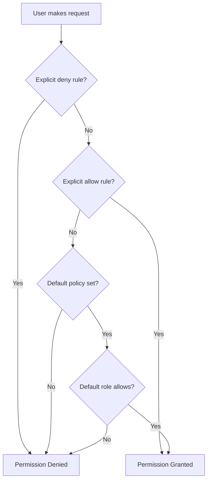

# How to Configure Default RBAC Policy in ArgoCD

Author: [nawazdhandala](https://github.com/nawazdhandala)

Tags: ArgoCD, GitOps, Kubernetes, RBAC, Security

Description: Learn how to configure the default RBAC policy in ArgoCD to control baseline permissions for authenticated users who do not have explicit role assignments.

---

The default RBAC policy in ArgoCD determines what permissions authenticated users get when they do not match any specific role or group mapping. It is the safety net that catches every user who slips through your explicit policy rules. Getting this wrong can either lock out your entire team or give everyone admin access.

This guide explains how the default policy works, what options you have, and which setting is right for different environments.

## What Is the Default Policy

The default policy is set in the `argocd-rbac-cm` ConfigMap under the `policy.default` key:

```yaml
apiVersion: v1
kind: ConfigMap
metadata:
  name: argocd-rbac-cm
  namespace: argocd
data:
  policy.default: role:readonly
```

When ArgoCD evaluates an RBAC request and no explicit policy rule matches the user (either by direct user mapping or through group membership), it falls back to the default policy.

## The Three Common Options

### Option 1: Readonly Default (Most Common for Internal Teams)

```yaml
data:
  policy.default: role:readonly
```

Every authenticated user can view all applications, clusters, and repositories but cannot make any changes. This is ideal when:

- You want all team members to have visibility into deployments
- You use SSO and want a baseline experience for anyone with a company account
- Transparency is more important than strict information isolation

### Option 2: No Default (Most Secure)

```yaml
data:
  policy.default: ""
```

Users without explicit role assignments see nothing and can do nothing. They land on an empty dashboard after logging in. This is ideal when:

- You work in a regulated environment with strict least-privilege requirements
- Different teams should not see each other's applications
- You have a large organization with many teams on shared infrastructure

### Option 3: Custom Default Role

```yaml
data:
  policy.csv: |
    p, role:authenticated, applications, get, */*, allow
    p, role:authenticated, logs, get, */*, allow

  policy.default: role:authenticated
```

Create a custom role with specific permissions and use it as the default. This gives you more control than the built-in readonly role. This is ideal when:

- You want view access but also log access for everyone
- You want to exclude certain resources from the default (like cluster management)
- You need something between readonly and no access

## How the Default Policy Interacts with Explicit Rules

The default policy is a fallback, not an override. Here is how ArgoCD evaluates permissions:



Important: If a user has explicit role assignments AND the default policy applies, the user gets the union of both. The default policy adds to, not replaces, explicit permissions.

```yaml
data:
  policy.csv: |
    # Explicit: deployer can sync frontend apps
    p, role:deployer, applications, sync, frontend/*, allow
    g, dev-user, role:deployer

  # Default: everyone gets readonly
  policy.default: role:readonly
```

In this case, `dev-user` can:
- View all applications (from default readonly)
- Sync frontend applications (from explicit deployer role)

A user without any explicit mapping can only:
- View all applications (from default readonly)

## Configuring Different Defaults for Different Environments

You cannot have different default policies per project or environment in a single ArgoCD instance. However, you can achieve similar results with explicit policies:

```yaml
data:
  policy.csv: |
    # Give everyone view access to non-production
    p, role:default-access, applications, get, dev/*, allow
    p, role:default-access, applications, get, staging/*, allow
    p, role:default-access, logs, get, dev/*, allow
    p, role:default-access, logs, get, staging/*, allow

    # Production is explicitly restricted - only assigned roles
    # (no default access)

  policy.default: role:default-access
```

This gives all authenticated users visibility into dev and staging, but production applications are only visible to users with explicit role assignments.

## Changing the Default Policy

To change the default policy:

```bash
# Edit the ConfigMap directly
kubectl edit configmap argocd-rbac-cm -n argocd

# Or apply a patch
kubectl patch configmap argocd-rbac-cm -n argocd \
  --type merge \
  -p '{"data":{"policy.default":"role:readonly"}}'
```

Changes take effect immediately. There is no need to restart ArgoCD components. However, existing sessions might cache the previous policy for a short time.

## What Happens Without policy.default

If you do not set `policy.default` at all (the key does not exist in the ConfigMap), ArgoCD behaves as if it is set to empty string. This means no default permissions.

```yaml
# These two are equivalent:
data:
  policy.default: ""

# And this (no policy.default key at all):
data:
  policy.csv: |
    # your policies here
```

This is the most secure default but can confuse new users who log in via SSO and see an empty dashboard.

## Testing the Default Policy Impact

Before changing the default policy, test its impact:

```bash
# Test what an unmapped user can do with the current default
argocd admin settings rbac can unknown-user get applications 'default/my-app' \
  --namespace argocd

# Test with a proposed new default
argocd admin settings rbac can unknown-user get applications 'default/my-app' \
  --policy-file policy.csv \
  --default-role 'role:readonly'

# Test with no default
argocd admin settings rbac can unknown-user get applications 'default/my-app' \
  --policy-file policy.csv \
  --default-role ''
```

## Migration Strategies

### From Admin Default to Readonly

If your ArgoCD instance currently has `policy.default: role:admin` (dangerous but common in development setups), migrate carefully:

1. Identify which users rely on admin-level default access
2. Create explicit role assignments for those users
3. Change the default to readonly
4. Monitor for permission denied errors

```yaml
# Before: everyone is admin
data:
  policy.default: role:admin

# After: explicit assignments + readonly default
data:
  policy.csv: |
    g, platform-team, role:admin
    g, developers, role:deployer

    p, role:deployer, applications, get, */*, allow
    p, role:deployer, applications, sync, */*, allow

  policy.default: role:readonly
```

### From Readonly Default to No Default

If you need to tighten security further:

1. Audit who is currently relying on readonly access
2. Create viewer roles for those users or groups
3. Set the default to empty
4. Communicate the change to your team

```yaml
# Before
data:
  policy.default: role:readonly

# After
data:
  policy.csv: |
    p, role:viewer, applications, get, */*, allow
    p, role:viewer, logs, get, */*, allow

    g, all-employees, role:viewer
    g, platform-team, role:admin

  policy.default: ""
```

## Recommendations by Environment

| Environment | Recommended Default | Reason |
|-------------|-------------------|--------|
| Development/Lab | `role:readonly` | Maximum visibility for learning |
| Internal Staging | `role:readonly` | Transparency across teams |
| Production (small org) | `role:readonly` | Everyone should see production state |
| Production (large org) | `""` | Strict isolation between teams |
| Multi-tenant | `""` | Mandatory tenant isolation |
| Regulated (SOC2, HIPAA) | `""` | Least-privilege compliance |

## Summary

The default RBAC policy in ArgoCD is the baseline permission level for all authenticated users without explicit role assignments. Set it to `role:readonly` for environments where visibility is valued, or empty string for environments where strict least-privilege is required. Always test the impact of changes with `argocd admin settings rbac can` before applying them, and create explicit role assignments for users who need more than the default before you tighten it.
