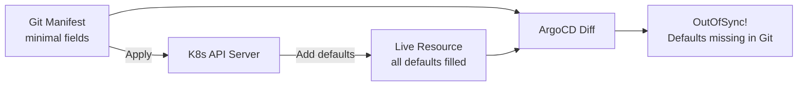

# How to Handle Default Value Diffs in ArgoCD

Author: [nawazdhandala](https://github.com/nawazdhandala)

Tags: ArgoCD, GitOps, Kubernetes, Diff Customization, Sync

Description: Learn how to deal with Kubernetes default values causing false OutOfSync status in ArgoCD when the API server adds fields not present in your Git manifests.

---

You write a minimal Deployment manifest in Git, sync it with ArgoCD, and it immediately shows OutOfSync. The diff reveals fields you never defined - things like `terminationGracePeriodSeconds: 30`, `dnsPolicy: ClusterFirst`, or `restartPolicy: Always`. These are default values that the Kubernetes API server adds when creating resources. Your Git manifests do not include them, so ArgoCD sees a difference.

This guide covers why default value diffs happen and the various strategies to eliminate them.

## Why Default Values Cause Diffs

When you submit a resource to the Kubernetes API server, it fills in any fields you did not specify with their default values. Your Git manifest might look like this:

```yaml
apiVersion: apps/v1
kind: Deployment
metadata:
  name: my-app
spec:
  replicas: 3
  selector:
    matchLabels:
      app: my-app
  template:
    metadata:
      labels:
        app: my-app
    spec:
      containers:
        - name: app
          image: myapp:v1
          ports:
            - containerPort: 8080
```

But the live resource in Kubernetes has many additional fields:

```yaml
spec:
  replicas: 3
  revisionHistoryLimit: 10          # default
  progressDeadlineSeconds: 600      # default
  strategy:
    type: RollingUpdate             # default
    rollingUpdate:
      maxSurge: 25%                 # default
      maxUnavailable: 25%           # default
  template:
    spec:
      containers:
        - name: app
          image: myapp:v1
          ports:
            - containerPort: 8080
              protocol: TCP         # default
          terminationMessagePath: /dev/termination-log    # default
          terminationMessagePolicy: File                  # default
          imagePullPolicy: IfNotPresent                   # default
      restartPolicy: Always          # default
      terminationGracePeriodSeconds: 30  # default
      dnsPolicy: ClusterFirst        # default
      schedulerName: default-scheduler   # default
```



## Strategy 1: Use Server-Side Diff

The most effective solution is server-side diff. When enabled, ArgoCD sends your Git manifest to the API server as a dry-run, which adds all the default values. It then compares this defaulted version against the live state, eliminating false diffs from defaults:

```yaml
apiVersion: argoproj.io/v1alpha1
kind: Application
metadata:
  name: my-app
  annotations:
    argocd.argoproj.io/compare-options: ServerSideDiff=true
spec:
  source:
    repoURL: https://github.com/myorg/my-app.git
    targetRevision: main
    path: k8s
  destination:
    server: https://kubernetes.default.svc
    namespace: default
```

This is the recommended approach because it handles all default values automatically without any field-by-field configuration.

To enable server-side diff globally for all applications:

```yaml
apiVersion: v1
kind: ConfigMap
metadata:
  name: argocd-cm
  namespace: argocd
data:
  server.diff.serverSideDiff: "true"
```

## Strategy 2: Include Defaults in Git Manifests

Another approach is to explicitly include the default values in your Git manifests. This makes your manifests more verbose but eliminates any ambiguity:

```yaml
apiVersion: apps/v1
kind: Deployment
metadata:
  name: my-app
spec:
  replicas: 3
  revisionHistoryLimit: 10
  progressDeadlineSeconds: 600
  strategy:
    type: RollingUpdate
    rollingUpdate:
      maxSurge: 25%
      maxUnavailable: 25%
  selector:
    matchLabels:
      app: my-app
  template:
    metadata:
      labels:
        app: my-app
    spec:
      terminationGracePeriodSeconds: 30
      dnsPolicy: ClusterFirst
      restartPolicy: Always
      schedulerName: default-scheduler
      containers:
        - name: app
          image: myapp:v1
          ports:
            - containerPort: 8080
              protocol: TCP
          terminationMessagePath: /dev/termination-log
          terminationMessagePolicy: File
          imagePullPolicy: IfNotPresent
```

You can generate a fully-defaulted manifest from an existing resource:

```bash
# Get the live resource with all defaults
kubectl get deployment my-app -o yaml > full-manifest.yaml

# Clean up status, managedFields, and other runtime fields
# Then use this as your Git source
```

The downside is maintenance burden. You need to track which defaults change between Kubernetes versions.

## Strategy 3: Ignore Specific Default Fields

If you cannot use server-side diff and prefer minimal manifests, ignore the specific default fields that cause diffs:

```yaml
ignoreDifferences:
  - group: apps
    kind: Deployment
    jsonPointers:
      - /spec/revisionHistoryLimit
      - /spec/progressDeadlineSeconds
      - /spec/strategy
    jqPathExpressions:
      - .spec.template.spec.containers[].terminationMessagePath
      - .spec.template.spec.containers[].terminationMessagePolicy
      - .spec.template.spec.containers[].imagePullPolicy
      - .spec.template.spec.containers[].ports[].protocol
      - .spec.template.spec.terminationGracePeriodSeconds
      - .spec.template.spec.dnsPolicy
      - .spec.template.spec.restartPolicy
      - .spec.template.spec.schedulerName
```

This approach is tedious and fragile. You might miss some defaults, and different resource kinds have different default fields.

## Strategy 4: System-Level Ignore for Common Defaults

If you have many applications with the same default value diff problem, configure them at the system level:

```yaml
apiVersion: v1
kind: ConfigMap
metadata:
  name: argocd-cm
  namespace: argocd
data:
  resource.customizations.ignoreDifferences.apps_Deployment: |
    jqPathExpressions:
      - .spec.template.spec.containers[].terminationMessagePath
      - .spec.template.spec.containers[].terminationMessagePolicy
      - .spec.template.spec.containers[].ports[].protocol
  resource.customizations.ignoreDifferences._Service: |
    jsonPointers:
      - /spec/sessionAffinity
      - /spec/ipFamilies
      - /spec/ipFamilyPolicy
      - /spec/internalTrafficPolicy
```

## Common Default Value Diffs by Resource Type

### Deployment Defaults

```yaml
# Fields commonly defaulted on Deployments
spec.revisionHistoryLimit: 10
spec.progressDeadlineSeconds: 600
spec.strategy.type: RollingUpdate
spec.strategy.rollingUpdate.maxSurge: 25%
spec.strategy.rollingUpdate.maxUnavailable: 25%
```

### Pod Template Defaults

```yaml
# Fields commonly defaulted on Pod templates
spec.template.spec.restartPolicy: Always
spec.template.spec.terminationGracePeriodSeconds: 30
spec.template.spec.dnsPolicy: ClusterFirst
spec.template.spec.schedulerName: default-scheduler
spec.template.spec.securityContext: {}
```

### Container Defaults

```yaml
# Fields commonly defaulted on containers
containers[].imagePullPolicy: IfNotPresent  # or Always if tag is :latest
containers[].terminationMessagePath: /dev/termination-log
containers[].terminationMessagePolicy: File
containers[].ports[].protocol: TCP
```

### Service Defaults

```yaml
# Fields commonly defaulted on Services
spec.sessionAffinity: None
spec.type: ClusterIP
spec.ipFamilies: [IPv4]
spec.ipFamilyPolicy: SingleStack
spec.internalTrafficPolicy: Cluster
spec.ports[].protocol: TCP
```

### Ingress Defaults

```yaml
# Fields commonly defaulted on Ingresses
spec.rules[].http.paths[].pathType: ImplementationSpecific  # depends on version
```

## Default Values That Change Between Kubernetes Versions

Some default values change when you upgrade Kubernetes. This can suddenly cause applications that were synced to show as OutOfSync. Examples include:

- `spec.ipFamilyPolicy` was added to Services in Kubernetes 1.20
- `spec.internalTrafficPolicy` was added in Kubernetes 1.21
- Container `securityContext.allowPrivilegeEscalation` default behavior changed

After upgrading Kubernetes, run a check across all applications:

```bash
# List all OutOfSync applications after a cluster upgrade
argocd app list -o json | \
  jq '.[] | select(.status.sync.status == "OutOfSync") | .metadata.name'
```

## Handling CRD Default Values

Custom Resource Definitions can define default values through OpenAPI v3 schema validation:

```yaml
apiVersion: apiextensions.k8s.io/v1
kind: CustomResourceDefinition
metadata:
  name: myresources.example.com
spec:
  versions:
    - name: v1
      schema:
        openAPIV3Schema:
          type: object
          properties:
            spec:
              type: object
              properties:
                retryCount:
                  type: integer
                  default: 3        # This default will cause diffs
                timeout:
                  type: string
                  default: "30s"    # This too
```

If the CRD defines defaults, any custom resource that does not specify those fields will have them added by the API server. Handle these the same way as built-in defaults:

```yaml
ignoreDifferences:
  - group: example.com
    kind: MyResource
    jsonPointers:
      - /spec/retryCount
      - /spec/timeout
```

## Debugging Default Value Diffs

```bash
# See what ArgoCD thinks the diff is
argocd app diff my-app

# Get the full live resource to see all defaults
kubectl get deployment my-app -o yaml

# Compare your Git manifest to the live resource
diff <(cat git-manifest.yaml) <(kubectl get deployment my-app -o yaml)

# Check if server-side diff would help
# Temporarily enable it on one app
argocd app set my-app --plugin-env 'ARGOCD_APP_PARAMETERS=[]'
kubectl annotate application my-app -n argocd \
  argocd.argoproj.io/compare-options=ServerSideDiff=true
argocd app get my-app --hard-refresh
argocd app diff my-app
```

## Best Practices

1. **Use server-side diff** - It is the cleanest solution and handles all default values automatically
2. **Be explicit in production** - For critical workloads, include defaults in your manifests so you know exactly what is deployed
3. **Document your ignore rules** - If you choose to ignore defaults, add comments explaining why each rule exists
4. **Review after Kubernetes upgrades** - New defaults may appear with new API versions
5. **Prefer system-level rules** - Default value diffs affect all applications equally, so configure them globally

For more on diff strategies, see [How to Customize Diffs in ArgoCD](https://oneuptime.com/blog/post/2026-01-25-customize-diffs-argocd/view) and [How to Use Server-Side Diff in ArgoCD](https://oneuptime.com/blog/post/2026-02-09-argocd-server-side-apply/view).
