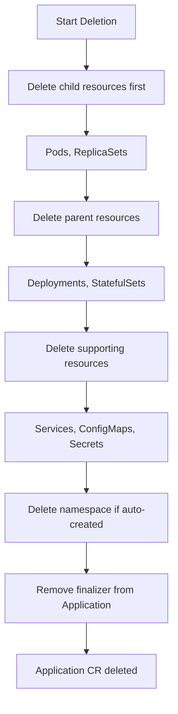

# How to Delete an ArgoCD Application and All Its Resources

Author: [nawazdhandala](https://github.com/nawazdhandala)

Tags: ArgoCD, GitOps, Kubernetes, Application Management

Description: Complete guide to deleting an ArgoCD Application along with all its managed Kubernetes resources using cascade deletion, finalizers, and proper cleanup procedures.

---

When you want to completely remove an application from your cluster - both the ArgoCD Application resource and all the Kubernetes workloads it manages - you need a cascade delete. This operation removes everything: Deployments, Services, ConfigMaps, Pods, and any other resources ArgoCD tracks for that application. Here is how to do it safely.

## Prerequisites: The Resources Finalizer

Cascade deletion only works when the Application has the resources finalizer. Check your Application:

```bash
kubectl get application my-app -n argocd -o jsonpath='{.metadata.finalizers}'
```

If the output includes `resources-finalizer.argocd.argoproj.io`, cascade delete will work. If there are no finalizers, you need to add one first.

### Adding the Finalizer

If your Application does not have the finalizer:

```bash
# Add the resources finalizer
kubectl patch application my-app -n argocd \
  --type json \
  -p '[{"op": "add", "path": "/metadata/finalizers", "value": ["resources-finalizer.argocd.argoproj.io"]}]'
```

Or in the Application YAML:

```yaml
metadata:
  name: my-app
  namespace: argocd
  finalizers:
    - resources-finalizer.argocd.argoproj.io
```

### Finalizer Variants

ArgoCD supports two finalizer modes:

```yaml
# Standard foreground deletion - waits for all resources to be deleted
finalizers:
  - resources-finalizer.argocd.argoproj.io

# Background deletion - faster, does not wait for resource deletion to complete
finalizers:
  - resources-finalizer.argocd.argoproj.io/background
```

Use foreground deletion when you need to be certain all resources are gone before the Application disappears. Use background deletion when speed matters and you trust the garbage collector to clean up.

## Method 1: Delete via ArgoCD CLI

The simplest and most common method:

```bash
# Delete with cascade (default behavior when finalizer is present)
argocd app delete my-app

# You will be prompted to confirm:
# Are you sure you want to delete 'my-app' and all its resources? [y/n]
```

To skip the confirmation prompt (useful in scripts):

```bash
argocd app delete my-app -y
```

To explicitly enable cascade (in case the default changes):

```bash
argocd app delete my-app --cascade=true -y
```

## Method 2: Delete via kubectl

Since an Application is a Kubernetes custom resource, you can delete it with kubectl:

```bash
kubectl delete application my-app -n argocd
```

When the finalizer is present, this triggers the same cascade deletion as the ArgoCD CLI. Kubernetes sends the delete request, ArgoCD's controller sees the finalizer, deletes all managed resources, removes the finalizer, and then Kubernetes completes the deletion.

## Method 3: Delete via the ArgoCD UI

1. Navigate to the application in the ArgoCD UI
2. Click the **Delete** button in the application header
3. In the confirmation dialog, make sure the **Cascade** checkbox is **checked**
4. Type the application name to confirm
5. Click **OK**

The UI will show the deletion progress. Resources will disappear from the resource tree as they are deleted.

## What Gets Deleted

ArgoCD deletes all resources it tracks for the application. This includes:

- Resources directly defined in your manifests (Deployments, Services, ConfigMaps, etc.)
- Resources that ArgoCD created (like namespaces if CreateNamespace was used)

### Resources That Are NOT Deleted

- Resources in the cluster that are not tracked by this Application
- Resources managed by other ArgoCD Applications
- Kubernetes system resources
- PersistentVolumes (PVs) - even if PVCs are deleted, the reclaim policy on the PV controls whether the actual storage is deleted

### Propagation Policy

The deletion propagation policy controls how dependent resources are handled:

```yaml
syncPolicy:
  syncOptions:
    - PrunePropagationPolicy=foreground  # Wait for dependents to be deleted first
    # OR
    - PrunePropagationPolicy=background  # Delete owner, let GC clean up dependents
    # OR
    - PrunePropagationPolicy=orphan      # Delete owner, leave dependents running
```

The default is `foreground`, which means ArgoCD waits for all dependent resources (Pods owned by ReplicaSets, ReplicaSets owned by Deployments) to be fully deleted before proceeding.

## Deletion Order

ArgoCD deletes resources in a specific order during cascade deletion:



If sync waves were used, resources are deleted in reverse wave order.

## Handling Stuck Deletions

Sometimes a cascade delete gets stuck. The Application shows as "Deleting" but never completes.

### Check What is Blocking

```bash
# See the Application status
kubectl get application my-app -n argocd -o yaml

# Check for resources that are not being deleted
kubectl get all -n my-app-namespace

# Check for finalizers on child resources that might be blocking
kubectl get pods -n my-app-namespace -o jsonpath='{range .items[*]}{.metadata.name}: {.metadata.finalizers}{"\n"}{end}'
```

### Common Causes

1. **Resources with their own finalizers** - Some resources (like PVCs with the `kubernetes.io/pvc-protection` finalizer) will not delete until their conditions are met.

2. **Namespace termination stuck** - If the namespace itself is stuck in Terminating state, check for remaining resources or finalizers on the namespace.

3. **ArgoCD controller not running** - The application controller processes finalizers. If it is down, deletions hang.

4. **RBAC issues** - ArgoCD might lack permissions to delete certain resource types.

### Force Delete (Last Resort)

If a deletion is truly stuck and you need to force it:

```bash
# WARNING: This skips cleanup and may leave orphaned resources
# Remove the finalizer manually
kubectl patch application my-app -n argocd \
  --type json \
  -p '[{"op": "remove", "path": "/metadata/finalizers"}]'

# The Application will be immediately deleted
# Then manually clean up any remaining resources
kubectl delete namespace my-app-namespace
```

Only use this as a last resort. You may need to manually clean up resources afterward.

## Deleting Applications in an App-of-Apps Setup

When using the app-of-apps pattern, deleting the parent application with cascade will delete the child Application resources, which in turn cascade-delete their managed resources:

```text
Parent App (deleted)
  -> Child App 1 (cascade deleted)
    -> Deployment, Service, etc. (cascade deleted)
  -> Child App 2 (cascade deleted)
    -> Deployment, Service, etc. (cascade deleted)
```

Be very careful with this - deleting the parent app removes everything across all child applications.

To delete just one child application:

```bash
# Delete only the specific child app, not the parent
argocd app delete child-app-1 -y
```

## Deleting Applications Created by ApplicationSets

If an Application was created by an ApplicationSet, you typically should not delete the Application directly. Instead, modify the ApplicationSet to stop generating that Application:

```bash
# Instead of: argocd app delete my-app
# Modify the ApplicationSet to exclude the app
# Or delete the ApplicationSet itself
kubectl delete applicationset my-appset -n argocd
```

The ApplicationSet controller manages the lifecycle of generated Applications. If you delete an Application it generated, the controller may recreate it on the next reconciliation.

## Pre-Deletion Checklist

Before deleting a production application:

1. **Confirm the application name** - A typo could delete the wrong application
2. **Check cascade setting** - Make sure you actually want to delete the resources
3. **Verify no other applications depend on these resources** - Shared resources could break other apps
4. **Check for PersistentVolumes** - Understand the reclaim policy for any persistent storage
5. **Notify the team** - Especially if other people are working on or monitoring this application
6. **Take a backup if needed** - For stateful applications, ensure backups exist before deletion
7. **Check sync windows** - If sync windows are in effect, deletion may be blocked

```bash
# Final verification before deletion
argocd app get my-app
echo "About to delete my-app and ALL its resources. Proceed? [y/n]"
```

Deleting an ArgoCD Application with all its resources is a powerful and irreversible operation. The combination of finalizers and cascade deletion gives you a clean removal of everything associated with an application. Just make sure you are deleting the right application and that you actually want everything gone before you confirm.
