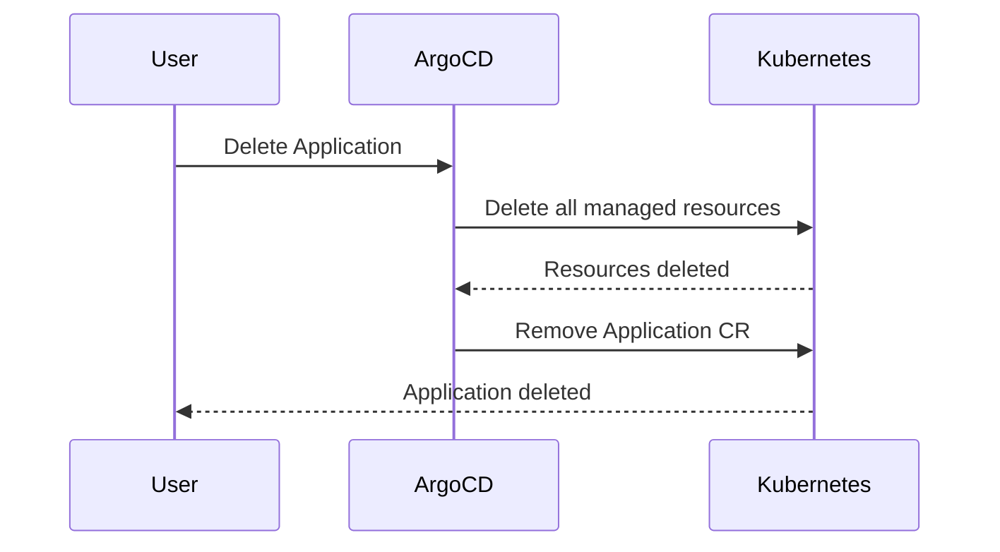

# How to Delete an ArgoCD Application Without Deleting Resources

Author: [nawazdhandala](https://github.com/nawazdhandala)

Tags: ArgoCD, GitOps, Kubernetes, Application Management

Description: Learn how to safely remove an ArgoCD Application without deleting its managed Kubernetes resources using non-cascading deletion and finalizer management.

---

There are times when you need to remove an ArgoCD Application without destroying the actual workloads running in your cluster. Maybe you are migrating to a different GitOps tool, reorganizing your application structure, or transferring ownership of resources to another ArgoCD Application. Whatever the reason, ArgoCD provides a way to do this - but you need to understand how finalizers work to avoid accidentally deleting everything.

## The Default Behavior: Cascade Delete

By default, when you delete an ArgoCD Application that has the resources finalizer, ArgoCD deletes all the Kubernetes resources it manages:

```yaml
metadata:
  finalizers:
    - resources-finalizer.argocd.argoproj.io
```

With this finalizer present, deleting the Application triggers this sequence:



This is usually what you want - cleaning up everything when removing an application. But sometimes it is not.

## Method 1: Remove the Finalizer Before Deleting

The most reliable way to delete an Application without affecting its resources is to remove the finalizer first.

### Using kubectl

```bash
# Step 1: Remove the finalizer from the Application
kubectl patch application my-app -n argocd \
  --type json \
  -p '[{"op": "remove", "path": "/metadata/finalizers"}]'

# Step 2: Delete the Application (resources will NOT be deleted)
kubectl delete application my-app -n argocd
```

### Using the ArgoCD CLI

```bash
# Step 1: Remove the finalizer
argocd app patch my-app --patch '{"metadata": {"finalizers": null}}' --type merge

# Step 2: Delete without cascade
argocd app delete my-app --cascade=false
```

### Verifying Resources Survived

After deleting the Application, verify your workloads are still running:

```bash
# Check that your Deployments, Services, etc. are still present
kubectl get all -n my-app-namespace

# You should see your resources still running
# NAME                          READY   STATUS    RESTARTS   AGE
# pod/web-abc123-x7k9l          1/1     Running   0          5d
# pod/web-abc123-mn4p2           1/1     Running   0          5d
```

## Method 2: Use the --cascade=false Flag

The ArgoCD CLI has a direct flag for non-cascading deletion:

```bash
# Delete the Application without deleting managed resources
argocd app delete my-app --cascade=false
```

This flag tells ArgoCD to skip the resource cleanup phase. It effectively:
1. Removes any finalizers on the Application
2. Deletes the Application custom resource
3. Leaves all managed Kubernetes resources intact

### Confirmation Prompt

The CLI will ask for confirmation:

```text
Are you sure you want to delete 'my-app'? [y/n]
```

To skip the prompt in automation:

```bash
argocd app delete my-app --cascade=false -y
```

## Method 3: Non-Cascading Delete from the UI

In the ArgoCD web UI:

1. Navigate to the application you want to delete
2. Click the **Delete** button in the header
3. In the deletion dialog, **uncheck** the "Cascade" checkbox
4. Type the application name to confirm
5. Click **OK**

With cascade unchecked, ArgoCD deletes only the Application CR and leaves the managed resources in the cluster.

## Method 4: Application Has No Finalizer

If your Application was created without a finalizer:

```yaml
metadata:
  name: my-app
  namespace: argocd
  # No finalizers listed
spec:
  # ...
```

Then deleting it will never cascade-delete resources regardless of what method you use. The finalizer is what triggers the cascade behavior.

## What Happens to Orphaned Resources?

After you delete the Application without cascade, the Kubernetes resources become "orphaned" - they are no longer managed by ArgoCD. This means:

1. **No more auto-sync** - Changes in Git will not be applied
2. **No more self-healing** - Manual changes will not be reverted
3. **No more health monitoring** - ArgoCD will not track health status
4. **No drift detection** - ArgoCD will not report OutOfSync status

The resources continue to run normally in Kubernetes. They just are not managed by ArgoCD anymore.

### Cleaning Up ArgoCD Tracking Labels

ArgoCD adds tracking labels and annotations to managed resources. After orphaning, these labels remain but are harmless:

```yaml
metadata:
  labels:
    app.kubernetes.io/instance: my-app     # ArgoCD tracking label
  annotations:
    # ArgoCD tracking annotation (varies by tracking method)
    argocd.argoproj.io/tracking-id: my-app:apps/Deployment:my-namespace/web
```

If you want to clean these up:

```bash
# Remove ArgoCD tracking label from a Deployment
kubectl label deployment web -n my-namespace app.kubernetes.io/instance-

# Remove ArgoCD tracking annotation
kubectl annotate deployment web -n my-namespace argocd.argoproj.io/tracking-id-
```

## Common Use Cases

### Migrating Between ArgoCD Applications

When restructuring your application organization:

```bash
# 1. Delete the old Application without cascade
argocd app delete old-app-structure --cascade=false

# 2. Create the new Application pointing to the same resources
kubectl apply -f new-app-structure.yaml

# 3. ArgoCD adopts the existing resources
# The new Application will show as "Synced" if manifests match
```

### Migrating to a Different GitOps Tool

When switching from ArgoCD to Flux or another tool:

```bash
# 1. Delete all ArgoCD Applications without cascade
for app in $(argocd app list -o name); do
  argocd app delete "$app" --cascade=false -y
done

# 2. Resources continue running
# 3. Set up the new GitOps tool to manage them
```

### Temporary ArgoCD Removal

When you need to temporarily remove ArgoCD management (for debugging or maintenance):

```bash
# Remove ArgoCD management
argocd app delete my-app --cascade=false

# Do your manual changes and investigation
kubectl edit deployment web -n my-namespace

# Re-create the Application when done
kubectl apply -f my-app-application.yaml
```

### Transferring Between Projects

When moving an application to a different ArgoCD project:

```bash
# Delete from the old project without cascade
argocd app delete my-app --cascade=false

# Create in the new project
kubectl apply -f my-app-new-project.yaml
```

## Safety Precautions

1. **Always verify the cascade setting** - Double-check before confirming deletion. A cascade delete on a production application can cause a significant outage.

2. **Test in staging first** - If you have never done a non-cascading delete, practice on a non-production application first.

3. **Document the orphaned resources** - After removing ArgoCD management, make sure the team knows these resources exist but are not GitOps-managed anymore.

4. **Have a plan for the orphaned resources** - Will they be re-adopted by another Application? Managed manually? Deleted later? Decide before you orphan them.

5. **Check for dependent applications** - If your Application is part of an app-of-apps pattern, deleting it might affect the parent application's health status.

Deleting an ArgoCD Application without deleting resources is a straightforward operation once you understand finalizers and the cascade flag. The key takeaway is that the `resources-finalizer.argocd.argoproj.io` finalizer controls cascade behavior, and you can bypass it using `--cascade=false`, removing the finalizer, or simply never adding the finalizer in the first place.
