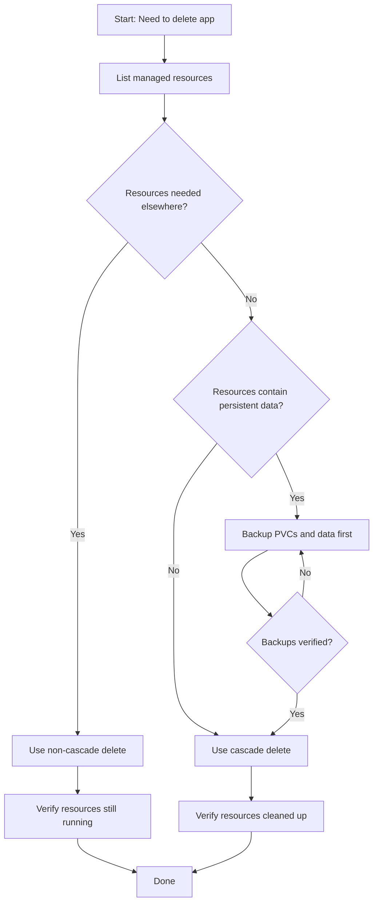

# How to Delete an ArgoCD Application Safely

Author: [nawazdhandala](https://github.com/nawazdhandala)

Tags: ArgoCD, GitOps, Kubernetes, Application Management, Deployments

Description: Learn how to delete ArgoCD applications safely using cascade and non-cascade deletion, finalizers, CLI commands, and UI options to avoid losing critical Kubernetes resources.

---

Deleting an ArgoCD application sounds simple, but getting it wrong can either wipe out production workloads or leave behind orphaned resources cluttering your cluster. The difference between a safe deletion and a catastrophic one often comes down to understanding exactly what happens when you hit that delete button.

This guide walks through every safe deletion method available in ArgoCD, when to use each one, and the precautions you should take before deleting anything in a production environment.

## Understanding what happens when you delete an ArgoCD Application

When you delete an ArgoCD Application resource, two things can happen depending on your configuration:

1. **Cascade delete** - ArgoCD deletes the Application AND all Kubernetes resources it manages (Deployments, Services, ConfigMaps, etc.)
2. **Non-cascade delete** - ArgoCD deletes only the Application resource itself, leaving the managed Kubernetes resources running in the cluster

The behavior is controlled by finalizers on the Application resource and the deletion flags you pass.

```yaml
# Application with cascade delete finalizer
apiVersion: argoproj.io/v1alpha1
kind: Application
metadata:
  name: my-app
  namespace: argocd
  finalizers:
    - resources-finalizer.argocd.argoproj.io  # This enables cascade delete
spec:
  project: default
  source:
    repoURL: https://github.com/myorg/my-app.git
    targetRevision: HEAD
    path: k8s
  destination:
    server: https://kubernetes.default.svc
    namespace: production
```

## Pre-deletion checklist

Before deleting any ArgoCD application, run through this checklist:

**1. Identify all managed resources**

```bash
# List all resources managed by the application
argocd app resources my-app

# Get detailed resource tree
argocd app get my-app --output tree
```

**2. Check if other applications depend on shared resources**

```bash
# Look for shared resources across applications
kubectl get configmaps -n production -o json | jq '.items[] | select(.metadata.annotations["argocd.argoproj.io/tracking-id"] != null) | {name: .metadata.name, tracking: .metadata.annotations["argocd.argoproj.io/tracking-id"]}'
```

**3. Verify the finalizer configuration**

```bash
# Check what finalizers are set
kubectl get application my-app -n argocd -o jsonpath='{.metadata.finalizers}'
```

**4. Take a backup of the Application manifest**

```bash
# Export the application manifest before deletion
argocd app get my-app -o yaml > my-app-backup.yaml

# Also backup any application-specific secrets
kubectl get secrets -n production -l app.kubernetes.io/instance=my-app -o yaml > my-app-secrets-backup.yaml
```

## Method 1: Delete using the ArgoCD CLI

The CLI gives you the most control over deletion behavior.

**Cascade delete (deletes app AND resources):**

```bash
# Cascade is the default when finalizer is present
argocd app delete my-app

# Explicitly enable cascade delete
argocd app delete my-app --cascade
```

**Non-cascade delete (keeps resources running):**

```bash
# Delete only the ArgoCD Application, keep Kubernetes resources
argocd app delete my-app --cascade=false
```

**Delete with confirmation bypass (for automation):**

```bash
# Skip the confirmation prompt
argocd app delete my-app -y

# Non-cascade with no prompt
argocd app delete my-app --cascade=false -y
```

## Method 2: Delete using the ArgoCD UI

In the ArgoCD web interface:

1. Navigate to the application you want to delete
2. Click the **DELETE** button in the top-right corner
3. A dialog appears asking you to type the application name
4. Choose between **Foreground** (cascade) or **Non-cascade** deletion
5. Type the application name to confirm
6. Click **OK**

The name confirmation step is a built-in safety mechanism that prevents accidental clicks from deleting applications.

## Method 3: Delete using kubectl

Since ArgoCD Applications are Kubernetes custom resources, you can delete them directly with kubectl:

```bash
# This respects whatever finalizers are configured
kubectl delete application my-app -n argocd

# Force removal of finalizers first (dangerous - use only as last resort)
kubectl patch application my-app -n argocd \
  -p '{"metadata":{"finalizers":null}}' --type merge
kubectl delete application my-app -n argocd
```

## Method 4: Delete declaratively through Git

If you manage ArgoCD applications declaratively (e.g., with an app-of-apps pattern), you can delete by removing the Application manifest from your Git repository:

```bash
# Remove the application YAML from your config repo
git rm apps/my-app.yaml
git commit -m "Remove my-app application"
git push
```

When the parent application syncs, it will detect the missing manifest and delete the child application. Whether resources are cascade-deleted depends on the prune setting of the parent application.

## Safe deletion workflow for production

Here is a recommended workflow for safely deleting applications in production:



## Handling deletion in different scenarios

### Scenario 1: Migrating an application to a different ArgoCD project

```bash
# Step 1: Export the current application
argocd app get my-app -o yaml > my-app.yaml

# Step 2: Delete without cascade (keep resources)
argocd app delete my-app --cascade=false -y

# Step 3: Update the project in the manifest
# Edit my-app.yaml to change spec.project

# Step 4: Recreate the application
kubectl apply -f my-app.yaml
```

### Scenario 2: Removing an application during cluster decommissioning

```bash
# When the entire cluster is going away, cascade delete everything
argocd app delete my-app --cascade -y

# For bulk deletion of all apps in a project
argocd app list -p my-project -o name | xargs -I {} argocd app delete {} --cascade -y
```

### Scenario 3: Removing ArgoCD management while keeping workloads

```bash
# Remove ArgoCD tracking labels/annotations from resources
argocd app delete my-app --cascade=false -y

# Clean up ArgoCD-specific labels from remaining resources
kubectl get all -n production -l app.kubernetes.io/instance=my-app -o name | \
  xargs -I {} kubectl label {} app.kubernetes.io/instance- app.kubernetes.io/managed-by-
```

## Preventing accidental deletion with RBAC

You can restrict who can delete applications using ArgoCD RBAC policies:

```csv
# argocd-rbac-cm ConfigMap
p, role:developer, applications, delete, default/*, deny
p, role:admin, applications, delete, default/*, allow
```

This ensures only administrators can delete applications, while developers can still view and sync them.

## Verifying deletion was successful

After deletion, always verify the outcome:

```bash
# Verify the application is gone
argocd app list | grep my-app

# For cascade delete: verify resources are removed
kubectl get all -n production -l app.kubernetes.io/instance=my-app

# For non-cascade delete: verify resources are still running
kubectl get deployments -n production
kubectl get services -n production
```

## Common pitfalls to avoid

1. **Deleting without checking finalizers** - If the cascade finalizer is set and you did not mean to delete resources, they will be gone
2. **Bulk deleting applications** - Always test with one application first before scripting bulk deletions
3. **Deleting parent applications in app-of-apps** - This can trigger cascade deletion of all child applications and their resources
4. **Not backing up the Application manifest** - Once deleted, the Application configuration is gone unless it lives in Git
5. **Ignoring shared resources** - If two applications manage overlapping resources, deleting one may affect the other

For more on how finalizers control deletion behavior, see the guide on [ArgoCD Application Finalizers](https://oneuptime.com/blog/post/2026-02-09-argocd-application-finalizers/view). For handling resources that get stuck during deletion, check out the post on [handling stuck application deletion](https://oneuptime.com/blog/post/2026-02-26-argocd-stuck-application-deletion/view).

## Summary

Safe ArgoCD application deletion requires understanding the cascade vs non-cascade distinction, checking finalizer configuration, backing up manifests before deletion, and verifying the outcome afterward. When in doubt, default to non-cascade delete - you can always clean up resources manually, but you cannot easily recover resources that were cascade-deleted by accident. Build deletion safeguards into your RBAC policies and always treat production deletions with the same care you would give to any destructive operation.
