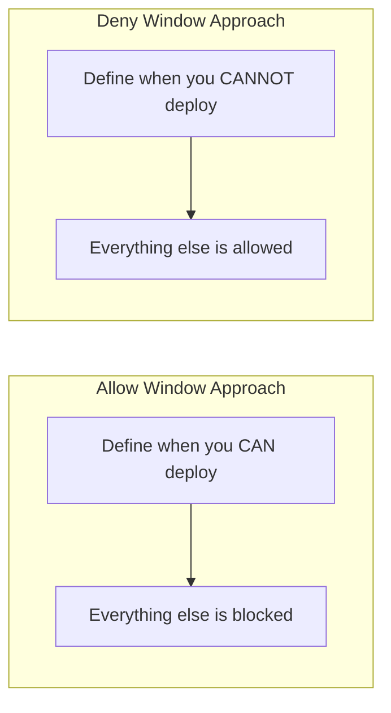

# How to Create Deny Sync Windows to Prevent Deployments in ArgoCD

Author: [nawazdhandala](https://github.com/nawazdhandala)

Tags: ArgoCD, GitOps, Kubernetes, Sync Windows, Deployment Freeze

Description: Learn how to use ArgoCD deny sync windows to block deployments during peak hours, holidays, freeze periods, and other critical times when changes should not be applied.

---

Deny sync windows block deployments during specified time periods. Unlike allow windows which restrict syncs to specific times, deny windows are blackout periods where no syncs can happen. They are your deployment freeze mechanism, protecting production during peak traffic, holidays, and critical business periods.

## How Deny Windows Differ from Allow Windows

Allow windows say "only deploy during these times." Deny windows say "never deploy during these times."



The key rule: deny always wins. If both an allow window and a deny window are active at the same time, the sync is blocked.

## Basic Deny Window: Block Business Hours

The most common deny window blocks deployments during business hours when users are active.

```yaml
apiVersion: argoproj.io/v1alpha1
kind: AppProject
metadata:
  name: production
  namespace: argocd
spec:
  sourceRepos:
    - '*'
  destinations:
    - namespace: '*'
      server: '*'
  syncWindows:
    # Block deployments Monday through Friday, 8 AM to 6 PM
    - kind: deny
      schedule: '0 8 * * 1-5'
      duration: 10h
      applications:
        - '*'
      manualSync: true  # Allow manual overrides
      timeZone: 'America/New_York'
```

During the deny window (8 AM to 6 PM on weekdays), automated syncs are blocked. Setting `manualSync: true` allows operators to manually trigger a sync if needed for an emergency fix.

## Deployment Freeze for Holidays

Block all deployments during major holidays when fewer engineers are available to respond to incidents.

```yaml
syncWindows:
  # Christmas freeze: Dec 23 through Jan 2
  - kind: deny
    schedule: '0 0 23 12 *'
    duration: 240h  # 10 days
    applications:
      - '*'
    manualSync: false  # No exceptions, not even manual
    timeZone: 'UTC'

  # Thanksgiving freeze: 4th Thursday of November through Sunday
  # Note: Cron cannot express "4th Thursday", so use approximate dates
  - kind: deny
    schedule: '0 0 22 11 *'
    duration: 120h  # 5 days
    applications:
      - '*'
    manualSync: false
    timeZone: 'America/New_York'
```

With `manualSync: false`, nobody can sync even manually. This is appropriate for holidays when the on-call team is minimal.

## Block Friday Afternoon Deployments

The classic "no Friday deploys" rule prevents weekend-ruining incidents.

```yaml
syncWindows:
  # Block Friday afternoon through Sunday night
  - kind: deny
    schedule: '0 14 * * 5'
    duration: 58h  # Friday 2 PM through Sunday midnight
    applications:
      - '*'
    manualSync: true
    timeZone: 'America/Los_Angeles'
```

This blocks deployments from Friday at 2 PM until Sunday at midnight Pacific Time. Manual syncs are still allowed for genuine emergencies.

## Peak Traffic Period Protection

E-commerce applications might need protection during known peak traffic periods.

```yaml
syncWindows:
  # Block during Black Friday weekend (approximate)
  - kind: deny
    schedule: '0 0 25 11 *'
    duration: 96h  # 4 days
    applications:
      - 'ecommerce-*'
    manualSync: false
    timeZone: 'America/New_York'

  # Block during daily peak hours (11 AM to 2 PM)
  - kind: deny
    schedule: '0 11 * * 1-5'
    duration: 3h
    applications:
      - 'ecommerce-*'
      - 'payment-*'
    manualSync: true
    timeZone: 'America/New_York'

  # Block during flash sale events (configured per event)
  - kind: deny
    schedule: '0 9 15 3 *'
    duration: 12h
    applications:
      - 'ecommerce-*'
    manualSync: false
    timeZone: 'UTC'
```

## Quarter-End Financial Freeze

Financial applications often require a code freeze around quarter-end reporting periods.

```yaml
syncWindows:
  # Q1 end freeze (March 28 - April 2)
  - kind: deny
    schedule: '0 0 28 3 *'
    duration: 120h
    applications:
      - 'finance-*'
      - 'accounting-*'
      - 'reporting-*'
    manualSync: false
    timeZone: 'UTC'

  # Q2 end freeze (June 28 - July 2)
  - kind: deny
    schedule: '0 0 28 6 *'
    duration: 120h
    applications:
      - 'finance-*'
      - 'accounting-*'
      - 'reporting-*'
    manualSync: false
    timeZone: 'UTC'

  # Q3 end freeze (September 28 - October 2)
  - kind: deny
    schedule: '0 0 28 9 *'
    duration: 120h
    applications:
      - 'finance-*'
      - 'accounting-*'
      - 'reporting-*'
    manualSync: false
    timeZone: 'UTC'

  # Q4 end / Year-end freeze (December 20 - January 5)
  - kind: deny
    schedule: '0 0 20 12 *'
    duration: 384h
    applications:
      - 'finance-*'
      - 'accounting-*'
      - 'reporting-*'
    manualSync: false
    timeZone: 'UTC'
```

## Selective Deny: Block Only Critical Applications

Not every application needs the same restrictions. Use application name patterns to apply deny windows selectively.

```yaml
syncWindows:
  # Block production-critical apps during business hours
  - kind: deny
    schedule: '0 9 * * 1-5'
    duration: 8h
    applications:
      - 'prod-payment-*'
      - 'prod-auth-*'
      - 'prod-database-*'
    manualSync: true
    timeZone: 'UTC'

  # Internal tools can deploy anytime (no deny window)
  # Just by not matching them in any deny window
```

Applications not matching any deny window pattern can sync freely.

## Stacking Multiple Deny Windows

Multiple deny windows stack. A sync is blocked if any active deny window matches the application.

```yaml
syncWindows:
  # Deny during weekday business hours
  - kind: deny
    schedule: '0 9 * * 1-5'
    duration: 8h
    applications:
      - '*'
    manualSync: true
    timeZone: 'UTC'

  # Also deny on Sundays (rest day)
  - kind: deny
    schedule: '0 0 * * 0'
    duration: 24h
    applications:
      - '*'
    manualSync: true
    timeZone: 'UTC'

  # Also deny during monthly maintenance of the monitoring system
  - kind: deny
    schedule: '0 1 1 * *'
    duration: 2h
    applications:
      - '*'
    manualSync: false
    timeZone: 'UTC'
```

This creates three layers of protection: weekday business hours, all of Sunday, and the first of each month during monitoring maintenance.

## Deny Window with Allow Override Pattern

A powerful pattern is combining a broad deny with targeted allows.

```yaml
syncWindows:
  # Deny everything by default during business hours
  - kind: deny
    schedule: '0 8 * * 1-5'
    duration: 10h
    applications:
      - '*'
    manualSync: true
    timeZone: 'UTC'
```

But remember: deny always wins over allow. You cannot override a deny window with an allow window. If you need exceptions, use `manualSync: true` on the deny window and perform manual syncs for emergencies. Or restructure your windows so the deny window does not cover the period you need to deploy in.

## Testing Deny Windows

Verify that deny windows are working correctly.

```bash
# Check project sync windows
argocd proj windows list production

# Try to sync during a deny window (should fail for auto-sync)
argocd app sync my-app
# Expected: error about sync window blocking the operation

# Check the application for sync window conditions
argocd app get my-app --output json | \
  jq '.status.conditions[] | select(.type | contains("SyncWindow"))'
```

If the sync succeeds when it should be blocked, check that your application matches the window's application, namespace, or cluster patterns. A common mistake is having a pattern like `production-*` when the application is named `prod-payment-api`.

## Managing Deny Windows at Scale

For organizations with many projects, use a consistent naming convention and template for deny windows.

```bash
# Script to add standard deny windows to all production projects
for project in $(argocd proj list -o name | grep '^prod-'); do
  echo "Adding deny windows to $project..."

  # Business hours deny
  argocd proj windows add "$project" \
    --kind deny \
    --schedule "0 9 * * 1-5" \
    --duration 8h \
    --applications "*" \
    --manual-sync

  # Weekend deny
  argocd proj windows add "$project" \
    --kind deny \
    --schedule "0 0 * * 0,6" \
    --duration 24h \
    --applications "*" \
    --manual-sync
done
```

For the allow window counterpart, see the [allow sync windows guide](https://oneuptime.com/blog/post/2026-02-26-argocd-allow-sync-windows-maintenance/view). For overriding these windows during emergencies, check the [sync window override guide](https://oneuptime.com/blog/post/2026-02-26-argocd-override-sync-windows-emergency/view).
