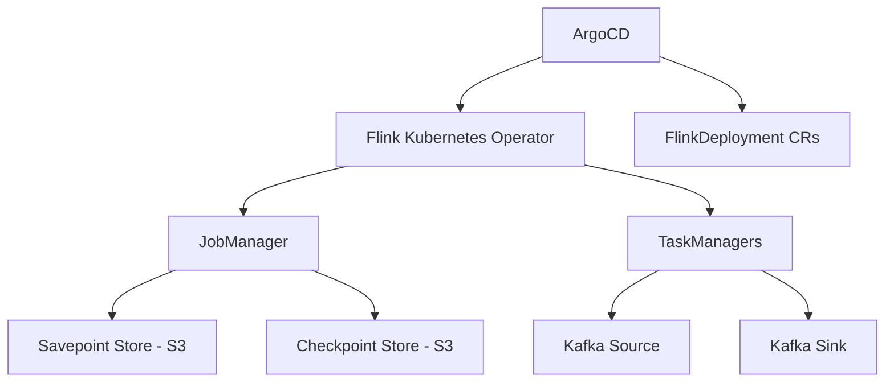

# How to Deploy Apache Flink with ArgoCD

Author: [nawazdhandala](https://github.com/nawazdhandala)

Tags: ArgoCD, GitOps, Kubernetes, Apache Flink, Stream Processing

Description: A practical guide to deploying Apache Flink on Kubernetes using ArgoCD and the Flink Kubernetes Operator for GitOps-managed stream processing infrastructure.

---

Apache Flink is the go-to framework for stateful stream processing at scale. It handles everything from real-time analytics to complex event processing. Deploying Flink on Kubernetes with ArgoCD gives you a GitOps-managed stream processing platform where job configurations, cluster settings, and scaling parameters are all version-controlled.

This guide covers deploying the Flink Kubernetes Operator with ArgoCD and managing Flink jobs declaratively.

## Architecture



## Step 1: Deploy the Flink Kubernetes Operator

```yaml
# flink-operator-app.yaml
apiVersion: argoproj.io/v1alpha1
kind: Application
metadata:
  name: flink-operator
  namespace: argocd
spec:
  project: data-infrastructure
  source:
    repoURL: https://downloads.apache.org/flink/flink-kubernetes-operator-1.8.0/
    chart: flink-kubernetes-operator
    targetRevision: 1.8.0
    helm:
      values: |
        image:
          repository: apache/flink-kubernetes-operator
          tag: 1.8.0
        watchNamespaces:
          - flink-jobs
        webhook:
          create: true
        operatorHealth:
          port: 8085
        metrics:
          port: 9999
        defaultConfiguration:
          create: true
          flink-conf.yaml: |
            kubernetes.operator.periodic.savepoint.interval: 1h
            kubernetes.operator.savepoint.history.max.count: 5
            kubernetes.operator.job.upgrade.last-state-fallback.enabled: true
  destination:
    server: https://kubernetes.default.svc
    namespace: flink-operator
  syncPolicy:
    automated:
      prune: true
      selfHeal: true
    syncOptions:
      - CreateNamespace=true
      - ServerSideApply=true
```

Key operator configuration choices:

- Periodic savepoints every hour for disaster recovery
- Last-state fallback for job upgrades when savepoints fail
- Webhook validation to catch configuration errors early

## Step 2: Deploy a Flink Streaming Job

Define your Flink streaming job as a FlinkDeployment:

```yaml
# flink-jobs/production/order-processor.yaml
apiVersion: flink.apache.org/v1beta1
kind: FlinkDeployment
metadata:
  name: order-processor
  labels:
    app: order-processor
    team: data-engineering
spec:
  image: myregistry/flink-order-processor:v3.1.0
  flinkVersion: v1_18
  flinkConfiguration:
    # Checkpointing
    execution.checkpointing.interval: "60000"
    execution.checkpointing.mode: EXACTLY_ONCE
    execution.checkpointing.min-pause: "30000"
    execution.checkpointing.timeout: "300000"
    state.checkpoints.num-retained: "5"

    # State backend
    state.backend: rocksdb
    state.backend.rocksdb.memory.managed: "true"
    state.backend.incremental: "true"

    # Checkpoint and savepoint storage
    state.checkpoints.dir: s3://flink-state/checkpoints/order-processor/
    state.savepoints.dir: s3://flink-state/savepoints/order-processor/

    # Network
    taskmanager.network.memory.fraction: "0.15"
    taskmanager.network.memory.min: "128mb"
    taskmanager.network.memory.max: "1gb"

    # High availability
    high-availability.type: kubernetes
    high-availability.storageDir: s3://flink-state/ha/order-processor/

    # Restart strategy
    restart-strategy.type: exponential-delay
    restart-strategy.exponential-delay.initial-backoff: "10s"
    restart-strategy.exponential-delay.max-backoff: "5min"
    restart-strategy.exponential-delay.backoff-multiplier: "2.0"

    # Metrics
    metrics.reporters: prom
    metrics.reporter.prom.factory.class: org.apache.flink.metrics.prometheus.PrometheusReporterFactory
    metrics.reporter.prom.port: "9249"

  serviceAccount: flink

  jobManager:
    resource:
      memory: "4096m"
      cpu: 2
    replicas: 1

  taskManager:
    resource:
      memory: "8192m"
      cpu: 4
    replicas: 4

  job:
    jarURI: local:///opt/flink/usrlib/order-processor.jar
    entryClass: com.myorg.flink.OrderProcessor
    args:
      - "--kafka-bootstrap-servers"
      - "production-kafka-kafka-bootstrap:9092"
      - "--input-topic"
      - "orders"
      - "--output-topic"
      - "processed-orders"
    parallelism: 16
    upgradeMode: savepoint
    state: running
    savepointTriggerNonce: 0
```

Important settings explained:

- `upgradeMode: savepoint` ensures that when you update the job (new image, config change), Flink takes a savepoint before stopping and restores from it after starting the new version
- `state.backend: rocksdb` with incremental checkpoints for efficient state management
- Kubernetes high availability so the JobManager can recover from pod failures

## Step 3: Session Cluster for Ad-Hoc Jobs

For SQL queries and ad-hoc analysis, deploy a Flink session cluster:

```yaml
# flink-jobs/production/session-cluster.yaml
apiVersion: flink.apache.org/v1beta1
kind: FlinkDeployment
metadata:
  name: flink-session
  labels:
    app: flink-session
    type: session
spec:
  image: apache/flink:1.18.1
  flinkVersion: v1_18
  flinkConfiguration:
    state.backend: rocksdb
    state.checkpoints.dir: s3://flink-state/checkpoints/session/
    state.savepoints.dir: s3://flink-state/savepoints/session/
    high-availability.type: kubernetes
    high-availability.storageDir: s3://flink-state/ha/session/
  serviceAccount: flink
  jobManager:
    resource:
      memory: "4096m"
      cpu: 2
  taskManager:
    resource:
      memory: "8192m"
      cpu: 4
    replicas: 4
```

Users can then submit SQL queries and short-lived jobs to this session cluster without modifying Git.

## Step 4: ArgoCD Application

```yaml
apiVersion: argoproj.io/v1alpha1
kind: Application
metadata:
  name: flink-jobs-production
  namespace: argocd
  labels:
    team: data-engineering
    component: flink
spec:
  project: data-infrastructure
  source:
    repoURL: https://github.com/myorg/data-platform.git
    targetRevision: main
    path: flink-jobs/production
  destination:
    server: https://kubernetes.default.svc
    namespace: flink-jobs
  syncPolicy:
    automated:
      prune: false
      selfHeal: true
    syncOptions:
      - CreateNamespace=true
      - RespectIgnoreDifferences=true
  ignoreDifferences:
    - group: flink.apache.org
      kind: FlinkDeployment
      jsonPointers:
        - /status
        - /spec/job/savepointTriggerNonce
        - /spec/taskManager/replicas
```

The `ignoreDifferences` for `savepointTriggerNonce` is important because the operator updates this value when triggering savepoints.

## Handling Job Upgrades

When you need to deploy a new version of your Flink job, update the image tag in Git:

```yaml
spec:
  image: myregistry/flink-order-processor:v3.2.0  # Updated from v3.1.0
```

The operator will:

1. Trigger a savepoint on the running job
2. Cancel the job
3. Start the new version from the savepoint
4. Resume processing from where it left off

This is the zero-data-loss upgrade path that makes Flink and GitOps such a good combination.

## Autoscaling Flink Jobs

The Flink operator supports reactive autoscaling:

```yaml
flinkConfiguration:
  # Enable reactive mode
  scheduler-mode: reactive

  # Scaling limits
  jobmanager.adaptive-scheduler.min-parallelism-increase: "1"

  # Cooldown period
  kubernetes.operator.job.autoscaler.enabled: "true"
  kubernetes.operator.job.autoscaler.stabilization.interval: "5min"
  kubernetes.operator.job.autoscaler.metrics.window: "10min"
  kubernetes.operator.job.autoscaler.target.utilization: "0.7"
  kubernetes.operator.job.autoscaler.scale-down.max-factor: "0.5"
  kubernetes.operator.job.autoscaler.scale-up.max-factor: "2.0"
```

## Monitoring Flink with Prometheus

Add a ServiceMonitor for Flink metrics:

```yaml
apiVersion: monitoring.coreos.com/v1
kind: ServiceMonitor
metadata:
  name: flink-metrics
  labels:
    team: data-engineering
spec:
  selector:
    matchLabels:
      app: order-processor
  endpoints:
    - port: metrics
      path: /
      interval: 15s
```

Key metrics to monitor:

- `flink_jobmanager_job_uptime` - how long the job has been running
- `flink_taskmanager_job_task_operator_numRecordsInPerSecond` - throughput
- `flink_jobmanager_job_lastCheckpointDuration` - checkpoint health
- `flink_taskmanager_Status_JVM_Memory_Heap_Used` - memory pressure

## Best Practices

1. **Use savepoint upgrade mode** - Always use `upgradeMode: savepoint` for stateful jobs to ensure zero data loss during upgrades.

2. **Store state externally** - Use S3 or GCS for checkpoints, savepoints, and HA storage. Local storage does not survive pod restarts.

3. **Set checkpoint intervals wisely** - Too frequent checkpoints add overhead. Too infrequent means more data to reprocess after failures.

4. **Monitor backpressure** - Flink's backpressure metrics tell you when your pipeline cannot keep up with input rate.

5. **Test state compatibility** - Before upgrading, verify that the new job version can restore from savepoints created by the old version.

Deploying Flink with ArgoCD gives you a robust, auditable stream processing platform. Every change to job configurations, scaling parameters, and cluster settings goes through pull requests, making it easy to track changes and roll back when needed.
