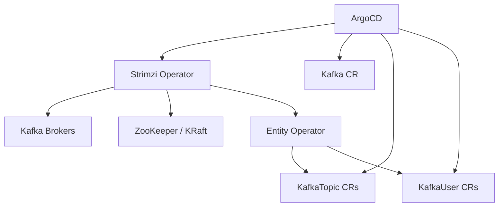

# How to Deploy Apache Kafka with ArgoCD

Author: [nawazdhandala](https://github.com/nawazdhandala)

Tags: ArgoCD, GitOps, Kubernetes, Apache Kafka, Streaming

Description: A complete guide to deploying Apache Kafka on Kubernetes using ArgoCD and the Strimzi operator for production-grade, GitOps-managed event streaming infrastructure.

---

Apache Kafka is the de facto standard for event streaming, but deploying and managing it on Kubernetes is notoriously complex. Between broker configurations, ZooKeeper (or KRaft) management, topic provisioning, and security settings, there is a lot that can go wrong. ArgoCD combined with the Strimzi Kafka operator brings order to this complexity by making your entire Kafka deployment declarative and version-controlled.

This guide covers deploying a production-ready Kafka cluster on Kubernetes using Strimzi and ArgoCD.

## Architecture



The Strimzi operator translates Kafka custom resources into StatefulSets, Services, ConfigMaps, and Secrets.

## Step 1: Deploy the Strimzi Operator

Create an ArgoCD Application for the Strimzi operator:

```yaml
# strimzi-operator-app.yaml
apiVersion: argoproj.io/v1alpha1
kind: Application
metadata:
  name: strimzi-operator
  namespace: argocd
spec:
  project: data-infrastructure
  source:
    repoURL: https://strimzi.io/charts/
    chart: strimzi-kafka-operator
    targetRevision: 0.39.0
    helm:
      values: |
        replicas: 1
        watchAnyNamespace: true
        resources:
          limits:
            cpu: "1"
            memory: "512Mi"
          requests:
            cpu: "200m"
            memory: "256Mi"
        featureGates: "+UseKRaft,+KafkaNodePools"
  destination:
    server: https://kubernetes.default.svc
    namespace: strimzi-system
  syncPolicy:
    automated:
      prune: true
      selfHeal: true
    syncOptions:
      - CreateNamespace=true
      - ServerSideApply=true
```

## Step 2: Define the Kafka Cluster

Now define your Kafka cluster using KRaft mode (no ZooKeeper):

```yaml
# kafka/production/kafka-cluster.yaml
apiVersion: kafka.strimzi.io/v1beta2
kind: KafkaNodePool
metadata:
  name: controller
  labels:
    strimzi.io/cluster: production-kafka
spec:
  replicas: 3
  roles:
    - controller
  storage:
    type: jbod
    volumes:
      - id: 0
        type: persistent-claim
        size: 20Gi
        class: gp3
        deleteClaim: false
  resources:
    requests:
      cpu: "1"
      memory: "4Gi"
    limits:
      cpu: "2"
      memory: "8Gi"
---
apiVersion: kafka.strimzi.io/v1beta2
kind: KafkaNodePool
metadata:
  name: broker
  labels:
    strimzi.io/cluster: production-kafka
spec:
  replicas: 3
  roles:
    - broker
  storage:
    type: jbod
    volumes:
      - id: 0
        type: persistent-claim
        size: 500Gi
        class: gp3
        deleteClaim: false
  resources:
    requests:
      cpu: "2"
      memory: "8Gi"
    limits:
      cpu: "4"
      memory: "16Gi"
---
apiVersion: kafka.strimzi.io/v1beta2
kind: Kafka
metadata:
  name: production-kafka
  annotations:
    strimzi.io/node-pools: enabled
    strimzi.io/kraft: enabled
spec:
  kafka:
    version: 3.7.0
    metadataVersion: 3.7-IV4
    listeners:
      - name: plain
        port: 9092
        type: internal
        tls: false
      - name: tls
        port: 9093
        type: internal
        tls: true
        authentication:
          type: tls
      - name: external
        port: 9094
        type: loadbalancer
        tls: true
        authentication:
          type: tls
    config:
      offsets.topic.replication.factor: 3
      transaction.state.log.replication.factor: 3
      transaction.state.log.min.isr: 2
      default.replication.factor: 3
      min.insync.replicas: 2
      log.retention.hours: 168
      log.segment.bytes: 1073741824
      log.retention.check.interval.ms: 300000
      num.partitions: 12
      auto.create.topics.enable: false
    metricsConfig:
      type: jmxPrometheusExporter
      valueFrom:
        configMapKeyRef:
          name: kafka-metrics
          key: kafka-metrics-config.yml
  entityOperator:
    topicOperator:
      resources:
        requests:
          cpu: "200m"
          memory: "256Mi"
    userOperator:
      resources:
        requests:
          cpu: "200m"
          memory: "256Mi"
```

Key configurations:

- KRaft mode eliminates the need for ZooKeeper
- Separate controller and broker node pools for better resource management
- TLS listeners for secure internal and external communication
- `auto.create.topics.enable: false` forces explicit topic creation through Git

## Step 3: Define Kafka Topics as Code

One of the biggest wins of using ArgoCD with Kafka is topic management. Every topic is defined in Git:

```yaml
# kafka/production/topics/orders.yaml
apiVersion: kafka.strimzi.io/v1beta2
kind: KafkaTopic
metadata:
  name: orders
  labels:
    strimzi.io/cluster: production-kafka
    team: commerce
spec:
  partitions: 24
  replicas: 3
  config:
    retention.ms: "604800000"     # 7 days
    cleanup.policy: delete
    min.insync.replicas: "2"
    max.message.bytes: "1048576"  # 1MB
    compression.type: lz4
---
apiVersion: kafka.strimzi.io/v1beta2
kind: KafkaTopic
metadata:
  name: user-events
  labels:
    strimzi.io/cluster: production-kafka
    team: analytics
spec:
  partitions: 48
  replicas: 3
  config:
    retention.ms: "2592000000"    # 30 days
    cleanup.policy: compact,delete
    min.insync.replicas: "2"
    segment.ms: "3600000"         # 1 hour segments
```

When you need a new topic, add a YAML file, submit a pull request, get it reviewed, and merge. ArgoCD applies the change automatically.

## Step 4: Kafka User Management

Manage Kafka user ACLs through Git:

```yaml
# kafka/production/users/order-service.yaml
apiVersion: kafka.strimzi.io/v1beta2
kind: KafkaUser
metadata:
  name: order-service
  labels:
    strimzi.io/cluster: production-kafka
spec:
  authentication:
    type: tls
  authorization:
    type: simple
    acls:
      - resource:
          type: topic
          name: orders
          patternType: literal
        operations:
          - Create
          - Write
          - Describe
      - resource:
          type: topic
          name: order-events
          patternType: literal
        operations:
          - Read
          - Describe
      - resource:
          type: group
          name: order-service-
          patternType: prefix
        operations:
          - Read
```

## Step 5: Metrics Configuration

Deploy Kafka metrics for monitoring:

```yaml
# kafka/production/kafka-metrics-configmap.yaml
apiVersion: v1
kind: ConfigMap
metadata:
  name: kafka-metrics
data:
  kafka-metrics-config.yml: |
    lowercaseOutputName: true
    lowercaseOutputLabelNames: true
    rules:
      - pattern: kafka.server<type=(.+), name=(.+), clientId=(.+), topic=(.+), partition=(.*)><>Value
        name: kafka_server_$1_$2
        type: GAUGE
        labels:
          clientId: "$3"
          topic: "$4"
          partition: "$5"
      - pattern: kafka.server<type=(.+), name=(.+)><>Value
        name: kafka_server_$1_$2
        type: GAUGE
      - pattern: kafka.server<type=(.+), name=(.+)><>Count
        name: kafka_server_$1_$2_total
        type: COUNTER
```

## The ArgoCD Application

```yaml
apiVersion: argoproj.io/v1alpha1
kind: Application
metadata:
  name: kafka-production
  namespace: argocd
  labels:
    team: data-platform
    component: kafka
spec:
  project: data-infrastructure
  source:
    repoURL: https://github.com/myorg/data-platform.git
    targetRevision: main
    path: kafka/production
  destination:
    server: https://kubernetes.default.svc
    namespace: kafka
  syncPolicy:
    automated:
      prune: false  # Don't auto-delete topics
      selfHeal: true
    syncOptions:
      - CreateNamespace=true
      - RespectIgnoreDifferences=true
    retry:
      limit: 5
      backoff:
        duration: 30s
        factor: 2
        maxDuration: 10m
  ignoreDifferences:
    - group: kafka.strimzi.io
      kind: Kafka
      jsonPointers:
        - /status
```

Setting `prune: false` is important for Kafka. You do not want ArgoCD to accidentally delete a topic resource, which would delete the topic and all its data.

## Handling Kafka Upgrades

Kafka version upgrades with Strimzi are handled through a rolling update. Update the version in your Kafka CR:

```yaml
spec:
  kafka:
    version: 3.8.0
    metadataVersion: 3.8-IV0  # Update after all brokers are upgraded
```

Push to Git, and Strimzi will perform a rolling upgrade broker by broker. The metadata version should be updated in a separate commit after all brokers are running the new version.

## Best Practices

1. **Disable topic auto-creation** - Force all topics to be defined in Git. This prevents runaway topic creation from misconfigured producers.

2. **Use separate node pools** - KRaft mode supports separate controller and broker pools for better isolation and resource management.

3. **Set prune to false** - Accidentally deleting a KafkaTopic resource deletes the actual topic. Disable auto-pruning.

4. **Monitor lag** - Deploy a consumer lag exporter and create alerts for consumer groups falling behind.

5. **Size storage generously** - Running out of disk on a Kafka broker is a serious incident. Monitor disk usage and set alerts at 70%.

Deploying Kafka with ArgoCD and Strimzi gives you a fully GitOps-managed event streaming platform where every configuration change is tracked, reviewed, and easily reversible.
