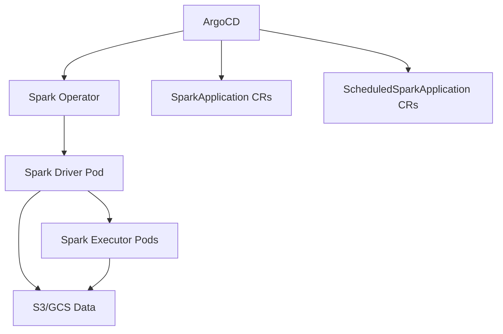

# How to Deploy Apache Spark on Kubernetes with ArgoCD

Author: [nawazdhandala](https://github.com/nawazdhandala)

Tags: ArgoCD, GitOps, Kubernetes, Apache Spark, Data Engineering

Description: Learn how to deploy and manage Apache Spark on Kubernetes using ArgoCD and the Spark operator for GitOps-managed batch and streaming data processing workloads.

---

Apache Spark remains the workhorse of large-scale data processing. Running Spark on Kubernetes instead of YARN brings benefits like better resource isolation, container-based dependency management, and unified infrastructure. Adding ArgoCD on top means your Spark infrastructure, job definitions, and configurations are all managed through GitOps.

This guide covers deploying the Spark operator on Kubernetes with ArgoCD and running production Spark jobs through declarative configurations.

## Architecture



The Spark operator watches for SparkApplication and ScheduledSparkApplication custom resources and manages the full lifecycle of Spark jobs.

## Step 1: Deploy the Spark Operator

Install the Spark operator through ArgoCD:

```yaml
# spark-operator-app.yaml
apiVersion: argoproj.io/v1alpha1
kind: Application
metadata:
  name: spark-operator
  namespace: argocd
spec:
  project: data-infrastructure
  source:
    repoURL: https://kubeflow.github.io/spark-operator
    chart: spark-operator
    targetRevision: 1.4.0
    helm:
      values: |
        controller:
          workers: 10
          resources:
            limits:
              cpu: "2"
              memory: "1Gi"
            requests:
              cpu: "500m"
              memory: "512Mi"
        webhook:
          enable: true
          port: 8080
        spark:
          jobNamespaces:
            - spark-jobs
            - spark-streaming
        serviceAccounts:
          spark:
            create: true
            name: spark
  destination:
    server: https://kubernetes.default.svc
    namespace: spark-operator
  syncPolicy:
    automated:
      prune: true
      selfHeal: true
    syncOptions:
      - CreateNamespace=true
      - ServerSideApply=true
```

## Step 2: Define Spark Jobs as Code

Define your Spark batch jobs as SparkApplication resources:

```yaml
# spark-jobs/production/etl-daily-orders.yaml
apiVersion: sparkoperator.k8s.io/v1beta2
kind: SparkApplication
metadata:
  name: daily-orders-etl
  labels:
    app: orders-etl
    team: data-engineering
spec:
  type: Python
  pythonVersion: "3"
  mode: cluster
  image: myregistry/spark-etl:v2.3.0
  imagePullPolicy: Always
  mainApplicationFile: local:///app/etl/daily_orders.py
  arguments:
    - "--date"
    - "{{ .Date }}"
    - "--output"
    - "s3a://data-warehouse/orders/daily/"
  sparkVersion: "3.5.0"
  sparkConf:
    spark.sql.adaptive.enabled: "true"
    spark.sql.adaptive.coalescePartitions.enabled: "true"
    spark.sql.shuffle.partitions: "200"
    spark.serializer: "org.apache.spark.serializer.KryoSerializer"
    spark.hadoop.fs.s3a.impl: "org.apache.hadoop.fs.s3a.S3AFileSystem"
    spark.hadoop.fs.s3a.aws.credentials.provider: "com.amazonaws.auth.WebIdentityTokenCredentialsProvider"
    spark.eventLog.enabled: "true"
    spark.eventLog.dir: "s3a://spark-logs/event-logs/"
  driver:
    cores: 2
    coreLimit: "2"
    memory: "4g"
    memoryOverhead: "1g"
    labels:
      role: driver
    serviceAccount: spark
    nodeSelector:
      node-type: compute
  executor:
    cores: 4
    coreLimit: "4"
    memory: "8g"
    memoryOverhead: "2g"
    instances: 10
    labels:
      role: executor
    nodeSelector:
      node-type: compute
  restartPolicy:
    type: OnFailure
    onFailureRetries: 3
    onFailureRetryInterval: 60
    onSubmissionFailureRetries: 3
    onSubmissionFailureRetryInterval: 30
  monitoring:
    exposeDriverMetrics: true
    exposeExecutorMetrics: true
    prometheus:
      jmxExporterJar: "/prometheus/jmx_prometheus_javaagent.jar"
      port: 8090
```

## Step 3: Scheduled Spark Jobs

For recurring jobs, use ScheduledSparkApplication:

```yaml
# spark-jobs/production/scheduled-orders-etl.yaml
apiVersion: sparkoperator.k8s.io/v1beta2
kind: ScheduledSparkApplication
metadata:
  name: daily-orders-etl-scheduled
  labels:
    app: orders-etl
    schedule: daily
spec:
  schedule: "0 2 * * *"  # Run at 2 AM daily
  concurrencyPolicy: Forbid
  successfulRunHistoryLimit: 5
  failedRunHistoryLimit: 5
  template:
    type: Python
    pythonVersion: "3"
    mode: cluster
    image: myregistry/spark-etl:v2.3.0
    mainApplicationFile: local:///app/etl/daily_orders.py
    sparkVersion: "3.5.0"
    sparkConf:
      spark.sql.adaptive.enabled: "true"
      spark.sql.shuffle.partitions: "200"
    driver:
      cores: 2
      memory: "4g"
      serviceAccount: spark
    executor:
      cores: 4
      memory: "8g"
      instances: 10
    restartPolicy:
      type: OnFailure
      onFailureRetries: 3
      onFailureRetryInterval: 60
```

## Step 4: Spark Streaming Jobs

For real-time processing, define structured streaming applications:

```yaml
# spark-streaming/production/order-stream-processor.yaml
apiVersion: sparkoperator.k8s.io/v1beta2
kind: SparkApplication
metadata:
  name: order-stream-processor
  labels:
    app: order-stream
    type: streaming
spec:
  type: Scala
  mode: cluster
  image: myregistry/spark-streaming:v1.5.0
  mainClass: com.myorg.streaming.OrderStreamProcessor
  mainApplicationFile: local:///app/jars/order-stream.jar
  sparkVersion: "3.5.0"
  sparkConf:
    spark.streaming.kafka.maxRatePerPartition: "1000"
    spark.sql.streaming.checkpointLocation: "s3a://spark-checkpoints/order-stream/"
    spark.sql.streaming.stateStore.providerClass: "org.apache.spark.sql.execution.streaming.state.RocksDBStateStoreProvider"
    spark.kubernetes.executor.deleteOnTermination: "false"
  driver:
    cores: 2
    memory: "4g"
    serviceAccount: spark
  executor:
    cores: 4
    memory: "8g"
    instances: 5
  restartPolicy:
    type: Always
    onFailureRetries: -1  # Unlimited retries for streaming
    onFailureRetryInterval: 30
```

Notice the `restartPolicy.type: Always` for streaming jobs. Unlike batch jobs, streaming applications should be restarted indefinitely if they fail.

## Step 5: ArgoCD Application for Spark Jobs

```yaml
apiVersion: argoproj.io/v1alpha1
kind: Application
metadata:
  name: spark-jobs-production
  namespace: argocd
  labels:
    team: data-engineering
    component: spark
spec:
  project: data-infrastructure
  source:
    repoURL: https://github.com/myorg/data-platform.git
    targetRevision: main
    path: spark-jobs/production
  destination:
    server: https://kubernetes.default.svc
    namespace: spark-jobs
  syncPolicy:
    automated:
      prune: false  # Don't auto-delete running jobs
      selfHeal: true
    syncOptions:
      - CreateNamespace=true
      - RespectIgnoreDifferences=true
  ignoreDifferences:
    - group: sparkoperator.k8s.io
      kind: SparkApplication
      jsonPointers:
        - /status
    - group: sparkoperator.k8s.io
      kind: ScheduledSparkApplication
      jsonPointers:
        - /status
```

## Handling Spark Dependencies

Manage Spark dependencies using init containers or baked into the image. For complex dependency trees, use a custom Dockerfile:

```dockerfile
FROM apache/spark:3.5.0-python3
USER root

# Install Python dependencies
COPY requirements.txt /app/
RUN pip install --no-cache-dir -r /app/requirements.txt

# Copy application code
COPY etl/ /app/etl/
COPY config/ /app/config/

# Add extra JARs for S3, Kafka, etc.
RUN curl -o /opt/spark/jars/hadoop-aws-3.3.6.jar \
    https://repo1.maven.org/maven2/org/apache/hadoop/hadoop-aws/3.3.6/hadoop-aws-3.3.6.jar && \
    curl -o /opt/spark/jars/aws-java-sdk-bundle-1.12.367.jar \
    https://repo1.maven.org/maven2/com/amazonaws/aws-java-sdk-bundle/1.12.367/aws-java-sdk-bundle-1.12.367.jar

USER spark
```

When the image is updated, ArgoCD detects the change in the SparkApplication manifest and triggers a new submission.

## Dynamic Resource Allocation

For workloads with varying resource needs, enable dynamic allocation:

```yaml
sparkConf:
  spark.dynamicAllocation.enabled: "true"
  spark.dynamicAllocation.initialExecutors: "2"
  spark.dynamicAllocation.minExecutors: "2"
  spark.dynamicAllocation.maxExecutors: "50"
  spark.dynamicAllocation.executorIdleTimeout: "120s"
  spark.dynamicAllocation.shuffleTracking.enabled: "true"
```

When using dynamic allocation with ArgoCD, make sure to add `ignoreDifferences` for the executor count since it changes at runtime.

## Spark History Server

Deploy the Spark History Server for job debugging:

```yaml
# spark-infrastructure/history-server.yaml
apiVersion: apps/v1
kind: Deployment
metadata:
  name: spark-history-server
spec:
  replicas: 1
  selector:
    matchLabels:
      app: spark-history
  template:
    spec:
      serviceAccountName: spark
      containers:
        - name: history-server
          image: apache/spark:3.5.0
          command:
            - /opt/spark/sbin/start-history-server.sh
          env:
            - name: SPARK_HISTORY_OPTS
              value: >-
                -Dspark.history.fs.logDirectory=s3a://spark-logs/event-logs/
                -Dspark.history.ui.port=18080
                -Dspark.hadoop.fs.s3a.impl=org.apache.hadoop.fs.s3a.S3AFileSystem
          ports:
            - containerPort: 18080
          resources:
            requests:
              cpu: "1"
              memory: "2Gi"
```

## Best Practices

1. **Use node selectors** - Run Spark executors on dedicated compute-optimized nodes to avoid interfering with other workloads.

2. **Set memory overhead** - Spark needs additional memory beyond what you specify for off-heap usage. Set `memoryOverhead` to at least 10% of executor memory.

3. **Enable adaptive query execution** - `spark.sql.adaptive.enabled: true` lets Spark optimize query plans at runtime.

4. **Store checkpoints externally** - For streaming jobs, store checkpoints in S3 or GCS so they survive pod restarts.

5. **Monitor executor metrics** - Use the Prometheus integration to track executor memory, CPU, and shuffle metrics.

Deploying Spark with ArgoCD and the Spark operator gives you a clean, declarative way to manage your entire data processing pipeline. Every job definition, configuration change, and version upgrade goes through Git.
