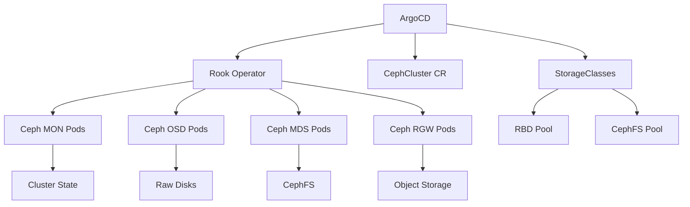

# How to Deploy Ceph/Rook with ArgoCD

Author: [nawazdhandala](https://github.com/nawazdhandala)

Tags: ArgoCD, GitOps, Kubernetes, Ceph, Rook

Description: Learn how to deploy and manage a Rook-Ceph storage cluster using ArgoCD for GitOps-driven distributed storage that provides block, file, and object storage.

---

Rook is a Kubernetes operator that turns Ceph into a cloud-native storage solution. It provides block storage (RBD), shared filesystems (CephFS), and object storage (compatible with S3) all running inside your Kubernetes cluster. Deploying Rook-Ceph through ArgoCD gives you a GitOps-managed storage platform where every configuration change is version-controlled and auditable.

This guide walks through deploying a production Rook-Ceph cluster with ArgoCD, from the operator to storage classes.

## Architecture Overview



## Deployment Order with Sync Waves

Rook-Ceph has strict deployment ordering requirements:

1. CRDs and operator first
2. Ceph cluster next
3. Storage pools and classes last

Use ArgoCD sync waves to enforce this order.

## Step 1: Deploy Rook Operator

```yaml
apiVersion: argoproj.io/v1alpha1
kind: Application
metadata:
  name: rook-ceph-operator
  namespace: argocd
  annotations:
    argocd.argoproj.io/sync-wave: "-2"
spec:
  project: infrastructure
  source:
    repoURL: https://charts.rook.io/release
    chart: rook-ceph
    targetRevision: v1.13.0
    helm:
      releaseName: rook-ceph
      valuesObject:
        crds:
          enabled: true
        monitoring:
          enabled: true
        resources:
          requests:
            cpu: 200m
            memory: 256Mi
          limits:
            cpu: 500m
            memory: 512Mi
        # Enable discovery daemon for automatic OSD detection
        enableDiscoveryDaemon: true
        # CSI driver configuration
        csi:
          enableRbdDriver: true
          enableCephfsDriver: true
          enableGrpcMetrics: true
          provisionerReplicas: 2
          # Resource limits for CSI pods
          csiRBDProvisionerResource: |
            - name: csi-provisioner
              resource:
                requests:
                  memory: 128Mi
                  cpu: 100m
                limits:
                  memory: 256Mi
          csiCephFSProvisionerResource: |
            - name: csi-provisioner
              resource:
                requests:
                  memory: 128Mi
                  cpu: 100m
                limits:
                  memory: 256Mi
  destination:
    server: https://kubernetes.default.svc
    namespace: rook-ceph
  syncPolicy:
    automated:
      selfHeal: true
    syncOptions:
      - CreateNamespace=true
      - ServerSideApply=true
```

## Step 2: Deploy the Ceph Cluster

```yaml
apiVersion: argoproj.io/v1alpha1
kind: Application
metadata:
  name: rook-ceph-cluster
  namespace: argocd
  annotations:
    argocd.argoproj.io/sync-wave: "-1"
spec:
  project: infrastructure
  source:
    repoURL: https://github.com/your-org/platform-config
    path: rook-ceph/cluster
    targetRevision: main
  destination:
    server: https://kubernetes.default.svc
    namespace: rook-ceph
  syncPolicy:
    automated:
      selfHeal: true
    syncOptions:
      - ServerSideApply=true
```

The CephCluster manifest:

```yaml
# rook-ceph/cluster/ceph-cluster.yaml
apiVersion: ceph.rook.io/v1
kind: CephCluster
metadata:
  name: rook-ceph
  namespace: rook-ceph
spec:
  cephVersion:
    image: quay.io/ceph/ceph:v18.2.1
    allowUnsupported: false
  dataDirHostPath: /var/lib/rook
  skipUpgradeChecks: false
  continueUpgradeAfterChecksEvenIfNotHealthy: false

  mon:
    count: 3
    allowMultiplePerNode: false

  mgr:
    count: 2
    allowMultiplePerNode: false
    modules:
      - name: pg_autoscaler
        enabled: true
      - name: prometheus
        enabled: true

  dashboard:
    enabled: true
    ssl: true

  monitoring:
    enabled: true
    metricsDisabled: false

  network:
    provider: host
    # Or use multus for dedicated storage network
    # provider: multus
    # selectors:
    #   public: rook-ceph/public-net
    #   cluster: rook-ceph/cluster-net

  crashCollector:
    disable: false

  cleanupPolicy:
    # Safety: do not allow cluster deletion to clean data
    confirmation: ""
    sanitizeDisks:
      method: quick
      dataSource: zero
      iteration: 1
    allowUninstallWithVolumes: false

  storage:
    useAllNodes: false
    useAllDevices: false
    nodes:
      - name: "worker-1"
        devices:
          - name: "sdb"
            config:
              osdsPerDevice: "1"
          - name: "sdc"
      - name: "worker-2"
        devices:
          - name: "sdb"
          - name: "sdc"
      - name: "worker-3"
        devices:
          - name: "sdb"
          - name: "sdc"

  resources:
    mon:
      requests:
        cpu: 500m
        memory: 1Gi
      limits:
        cpu: 2000m
        memory: 2Gi
    osd:
      requests:
        cpu: 500m
        memory: 2Gi
      limits:
        cpu: 2000m
        memory: 4Gi
    mgr:
      requests:
        cpu: 250m
        memory: 512Mi
      limits:
        cpu: 1000m
        memory: 1Gi

  priorityClassNames:
    mon: system-node-critical
    osd: system-node-critical
    mgr: system-cluster-critical

  disruptionManagement:
    managePodBudgets: true
    osdMaintenanceTimeout: 30
    pgHealthCheckTimeout: 0
```

## Step 3: Create Storage Pools and Classes

```yaml
# CephBlockPool for RBD volumes
apiVersion: ceph.rook.io/v1
kind: CephBlockPool
metadata:
  name: replicapool
  namespace: rook-ceph
spec:
  failureDomain: host
  replicated:
    size: 3
    requireSafeReplicaSize: true
  parameters:
    compression_mode: aggressive

---
# StorageClass for RBD
apiVersion: storage.k8s.io/v1
kind: StorageClass
metadata:
  name: ceph-block
  annotations:
    storageclass.kubernetes.io/is-default-class: "true"
provisioner: rook-ceph.rbd.csi.ceph.com
parameters:
  clusterID: rook-ceph
  pool: replicapool
  imageFormat: "2"
  imageFeatures: layering,fast-diff,object-map,deep-flatten,exclusive-lock
  csi.storage.k8s.io/provisioner-secret-name: rook-csi-rbd-provisioner
  csi.storage.k8s.io/provisioner-secret-namespace: rook-ceph
  csi.storage.k8s.io/controller-expand-secret-name: rook-csi-rbd-provisioner
  csi.storage.k8s.io/controller-expand-secret-namespace: rook-ceph
  csi.storage.k8s.io/node-stage-secret-name: rook-csi-rbd-node
  csi.storage.k8s.io/node-stage-secret-namespace: rook-ceph
  csi.storage.k8s.io/fstype: ext4
reclaimPolicy: Delete
allowVolumeExpansion: true

---
# CephFilesystem for shared storage
apiVersion: ceph.rook.io/v1
kind: CephFilesystem
metadata:
  name: cephfs
  namespace: rook-ceph
spec:
  metadataPool:
    replicated:
      size: 3
  dataPools:
    - failureDomain: host
      replicated:
        size: 3
      name: data0
  metadataServer:
    activeCount: 1
    activeStandby: true
    resources:
      requests:
        cpu: 500m
        memory: 1Gi
      limits:
        cpu: 2000m
        memory: 4Gi

---
# StorageClass for CephFS
apiVersion: storage.k8s.io/v1
kind: StorageClass
metadata:
  name: ceph-filesystem
provisioner: rook-ceph.cephfs.csi.ceph.com
parameters:
  clusterID: rook-ceph
  fsName: cephfs
  pool: cephfs-data0
  csi.storage.k8s.io/provisioner-secret-name: rook-csi-cephfs-provisioner
  csi.storage.k8s.io/provisioner-secret-namespace: rook-ceph
  csi.storage.k8s.io/controller-expand-secret-name: rook-csi-cephfs-provisioner
  csi.storage.k8s.io/controller-expand-secret-namespace: rook-ceph
  csi.storage.k8s.io/node-stage-secret-name: rook-csi-cephfs-node
  csi.storage.k8s.io/node-stage-secret-namespace: rook-ceph
reclaimPolicy: Delete
allowVolumeExpansion: true
```

## Custom Health Checks

```yaml
apiVersion: v1
kind: ConfigMap
metadata:
  name: argocd-cm
  namespace: argocd
data:
  resource.customizations.health.ceph.rook.io_CephCluster: |
    hs = {}
    if obj.status ~= nil and obj.status.ceph ~= nil then
      local health = obj.status.ceph.health or "UNKNOWN"
      if health == "HEALTH_OK" then
        hs.status = "Healthy"
        hs.message = "Ceph cluster is healthy"
      elseif health == "HEALTH_WARN" then
        hs.status = "Degraded"
        hs.message = obj.status.ceph.lastChecked or
          "Ceph cluster has warnings"
      else
        hs.status = "Degraded"
        hs.message = "Ceph cluster health: " .. health
      end
    else
      hs.status = "Progressing"
      hs.message = "Waiting for Ceph cluster status"
    end
    return hs

  resource.customizations.health.ceph.rook.io_CephBlockPool: |
    hs = {}
    if obj.status ~= nil then
      local phase = obj.status.phase or "Unknown"
      if phase == "Ready" then
        hs.status = "Healthy"
        hs.message = "Block pool is ready"
      elseif phase == "Progressing" then
        hs.status = "Progressing"
        hs.message = "Block pool is being created"
      else
        hs.status = "Degraded"
        hs.message = "Block pool phase: " .. phase
      end
    else
      hs.status = "Progressing"
      hs.message = "Waiting for pool status"
    end
    return hs
```

## Monitoring Ceph Through Prometheus

Rook-Ceph includes Prometheus metrics. Add ServiceMonitor:

```yaml
apiVersion: monitoring.coreos.com/v1
kind: ServiceMonitor
metadata:
  name: rook-ceph
  namespace: rook-ceph
spec:
  selector:
    matchLabels:
      app: rook-ceph-mgr
  endpoints:
    - port: http-metrics
      interval: 15s
```

Key metrics to watch:

```promql
# Ceph cluster health
ceph_health_status

# OSD utilization
ceph_osd_utilization

# Pool usage
ceph_pool_stored_raw / ceph_pool_max_avail * 100

# IOPS
rate(ceph_pool_rd[5m]) + rate(ceph_pool_wr[5m])

# Slow OSD operations
ceph_osd_slow_ops
```

## Upgrade Strategy

When upgrading Ceph versions through ArgoCD:

1. Update the `cephVersion.image` in Git
2. ArgoCD detects the change and shows OutOfSync
3. Review the diff carefully
4. Sync manually (do not auto-sync Ceph version changes)

```yaml
# Override auto-sync for Ceph upgrades
syncPolicy:
  automated:
    selfHeal: true
    # Set to false during upgrades
    prune: false
```

## Summary

Deploying Rook-Ceph with ArgoCD gives you a fully GitOps-managed distributed storage platform. Use sync waves to enforce the correct deployment order (operator, cluster, pools, storage classes), add custom health checks so ArgoCD understands Ceph cluster status, and monitor through Prometheus metrics. Be conservative with auto-sync for the CephCluster resource, especially during upgrades. This setup provides enterprise-grade block, file, and object storage managed entirely through Git.
