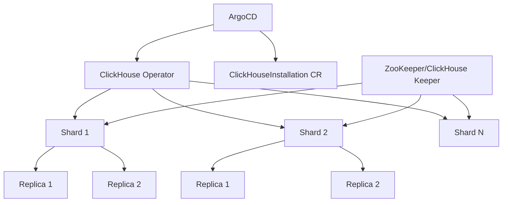

# How to Deploy ClickHouse with ArgoCD

Author: [nawazdhandala](https://github.com/nawazdhandala)

Tags: ArgoCD, GitOps, Kubernetes, ClickHouse, Analytics

Description: Learn how to deploy and manage ClickHouse on Kubernetes using ArgoCD and the Altinity ClickHouse Operator for GitOps-managed analytical database infrastructure.

---

ClickHouse is a column-oriented database designed for real-time analytics. It handles billions of rows with sub-second query times, making it the database of choice for observability, product analytics, and business intelligence. Deploying ClickHouse on Kubernetes with ArgoCD gives you a GitOps-managed analytical database where cluster topology, configurations, and schema changes are all version-controlled.

This guide covers deploying ClickHouse using the Altinity ClickHouse Operator, managed through ArgoCD.

## Architecture



## Step 1: Deploy the ClickHouse Operator

```yaml
# clickhouse-operator-app.yaml
apiVersion: argoproj.io/v1alpha1
kind: Application
metadata:
  name: clickhouse-operator
  namespace: argocd
spec:
  project: data-infrastructure
  source:
    repoURL: https://docs.altinity.com/clickhouse-operator/
    chart: altinity-clickhouse-operator
    targetRevision: 0.23.0
    helm:
      values: |
        operator:
          resources:
            requests:
              cpu: "200m"
              memory: "256Mi"
            limits:
              cpu: "1"
              memory: "512Mi"
        metrics:
          enabled: true
  destination:
    server: https://kubernetes.default.svc
    namespace: clickhouse-operator
  syncPolicy:
    automated:
      prune: true
      selfHeal: true
    syncOptions:
      - CreateNamespace=true
      - ServerSideApply=true
```

## Step 2: Deploy ClickHouse Keeper

ClickHouse Keeper is a lightweight alternative to ZooKeeper for cluster coordination:

```yaml
# clickhouse/production/keeper.yaml
apiVersion: clickhouse.altinity.com/v1
kind: ClickHouseKeeperInstallation
metadata:
  name: keeper
spec:
  configuration:
    clusters:
      - name: keeper
        layout:
          replicasCount: 3
    settings:
      logger/level: information
      logger/console: "true"
      listen_host: "0.0.0.0"
      keeper_server/storage_path: /var/lib/clickhouse-keeper
      keeper_server/tcp_port: "2181"
      keeper_server/four_letter_word_white_list: "*"
      keeper_server/coordination_settings/operation_timeout_ms: "10000"
      keeper_server/coordination_settings/session_timeout_ms: "30000"
      keeper_server/raft_configuration/reserve_log_items: "200"
  templates:
    podTemplates:
      - name: default
        spec:
          containers:
            - name: clickhouse-keeper
              image: clickhouse/clickhouse-keeper:24.1
              resources:
                requests:
                  cpu: "500m"
                  memory: "1Gi"
                limits:
                  cpu: "1"
                  memory: "2Gi"
    volumeClaimTemplates:
      - name: default
        spec:
          accessModes: ["ReadWriteOnce"]
          storageClassName: gp3
          resources:
            requests:
              storage: 25Gi
```

## Step 3: Deploy the ClickHouse Cluster

Define your ClickHouse cluster with sharding and replication:

```yaml
# clickhouse/production/cluster.yaml
apiVersion: clickhouse.altinity.com/v1
kind: ClickHouseInstallation
metadata:
  name: analytics
  labels:
    team: data-platform
spec:
  configuration:
    zookeeper:
      nodes:
        - host: keeper-0.keeper.clickhouse.svc.cluster.local
          port: 2181
        - host: keeper-1.keeper.clickhouse.svc.cluster.local
          port: 2181
        - host: keeper-2.keeper.clickhouse.svc.cluster.local
          port: 2181

    clusters:
      - name: analytics
        layout:
          shardsCount: 3
          replicasCount: 2
        templates:
          podTemplate: clickhouse-pod
          dataVolumeClaimTemplate: data-volume
          logVolumeClaimTemplate: log-volume

    settings:
      # Performance settings
      max_concurrent_queries: "200"
      max_threads: "16"
      max_memory_usage: "10000000000"  # 10GB per query
      max_memory_usage_for_all_queries: "50000000000"  # 50GB total

      # Merge tree settings
      merge_tree/max_bytes_to_merge_at_max_space_in_pool: "161061273600"

      # Logging
      logger/level: information
      logger/console: "true"

      # Compression
      compression/case/method: zstd
      compression/case/min_part_size: "10000000000"
      compression/case/min_part_size_ratio: "0.01"

    profiles:
      default/max_memory_usage: "10000000000"
      default/max_execution_time: "600"
      default/load_balancing: random
      readonly/readonly: "1"

    quotas:
      default/interval/duration: "3600"
      default/interval/queries: "10000"
      default/interval/result_rows: "1000000000"

    users:
      admin/password_sha256_hex: "..."
      admin/networks/ip: "::/0"
      admin/profile: default
      admin/quota: default

      readonly/password_sha256_hex: "..."
      readonly/networks/ip: "::/0"
      readonly/profile: readonly
      readonly/quota: default

  templates:
    podTemplates:
      - name: clickhouse-pod
        spec:
          containers:
            - name: clickhouse
              image: clickhouse/clickhouse-server:24.1
              ports:
                - name: http
                  containerPort: 8123
                - name: native
                  containerPort: 9000
                - name: interserver
                  containerPort: 9009
              resources:
                requests:
                  cpu: "4"
                  memory: "16Gi"
                limits:
                  cpu: "8"
                  memory: "32Gi"

    volumeClaimTemplates:
      - name: data-volume
        spec:
          accessModes: ["ReadWriteOnce"]
          storageClassName: gp3
          resources:
            requests:
              storage: 1000Gi
      - name: log-volume
        spec:
          accessModes: ["ReadWriteOnce"]
          storageClassName: gp3
          resources:
            requests:
              storage: 50Gi
```

This gives you a 3-shard, 2-replica cluster with 6 total ClickHouse pods. Each shard holds a portion of the data, and each replica provides redundancy.

## Step 4: The ArgoCD Application

```yaml
apiVersion: argoproj.io/v1alpha1
kind: Application
metadata:
  name: clickhouse-production
  namespace: argocd
  labels:
    team: data-platform
    component: clickhouse
spec:
  project: data-infrastructure
  source:
    repoURL: https://github.com/myorg/data-platform.git
    targetRevision: main
    path: clickhouse/production
  destination:
    server: https://kubernetes.default.svc
    namespace: clickhouse
  syncPolicy:
    automated:
      prune: false  # Never auto-delete ClickHouse resources
      selfHeal: true
    syncOptions:
      - CreateNamespace=true
      - RespectIgnoreDifferences=true
    retry:
      limit: 3
      backoff:
        duration: 1m
        factor: 2
        maxDuration: 10m
  ignoreDifferences:
    - group: clickhouse.altinity.com
      kind: ClickHouseInstallation
      jsonPointers:
        - /status
```

## Step 5: Schema Management

Manage your ClickHouse schemas through a pre-sync hook:

```yaml
# clickhouse/production/schema-migration.yaml
apiVersion: batch/v1
kind: Job
metadata:
  name: clickhouse-schema-migration
  annotations:
    argocd.argoproj.io/hook: PreSync
    argocd.argoproj.io/hook-delete-policy: HookSucceeded
spec:
  template:
    spec:
      restartPolicy: Never
      containers:
        - name: migrate
          image: myregistry/clickhouse-migrations:v1.0.0
          env:
            - name: CLICKHOUSE_HOST
              value: "analytics-clickhouse.clickhouse.svc.cluster.local"
            - name: CLICKHOUSE_PORT
              value: "8123"
          command:
            - /bin/sh
            - -c
            - |
              # Apply schema migrations
              for f in /migrations/*.sql; do
                echo "Applying $f"
                clickhouse-client --host $CLICKHOUSE_HOST \
                  --port 9000 \
                  --multiquery < "$f"
              done
          volumeMounts:
            - name: migrations
              mountPath: /migrations
      volumes:
        - name: migrations
          configMap:
            name: clickhouse-migrations
```

```yaml
# clickhouse/production/migrations-configmap.yaml
apiVersion: v1
kind: ConfigMap
metadata:
  name: clickhouse-migrations
data:
  001_events_table.sql: |
    CREATE TABLE IF NOT EXISTS analytics.events ON CLUSTER 'analytics'
    (
        event_id UUID DEFAULT generateUUIDv4(),
        event_type LowCardinality(String),
        user_id UInt64,
        timestamp DateTime64(3),
        properties Map(String, String),
        _partition_date Date DEFAULT toDate(timestamp)
    )
    ENGINE = ReplicatedMergeTree('/clickhouse/tables/{shard}/events', '{replica}')
    PARTITION BY toYYYYMM(_partition_date)
    ORDER BY (event_type, user_id, timestamp)
    TTL _partition_date + INTERVAL 90 DAY;

    CREATE TABLE IF NOT EXISTS analytics.events_distributed ON CLUSTER 'analytics'
    AS analytics.events
    ENGINE = Distributed('analytics', 'analytics', 'events', xxHash64(user_id));
```

## Monitoring ClickHouse

The operator exposes Prometheus metrics out of the box. Add a ServiceMonitor:

```yaml
apiVersion: monitoring.coreos.com/v1
kind: ServiceMonitor
metadata:
  name: clickhouse-metrics
spec:
  selector:
    matchLabels:
      clickhouse.altinity.com/chi: analytics
  endpoints:
    - port: exporter
      path: /metrics
      interval: 30s
```

Key metrics to watch:

- `chi_clickhouse_metric_Query` - active queries
- `chi_clickhouse_metric_Merge` - active merges
- `chi_clickhouse_metric_ReplicasMaxAbsoluteDelay` - replication lag
- `chi_clickhouse_asynchronous_metric_MaxPartCountForPartition` - partition health

## Best Practices

1. **Never enable auto-prune** for ClickHouse - accidentally deleting a ClickHouseInstallation resource could destroy your data.

2. **Use ClickHouse Keeper** instead of ZooKeeper - it is lighter, easier to manage, and maintained by the ClickHouse team.

3. **Size storage generously** - ClickHouse stores data in compressed columnar format but can still use significant disk. Monitor usage and expand proactively.

4. **Use TTL for data lifecycle** - Define TTL policies in your table schemas to automatically clean up old data.

5. **Monitor replication lag** - In a replicated setup, lag means some replicas have stale data. Alert on `ReplicasMaxAbsoluteDelay` exceeding your tolerance.

Deploying ClickHouse with ArgoCD and the Altinity operator gives you a production-grade analytical database that is fully managed through GitOps. Schema changes, configuration updates, and scaling operations all go through version control.
