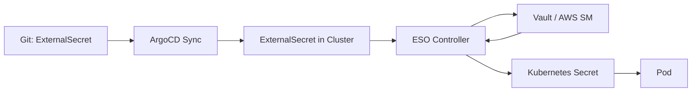

# How to Deploy ConfigMaps and Secrets with ArgoCD

Author: [nawazdhandala](https://github.com/nawazdhandala)

Tags: ArgoCD, GitOps, Kubernetes, ConfigMap, Secrets Management

Description: Learn how to manage Kubernetes ConfigMaps and Secrets with ArgoCD, including secret encryption strategies, external secret operators, and configuration change detection.

---

ConfigMaps and Secrets are the foundation of application configuration in Kubernetes. Almost every workload references them for environment variables, configuration files, or credentials. Managing them through ArgoCD requires careful thinking about security (especially for Secrets), change propagation, and organizational patterns.

## ConfigMaps with ArgoCD: The Basics

ConfigMaps are straightforward in ArgoCD. Store them in Git alongside your application manifests:

```yaml
# apps/myapp/configmap.yaml
apiVersion: v1
kind: ConfigMap
metadata:
  name: myapp-config
data:
  # Simple key-value pairs
  LOG_LEVEL: "info"
  MAX_CONNECTIONS: "100"
  CACHE_TTL: "300"

  # Configuration files
  app.yaml: |
    server:
      port: 8080
      timeout: 30s
    database:
      pool_size: 10
      idle_timeout: 60s
    cache:
      enabled: true
      ttl: 300
```

Reference it in your Deployment:

```yaml
apiVersion: apps/v1
kind: Deployment
metadata:
  name: myapp
spec:
  template:
    spec:
      containers:
        - name: myapp
          image: myapp:1.0.0
          # As environment variables
          envFrom:
            - configMapRef:
                name: myapp-config
          # As mounted files
          volumeMounts:
            - name: config
              mountPath: /app/config
      volumes:
        - name: config
          configMap:
            name: myapp-config
            items:
              - key: app.yaml
                path: app.yaml
```

## The ConfigMap Update Problem

Here is the most common issue with ConfigMaps and ArgoCD: when you update a ConfigMap, Kubernetes does not automatically restart pods that reference it. Your pods continue running with the old configuration until they are restarted.

### Solution 1: Checksum Annotations

Add a hash of the ConfigMap content as an annotation on your pod template. When the ConfigMap changes, the annotation changes, triggering a rolling update:

```yaml
apiVersion: apps/v1
kind: Deployment
metadata:
  name: myapp
spec:
  template:
    metadata:
      annotations:
        # Update this when ConfigMap changes
        checksum/config: "abc123def456"
    spec:
      containers:
        - name: myapp
          envFrom:
            - configMapRef:
                name: myapp-config
```

If you use Helm, this can be automated:

```yaml
annotations:
  checksum/config: {{ include (print $.Template.BasePath "/configmap.yaml") . | sha256sum }}
```

### Solution 2: Immutable ConfigMaps with Versioned Names

Create a new ConfigMap with a version suffix each time the content changes:

```yaml
apiVersion: v1
kind: ConfigMap
metadata:
  name: myapp-config-v3
data:
  LOG_LEVEL: "debug"  # Changed from "info"
```

Update your Deployment to reference the new name:

```yaml
envFrom:
  - configMapRef:
      name: myapp-config-v3  # Updated from v2
```

This guarantees a rolling update and makes it easy to roll back by changing the reference back to the old version.

### Solution 3: Stakater Reloader

Install the Stakater Reloader controller, which watches ConfigMaps and Secrets and automatically restarts Deployments when their referenced configurations change:

```yaml
# Add annotation to your Deployment
apiVersion: apps/v1
kind: Deployment
metadata:
  name: myapp
  annotations:
    reloader.stakater.com/auto: "true"
```

Deploy Reloader through ArgoCD:

```yaml
apiVersion: argoproj.io/v1alpha1
kind: Application
metadata:
  name: reloader
  namespace: argocd
spec:
  project: default
  source:
    repoURL: https://stakater.github.io/stakater-charts
    chart: reloader
    targetRevision: 1.0.52
    helm:
      values: |
        reloader:
          watchGlobally: true
  destination:
    server: https://kubernetes.default.svc
    namespace: kube-system
```

## Secrets in GitOps: The Security Challenge

Storing plain-text Secrets in Git is a security risk. Even in private repositories, anyone with read access can see your credentials. Several solutions exist for managing Secrets in a GitOps workflow.

### Option 1: Sealed Secrets

Bitnami Sealed Secrets encrypts Secrets so they can be safely stored in Git. Only the controller running in your cluster can decrypt them:

```bash
# Install the kubeseal CLI
brew install kubeseal

# Encrypt a Secret
kubectl create secret generic db-creds \
  --from-literal=username=admin \
  --from-literal=password=s3cret \
  --dry-run=client -o yaml | kubeseal \
  --controller-name=sealed-secrets \
  --controller-namespace=kube-system \
  -o yaml > sealed-secret.yaml
```

The resulting SealedSecret can be safely committed to Git:

```yaml
# apps/myapp/sealed-secret.yaml
apiVersion: bitnami.com/v1alpha1
kind: SealedSecret
metadata:
  name: db-creds
spec:
  encryptedData:
    username: AgBy3i4OJSWK+PiTySYZZA9rO...
    password: AgCtr8FjPQk1tH2bJg+g0PCVH...
  template:
    metadata:
      name: db-creds
    type: Opaque
```

### Option 2: External Secrets Operator

External Secrets Operator (ESO) syncs secrets from external providers (Vault, AWS Secrets Manager, Azure Key Vault) into Kubernetes Secrets:

```yaml
# apps/myapp/external-secret.yaml
apiVersion: external-secrets.io/v1beta1
kind: ExternalSecret
metadata:
  name: db-creds
spec:
  refreshInterval: 1h
  secretStoreRef:
    name: vault-backend
    kind: ClusterSecretStore
  target:
    name: db-creds
    creationPolicy: Owner
  data:
    - secretKey: username
      remoteRef:
        key: apps/myapp/database
        property: username
    - secretKey: password
      remoteRef:
        key: apps/myapp/database
        property: password
```

ArgoCD manages the ExternalSecret resource, and ESO creates the actual Secret:



### Option 3: SOPS-Encrypted Secrets

Mozilla SOPS encrypts Secret values in-place while keeping keys readable:

```yaml
# apps/myapp/secret.enc.yaml
apiVersion: v1
kind: Secret
metadata:
  name: db-creds
type: Opaque
stringData:
  username: ENC[AES256_GCM,data:dGVzdA==,iv:...,tag:...]
  password: ENC[AES256_GCM,data:cGFzc3dvcmQ=,iv:...,tag:...]
sops:
  kms:
    - arn: arn:aws:kms:us-east-1:123456:key/abc-123
  encrypted_regex: ^(data|stringData)$
  version: 3.7.3
```

ArgoCD has a SOPS plugin that decrypts during sync:

```yaml
# In argocd-cm ConfigMap
data:
  configManagementPlugins: |
    - name: sops
      generate:
        command: ["sh", "-c"]
        args: ["sops -d secret.enc.yaml"]
```

## Organizing ConfigMaps Across Environments

For multi-environment setups, use Kustomize overlays to manage environment-specific configuration:

```
apps/myapp/
  base/
    configmap.yaml      # Shared config
    deployment.yaml
    kustomization.yaml
  overlays/
    dev/
      configmap-patch.yaml
      kustomization.yaml
    staging/
      configmap-patch.yaml
      kustomization.yaml
    production/
      configmap-patch.yaml
      kustomization.yaml
```

Base ConfigMap:

```yaml
# base/configmap.yaml
apiVersion: v1
kind: ConfigMap
metadata:
  name: myapp-config
data:
  LOG_LEVEL: "info"
  CACHE_ENABLED: "true"
```

Environment-specific patch:

```yaml
# overlays/production/configmap-patch.yaml
apiVersion: v1
kind: ConfigMap
metadata:
  name: myapp-config
data:
  LOG_LEVEL: "warn"
  MAX_CONNECTIONS: "500"
  CACHE_TTL: "600"
```

## Sync Waves for ConfigMaps and Secrets

Always create ConfigMaps and Secrets before the Deployments that reference them:

```yaml
apiVersion: v1
kind: ConfigMap
metadata:
  name: myapp-config
  annotations:
    argocd.argoproj.io/sync-wave: "-1"
---
apiVersion: v1
kind: Secret
metadata:
  name: myapp-secret
  annotations:
    argocd.argoproj.io/sync-wave: "-1"
---
apiVersion: apps/v1
kind: Deployment
metadata:
  name: myapp
  annotations:
    argocd.argoproj.io/sync-wave: "0"
```

## Preventing Accidental Secret Deletion

Protect secrets from accidental pruning:

```yaml
apiVersion: v1
kind: Secret
metadata:
  name: db-creds
  annotations:
    argocd.argoproj.io/sync-options: Prune=false
```

This prevents ArgoCD from deleting the Secret even if it is removed from Git.

## Summary

ConfigMaps are straightforward to manage with ArgoCD, but you need a strategy for triggering pod restarts when configuration changes. For Secrets, never store plain-text credentials in Git - use Sealed Secrets, External Secrets Operator, or SOPS encryption. Use sync waves to ensure configuration resources are created before the workloads that depend on them, and protect critical secrets from accidental deletion with prune annotations. These patterns keep your configuration management both secure and reliable in a GitOps workflow.
