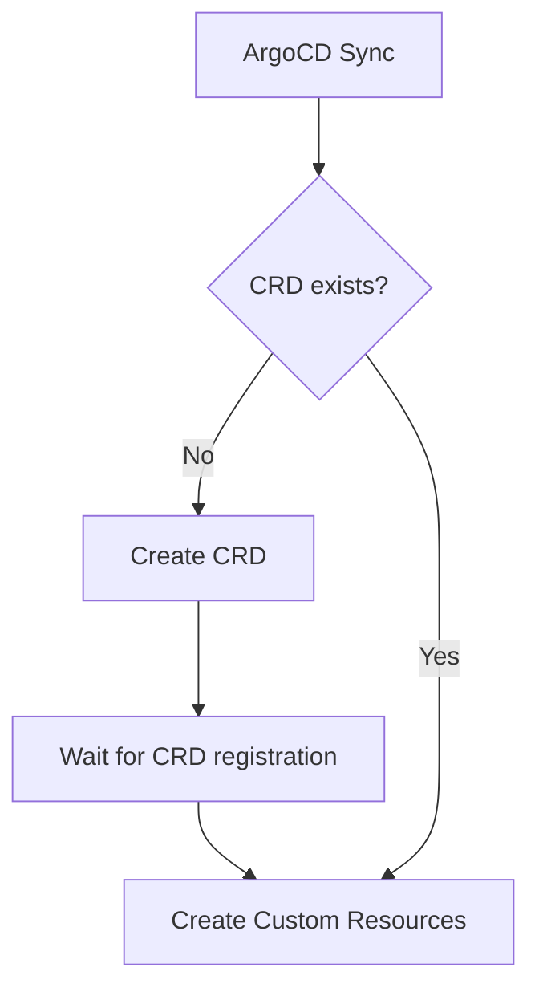

# How to Deploy Custom Resource Definitions with ArgoCD

Author: [nawazdhandala](https://github.com/nawazdhandala)

Tags: ArgoCD, GitOps, Kubernetes, CRD, Custom Resource

Description: Learn how to deploy Custom Resource Definitions and their instances with ArgoCD, including sync ordering, health checks, and handling CRD lifecycle in GitOps workflows.

---

Custom Resource Definitions (CRDs) extend Kubernetes with new resource types. Operators like cert-manager, Prometheus Operator, and Istio all use CRDs. Deploying CRDs through ArgoCD requires careful handling because CRDs must exist before any custom resources (CRs) that use them can be created. Getting the ordering wrong leads to sync failures.

## The CRD Chicken-and-Egg Problem

The core challenge is ordering. Consider deploying cert-manager: you need the CRD for `Certificate` to exist before you can create a `Certificate` resource. If ArgoCD tries to sync both at the same time, the CR creation fails because the CRD has not been registered yet.



## Strategy 1: Sync Waves

The simplest approach is using ArgoCD sync waves to ensure CRDs are created first:

```yaml
# crds/certificate-crd.yaml
apiVersion: apiextensions.k8s.io/v1
kind: CustomResourceDefinition
metadata:
  name: certificates.cert-manager.io
  annotations:
    argocd.argoproj.io/sync-wave: "-5"  # Create early
spec:
  group: cert-manager.io
  names:
    kind: Certificate
    listKind: CertificateList
    plural: certificates
    singular: certificate
  scope: Namespaced
  versions:
    - name: v1
      served: true
      storage: true
      schema:
        openAPIV3Schema:
          type: object
          # ... schema definition
```

Then your custom resources use a later sync wave:

```yaml
# resources/certificate.yaml
apiVersion: cert-manager.io/v1
kind: Certificate
metadata:
  name: myapp-tls
  annotations:
    argocd.argoproj.io/sync-wave: "0"  # Created after CRDs
spec:
  secretName: myapp-tls-secret
  issuerRef:
    name: letsencrypt-prod
    kind: ClusterIssuer
  commonName: myapp.example.com
  dnsNames:
    - myapp.example.com
```

## Strategy 2: Separate Applications for CRDs and CRs

A more robust approach is to split CRDs and their custom resources into separate ArgoCD Applications. This keeps the CRD lifecycle independent:

```yaml
# Application for CRDs
apiVersion: argoproj.io/v1alpha1
kind: Application
metadata:
  name: cert-manager-crds
  namespace: argocd
  annotations:
    argocd.argoproj.io/sync-wave: "-1"
spec:
  project: default
  source:
    repoURL: https://github.com/myorg/gitops
    targetRevision: main
    path: platform/cert-manager-crds
  destination:
    server: https://kubernetes.default.svc
  syncPolicy:
    automated:
      prune: false  # Never auto-delete CRDs
      selfHeal: true
    syncOptions:
      - Replace=true  # Replace CRDs instead of patching
---
# Application for cert-manager and its resources
apiVersion: argoproj.io/v1alpha1
kind: Application
metadata:
  name: cert-manager
  namespace: argocd
  annotations:
    argocd.argoproj.io/sync-wave: "0"
spec:
  project: default
  source:
    repoURL: https://github.com/myorg/gitops
    targetRevision: main
    path: platform/cert-manager
  destination:
    server: https://kubernetes.default.svc
    namespace: cert-manager
  syncPolicy:
    automated:
      prune: true
      selfHeal: true
```

## Strategy 3: ServerSideApply for Large CRDs

Some CRDs are very large (Istio CRDs, for example). Standard `kubectl apply` may fail with annotation size limits. Use server-side apply:

```yaml
spec:
  syncPolicy:
    syncOptions:
      - ServerSideApply=true
```

Or set it per-resource:

```yaml
apiVersion: apiextensions.k8s.io/v1
kind: CustomResourceDefinition
metadata:
  name: virtualservices.networking.istio.io
  annotations:
    argocd.argoproj.io/sync-options: ServerSideApply=true
```

## CRD Health Checks

ArgoCD checks if CRDs are healthy by verifying they are in the `Established` condition. You can see this in the ArgoCD UI. A CRD is considered:

- **Healthy**: When `Established` condition is True
- **Progressing**: While being created
- **Degraded**: If `NamesAccepted` condition is False (name conflict)

For custom resources, ArgoCD has built-in health checks for common CRDs (cert-manager, Argo Rollouts, etc.). For your own CRDs, define custom health checks:

```yaml
# In argocd-cm ConfigMap
data:
  resource.customizations.health.myorg.io_MyResource: |
    hs = {}
    if obj.status ~= nil then
      if obj.status.phase == "Ready" then
        hs.status = "Healthy"
        hs.message = obj.status.message or "Resource is ready"
      elseif obj.status.phase == "Failed" then
        hs.status = "Degraded"
        hs.message = obj.status.message or "Resource failed"
      else
        hs.status = "Progressing"
        hs.message = obj.status.message or "Resource is being processed"
      end
    else
      hs.status = "Progressing"
      hs.message = "Waiting for status"
    end
    return hs
```

## Deploying Operators that Include CRDs

Most operators bundle CRDs with their installation. When deploying operators through Helm charts in ArgoCD, you need to handle CRD installation:

```yaml
apiVersion: argoproj.io/v1alpha1
kind: Application
metadata:
  name: prometheus-operator
  namespace: argocd
spec:
  project: default
  source:
    repoURL: https://prometheus-community.github.io/helm-charts
    chart: kube-prometheus-stack
    targetRevision: 55.0.0
    helm:
      # Helm charts often have a flag to skip CRD installation
      # if you manage CRDs separately
      values: |
        crds:
          enabled: true
  destination:
    server: https://kubernetes.default.svc
    namespace: monitoring
  syncPolicy:
    automated:
      prune: true
      selfHeal: true
    syncOptions:
      - ServerSideApply=true  # Needed for large CRDs
```

## Protecting CRDs from Deletion

CRD deletion cascades to all custom resources of that type. This is extremely dangerous. Always protect CRDs:

```yaml
apiVersion: apiextensions.k8s.io/v1
kind: CustomResourceDefinition
metadata:
  name: certificates.cert-manager.io
  annotations:
    # Prevent ArgoCD from deleting this CRD
    argocd.argoproj.io/sync-options: Prune=false
  # Add a finalizer as extra protection
  finalizers:
    - customresourcecleanup.apiextensions.k8s.io
```

You can also configure this at the Application level:

```yaml
spec:
  syncPolicy:
    automated:
      prune: false  # Disable pruning entirely for CRD applications
```

## Handling CRD Version Upgrades

CRDs support multiple versions with conversion webhooks. When upgrading a CRD version through ArgoCD:

```yaml
apiVersion: apiextensions.k8s.io/v1
kind: CustomResourceDefinition
metadata:
  name: myresources.myorg.io
spec:
  group: myorg.io
  names:
    kind: MyResource
    plural: myresources
  scope: Namespaced
  versions:
    - name: v1
      served: true
      storage: false  # Old version, still served but not stored
      schema:
        openAPIV3Schema:
          type: object
          properties:
            spec:
              type: object
              properties:
                replicas:
                  type: integer
    - name: v2
      served: true
      storage: true   # New version, used for storage
      schema:
        openAPIV3Schema:
          type: object
          properties:
            spec:
              type: object
              properties:
                replicas:
                  type: integer
                scaling:
                  type: object
  conversion:
    strategy: Webhook
    webhook:
      conversionReviewVersions: ["v1"]
      clientConfig:
        service:
          name: myresource-conversion
          namespace: default
          path: /convert
```

## Ignoring CRD Differences

CRDs often have fields added by Kubernetes that are not in your Git manifests. Tell ArgoCD to ignore these:

```yaml
spec:
  ignoreDifferences:
    - group: apiextensions.k8s.io
      kind: CustomResourceDefinition
      jqPathExpressions:
        - .spec.versions[].schema.openAPIV3Schema
        - .status
```

For custom resources, ignore operator-managed status fields:

```yaml
spec:
  ignoreDifferences:
    - group: cert-manager.io
      kind: Certificate
      jqPathExpressions:
        - .status
```

## Deploying Your Own CRD with ArgoCD

Here is a complete example of deploying a custom CRD and its resources:

```yaml
# Directory structure:
# apps/my-operator/
#   crd.yaml
#   operator-deployment.yaml
#   rbac.yaml
#   example-resource.yaml

# crd.yaml
apiVersion: apiextensions.k8s.io/v1
kind: CustomResourceDefinition
metadata:
  name: backups.myorg.io
  annotations:
    argocd.argoproj.io/sync-wave: "-2"
    argocd.argoproj.io/sync-options: Prune=false
spec:
  group: myorg.io
  names:
    kind: Backup
    plural: backups
    singular: backup
    shortNames: ["bk"]
  scope: Namespaced
  versions:
    - name: v1
      served: true
      storage: true
      schema:
        openAPIV3Schema:
          type: object
          properties:
            spec:
              type: object
              required: ["schedule", "target"]
              properties:
                schedule:
                  type: string
                target:
                  type: string
                retention:
                  type: integer
                  default: 7
      subresources:
        status: {}
      additionalPrinterColumns:
        - name: Schedule
          type: string
          jsonPath: .spec.schedule
        - name: Target
          type: string
          jsonPath: .spec.target
        - name: Status
          type: string
          jsonPath: .status.phase
```

## Summary

Deploying CRDs with ArgoCD requires attention to sync ordering, protection against accidental deletion, and proper health checks for custom resources. Use sync waves or separate Applications to ensure CRDs exist before their instances. Always disable pruning for CRDs to prevent cascading deletion of all custom resources. Use server-side apply for large CRDs, and define custom health checks so ArgoCD accurately reports the status of your custom resources.
