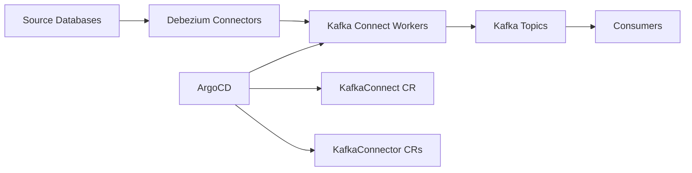

# How to Deploy Debezium CDC Platform with ArgoCD

Author: [nawazdhandala](https://github.com/nawazdhandala)

Tags: ArgoCD, GitOps, Kubernetes, Debezium, Change Data Capture

Description: A practical guide to deploying Debezium change data capture platform on Kubernetes using ArgoCD for GitOps-managed real-time data integration from databases to streaming platforms.

---

Debezium is the leading open-source change data capture (CDC) platform. It captures row-level changes from databases like PostgreSQL, MySQL, and MongoDB and streams them to Kafka in real time. Deploying Debezium on Kubernetes with ArgoCD means your CDC connectors, Kafka Connect workers, and configuration are all managed declaratively through Git.

This guide covers deploying the full Debezium stack using Strimzi's Kafka Connect integration, managed by ArgoCD.

## Architecture



Debezium runs as plugins inside Kafka Connect. Strimzi's KafkaConnect and KafkaConnector custom resources let you manage the entire stack declaratively.

## Prerequisites

You need a Kafka cluster managed by Strimzi. If you do not have one, check out our guide on [deploying Apache Kafka with ArgoCD](https://oneuptime.com/blog/post/2026-02-26-argocd-deploy-apache-kafka/view).

## Step 1: Build a Custom Kafka Connect Image

Debezium connectors need to be packaged into a Kafka Connect image. Use the Strimzi Kafka Connect build feature:

```yaml
# debezium/production/kafka-connect.yaml
apiVersion: kafka.strimzi.io/v1beta2
kind: KafkaConnect
metadata:
  name: debezium-connect
  labels:
    team: data-engineering
  annotations:
    strimzi.io/use-connector-resources: "true"
spec:
  version: 3.7.0
  replicas: 3
  bootstrapServers: production-kafka-kafka-bootstrap:9092

  build:
    output:
      type: docker
      image: myregistry/debezium-connect:latest
      pushSecret: registry-credentials
    plugins:
      - name: debezium-postgres
        artifacts:
          - type: maven
            group: io.debezium
            artifact: debezium-connector-postgres
            version: 2.5.0
      - name: debezium-mysql
        artifacts:
          - type: maven
            group: io.debezium
            artifact: debezium-connector-mysql
            version: 2.5.0
      - name: debezium-mongodb
        artifacts:
          - type: maven
            group: io.debezium
            artifact: debezium-connector-mongodb
            version: 2.5.0
      - name: apicurio-converter
        artifacts:
          - type: maven
            group: io.apicurio
            artifact: apicurio-registry-distro-connect-converter
            version: 2.5.8

  config:
    # Distributed mode settings
    group.id: debezium-connect
    offset.storage.topic: debezium-connect-offsets
    offset.storage.replication.factor: 3
    config.storage.topic: debezium-connect-configs
    config.storage.replication.factor: 3
    status.storage.topic: debezium-connect-status
    status.storage.replication.factor: 3

    # Converter settings
    key.converter: org.apache.kafka.connect.json.JsonConverter
    value.converter: org.apache.kafka.connect.json.JsonConverter
    key.converter.schemas.enable: false
    value.converter.schemas.enable: true

    # Error handling
    errors.tolerance: all
    errors.deadletterqueue.topic.name: debezium-dlq
    errors.deadletterqueue.topic.replication.factor: 3
    errors.deadletterqueue.context.headers.enable: true

    # Performance
    offset.flush.interval.ms: 10000
    producer.compression.type: lz4

  resources:
    requests:
      cpu: "2"
      memory: "4Gi"
    limits:
      cpu: "4"
      memory: "8Gi"

  jvmOptions:
    -Xms: "2g"
    -Xmx: "4g"

  metricsConfig:
    type: jmxPrometheusExporter
    valueFrom:
      configMapKeyRef:
        name: connect-metrics
        key: metrics-config.yml

  template:
    pod:
      affinity:
        podAntiAffinity:
          preferredDuringSchedulingIgnoredDuringExecution:
            - weight: 100
              podAffinityTerm:
                labelSelector:
                  matchExpressions:
                    - key: strimzi.io/name
                      operator: In
                      values:
                        - debezium-connect
                topologyKey: kubernetes.io/hostname
```

The `strimzi.io/use-connector-resources: "true"` annotation tells Strimzi to manage connectors through KafkaConnector CRs instead of the REST API.

## Step 2: Define CDC Connectors

Now define your Debezium connectors as Kubernetes resources:

```yaml
# debezium/production/connectors/postgres-orders.yaml
apiVersion: kafka.strimzi.io/v1beta2
kind: KafkaConnector
metadata:
  name: orders-db-connector
  labels:
    strimzi.io/cluster: debezium-connect
    source: orders-database
    team: commerce
spec:
  class: io.debezium.connector.postgresql.PostgresConnector
  tasksMax: 1
  config:
    # Connection
    database.hostname: orders-db.production.svc.cluster.local
    database.port: "5432"
    database.user: debezium
    database.password: ${file:/opt/kafka/external-configuration/db-credentials/orders-password}
    database.dbname: orders

    # Naming
    topic.prefix: cdc.orders

    # Capture settings
    plugin.name: pgoutput
    slot.name: debezium_orders
    publication.name: debezium_orders_pub

    # Table selection
    table.include.list: "public.orders,public.order_items,public.customers"
    column.exclude.list: "public.customers.ssn,public.customers.credit_card"

    # Snapshot settings
    snapshot.mode: initial
    snapshot.max.threads: "4"

    # Transforms
    transforms: unwrap,route
    transforms.unwrap.type: io.debezium.transforms.ExtractNewRecordState
    transforms.unwrap.drop.tombstones: "false"
    transforms.unwrap.delete.handling.mode: rewrite
    transforms.route.type: org.apache.kafka.connect.transforms.RegexRouter
    transforms.route.regex: "cdc\\.orders\\.(.*)"
    transforms.route.replacement: "cdc.orders.$1"

    # Heartbeat
    heartbeat.interval.ms: "10000"
    heartbeat.action.query: "INSERT INTO debezium_heartbeat (last_heartbeat) VALUES (NOW()) ON CONFLICT (id) DO UPDATE SET last_heartbeat = NOW()"

    # Error handling
    errors.tolerance: all
    errors.deadletterqueue.topic.name: debezium-dlq
    errors.deadletterqueue.context.headers.enable: "true"
```

```yaml
# debezium/production/connectors/mysql-inventory.yaml
apiVersion: kafka.strimzi.io/v1beta2
kind: KafkaConnector
metadata:
  name: inventory-db-connector
  labels:
    strimzi.io/cluster: debezium-connect
    source: inventory-database
    team: warehouse
spec:
  class: io.debezium.connector.mysql.MySqlConnector
  tasksMax: 1
  config:
    database.hostname: inventory-db.production.svc.cluster.local
    database.port: "3306"
    database.user: debezium
    database.password: ${file:/opt/kafka/external-configuration/db-credentials/inventory-password}
    database.server.id: "10001"
    topic.prefix: cdc.inventory
    database.include.list: inventory
    table.include.list: "inventory.products,inventory.warehouses,inventory.stock_levels"
    schema.history.internal.kafka.bootstrap.servers: production-kafka-kafka-bootstrap:9092
    schema.history.internal.kafka.topic: schema-changes.inventory
    include.schema.changes: "true"
    snapshot.mode: initial
```

## Step 3: Manage Database Credentials

Store database passwords as Kubernetes secrets and mount them into Connect:

```yaml
# debezium/production/secrets.yaml
apiVersion: v1
kind: Secret
metadata:
  name: db-credentials
type: Opaque
stringData:
  orders-password: "changeme"
  inventory-password: "changeme"
```

Reference the secret in your KafkaConnect resource:

```yaml
spec:
  externalConfiguration:
    volumes:
      - name: db-credentials
        secret:
          secretName: db-credentials
```

In production, use Sealed Secrets or External Secrets Operator to manage these credentials securely.

## Step 4: The ArgoCD Application

```yaml
apiVersion: argoproj.io/v1alpha1
kind: Application
metadata:
  name: debezium-platform
  namespace: argocd
  labels:
    team: data-engineering
    component: cdc
spec:
  project: data-infrastructure
  source:
    repoURL: https://github.com/myorg/data-platform.git
    targetRevision: main
    path: debezium/production
  destination:
    server: https://kubernetes.default.svc
    namespace: kafka
  syncPolicy:
    automated:
      prune: false  # Don't auto-delete connectors
      selfHeal: true
    syncOptions:
      - RespectIgnoreDifferences=true
    retry:
      limit: 3
      backoff:
        duration: 30s
        factor: 2
        maxDuration: 5m
  ignoreDifferences:
    - group: kafka.strimzi.io
      kind: KafkaConnect
      jsonPointers:
        - /status
    - group: kafka.strimzi.io
      kind: KafkaConnector
      jsonPointers:
        - /status
```

Setting `prune: false` is critical. Deleting a KafkaConnector CR stops the connector and can leave the replication slot orphaned on the source database.

## Step 5: Monitoring Debezium

Deploy metrics collection for Debezium:

```yaml
# debezium/production/monitoring/connect-metrics.yaml
apiVersion: v1
kind: ConfigMap
metadata:
  name: connect-metrics
data:
  metrics-config.yml: |
    lowercaseOutputName: true
    lowercaseOutputLabelNames: true
    rules:
      # Connector metrics
      - pattern: "kafka.connect<type=connector-metrics, connector=(.+)><>(.+):"
        name: kafka_connect_connector_$2
        labels:
          connector: "$1"
      # Task metrics
      - pattern: "kafka.connect<type=connector-task-metrics, connector=(.+), task=(.+)><>(.+):"
        name: kafka_connect_task_$3
        labels:
          connector: "$1"
          task: "$2"
      # Debezium specific metrics
      - pattern: "debezium.([^:]+)<type=connector-metrics, server=(.+), task=(.+), context=(.+)><>(.+)"
        name: debezium_$1_$5
        labels:
          connector: "$2"
          task: "$3"
          context: "$4"
---
apiVersion: monitoring.coreos.com/v1
kind: ServiceMonitor
metadata:
  name: debezium-metrics
spec:
  selector:
    matchLabels:
      strimzi.io/name: debezium-connect
  endpoints:
    - port: tcp-prometheus
      path: /metrics
      interval: 30s
```

Key metrics to watch:

- `debezium_postgres_milliseconds_since_last_event` - replication lag
- `debezium_postgres_total_number_of_events_seen` - throughput
- `kafka_connect_task_status` - connector health
- Dead letter queue topic message count

## Handling Connector Updates

When you need to change a connector configuration, update the KafkaConnector YAML in Git:

```yaml
# Example: Adding a new table to capture
table.include.list: "public.orders,public.order_items,public.customers,public.payments"
```

ArgoCD syncs the change, and Strimzi updates the connector. For schema changes that affect the snapshot, you may need to reset the connector offset.

## Best Practices

1. **Always exclude sensitive columns** - Use `column.exclude.list` to prevent PII from flowing into Kafka.

2. **Set up dead letter queues** - Configure DLQ for every connector so failed records do not block the pipeline.

3. **Monitor replication lag** - Alert on `milliseconds_since_last_event` exceeding your SLA threshold.

4. **Use heartbeats** - Enable heartbeat queries to detect stalled connectors early, especially for tables with infrequent changes.

5. **Disable auto-prune** in ArgoCD - Deleting a connector resource can orphan database replication slots, leading to WAL accumulation on the source database.

6. **Version your connectors** - Pin Debezium connector versions explicitly. Major version upgrades can change the message format.

Deploying Debezium with ArgoCD gives you a fully GitOps-managed CDC platform where every connector configuration, table selection, and transformation is tracked in Git. This is critical for data governance and compliance.
