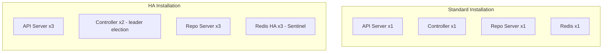

# How to Deploy ArgoCD in High Availability Mode

Author: [nawazdhandala](https://github.com/nawazdhandala)

Tags: ArgoCD, GitOps, Kubernetes, High Availability, Production

Description: Step-by-step guide to deploying ArgoCD in high availability mode with multiple replicas, Redis HA, and production-ready configurations for zero-downtime GitOps.

---

A single-instance ArgoCD deployment is fine for development but creates a dangerous single point of failure in production. When the single ArgoCD pod goes down, your entire GitOps pipeline stops. High availability mode runs multiple replicas of each component so that no single failure takes down the system. This guide walks you through deploying ArgoCD in HA mode from scratch.

## HA vs Non-HA Installation

The standard ArgoCD installation runs one replica of each component. The HA installation runs multiple replicas with leader election, load balancing, and Redis clustering:



## Method 1: Install HA with Official Manifests

ArgoCD provides dedicated HA manifests:

```bash
# Create the argocd namespace
kubectl create namespace argocd

# Install HA manifests
kubectl apply -n argocd \
  -f https://raw.githubusercontent.com/argoproj/argo-cd/stable/manifests/ha/install.yaml

# Verify all pods are running
kubectl get pods -n argocd
```

The HA manifests include:
- 3 API Server replicas with a Service for load balancing
- 2 Application Controller replicas with leader election
- 3 Repo Server replicas
- 3 Redis replicas with Sentinel for automatic failover
- PodDisruptionBudgets for all components
- Anti-affinity rules to spread pods across nodes

## Method 2: Install HA with Helm

Helm gives you more control over the HA configuration:

```bash
# Add the ArgoCD Helm repository
helm repo add argo https://argoproj.github.io/argo-helm
helm repo update
```

Create a comprehensive HA values file:

```yaml
# argocd-ha-values.yaml

# Global HA settings
global:
  topologySpreadConstraints:
    - maxSkew: 1
      topologyKey: kubernetes.io/hostname
      whenUnsatisfiable: DoNotSchedule

# API Server - Stateless, scale horizontally
server:
  replicas: 3
  autoscaling:
    enabled: true
    minReplicas: 3
    maxReplicas: 7
    targetCPUUtilizationPercentage: 70
    targetMemoryUtilizationPercentage: 80
  resources:
    requests:
      cpu: 200m
      memory: 256Mi
    limits:
      cpu: "1"
      memory: 512Mi
  pdb:
    enabled: true
    minAvailable: 2
  # Spread across nodes
  affinity:
    podAntiAffinity:
      preferredDuringSchedulingIgnoredDuringExecution:
        - weight: 100
          podAffinityTerm:
            labelSelector:
              matchLabels:
                app.kubernetes.io/name: argocd-server
            topologyKey: kubernetes.io/hostname

# Application Controller - Needs leader election
controller:
  replicas: 2
  resources:
    requests:
      cpu: 500m
      memory: 1Gi
    limits:
      cpu: "2"
      memory: 4Gi
  pdb:
    enabled: true
    minAvailable: 1
  env:
    # Enable controller sharding for large deployments
    - name: ARGOCD_CONTROLLER_REPLICAS
      value: "2"

# Repo Server - Stateless, scale horizontally
repoServer:
  replicas: 3
  autoscaling:
    enabled: true
    minReplicas: 3
    maxReplicas: 7
    targetCPUUtilizationPercentage: 70
  resources:
    requests:
      cpu: 200m
      memory: 256Mi
    limits:
      cpu: "1"
      memory: 1Gi
  pdb:
    enabled: true
    minAvailable: 2

# Redis HA
redis-ha:
  enabled: true
  replicas: 3
  haproxy:
    enabled: true
    replicas: 3
  redis:
    resources:
      requests:
        cpu: 200m
        memory: 256Mi
      limits:
        cpu: 500m
        memory: 512Mi
  sentinel:
    enabled: true
  persistentVolume:
    enabled: true
    size: 10Gi
  topologySpreadConstraints:
    - maxSkew: 1
      topologyKey: kubernetes.io/hostname
      whenUnsatisfiable: DoNotSchedule

# Disable the single-instance Redis
redis:
  enabled: false

# ApplicationSet Controller
applicationSet:
  replicas: 2
  pdb:
    enabled: true
    minAvailable: 1

# Notifications Controller
notifications:
  replicas: 1
```

Install with Helm:

```bash
helm install argocd argo/argo-cd \
  --namespace argocd \
  --create-namespace \
  --values argocd-ha-values.yaml \
  --version 7.7.5
```

## Verify the HA Deployment

After installation, verify all components are running with the correct replica counts:

```bash
# Check all pods
kubectl get pods -n argocd -o wide

# Expected output (abbreviated):
# argocd-server-7f5d8b6c4-abc12          Running   node-1
# argocd-server-7f5d8b6c4-def34          Running   node-2
# argocd-server-7f5d8b6c4-ghi56          Running   node-3
# argocd-application-controller-0         Running   node-1
# argocd-application-controller-1         Running   node-2
# argocd-repo-server-6b4d5c8e7-jkl78     Running   node-3
# argocd-repo-server-6b4d5c8e7-mno90     Running   node-1
# argocd-repo-server-6b4d5c8e7-pqr12     Running   node-2
# argocd-redis-ha-server-0               Running   node-1
# argocd-redis-ha-server-1               Running   node-2
# argocd-redis-ha-server-2               Running   node-3
# argocd-redis-ha-haproxy-stu34          Running   node-1
# argocd-redis-ha-haproxy-vwx56          Running   node-2
# argocd-redis-ha-haproxy-yza78          Running   node-3

# Verify PodDisruptionBudgets
kubectl get pdb -n argocd

# Check leader election for the controller
kubectl get lease -n argocd
```

## Configure Leader Election

The application controller uses Kubernetes lease-based leader election. Only one controller instance actively reconciles at a time, while others stand by:

```bash
# Check which controller is the leader
kubectl get lease argocd-application-controller -n argocd -o yaml

# The holderIdentity field shows the current leader
```

If you need to adjust leader election settings:

```yaml
# In argocd-cmd-params-cm ConfigMap
apiVersion: v1
kind: ConfigMap
metadata:
  name: argocd-cmd-params-cm
  namespace: argocd
data:
  # Leader election settings
  controller.leader.election.lease.duration: "30s"
  controller.leader.election.renew.deadline: "15s"
  controller.leader.election.retry.period: "5s"
```

## Configure Ingress for HA

With multiple API server replicas, configure your ingress to load balance across them:

```yaml
apiVersion: networking.k8s.io/v1
kind: Ingress
metadata:
  name: argocd-server-ingress
  namespace: argocd
  annotations:
    nginx.ingress.kubernetes.io/backend-protocol: "HTTPS"
    nginx.ingress.kubernetes.io/ssl-passthrough: "true"
    # Session affinity for the UI
    nginx.ingress.kubernetes.io/affinity: "cookie"
    nginx.ingress.kubernetes.io/affinity-mode: "persistent"
spec:
  ingressClassName: nginx
  rules:
    - host: argocd.example.com
      http:
        paths:
          - path: /
            pathType: Prefix
            backend:
              service:
                name: argocd-server
                port:
                  number: 443
  tls:
    - hosts:
        - argocd.example.com
      secretName: argocd-tls
```

## Persistent Storage for Redis HA

Redis HA needs persistent storage to survive pod restarts:

```yaml
# Storage class for Redis persistence
apiVersion: storage.k8s.io/v1
kind: StorageClass
metadata:
  name: argocd-redis-storage
provisioner: kubernetes.io/aws-ebs
parameters:
  type: gp3
  iopsPerGB: "10"
  encrypted: "true"
volumeBindingMode: WaitForFirstConsumer
reclaimPolicy: Retain
```

## Health Check After Deployment

Run a comprehensive health check:

```bash
# Retrieve admin password
ADMIN_PASS=$(kubectl get secret argocd-initial-admin-secret -n argocd \
  -o jsonpath='{.data.password}' | base64 -d)

# Login via CLI
argocd login argocd.example.com --username admin --password "$ADMIN_PASS"

# Check system health
argocd admin dashboard  # Opens the UI

# Verify cluster connections
argocd cluster list

# Create a test application
argocd app create ha-test \
  --repo https://github.com/argoproj/argocd-example-apps \
  --path guestbook \
  --dest-server https://kubernetes.default.svc \
  --dest-namespace default

# Sync and verify
argocd app sync ha-test
argocd app get ha-test
```

## Test HA by Simulating Failure

Verify that the system survives component failures:

```bash
# Delete an API server pod - UI should remain accessible
kubectl delete pod -n argocd -l app.kubernetes.io/name=argocd-server --field-selector=status.phase=Running | head -1

# Delete the controller leader - another instance should take over
kubectl delete pod -n argocd -l app.kubernetes.io/name=argocd-application-controller --field-selector=status.phase=Running | head -1

# Check that sync still works
argocd app sync ha-test

# Verify leader election happened
kubectl get lease argocd-application-controller -n argocd -o jsonpath='{.spec.holderIdentity}'
```

Deploying ArgoCD in HA mode is essential for any production environment. The Helm approach gives you the most flexibility, but the official HA manifests work well for straightforward deployments. For ongoing monitoring of your HA setup, see our guide on [monitoring ArgoCD component health](https://oneuptime.com/blog/post/2026-02-26-argocd-monitor-component-health/view).
