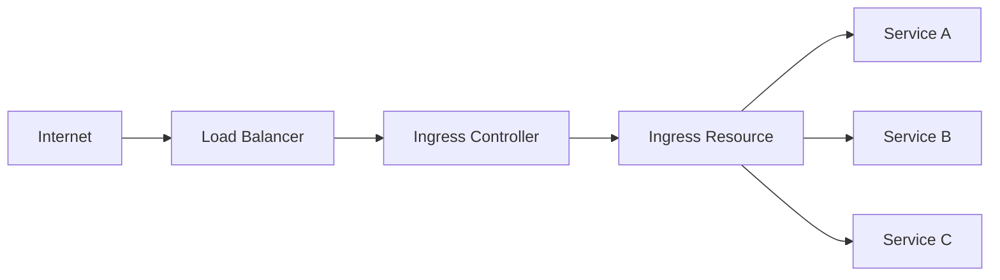

# How to Deploy Ingress Resources with ArgoCD

Author: [nawazdhandala](https://github.com/nawazdhandala)

Tags: ArgoCD, GitOps, Kubernetes, Ingress, Networking

Description: Learn how to deploy and manage Kubernetes Ingress resources with ArgoCD, including TLS configuration, path routing, multi-host setups, and ingress controller integration.

---

Ingress resources expose HTTP and HTTPS routes from outside the cluster to services within the cluster. They provide load balancing, SSL termination, and name-based virtual hosting. Managing Ingress resources through ArgoCD means your entire routing configuration is version-controlled and consistently deployed across environments.

## Ingress Architecture

Ingress resources alone do nothing. They need an Ingress controller that watches for Ingress resources and configures the underlying load balancer:



Popular Ingress controllers include NGINX, Traefik, HAProxy, and cloud-specific options like AWS ALB and GCE.

## Deploying the Ingress Controller Through ArgoCD

First, deploy the Ingress controller itself using ArgoCD:

```yaml
# platform/ingress-controller/application.yaml
apiVersion: argoproj.io/v1alpha1
kind: Application
metadata:
  name: ingress-nginx
  namespace: argocd
  annotations:
    argocd.argoproj.io/sync-wave: "-5"  # Deploy before applications
spec:
  project: default
  source:
    repoURL: https://kubernetes.github.io/ingress-nginx
    chart: ingress-nginx
    targetRevision: 4.9.0
    helm:
      values: |
        controller:
          replicaCount: 3
          service:
            type: LoadBalancer
            annotations:
              service.beta.kubernetes.io/aws-load-balancer-type: nlb
              service.beta.kubernetes.io/aws-load-balancer-scheme: internet-facing
          metrics:
            enabled: true
          resources:
            requests:
              cpu: 200m
              memory: 256Mi
            limits:
              cpu: 500m
              memory: 512Mi
  destination:
    server: https://kubernetes.default.svc
    namespace: ingress-nginx
  syncPolicy:
    automated:
      prune: true
      selfHeal: true
    syncOptions:
      - CreateNamespace=true
```

## Basic Ingress Resource

Here is a simple Ingress that routes traffic to a web application:

```yaml
# apps/myapp/ingress.yaml
apiVersion: networking.k8s.io/v1
kind: Ingress
metadata:
  name: myapp-ingress
  namespace: production
  annotations:
    nginx.ingress.kubernetes.io/rewrite-target: /
spec:
  ingressClassName: nginx
  rules:
    - host: myapp.example.com
      http:
        paths:
          - path: /
            pathType: Prefix
            backend:
              service:
                name: myapp
                port:
                  number: 80
```

## TLS Configuration

Add TLS termination with a certificate stored as a Kubernetes Secret:

```yaml
apiVersion: networking.k8s.io/v1
kind: Ingress
metadata:
  name: myapp-ingress
  namespace: production
  annotations:
    nginx.ingress.kubernetes.io/ssl-redirect: "true"
    nginx.ingress.kubernetes.io/force-ssl-redirect: "true"
spec:
  ingressClassName: nginx
  tls:
    - hosts:
        - myapp.example.com
      secretName: myapp-tls-secret
  rules:
    - host: myapp.example.com
      http:
        paths:
          - path: /
            pathType: Prefix
            backend:
              service:
                name: myapp
                port:
                  number: 80
```

### Automated TLS with cert-manager

The better approach is to use cert-manager for automatic certificate provisioning:

```yaml
apiVersion: networking.k8s.io/v1
kind: Ingress
metadata:
  name: myapp-ingress
  namespace: production
  annotations:
    # cert-manager automatically creates and renews the certificate
    cert-manager.io/cluster-issuer: letsencrypt-prod
    nginx.ingress.kubernetes.io/ssl-redirect: "true"
spec:
  ingressClassName: nginx
  tls:
    - hosts:
        - myapp.example.com
      secretName: myapp-tls-auto  # cert-manager creates this secret
  rules:
    - host: myapp.example.com
      http:
        paths:
          - path: /
            pathType: Prefix
            backend:
              service:
                name: myapp
                port:
                  number: 80
```

Deploy the ClusterIssuer through ArgoCD:

```yaml
apiVersion: cert-manager.io/v1
kind: ClusterIssuer
metadata:
  name: letsencrypt-prod
  annotations:
    argocd.argoproj.io/sync-wave: "-3"
spec:
  acme:
    server: https://acme-v02.api.letsencrypt.org/directory
    email: admin@example.com
    privateKeySecretRef:
      name: letsencrypt-prod-key
    solvers:
      - http01:
          ingress:
            class: nginx
```

## Path-Based Routing

Route different paths to different services:

```yaml
apiVersion: networking.k8s.io/v1
kind: Ingress
metadata:
  name: myplatform-ingress
  namespace: production
spec:
  ingressClassName: nginx
  tls:
    - hosts:
        - platform.example.com
      secretName: platform-tls
  rules:
    - host: platform.example.com
      http:
        paths:
          - path: /api
            pathType: Prefix
            backend:
              service:
                name: api-service
                port:
                  number: 8080
          - path: /auth
            pathType: Prefix
            backend:
              service:
                name: auth-service
                port:
                  number: 8080
          - path: /ws
            pathType: Prefix
            backend:
              service:
                name: websocket-service
                port:
                  number: 8080
          - path: /
            pathType: Prefix
            backend:
              service:
                name: frontend
                port:
                  number: 80
```

## Multi-Host Ingress

Serve multiple domains from a single Ingress:

```yaml
apiVersion: networking.k8s.io/v1
kind: Ingress
metadata:
  name: multi-host-ingress
  namespace: production
spec:
  ingressClassName: nginx
  tls:
    - hosts:
        - app.example.com
        - api.example.com
        - admin.example.com
      secretName: wildcard-tls
  rules:
    - host: app.example.com
      http:
        paths:
          - path: /
            pathType: Prefix
            backend:
              service:
                name: webapp
                port:
                  number: 80
    - host: api.example.com
      http:
        paths:
          - path: /
            pathType: Prefix
            backend:
              service:
                name: api-gateway
                port:
                  number: 8080
    - host: admin.example.com
      http:
        paths:
          - path: /
            pathType: Prefix
            backend:
              service:
                name: admin-panel
                port:
                  number: 80
```

## Common NGINX Ingress Annotations

NGINX Ingress controller supports many annotations for fine-tuning behavior:

```yaml
apiVersion: networking.k8s.io/v1
kind: Ingress
metadata:
  name: myapp-ingress
  annotations:
    # Rate limiting
    nginx.ingress.kubernetes.io/limit-rps: "50"
    nginx.ingress.kubernetes.io/limit-burst-multiplier: "5"

    # Timeouts
    nginx.ingress.kubernetes.io/proxy-read-timeout: "60"
    nginx.ingress.kubernetes.io/proxy-send-timeout: "60"
    nginx.ingress.kubernetes.io/proxy-connect-timeout: "10"

    # Body size
    nginx.ingress.kubernetes.io/proxy-body-size: "50m"

    # CORS
    nginx.ingress.kubernetes.io/enable-cors: "true"
    nginx.ingress.kubernetes.io/cors-allow-origin: "https://frontend.example.com"
    nginx.ingress.kubernetes.io/cors-allow-methods: "GET, POST, PUT, DELETE, OPTIONS"

    # WebSocket support
    nginx.ingress.kubernetes.io/websocket-services: "websocket-service"
    nginx.ingress.kubernetes.io/proxy-read-timeout: "3600"
    nginx.ingress.kubernetes.io/proxy-send-timeout: "3600"

    # Custom headers
    nginx.ingress.kubernetes.io/configuration-snippet: |
      more_set_headers "X-Frame-Options: DENY";
      more_set_headers "X-Content-Type-Options: nosniff";
      more_set_headers "Strict-Transport-Security: max-age=31536000; includeSubDomains";
```

## ArgoCD Application with Sync Waves

Deploy Ingress resources after their backend services are ready:

```yaml
# Wave -1: Service
apiVersion: v1
kind: Service
metadata:
  name: myapp
  annotations:
    argocd.argoproj.io/sync-wave: "-1"
spec:
  selector:
    app: myapp
  ports:
    - port: 80
      targetPort: 8080

---
# Wave 0: Deployment
apiVersion: apps/v1
kind: Deployment
metadata:
  name: myapp
  annotations:
    argocd.argoproj.io/sync-wave: "0"

---
# Wave 1: Ingress (after service and pods are ready)
apiVersion: networking.k8s.io/v1
kind: Ingress
metadata:
  name: myapp-ingress
  annotations:
    argocd.argoproj.io/sync-wave: "1"
```

## Environment-Specific Ingress with Kustomize

Use Kustomize to adjust hostnames and annotations per environment:

```yaml
# base/ingress.yaml
apiVersion: networking.k8s.io/v1
kind: Ingress
metadata:
  name: myapp-ingress
spec:
  ingressClassName: nginx
  rules:
    - host: myapp.example.com
      http:
        paths:
          - path: /
            pathType: Prefix
            backend:
              service:
                name: myapp
                port:
                  number: 80

# overlays/staging/ingress-patch.yaml
- op: replace
  path: /spec/rules/0/host
  value: myapp.staging.example.com
- op: add
  path: /spec/tls
  value:
    - hosts:
        - myapp.staging.example.com
      secretName: staging-tls

# overlays/production/ingress-patch.yaml
- op: replace
  path: /spec/rules/0/host
  value: myapp.example.com
- op: add
  path: /spec/tls
  value:
    - hosts:
        - myapp.example.com
      secretName: production-tls
```

## Health Checks for Ingress

ArgoCD checks Ingress health by verifying the load balancer address is assigned:

```yaml
# Custom health check in argocd-cm
data:
  resource.customizations.health.networking.k8s.io_Ingress: |
    hs = {}
    if obj.status ~= nil then
      if obj.status.loadBalancer ~= nil then
        if obj.status.loadBalancer.ingress ~= nil then
          if #obj.status.loadBalancer.ingress > 0 then
            hs.status = "Healthy"
            hs.message = "Load balancer provisioned"
            return hs
          end
        end
      end
    end
    hs.status = "Progressing"
    hs.message = "Waiting for load balancer"
    return hs
```

## Ingress with AWS ALB Controller

For AWS, you might use the ALB Ingress Controller instead of NGINX:

```yaml
apiVersion: networking.k8s.io/v1
kind: Ingress
metadata:
  name: myapp-ingress
  annotations:
    kubernetes.io/ingress.class: alb
    alb.ingress.kubernetes.io/scheme: internet-facing
    alb.ingress.kubernetes.io/target-type: ip
    alb.ingress.kubernetes.io/certificate-arn: arn:aws:acm:us-east-1:123456:certificate/abc-123
    alb.ingress.kubernetes.io/listen-ports: '[{"HTTPS":443}]'
    alb.ingress.kubernetes.io/ssl-redirect: "443"
    alb.ingress.kubernetes.io/healthcheck-path: /health
    alb.ingress.kubernetes.io/group.name: production
spec:
  rules:
    - host: myapp.example.com
      http:
        paths:
          - path: /
            pathType: Prefix
            backend:
              service:
                name: myapp
                port:
                  number: 80
```

## Summary

Ingress resources managed through ArgoCD provide version-controlled, reviewable routing configuration for your cluster. Deploy the Ingress controller first using a sync wave, then deploy Ingress resources after their backend services are ready. Use cert-manager for automated TLS, Kustomize for environment-specific hostnames, and NGINX annotations for fine-grained traffic control. ArgoCD's self-healing ensures your routing never drifts from the desired state, and the Git history gives you a complete audit trail of every routing change.
