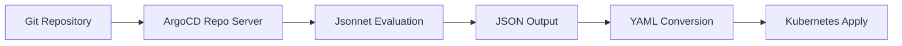

# How to Deploy Jsonnet Applications with ArgoCD

Author: [nawazdhandala](https://github.com/nawazdhandala)

Tags: ArgoCD, GitOps, Kubernetes, Jsonnet, Configuration Management

Description: Learn how to deploy Jsonnet-based applications with ArgoCD, including configuration, project setup, and practical deployment examples for Kubernetes workloads.

---

Jsonnet is a data templating language that extends JSON with variables, conditionals, loops, and functions. When paired with ArgoCD, it provides a powerful way to generate Kubernetes manifests programmatically without the overhead of Helm charts or Kustomize overlays. If you have been looking for a lightweight templating approach that keeps your configuration DRY, Jsonnet with ArgoCD is worth exploring.

## Why Use Jsonnet with ArgoCD

Jsonnet sits in a sweet spot between plain YAML and full-blown Helm charts. Here is why teams choose it:

- **No package manager needed** - Unlike Helm, there is no tiller, no release state, no chart repository to manage.
- **Pure functional language** - Every Jsonnet file evaluates to JSON (or YAML), making it predictable and testable.
- **Strong composition** - You can import, merge, and override objects cleanly using Jsonnet's `+` operator.
- **ArgoCD native support** - ArgoCD understands Jsonnet natively as a source type. No plugins required.

ArgoCD's repo server runs `jsonnet` internally to render your manifests before applying them to the cluster. This means your Git repository contains Jsonnet files, and ArgoCD handles the rendering transparently.

## Prerequisites

Before getting started, you need:

- A running Kubernetes cluster with ArgoCD installed
- A Git repository containing your Jsonnet files
- The ArgoCD CLI installed locally (optional, but helpful)

## Setting Up a Basic Jsonnet Project

Let us start with a simple Jsonnet file that generates a Kubernetes Deployment and Service. Create a file called `main.jsonnet` in your Git repository:

```jsonnet
// main.jsonnet - Generates a simple nginx deployment and service
local params = {
  name: 'nginx-app',
  namespace: 'default',
  replicas: 3,
  image: 'nginx:1.25',
  port: 80,
};

[
  // Deployment resource
  {
    apiVersion: 'apps/v1',
    kind: 'Deployment',
    metadata: {
      name: params.name,
      namespace: params.namespace,
      labels: { app: params.name },
    },
    spec: {
      replicas: params.replicas,
      selector: { matchLabels: { app: params.name } },
      template: {
        metadata: { labels: { app: params.name } },
        spec: {
          containers: [{
            name: params.name,
            image: params.image,
            ports: [{ containerPort: params.port }],
          }],
        },
      },
    },
  },

  // Service resource
  {
    apiVersion: 'v1',
    kind: 'Service',
    metadata: {
      name: params.name,
      namespace: params.namespace,
    },
    spec: {
      selector: { app: params.name },
      ports: [{ port: params.port, targetPort: params.port }],
      type: 'ClusterIP',
    },
  },
]
```

The Jsonnet file returns an array of Kubernetes objects. ArgoCD will render each element as a separate manifest and apply them to the cluster.

## Creating the ArgoCD Application

Now create an ArgoCD Application that points to your Jsonnet source. You can do this declaratively with YAML:

```yaml
# argocd-app.yaml - ArgoCD Application for Jsonnet source
apiVersion: argoproj.io/v1alpha1
kind: Application
metadata:
  name: nginx-jsonnet
  namespace: argocd
spec:
  project: default
  source:
    repoURL: https://github.com/your-org/your-repo.git
    targetRevision: main
    path: apps/nginx
    # ArgoCD auto-detects Jsonnet when it finds .jsonnet files
    # but you can also be explicit:
    directory:
      jsonnet: {}
  destination:
    server: https://kubernetes.default.svc
    namespace: default
  syncPolicy:
    automated:
      prune: true
      selfHeal: true
```

Apply this to your cluster:

```bash
# Apply the ArgoCD Application manifest
kubectl apply -f argocd-app.yaml
```

Alternatively, use the ArgoCD CLI:

```bash
# Create the application via CLI
argocd app create nginx-jsonnet \
  --repo https://github.com/your-org/your-repo.git \
  --path apps/nginx \
  --dest-server https://kubernetes.default.svc \
  --dest-namespace default \
  --sync-policy automated \
  --auto-prune \
  --self-heal
```

## How ArgoCD Renders Jsonnet

When ArgoCD encounters a directory containing `.jsonnet` files, it processes them through this pipeline:



The repo server looks for a file named `main.jsonnet` by default. If your entry point has a different name, you need to specify it in the application source configuration.

## Specifying the Jsonnet Entry Point

If your main Jsonnet file is not called `main.jsonnet`, tell ArgoCD which file to use:

```yaml
# Custom Jsonnet entry point
spec:
  source:
    repoURL: https://github.com/your-org/your-repo.git
    targetRevision: main
    path: apps/nginx
    directory:
      jsonnet:
        # Override the default entry point
        # ArgoCD will evaluate this file instead of main.jsonnet
        extVars: []
        tlas: []
```

Note that by default ArgoCD uses the directory source type and looks for files with `.jsonnet`, `.libsonnet`, or `.json` extensions. You do not need to explicitly declare the source type as Jsonnet - ArgoCD detects it automatically.

## Multi-Environment Deployments with Jsonnet

One of Jsonnet's strengths is composing configurations for multiple environments. Here is a pattern that works well:

```jsonnet
// lib/base.libsonnet - Base configuration shared across environments
{
  deployment(name, image, replicas=1, port=80):: {
    apiVersion: 'apps/v1',
    kind: 'Deployment',
    metadata: {
      name: name,
      labels: { app: name },
    },
    spec: {
      replicas: replicas,
      selector: { matchLabels: { app: name } },
      template: {
        metadata: { labels: { app: name } },
        spec: {
          containers: [{
            name: name,
            image: image,
            ports: [{ containerPort: port }],
            resources: {
              requests: { cpu: '100m', memory: '128Mi' },
              limits: { cpu: '500m', memory: '256Mi' },
            },
          }],
        },
      },
    },
  },
}
```

```jsonnet
// environments/production/main.jsonnet - Production-specific overrides
local base = import '../../lib/base.libsonnet';

local app = base.deployment(
  name='my-api',
  image='my-registry/my-api:v2.1.0',
  replicas=5,
  port=8080,
);

// Override production-specific settings
[
  app + {
    spec+: {
      template+: {
        spec+: {
          containers: [
            app.spec.template.spec.containers[0] + {
              resources: {
                requests: { cpu: '500m', memory: '512Mi' },
                limits: { cpu: '2', memory: '1Gi' },
              },
              env: [
                { name: 'ENV', value: 'production' },
                { name: 'LOG_LEVEL', value: 'warn' },
              ],
            },
          ],
        },
      },
    },
  },
]
```

Then create separate ArgoCD Applications for each environment, each pointing to the corresponding directory path.

## Syncing and Monitoring

Once your application is created, ArgoCD handles syncing automatically if you have auto-sync enabled. You can monitor the sync status:

```bash
# Check application status
argocd app get nginx-jsonnet

# View the rendered manifests ArgoCD will apply
argocd app manifests nginx-jsonnet

# Manually trigger a sync if auto-sync is off
argocd app sync nginx-jsonnet

# View sync history
argocd app history nginx-jsonnet
```

## Common Gotchas

**Jsonnet output must be an array or object** - ArgoCD expects the Jsonnet output to be either a single Kubernetes object (JSON object) or an array of objects. If your Jsonnet returns something else, the sync will fail.

**Import paths matter** - Jsonnet resolves imports relative to the file being evaluated. If your imports fail, check that the library paths are configured correctly in ArgoCD. See our post on [configuring Jsonnet library paths in ArgoCD](https://oneuptime.com/blog/post/2026-02-26-argocd-jsonnet-library-paths/view) for details.

**Hidden fields are stripped** - Jsonnet fields starting with `::` (hidden fields) do not appear in the output. This is a feature, not a bug - use hidden fields for internal helper values.

**Large manifests can be slow** - If your Jsonnet generates hundreds of resources, the rendering step can take time. Consider splitting into multiple ArgoCD Applications.

## When to Choose Jsonnet Over Helm or Kustomize

Jsonnet works best when:

- You need full programmatic control over manifest generation
- Your team is comfortable with a functional programming style
- You want to avoid the complexity of Helm's template syntax
- You have highly repetitive configurations that benefit from loops and functions
- You already use Jsonnet in other parts of your infrastructure (like Grafana dashboards)

Helm remains better for third-party chart consumption, and Kustomize excels at patching existing YAML. Jsonnet shines when you are generating everything from scratch and want maximum control.

## Summary

Deploying Jsonnet applications with ArgoCD is straightforward - ArgoCD natively supports Jsonnet as a source type, so you just point your Application at a directory containing `.jsonnet` files. The key steps are: structure your Jsonnet project with a clear entry point, create an ArgoCD Application manifest pointing to the directory, and let ArgoCD handle the rendering and deployment. For more advanced Jsonnet usage, check out our guides on [external variables](https://oneuptime.com/blog/post/2026-02-26-argocd-jsonnet-external-variables/view) and [top-level arguments](https://oneuptime.com/blog/post/2026-02-26-argocd-jsonnet-tla-top-level-arguments/view).
