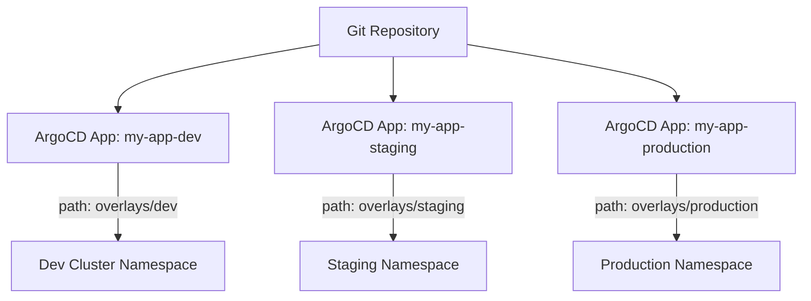

# How to Deploy Kustomize Applications with ArgoCD

Author: [nawazdhandala](https://github.com/nawazdhandala)

Tags: ArgoCD, GitOps, Kubernetes, Kustomize

Description: A practical guide to deploying Kustomize-based applications with ArgoCD, covering project setup, application configuration, sync strategies, and production patterns.

---

Kustomize is built into kubectl and offers template-free customization of Kubernetes manifests. ArgoCD has first-class Kustomize support, meaning it detects Kustomize projects automatically and runs `kustomize build` to generate the manifests it deploys. No plugins, no special configuration - just point ArgoCD at a directory with a `kustomization.yaml` and it works.

This guide covers setting up your first Kustomize-based ArgoCD application, configuring build options, handling common patterns, and working through the details that trip people up.

## How ArgoCD Detects Kustomize

ArgoCD inspects the source directory for a `kustomization.yaml`, `kustomization.yml`, or `Kustomization` file. When it finds one, it automatically uses Kustomize as the build tool. You do not need to specify the source type explicitly, though you can:

```yaml
# ArgoCD auto-detects Kustomize, but you can be explicit
spec:
  source:
    directory:
      recurse: false
    # Or explicitly set the source type (usually not needed)
```

## Basic Kustomize Project

Start with a simple Kustomize project structure:

```text
my-app/
  base/
    kustomization.yaml
    deployment.yaml
    service.yaml
    configmap.yaml
  overlays/
    dev/
      kustomization.yaml
      replica-patch.yaml
    staging/
      kustomization.yaml
      replica-patch.yaml
    production/
      kustomization.yaml
      replica-patch.yaml
      hpa.yaml
```

The base `kustomization.yaml`:

```yaml
# base/kustomization.yaml
apiVersion: kustomize.config.k8s.io/v1beta1
kind: Kustomization

resources:
  - deployment.yaml
  - service.yaml
  - configmap.yaml

commonLabels:
  app: my-app
```

The production overlay:

```yaml
# overlays/production/kustomization.yaml
apiVersion: kustomize.config.k8s.io/v1beta1
kind: Kustomization

resources:
  - ../../base
  - hpa.yaml

patches:
  - path: replica-patch.yaml

namespace: production

commonLabels:
  environment: production
```

## Creating the ArgoCD Application

Point ArgoCD at the overlay directory for the target environment:

```yaml
# application-production.yaml
apiVersion: argoproj.io/v1alpha1
kind: Application
metadata:
  name: my-app-production
  namespace: argocd
spec:
  project: default
  source:
    repoURL: https://github.com/myorg/k8s-configs.git
    targetRevision: main
    path: my-app/overlays/production  # Points to the overlay
  destination:
    server: https://kubernetes.default.svc
    namespace: production
  syncPolicy:
    automated:
      prune: true
      selfHeal: true
    syncOptions:
      - CreateNamespace=true
```

Apply it:

```bash
# Create the application
kubectl apply -f application-production.yaml

# Check the status
argocd app get my-app-production
```

ArgoCD runs `kustomize build` on the `my-app/overlays/production` directory and applies the resulting manifests.

## One Application Per Environment

Create separate ArgoCD Applications for each environment, each pointing to its overlay:

```yaml
# application-dev.yaml
apiVersion: argoproj.io/v1alpha1
kind: Application
metadata:
  name: my-app-dev
  namespace: argocd
spec:
  source:
    repoURL: https://github.com/myorg/k8s-configs.git
    targetRevision: develop  # Track the develop branch for dev
    path: my-app/overlays/dev
  destination:
    server: https://kubernetes.default.svc
    namespace: dev
  syncPolicy:
    automated:
      prune: true
      selfHeal: true
```



## Kustomize Build Options in ArgoCD

ArgoCD lets you pass flags to the `kustomize build` command through the Application spec:

```yaml
spec:
  source:
    kustomize:
      # Pass --enable-helm flag if using Helm chart inflator
      commonAnnotations:
        managed-by: argocd
      # Override namespace (takes precedence over kustomization.yaml)
      namespace: custom-namespace
      # Force common labels
      commonLabels:
        team: platform
```

For global Kustomize build options, configure the ArgoCD ConfigMap:

```yaml
# argocd-cm ConfigMap
apiVersion: v1
kind: ConfigMap
metadata:
  name: argocd-cm
  namespace: argocd
data:
  # Add build options for all Kustomize applications
  kustomize.buildOptions: "--enable-helm --enable-alpha-plugins"
```

## Handling Secrets with Kustomize and ArgoCD

Kustomize can generate secrets from files or literals, but those source files should not contain plaintext secrets in Git. Use Sealed Secrets or External Secrets Operator instead:

```yaml
# base/kustomization.yaml
resources:
  - deployment.yaml
  - service.yaml
  - external-secret.yaml  # ExternalSecret CR instead of plain Secret
```

```yaml
# base/external-secret.yaml
apiVersion: external-secrets.io/v1beta1
kind: ExternalSecret
metadata:
  name: my-app-secrets
spec:
  refreshInterval: 1h
  secretStoreRef:
    name: aws-secrets-manager
    kind: ClusterSecretStore
  target:
    name: my-app-secrets
  data:
    - secretKey: database-password
      remoteRef:
        key: /myapp/production/db-password
```

## Previewing What ArgoCD Will Deploy

Before ArgoCD syncs, preview the rendered output locally:

```bash
# Build the overlay locally to see the full output
kustomize build my-app/overlays/production

# Or with kubectl
kubectl kustomize my-app/overlays/production

# Compare with what ArgoCD sees
argocd app diff my-app-production
```

## Sync Status and Health

ArgoCD tracks the sync status of every resource generated by Kustomize. When you change the base or overlay in Git, ArgoCD detects the drift:

```bash
# Check sync status
argocd app get my-app-production

# View individual resource health
argocd app resources my-app-production

# Force a refresh to pick up Git changes immediately
argocd app get my-app-production --refresh
```

## Common Mistakes

**Pointing to the base instead of an overlay**: If you set `path` to `my-app/base`, ArgoCD deploys the un-customized base. Always point to the specific overlay for your environment.

**Missing namespace in overlay**: If your overlay does not set a namespace and the ArgoCD Application destination namespace differs from what the manifests expect, resources end up in the wrong namespace. Set the namespace explicitly in either the overlay's `kustomization.yaml` or the ArgoCD Application spec.

**Relative path issues**: Kustomize resolves paths relative to the `kustomization.yaml` file. ArgoCD clones the entire repo, so paths like `../../base` work correctly as long as the base directory exists in the same repo.

**Generator hash suffixes**: Kustomize appends hash suffixes to ConfigMaps and Secrets created by generators. This causes ArgoCD to detect changes on every sync if the content has not actually changed. Use `generatorOptions` to disable hashing if needed:

```yaml
generatorOptions:
  disableNameSuffixHash: true
```

For more on Kustomize overlays and environment management, see our [Kustomize overlays guide](https://oneuptime.com/blog/post/2026-02-09-kustomize-overlays-environments/view).
