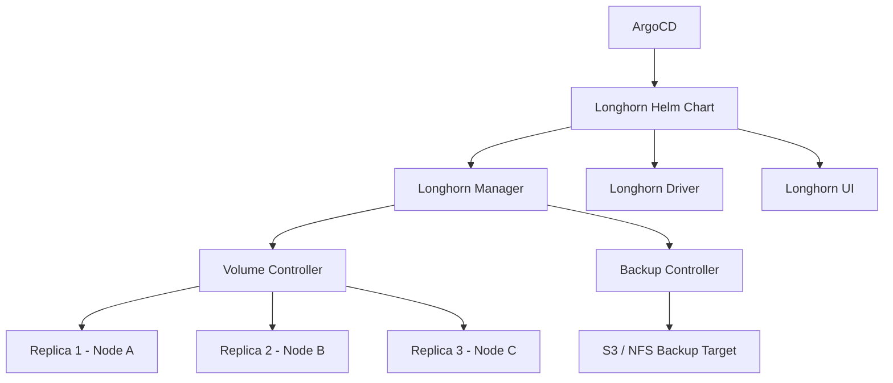

# How to Deploy Longhorn with ArgoCD

Author: [nawazdhandala](https://github.com/nawazdhandala)

Tags: ArgoCD, GitOps, Kubernetes, Longhorn, Storage

Description: Learn how to deploy and manage Longhorn distributed storage with ArgoCD for lightweight, highly available block storage in Kubernetes clusters.

---

Longhorn is a lightweight, reliable distributed block storage system for Kubernetes built by SUSE/Rancher. Unlike Ceph, which is a full storage platform, Longhorn focuses specifically on block storage with an emphasis on simplicity and ease of management. It provides volume replication, snapshots, backups, and disaster recovery without the operational complexity of Ceph.

Deploying Longhorn through ArgoCD gives you a GitOps-managed storage layer that is easy to configure and maintain.

## Why Longhorn

Longhorn stands out for several reasons:

- **Simple architecture** - each volume is its own lightweight controller
- **Built-in backup** to S3/NFS
- **Cross-cluster disaster recovery**
- **Incremental snapshots** at the block level
- **No special hardware required** - uses existing node storage
- **Web UI** for visual management

## Architecture



## Step 1: Prerequisites Check

Before deploying Longhorn, verify nodes meet the requirements:

```yaml
# Pre-install check job
apiVersion: batch/v1
kind: Job
metadata:
  name: longhorn-prereq-check
  namespace: longhorn-system
  annotations:
    argocd.argoproj.io/hook: PreSync
    argocd.argoproj.io/hook-delete-policy: HookSucceeded
spec:
  template:
    spec:
      containers:
        - name: check
          image: longhornio/longhorn-manager:v1.6.0
          command:
            - sh
            - -c
            - |
              # Check for required packages
              echo "Checking prerequisites..."

              # Verify open-iscsi is installed
              if ! command -v iscsiadm &> /dev/null; then
                echo "ERROR: open-iscsi not installed"
                exit 1
              fi

              # Verify NFSv4 client (for backup)
              if ! command -v mount.nfs4 &> /dev/null; then
                echo "WARNING: NFSv4 client not available"
              fi

              echo "Prerequisites check passed"
      restartPolicy: Never
  backoffLimit: 1
```

## Step 2: Deploy Longhorn with ArgoCD

```yaml
apiVersion: argoproj.io/v1alpha1
kind: Application
metadata:
  name: longhorn
  namespace: argocd
spec:
  project: infrastructure
  source:
    repoURL: https://charts.longhorn.io
    chart: longhorn
    targetRevision: 1.6.0
    helm:
      releaseName: longhorn
      valuesObject:
        # Default settings
        defaultSettings:
          # Number of replicas for each volume
          defaultReplicaCount: 3
          # Backup target (S3 example)
          backupTarget: "s3://longhorn-backups@us-east-1/"
          backupTargetCredentialSecret: longhorn-backup-secret
          # Storage reservation per node (percentage)
          storageMinimalAvailablePercentage: 15
          # Upgrade checker
          upgradeChecker: false
          # Guaranteed instance manager CPU
          guaranteedInstanceManagerCPU: 12
          # Auto-delete workload pod on volume detachment
          autoDeletePodWhenVolumeDetachedUnexpectedly: true
          # Replica auto-balance
          replicaAutoBalance: best-effort
          # Snapshot data integrity check
          snapshotDataIntegrity: fast-check
          snapshotDataIntegrityCronjob: "0 4 * * *"

        persistence:
          # Default StorageClass
          defaultClass: true
          defaultFsType: ext4
          defaultClassReplicaCount: 3
          reclaimPolicy: Delete

        # Ingress for the UI
        ingress:
          enabled: true
          ingressClassName: nginx
          host: longhorn.internal.example.com
          tls: true
          tlsSecret: longhorn-tls

        # Resource limits
        longhornManager:
          resources:
            requests:
              cpu: 250m
              memory: 256Mi
            limits:
              cpu: 500m
              memory: 512Mi

        longhornDriver:
          resources:
            requests:
              cpu: 100m
              memory: 128Mi
            limits:
              cpu: 250m
              memory: 256Mi

        # Node selector for storage nodes
        longhornManager:
          nodeSelector:
            storage-node: "true"
          tolerations:
            - key: "storage"
              operator: "Equal"
              value: "longhorn"
              effect: "NoSchedule"
  destination:
    server: https://kubernetes.default.svc
    namespace: longhorn-system
  syncPolicy:
    automated:
      selfHeal: true
    syncOptions:
      - CreateNamespace=true
      - ServerSideApply=true
```

## Step 3: Configure Backup Credentials

Create the backup target secret (store this in a sealed secret or external secrets manager):

```yaml
apiVersion: v1
kind: Secret
metadata:
  name: longhorn-backup-secret
  namespace: longhorn-system
type: Opaque
stringData:
  AWS_ACCESS_KEY_ID: "your-access-key"
  AWS_SECRET_ACCESS_KEY: "your-secret-key"
  AWS_ENDPOINTS: "https://s3.us-east-1.amazonaws.com"
```

## Step 4: Create Additional StorageClasses

```yaml
# High-performance StorageClass with more replicas
apiVersion: storage.k8s.io/v1
kind: StorageClass
metadata:
  name: longhorn-ha
provisioner: driver.longhorn.io
allowVolumeExpansion: true
reclaimPolicy: Retain
volumeBindingMode: Immediate
parameters:
  numberOfReplicas: "3"
  staleReplicaTimeout: "2880"
  fromBackup: ""
  fsType: ext4
  dataLocality: best-effort

---
# Single replica for non-critical data
apiVersion: storage.k8s.io/v1
kind: StorageClass
metadata:
  name: longhorn-single
provisioner: driver.longhorn.io
allowVolumeExpansion: true
reclaimPolicy: Delete
volumeBindingMode: Immediate
parameters:
  numberOfReplicas: "1"
  staleReplicaTimeout: "2880"
  fsType: ext4

---
# StorageClass with automatic backups
apiVersion: storage.k8s.io/v1
kind: StorageClass
metadata:
  name: longhorn-backup
provisioner: driver.longhorn.io
allowVolumeExpansion: true
reclaimPolicy: Retain
parameters:
  numberOfReplicas: "3"
  staleReplicaTimeout: "2880"
  recurringJobSelector: '[{"name":"backup-daily","isGroup":false}]'
```

## Step 5: Configure Recurring Jobs

Set up automated snapshots and backups:

```yaml
# Daily snapshot
apiVersion: longhorn.io/v1beta2
kind: RecurringJob
metadata:
  name: snapshot-daily
  namespace: longhorn-system
spec:
  cron: "0 2 * * *"
  task: snapshot
  groups:
    - default
  retain: 7
  concurrency: 2
  labels:
    type: snapshot
    schedule: daily

---
# Daily backup to S3
apiVersion: longhorn.io/v1beta2
kind: RecurringJob
metadata:
  name: backup-daily
  namespace: longhorn-system
spec:
  cron: "0 3 * * *"
  task: backup
  groups:
    - default
  retain: 30
  concurrency: 1
  labels:
    type: backup
    schedule: daily

---
# Filesystem trim weekly
apiVersion: longhorn.io/v1beta2
kind: RecurringJob
metadata:
  name: filesystem-trim
  namespace: longhorn-system
spec:
  cron: "0 1 * * 0"
  task: filesystem-trim
  groups:
    - default
  retain: 0
  concurrency: 5
```

## Custom Health Checks

```yaml
apiVersion: v1
kind: ConfigMap
metadata:
  name: argocd-cm
  namespace: argocd
data:
  resource.customizations.health.longhorn.io_Volume: |
    hs = {}
    if obj.status ~= nil then
      local state = obj.status.state or "Unknown"
      if state == "attached" or state == "detached" then
        local robustness = obj.status.robustness or "unknown"
        if robustness == "healthy" then
          hs.status = "Healthy"
          hs.message = "Volume " .. state .. ", robustness: healthy"
        elseif robustness == "degraded" then
          hs.status = "Degraded"
          hs.message = "Volume degraded - replica rebuilding"
        else
          hs.status = "Degraded"
          hs.message = "Robustness: " .. robustness
        end
      elseif state == "creating" then
        hs.status = "Progressing"
        hs.message = "Volume being created"
      else
        hs.status = "Degraded"
        hs.message = "Volume state: " .. state
      end
    else
      hs.status = "Progressing"
      hs.message = "Waiting for volume status"
    end
    return hs
```

## Monitoring Longhorn

Longhorn exposes Prometheus metrics through its manager:

```yaml
apiVersion: monitoring.coreos.com/v1
kind: ServiceMonitor
metadata:
  name: longhorn
  namespace: longhorn-system
spec:
  selector:
    matchLabels:
      app: longhorn-manager
  endpoints:
    - port: manager
      interval: 30s
```

Key metrics:

```promql
# Volume health
longhorn_volume_state{state!="attached"}

# Node storage capacity
longhorn_node_storage_capacity_bytes

# Node storage usage
longhorn_node_storage_usage_bytes
  / longhorn_node_storage_capacity_bytes * 100

# Replica rebuild status
longhorn_volume_robustness{robustness="degraded"}

# Backup status
longhorn_backup_state{state="Error"}
```

## Disaster Recovery

Longhorn supports cross-cluster disaster recovery through S3 backups:

```yaml
# On the DR cluster, create volumes from backups
apiVersion: v1
kind: PersistentVolumeClaim
metadata:
  name: database-data-dr
  namespace: production
spec:
  accessModes:
    - ReadWriteOnce
  storageClassName: longhorn
  resources:
    requests:
      storage: 50Gi
  dataSource:
    name: backup://s3://longhorn-backups@us-east-1/?backup=backup-abc123
    kind: LonghornBackup
```

## Summary

Longhorn provides a simpler alternative to Ceph for Kubernetes block storage, and deploying it through ArgoCD gives you full GitOps control over your storage layer. Configure default settings, replica counts, and backup targets through Helm values, manage StorageClasses and recurring jobs as Git resources, and monitor health through Prometheus. Longhorn's built-in backup and DR capabilities make it an excellent choice for teams that want reliable distributed storage without the operational complexity of running Ceph.
