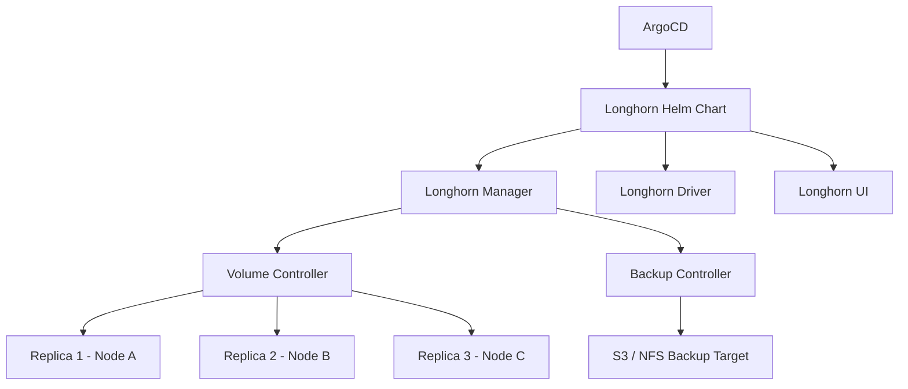

# How to Deploy Longhorn with ArgoCD

Author: [nawazdhandala](https://github.com/nawazdhandala)

Tags: ArgoCD, GitOps, Kubernetes, Longhorn, Storage

Description: Learn how to deploy and manage Longhorn distributed storage with ArgoCD for lightweight, highly available block storage in Kubernetes clusters.

---

Longhorn is a lightweight, reliable distributed block storage system for Kubernetes built by SUSE/Rancher. Unlike Ceph, which is a full storage platform, Longhorn focuses specifically on block storage with an emphasis on simplicity and ease of management. It provides volume replication, snapshots, backups, and disaster recovery without the operational complexity of Ceph.

Deploying Longhorn through ArgoCD gives you a GitOps-managed storage layer that is easy to configure and maintain.

If you would rather install Longhorn directly with Helm instead of GitOps, see the companion article [How to Deploy Longhorn Distributed Storage with Helm on Kubernetes](https://oneuptime.com/blog/post/2026-01-17-helm-longhorn-distributed-storage/view).

## How the pieces fit together (read this first)

The steps below mix two very different kinds of action, and the difference is the most common source of confusion. Keep this distinction in mind for every step:

- **Node-level prerequisites** are installed on the operating system of *every* worker node that will run Longhorn (Step 1). These are host packages and services such as `open-iscsi`/`iscsid` and the NFSv4 client. You install them with your OS package manager or configuration management (apt, yum, Ansible, cloud-init, etc.), not with `kubectl`. Longhorn cannot run if a node is missing them.
- **Cluster-level resources** are Kubernetes objects (the ArgoCD `Application`, `StorageClass`, `Secret`, `RecurringJob`, and so on). You never run these on individual nodes. They are submitted to the Kubernetes API server once, and the cluster schedules the resulting pods onto nodes for you. In this guide they are applied in one of two ways:
  - **Committed to Git and synced by ArgoCD** - the ArgoCD `Application` and anything you choose to manage via GitOps. You commit the YAML to your repository and ArgoCD applies it to the cluster on your behalf.
  - **Applied directly with `kubectl apply -f`** - convenient for one-off or bootstrap resources (for example a credentials `Secret`). Each step below states which method it uses.

In short: Step 1 runs on the nodes; every other step targets the cluster API server, either through ArgoCD's sync or through a direct `kubectl apply`.

## Why Longhorn

Longhorn stands out for several reasons:

- **Simple architecture** - each volume is its own lightweight controller
- **Built-in backup** to S3/NFS
- **Cross-cluster disaster recovery**
- **Incremental snapshots** at the block level
- **No special hardware required** - uses existing node storage
- **Web UI** for visual management

## Architecture


```mermaid
graph TD
    A[ArgoCD] --> B[Longhorn Helm Chart]
    B --> C[Longhorn Manager]
    B --> D[Longhorn Driver]
    B --> E[Longhorn UI]

    C --> F[Volume Controller]
    F --> G[Replica 1 - Node A]
    F --> H[Replica 2 - Node B]
    F --> I[Replica 3 - Node C]

    C --> J[Backup Controller]
    J --> K[S3 / NFS Backup Target]
```

## Step 1: Node prerequisites (runs on every node)

This step is node-level. Longhorn relies on the host operating system, so the following must be true on *every* node that will store Longhorn replicas:

- `open-iscsi` is installed and the `iscsid` daemon is running on all nodes (Longhorn uses `iscsiadm` on the host to attach volumes to Kubernetes).
- An NFSv4 client is installed on every node if you plan to use ReadWriteMany (RWX) volumes; the backup feature also requires NFSv4.

Install these with your OS package manager or configuration management before deploying Longhorn. For example, on Debian/Ubuntu nodes:

```bash
sudo apt-get update
sudo apt-get install -y open-iscsi nfs-common
sudo systemctl enable --now iscsid
```

Then verify the prerequisites across the whole cluster. The environment check script deploys a short-lived privileged DaemonSet (one pod per node) that inspects each host for iSCSI, NFS, mount propagation, and the required packages, then prints a per-node report:

```bash
curl -sSfL https://raw.githubusercontent.com/longhorn/longhorn/v1.6.0/scripts/environment_check.sh | bash
```

Expected output (one block per node; all checks should pass before you continue):

```text
[INFO]  Required dependencies 'kubectl jq mktemp sort printf' are installed.
[INFO]  All nodes have unique hostnames.
[INFO]  Waiting for longhorn-environment-check pods to become ready (0/3)...
[INFO]  All longhorn-environment-check pods are ready (3/3).
[INFO]  MountPropagation is enabled!
[INFO]  Checking iscsid...
[INFO]  Checking multipathd...
[INFO]  Checking nfs client...
[INFO]  Cleaning up longhorn-environment-check pods...
[INFO]  Cleanup completed.
```

If any node reports a missing package or a stopped `iscsid` service, fix that node before moving on. Cleanly passing this step is what makes the cluster-level steps that follow safe to apply.

## Step 2: Deploy Longhorn with ArgoCD (cluster-level, synced from Git)

This is the heart of the GitOps workflow. The manifest below is a single ArgoCD `Application` that points at the Longhorn Helm chart. You do not run it on any node. Instead you **commit this file to the Git repository ArgoCD watches**, and ArgoCD renders the chart and applies the resulting Kubernetes objects to the cluster's API server for you. ArgoCD then creates the Longhorn pods (manager, driver, UI) and schedules them onto the nodes that passed Step 1.

Save the following as something like `apps/longhorn.yaml` in your GitOps repository and commit it:

```yaml
apiVersion: argoproj.io/v1alpha1
kind: Application
metadata:
  name: longhorn
  namespace: argocd
spec:
  project: infrastructure
  source:
    repoURL: https://charts.longhorn.io
    chart: longhorn
    targetRevision: 1.6.0
    helm:
      releaseName: longhorn
      valuesObject:
        preUpgradeChecker:
          # Disable the Helm pre-upgrade hook when Longhorn is managed by ArgoCD
          jobEnabled: false

        # Default settings
        defaultSettings:
          # Number of replicas for each volume
          defaultReplicaCount: 3
          # Backup target (S3 example)
          backupTarget: "s3://longhorn-backups@us-east-1/"
          backupTargetCredentialSecret: longhorn-backup-secret
          # Storage reservation per node (percentage)
          storageMinimalAvailablePercentage: 15
          # Upgrade checker
          upgradeChecker: false
          # Guaranteed instance manager CPU
          guaranteedInstanceManagerCPU: 12
          # Auto-delete workload pod on volume detachment
          autoDeletePodWhenVolumeDetachedUnexpectedly: true
          # Replica auto-balance
          replicaAutoBalance: best-effort
          # Snapshot data integrity check
          snapshotDataIntegrity: fast-check
          snapshotDataIntegrityCronjob: "0 4 * * *"

        persistence:
          # Default StorageClass
          defaultClass: true
          defaultFsType: ext4
          defaultClassReplicaCount: 3
          reclaimPolicy: Delete

        # Ingress for the UI
        ingress:
          enabled: true
          ingressClassName: nginx
          host: longhorn.internal.example.com
          tls: true
          tlsSecret: longhorn-tls

        # Node selector for Longhorn Manager nodes
        longhornManager:
          nodeSelector:
            storage-node: "true"
          tolerations:
            - key: "storage"
              operator: "Equal"
              value: "longhorn"
              effect: "NoSchedule"

        longhornDriver:
          nodeSelector:
            storage-node: "true"
          tolerations:
            - key: "storage"
              operator: "Equal"
              value: "longhorn"
              effect: "NoSchedule"
  destination:
    server: https://kubernetes.default.svc
    namespace: longhorn-system
  syncPolicy:
    automated:
      selfHeal: true
    syncOptions:
      - CreateNamespace=true
      - ServerSideApply=true
```

Because `syncPolicy.automated` is set, you do not need to click anything in the ArgoCD UI: once the file is committed and pushed, ArgoCD detects the new `Application`, syncs it, and (thanks to `selfHeal: true`) reverts any drift back to the state in Git.

### Confirm the Application is Synced and Healthy

ArgoCD reports two independent statuses for every Application: a **Sync** status (`Synced` means the live cluster matches Git, `OutOfSync` means it does not) and a **Health** status (`Healthy`, `Progressing`, or `Degraded`). Check both:

```bash
kubectl get application longhorn -n argocd
```

Expected output once the chart has rolled out:

```text
NAME       SYNC STATUS   HEALTH STATUS
longhorn   Synced        Healthy
```

Then confirm the Longhorn pods came up in the `longhorn-system` namespace (these were created by ArgoCD on the cluster, not by you on a node):

```bash
kubectl get pods -n longhorn-system
```

Expected output (abbreviated; exact pod counts scale with the number of nodes):

```text
NAME                                          READY   STATUS    RESTARTS   AGE
csi-attacher-5f9d8b6c7d-7m2qz                 1/1     Running   0          3m
csi-provisioner-7c5d9f4b8c-4kx9p              1/1     Running   0          3m
engine-image-ei-1b8e2c3a-2pj4n                1/1     Running   0          3m
instance-manager-0a1b2c3d4e5f6789            1/1     Running   0          3m
longhorn-driver-deployer-6b7c8d9e0f-qz5wt     1/1     Running   0          3m
longhorn-manager-7h8j9k                       1/1     Running   0          3m
longhorn-ui-5c6d7e8f9a-1b2c3                  1/1     Running   0          3m
```

Finally, verify the default StorageClass that the chart created (because `persistence.defaultClass: true` was set):

```bash
kubectl get storageclass
```

Expected output (the `(default)` marker confirms Longhorn is the cluster's default StorageClass):

```text
NAME                 PROVISIONER          RECLAIMPOLICY   VOLUMEBINDINGMODE   ALLOWVOLUMEEXPANSION   AGE
longhorn (default)   driver.longhorn.io   Delete          Immediate           true                   3m
```

If the Application shows `Progressing` for more than a few minutes, run `kubectl get pods -n longhorn-system` and `kubectl describe` the pending pods; the usual cause is a node that failed the Step 1 prerequisites.

## Step 3: Configure Backup Credentials (cluster-level)

This is another cluster-level resource. Because it contains raw credentials, this example applies it **directly with `kubectl apply -f`** rather than committing plaintext to Git. In production you should instead manage it through a Sealed Secret or an external secrets operator and let ArgoCD sync that.

Save the manifest as `longhorn-backup-secret.yaml`:

```yaml
apiVersion: v1
kind: Secret
metadata:
  name: longhorn-backup-secret
  namespace: longhorn-system
type: Opaque
stringData:
  AWS_ACCESS_KEY_ID: "your-access-key"
  AWS_SECRET_ACCESS_KEY: "your-secret-key"
  AWS_ENDPOINTS: "https://s3.us-east-1.amazonaws.com"
```

Apply it to the cluster API server (not to a node):

```bash
kubectl apply -f longhorn-backup-secret.yaml
```

Expected output:

```text
secret/longhorn-backup-secret created
```

## Step 4: Create Additional StorageClasses (cluster-level, manage in Git)

`StorageClass` objects are cluster-scoped Kubernetes resources, so like the `Application` they belong in Git and are best synced by ArgoCD. Commit the manifest below alongside your other GitOps resources; ArgoCD will apply it to the cluster. (For a quick test you can also `kubectl apply -f storageclasses.yaml` directly.)

```yaml
# High-performance StorageClass with more replicas
apiVersion: storage.k8s.io/v1
kind: StorageClass
metadata:
  name: longhorn-ha
provisioner: driver.longhorn.io
allowVolumeExpansion: true
reclaimPolicy: Retain
volumeBindingMode: Immediate
parameters:
  numberOfReplicas: "3"
  staleReplicaTimeout: "2880"
  fromBackup: ""
  fsType: ext4
  dataLocality: best-effort

---
# Single replica for non-critical data
apiVersion: storage.k8s.io/v1
kind: StorageClass
metadata:
  name: longhorn-single
provisioner: driver.longhorn.io
allowVolumeExpansion: true
reclaimPolicy: Delete
volumeBindingMode: Immediate
parameters:
  numberOfReplicas: "1"
  staleReplicaTimeout: "2880"
  fsType: ext4

---
# StorageClass with automatic backups
apiVersion: storage.k8s.io/v1
kind: StorageClass
metadata:
  name: longhorn-backup
provisioner: driver.longhorn.io
allowVolumeExpansion: true
reclaimPolicy: Retain
parameters:
  numberOfReplicas: "3"
  staleReplicaTimeout: "2880"
  recurringJobSelector: '[{"name":"backup-daily","isGroup":false}]'
```

After the resource syncs, confirm the new classes exist next to the default one:

```bash
kubectl get storageclass
```

Expected output:

```text
NAME                 PROVISIONER          RECLAIMPOLICY   VOLUMEBINDINGMODE   ALLOWVOLUMEEXPANSION   AGE
longhorn (default)   driver.longhorn.io   Delete          Immediate           true                   10m
longhorn-backup      driver.longhorn.io   Retain          Immediate           true                   1m
longhorn-ha          driver.longhorn.io   Retain          Immediate           true                   1m
longhorn-single      driver.longhorn.io   Delete          Immediate           true                   1m
```

## Step 5: Configure Recurring Jobs (cluster-level, manage in Git)

`RecurringJob` is a Longhorn custom resource in the `longhorn-system` namespace. Commit these manifests to Git so ArgoCD syncs them, and Longhorn's controller (already running in the cluster from Step 2) will schedule the snapshots and backups. Set up automated snapshots and backups:

```yaml
# Daily snapshot
apiVersion: longhorn.io/v1beta2
kind: RecurringJob
metadata:
  name: snapshot-daily
  namespace: longhorn-system
spec:
  cron: "0 2 * * *"
  task: snapshot
  groups:
    - default
  retain: 7
  concurrency: 2
  labels:
    type: snapshot
    schedule: daily

---
# Daily backup to S3
apiVersion: longhorn.io/v1beta2
kind: RecurringJob
metadata:
  name: backup-daily
  namespace: longhorn-system
spec:
  cron: "0 3 * * *"
  task: backup
  groups:
    - default
  retain: 30
  concurrency: 1
  labels:
    type: backup
    schedule: daily

---
# Filesystem trim weekly
apiVersion: longhorn.io/v1beta2
kind: RecurringJob
metadata:
  name: filesystem-trim
  namespace: longhorn-system
spec:
  cron: "0 1 * * 0"
  task: filesystem-trim
  groups:
    - default
  retain: 0
  concurrency: 5
```

## Custom Health Checks

By default ArgoCD does not know how to read Longhorn's `Volume` status, so it may report a healthy volume as `Progressing`. The patch below teaches the ArgoCD controller a custom health check. This edits the cluster-level `argocd-cm` ConfigMap in the `argocd` namespace (apply it with `kubectl apply -f`, or fold it into how you already manage ArgoCD's own configuration); restart or let the `argocd-server` pick up the change:

```yaml
apiVersion: v1
kind: ConfigMap
metadata:
  name: argocd-cm
  namespace: argocd
data:
  resource.customizations.health.longhorn.io_Volume: |
    hs = {}
    if obj.status ~= nil then
      local state = obj.status.state or "Unknown"
      if state == "attached" or state == "detached" then
        local robustness = obj.status.robustness or "unknown"
        if robustness == "healthy" then
          hs.status = "Healthy"
          hs.message = "Volume " .. state .. ", robustness: healthy"
        elseif robustness == "degraded" then
          hs.status = "Degraded"
          hs.message = "Volume degraded - replica rebuilding"
        else
          hs.status = "Degraded"
          hs.message = "Robustness: " .. robustness
        end
      elseif state == "creating" then
        hs.status = "Progressing"
        hs.message = "Volume being created"
      else
        hs.status = "Degraded"
        hs.message = "Volume state: " .. state
      end
    else
      hs.status = "Progressing"
      hs.message = "Waiting for volume status"
    end
    return hs
```

## Monitoring Longhorn

Longhorn exposes Prometheus metrics through its manager:

```yaml
apiVersion: monitoring.coreos.com/v1
kind: ServiceMonitor
metadata:
  name: longhorn
  namespace: longhorn-system
spec:
  selector:
    matchLabels:
      app: longhorn-manager
  endpoints:
    - port: manager
      interval: 30s
```

Key metrics:

```promql
# Volume health
longhorn_volume_state{state!="attached"} == 1

# Node storage capacity
longhorn_node_storage_capacity_bytes

# Node storage usage
longhorn_node_storage_usage_bytes
  / longhorn_node_storage_capacity_bytes * 100

# Replica rebuild status
longhorn_volume_robustness{state="degraded"} == 1

# Backup status
longhorn_backup_state == 4
```

## Disaster Recovery

Longhorn supports cross-cluster disaster recovery through S3 backups:

```yaml
# On the DR cluster, restore the Longhorn volume from a backup
apiVersion: longhorn.io/v1beta2
kind: Volume
metadata:
  name: database-data-dr
  namespace: longhorn-system
spec:
  size: "53687091200"
  fromBackup: "s3://longhorn-backups@us-east-1/?backup=backup-abc123&volume=database-data"
  numberOfReplicas: 3
  frontend: blockdev

---
apiVersion: v1
kind: PersistentVolume
metadata:
  name: database-data-dr
spec:
  capacity:
    storage: 50Gi
  volumeMode: Filesystem
  accessModes:
    - ReadWriteOnce
  storageClassName: longhorn
  csi:
    driver: driver.longhorn.io
    volumeHandle: database-data-dr

---
apiVersion: v1
kind: PersistentVolumeClaim
metadata:
  name: database-data-dr
  namespace: production
spec:
  accessModes:
    - ReadWriteOnce
  storageClassName: longhorn
  resources:
    requests:
      storage: 50Gi
  volumeName: database-data-dr
```

## Summary

Longhorn provides a simpler alternative to Ceph for Kubernetes block storage, and deploying it through ArgoCD gives you full GitOps control over your storage layer. Remember the one distinction that makes the whole workflow click: the node prerequisites in Step 1 (`open-iscsi`, the NFSv4 client) are installed on every node's operating system, while everything else is a cluster-level Kubernetes resource that you either commit to Git for ArgoCD to sync or apply once with `kubectl apply`. Configure default settings, replica counts, and backup targets through Helm values, manage StorageClasses and recurring jobs as Git resources, and confirm each step with the `kubectl get` checks shown above. Longhorn's built-in backup and DR capabilities make it an excellent choice for teams that want reliable distributed storage without the operational complexity of running Ceph.

If you prefer a plain Helm installation without ArgoCD, the companion guide [How to Deploy Longhorn Distributed Storage with Helm on Kubernetes](https://oneuptime.com/blog/post/2026-01-17-helm-longhorn-distributed-storage/view) walks through the same storage layer step by step.
