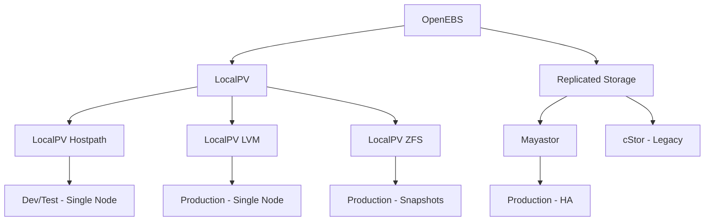

# How to Deploy OpenEBS with ArgoCD

Author: [nawazdhandala](https://github.com/nawazdhandala)

Tags: ArgoCD, GitOps, Kubernetes, OpenEBS, Storage

Description: Learn how to deploy and manage OpenEBS container-attached storage with ArgoCD for flexible, per-workload storage engines including LocalPV, cStor, and Mayastor.

---

OpenEBS is a container-attached storage (CAS) solution that provides multiple storage engines to match different workload requirements. Unlike traditional storage systems that present a single storage type, OpenEBS lets you choose the right storage engine for each workload - from simple local volumes for testing to replicated block storage for production databases.

Deploying OpenEBS through ArgoCD gives you GitOps control over your entire storage layer, including which storage engines are available and how they are configured.

## OpenEBS Storage Engines

OpenEBS provides several storage engines, each suited for different use cases:



| Engine | Replication | Use Case | Performance |
|---|---|---|---|
| LocalPV Hostpath | None | Development, testing | Highest |
| LocalPV LVM | None | Single-node production | High |
| LocalPV ZFS | None | Snapshots, compression | High |
| Mayastor | Yes (NVMe-oF) | Production HA | High |
| cStor | Yes | Legacy production | Medium |

## Step 1: Deploy OpenEBS with ArgoCD

### Option A: Full OpenEBS Installation

```yaml
apiVersion: argoproj.io/v1alpha1
kind: Application
metadata:
  name: openebs
  namespace: argocd
spec:
  project: infrastructure
  source:
    repoURL: https://openebs.github.io/openebs
    chart: openebs
    targetRevision: 4.0.0
    helm:
      releaseName: openebs
      valuesObject:
        # Enable specific engines
        engines:
          local:
            lvm:
              enabled: true
            zfs:
              enabled: true
          replicated:
            mayastor:
              enabled: true

        # LocalPV Hostpath configuration
        localpv-provisioner:
          enabled: true
          hostpathClass:
            enabled: true
            isDefaultClass: false
            basePath: /var/openebs/local

        # LVM LocalPV configuration
        lvm-localpv:
          enabled: true
          storageClass:
            enabled: true

        # ZFS LocalPV configuration
        zfs-localpv:
          enabled: true
          storageClass:
            enabled: true

        # Mayastor configuration
        mayastor:
          enabled: true
          csi:
            node:
              resources:
                requests:
                  cpu: 500m
                  memory: 512Mi
          io_engine:
            resources:
              requests:
                cpu: 1000m
                memory: 1Gi
              limits:
                cpu: 2000m
                memory: 2Gi
  destination:
    server: https://kubernetes.default.svc
    namespace: openebs
  syncPolicy:
    automated:
      selfHeal: true
    syncOptions:
      - CreateNamespace=true
      - ServerSideApply=true
```

### Option B: Lightweight Installation (LocalPV Only)

```yaml
apiVersion: argoproj.io/v1alpha1
kind: Application
metadata:
  name: openebs-localpv
  namespace: argocd
spec:
  project: infrastructure
  source:
    repoURL: https://openebs.github.io/openebs
    chart: openebs
    targetRevision: 4.0.0
    helm:
      releaseName: openebs
      valuesObject:
        engines:
          local:
            lvm:
              enabled: true
            zfs:
              enabled: false
          replicated:
            mayastor:
              enabled: false
        localpv-provisioner:
          enabled: true
          hostpathClass:
            enabled: true
            isDefaultClass: true
            basePath: /var/openebs/local
  destination:
    server: https://kubernetes.default.svc
    namespace: openebs
  syncPolicy:
    automated:
      selfHeal: true
    syncOptions:
      - CreateNamespace=true
```

## Step 2: Configure StorageClasses

### LocalPV Hostpath StorageClass

```yaml
apiVersion: storage.k8s.io/v1
kind: StorageClass
metadata:
  name: openebs-hostpath
  annotations:
    openebs.io/cas-type: local
    cas.openebs.io/config: |
      - name: StorageType
        value: hostpath
      - name: BasePath
        value: /var/openebs/local
provisioner: openebs.io/local
reclaimPolicy: Delete
volumeBindingMode: WaitForFirstConsumer
```

### LocalPV LVM StorageClass

```yaml
apiVersion: storage.k8s.io/v1
kind: StorageClass
metadata:
  name: openebs-lvm
provisioner: local.csi.openebs.io
parameters:
  storage: "lvm"
  volgroup: "openebs-vg"
  fsType: "ext4"
reclaimPolicy: Delete
allowVolumeExpansion: true
volumeBindingMode: WaitForFirstConsumer
```

### LocalPV ZFS StorageClass

```yaml
apiVersion: storage.k8s.io/v1
kind: StorageClass
metadata:
  name: openebs-zfs
provisioner: zfs.csi.openebs.io
parameters:
  poolname: "openebs-pool"
  fstype: "zfs"
  compression: "lz4"
  dedup: "off"
  recordsize: "128k"
reclaimPolicy: Delete
allowVolumeExpansion: true
volumeBindingMode: WaitForFirstConsumer
```

### Mayastor StorageClass

```yaml
apiVersion: storage.k8s.io/v1
kind: StorageClass
metadata:
  name: openebs-mayastor
provisioner: io.openebs.csi-mayastor
parameters:
  ioTimeout: "30"
  protocol: nvmf
  repl_count: "3"
reclaimPolicy: Delete
allowVolumeExpansion: true
volumeBindingMode: Immediate
```

## Step 3: Configure Mayastor DiskPools

For Mayastor, you need to define DiskPools on nodes:

```yaml
# DiskPool on node 1
apiVersion: openebs.io/v1beta2
kind: DiskPool
metadata:
  name: pool-worker-1
  namespace: openebs
spec:
  node: worker-1
  disks:
    - "aio:///dev/sdb"

---
# DiskPool on node 2
apiVersion: openebs.io/v1beta2
kind: DiskPool
metadata:
  name: pool-worker-2
  namespace: openebs
spec:
  node: worker-2
  disks:
    - "aio:///dev/sdb"

---
# DiskPool on node 3
apiVersion: openebs.io/v1beta2
kind: DiskPool
metadata:
  name: pool-worker-3
  namespace: openebs
spec:
  node: worker-3
  disks:
    - "aio:///dev/sdb"
```

## Repository Structure

```text
openebs-config/
  base/
    kustomization.yaml
  overlays/
    dev/
      kustomization.yaml
      values.yaml  # LocalPV only
      storage-classes/
        hostpath.yaml
    production/
      kustomization.yaml
      values.yaml  # Mayastor + LocalPV
      storage-classes/
        mayastor-ha.yaml
        lvm-fast.yaml
        hostpath-dev.yaml
      disk-pools/
        pool-worker-1.yaml
        pool-worker-2.yaml
        pool-worker-3.yaml
```

## ArgoCD Application for Storage Configuration

```yaml
apiVersion: argoproj.io/v1alpha1
kind: Application
metadata:
  name: openebs-config
  namespace: argocd
  annotations:
    argocd.argoproj.io/sync-wave: "1"
spec:
  project: infrastructure
  source:
    repoURL: https://github.com/your-org/openebs-config
    path: overlays/production
    targetRevision: main
  destination:
    server: https://kubernetes.default.svc
    namespace: openebs
  syncPolicy:
    automated:
      selfHeal: true
    syncOptions:
      - ServerSideApply=true
```

## Custom Health Checks

```yaml
apiVersion: v1
kind: ConfigMap
metadata:
  name: argocd-cm
  namespace: argocd
data:
  # DiskPool health check
  resource.customizations.health.openebs.io_DiskPool: |
    hs = {}
    if obj.status ~= nil then
      local state = obj.status.state or "Unknown"
      if state == "Online" then
        hs.status = "Healthy"
        local capacity = obj.status.capacity or 0
        local used = obj.status.used or 0
        hs.message = string.format(
          "Online - %d/%d bytes used", used, capacity
        )
      elseif state == "Creating" then
        hs.status = "Progressing"
        hs.message = "DiskPool being created"
      else
        hs.status = "Degraded"
        hs.message = "DiskPool state: " .. state
      end
    else
      hs.status = "Progressing"
      hs.message = "Waiting for DiskPool status"
    end
    return hs
```

## Monitoring OpenEBS

### Prometheus Metrics

```yaml
apiVersion: monitoring.coreos.com/v1
kind: ServiceMonitor
metadata:
  name: openebs
  namespace: openebs
spec:
  selector:
    matchLabels:
      app: openebs
  endpoints:
    - port: metrics
      interval: 30s
```

Key metrics:

```promql
# Volume capacity and usage
openebs_volume_capacity_bytes
openebs_volume_used_bytes

# Volume replica status
openebs_volume_replica_count
openebs_volume_healthy_replica_count

# Disk pool health
openebs_pool_status
openebs_pool_capacity_bytes
openebs_pool_used_bytes

# I/O performance
rate(openebs_read_bytes_total[5m])
rate(openebs_write_bytes_total[5m])
rate(openebs_read_iops[5m])
rate(openebs_write_iops[5m])
```

### Alerting

```yaml
apiVersion: monitoring.coreos.com/v1
kind: PrometheusRule
metadata:
  name: openebs-alerts
  namespace: openebs
spec:
  groups:
    - name: openebs
      rules:
        - alert: OpenEBSPoolAlmostFull
          expr: >
            openebs_pool_used_bytes / openebs_pool_capacity_bytes > 0.85
          for: 15m
          labels:
            severity: warning
          annotations:
            summary: "DiskPool {{ $labels.pool }} is almost full"

        - alert: OpenEBSVolumeDegraded
          expr: >
            openebs_volume_healthy_replica_count
            < openebs_volume_replica_count
          for: 10m
          labels:
            severity: warning
          annotations:
            summary: >
              Volume {{ $labels.volume }} has degraded replicas
```

## Choosing the Right Engine

Use this decision guide managed through your ArgoCD configuration:

```yaml
# Decision guide as Kubernetes ConfigMap for reference
apiVersion: v1
kind: ConfigMap
metadata:
  name: storage-selection-guide
  namespace: openebs
data:
  guide: |
    Workload Type -> Recommended Engine -> StorageClass

    Development/Test -> LocalPV Hostpath -> openebs-hostpath
    CI/CD Build Volumes -> LocalPV Hostpath -> openebs-hostpath
    Production DB (single-node) -> LocalPV LVM -> openebs-lvm
    Production DB (HA needed) -> Mayastor -> openebs-mayastor
    Need Snapshots -> LocalPV ZFS -> openebs-zfs
    Shared Storage -> CephFS via Rook -> ceph-filesystem
```

## Summary

OpenEBS provides flexibility in storage engines that matches different workload requirements. Deploying it through ArgoCD ensures consistent storage configuration across environments. Use LocalPV for development and single-node production workloads, Mayastor for high-availability block storage, and ZFS for workloads that benefit from snapshots and compression. Define DiskPools and StorageClasses in Git, and ArgoCD keeps your storage layer in sync across all clusters.

For other storage solutions, see our guides on [deploying Ceph/Rook with ArgoCD](https://oneuptime.com/blog/post/2026-02-26-argocd-deploy-ceph-rook/view) and [deploying Longhorn with ArgoCD](https://oneuptime.com/blog/post/2026-02-26-argocd-deploy-longhorn/view).
