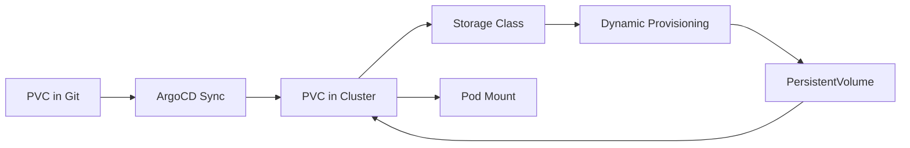

# How to Deploy PersistentVolumeClaims with ArgoCD

Author: [nawazdhandala](https://github.com/nawazdhandala)

Tags: ArgoCD, GitOps, Kubernetes, Persistent Storage, PVC

Description: Learn how to manage PersistentVolumeClaims with ArgoCD for stateful applications, including storage class selection, access modes, volume expansion, and protection strategies.

---

PersistentVolumeClaims (PVCs) are how Kubernetes applications request durable storage. Unlike ephemeral pod storage, PVC data survives pod restarts, rescheduling, and even cluster upgrades. Managing PVCs through ArgoCD requires understanding how Kubernetes storage provisioning works and how to prevent accidental data loss.

## PVC Basics in GitOps

A PVC is a request for storage. When you create a PVC, Kubernetes finds (or dynamically provisions) a PersistentVolume (PV) that satisfies the request. The PVC then binds to that PV.



## Basic PVC Deployment

Here is a PVC for a PostgreSQL database managed through ArgoCD:

```yaml
# apps/postgres/pvc.yaml
apiVersion: v1
kind: PersistentVolumeClaim
metadata:
  name: postgres-data
  labels:
    app: postgres
spec:
  accessModes:
    - ReadWriteOnce
  storageClassName: standard
  resources:
    requests:
      storage: 50Gi
```

Reference it in your Deployment or StatefulSet:

```yaml
# apps/postgres/deployment.yaml
apiVersion: apps/v1
kind: Deployment
metadata:
  name: postgres
spec:
  replicas: 1
  selector:
    matchLabels:
      app: postgres
  template:
    metadata:
      labels:
        app: postgres
    spec:
      containers:
        - name: postgres
          image: postgres:16
          ports:
            - containerPort: 5432
          env:
            - name: PGDATA
              value: /var/lib/postgresql/data/pgdata
          volumeMounts:
            - name: data
              mountPath: /var/lib/postgresql/data
      volumes:
        - name: data
          persistentVolumeClaim:
            claimName: postgres-data
```

## ArgoCD Application with PVC Protection

The most critical aspect of managing PVCs through ArgoCD is preventing accidental deletion:

```yaml
apiVersion: argoproj.io/v1alpha1
kind: Application
metadata:
  name: postgres
  namespace: argocd
spec:
  project: default
  source:
    repoURL: https://github.com/myorg/gitops
    targetRevision: main
    path: apps/postgres
  destination:
    server: https://kubernetes.default.svc
    namespace: databases
  syncPolicy:
    automated:
      prune: false       # Never auto-delete PVCs
      selfHeal: true
    syncOptions:
      - CreateNamespace=true
      - PrunePropagationPolicy=orphan  # Keep PVCs when parent is deleted
```

Additionally, annotate your PVCs to prevent pruning:

```yaml
apiVersion: v1
kind: PersistentVolumeClaim
metadata:
  name: postgres-data
  annotations:
    argocd.argoproj.io/sync-options: Prune=false
```

## Choosing Storage Classes

Different workloads need different storage characteristics. Define your PVC with the appropriate storage class:

```yaml
# High-performance SSD for databases
apiVersion: v1
kind: PersistentVolumeClaim
metadata:
  name: db-storage
spec:
  accessModes:
    - ReadWriteOnce
  storageClassName: fast-ssd   # SSD-backed
  resources:
    requests:
      storage: 100Gi
---
# Cost-effective HDD for logs and archives
apiVersion: v1
kind: PersistentVolumeClaim
metadata:
  name: archive-storage
spec:
  accessModes:
    - ReadWriteOnce
  storageClassName: standard-hdd  # HDD-backed
  resources:
    requests:
      storage: 500Gi
---
# Shared storage for multi-pod access
apiVersion: v1
kind: PersistentVolumeClaim
metadata:
  name: shared-data
spec:
  accessModes:
    - ReadWriteMany  # Multiple pods can write
  storageClassName: nfs-client
  resources:
    requests:
      storage: 200Gi
```

Manage StorageClass definitions through ArgoCD as well:

```yaml
# platform/storage-classes/fast-ssd.yaml
apiVersion: storage.k8s.io/v1
kind: StorageClass
metadata:
  name: fast-ssd
  annotations:
    argocd.argoproj.io/sync-wave: "-5"  # Create before PVCs
provisioner: kubernetes.io/aws-ebs
parameters:
  type: gp3
  iopsPerGB: "50"
  encrypted: "true"
reclaimPolicy: Retain  # Keep data even after PVC deletion
allowVolumeExpansion: true
volumeBindingMode: WaitForFirstConsumer
```

## Volume Expansion Through GitOps

When your application needs more storage, simply update the PVC size in Git:

```yaml
apiVersion: v1
kind: PersistentVolumeClaim
metadata:
  name: postgres-data
spec:
  accessModes:
    - ReadWriteOnce
  storageClassName: fast-ssd
  resources:
    requests:
      storage: 100Gi  # Changed from 50Gi
```

Requirements for volume expansion:

- The StorageClass must have `allowVolumeExpansion: true`
- You can only increase size, never decrease
- Some providers require pod restart for the filesystem to expand

ArgoCD syncs the size change, and Kubernetes handles the expansion. Note that ArgoCD might show a diff temporarily while the expansion is in progress.

## Handling PVC Immutable Fields

PVCs have fields that cannot be changed after creation:

- `accessModes`
- `storageClassName`
- `volumeMode`
- `volumeName` (if manually set)

If you need to change these, you must delete and recreate the PVC, which means migrating data. ArgoCD will show these as diffs that cannot be synced.

To handle this situation:

```bash
# 1. Back up data
kubectl exec postgres-0 -- pg_dumpall > backup.sql

# 2. Scale down the workload
# Update replicas to 0 in Git, let ArgoCD sync

# 3. Delete the old PVC
kubectl delete pvc postgres-data -n databases

# 4. Update the PVC spec in Git with new settings
# Let ArgoCD create the new PVC

# 5. Restore data and scale back up
```

## Ignoring PVC Status Differences

PVCs accumulate status fields that cause diffs in ArgoCD. Ignore them:

```yaml
spec:
  ignoreDifferences:
    - group: ""
      kind: PersistentVolumeClaim
      jqPathExpressions:
        - .status
        - .spec.volumeName     # Assigned by Kubernetes
        - .spec.volumeMode     # Defaulted by Kubernetes
        - .metadata.annotations."pv.kubernetes.io/bind-completed"
        - .metadata.annotations."pv.kubernetes.io/bound-by-controller"
        - .metadata.annotations."volume.beta.kubernetes.io/storage-provisioner"
```

## Sync Waves for PVC Dependencies

PVCs should be created before the Deployments or StatefulSets that reference them:

```yaml
# PVC - wave -1
apiVersion: v1
kind: PersistentVolumeClaim
metadata:
  name: postgres-data
  annotations:
    argocd.argoproj.io/sync-wave: "-1"
spec:
  accessModes: ["ReadWriteOnce"]
  storageClassName: fast-ssd
  resources:
    requests:
      storage: 50Gi
---
# Deployment - wave 0
apiVersion: apps/v1
kind: Deployment
metadata:
  name: postgres
  annotations:
    argocd.argoproj.io/sync-wave: "0"
spec:
  # ... references postgres-data PVC
```

## Static Volume Provisioning

For pre-existing storage (NFS shares, existing cloud volumes), create both the PV and PVC through ArgoCD:

```yaml
# pv.yaml - Pre-provisioned volume
apiVersion: v1
kind: PersistentVolume
metadata:
  name: legacy-data-pv
  annotations:
    argocd.argoproj.io/sync-wave: "-2"
spec:
  capacity:
    storage: 1Ti
  accessModes:
    - ReadWriteMany
  persistentVolumeReclaimPolicy: Retain
  nfs:
    server: nfs.example.com
    path: /exports/legacy-data
---
# pvc.yaml - Claim that binds to the PV
apiVersion: v1
kind: PersistentVolumeClaim
metadata:
  name: legacy-data
  annotations:
    argocd.argoproj.io/sync-wave: "-1"
spec:
  accessModes:
    - ReadWriteMany
  resources:
    requests:
      storage: 1Ti
  volumeName: legacy-data-pv  # Bind to specific PV
```

## Backup and Snapshot Integration

While ArgoCD manages PVC definitions, data backup needs a separate strategy. Use VolumeSnapshots if your storage provider supports them:

```yaml
# Create a snapshot before updates using a PreSync hook
apiVersion: batch/v1
kind: Job
metadata:
  name: backup-before-update
  annotations:
    argocd.argoproj.io/hook: PreSync
    argocd.argoproj.io/hook-delete-policy: BeforeHookCreation
spec:
  template:
    spec:
      containers:
        - name: snapshot
          image: bitnami/kubectl:latest
          command: [sh, -c]
          args:
            - |
              cat <<SNAP | kubectl apply -f -
              apiVersion: snapshot.storage.k8s.io/v1
              kind: VolumeSnapshot
              metadata:
                name: postgres-data-$(date +%Y%m%d%H%M%S)
                namespace: databases
              spec:
                volumeSnapshotClassName: csi-snapshotter
                source:
                  persistentVolumeClaimName: postgres-data
              SNAP
      restartPolicy: Never
      serviceAccountName: snapshot-creator
```

## Multi-Environment PVC Configuration

Use Kustomize to adjust PVC sizes per environment:

```yaml
# base/pvc.yaml
apiVersion: v1
kind: PersistentVolumeClaim
metadata:
  name: app-data
spec:
  accessModes: ["ReadWriteOnce"]
  resources:
    requests:
      storage: 10Gi

# overlays/production/pvc-patch.yaml
apiVersion: v1
kind: PersistentVolumeClaim
metadata:
  name: app-data
spec:
  storageClassName: fast-ssd
  resources:
    requests:
      storage: 500Gi
```

## Summary

PersistentVolumeClaims in ArgoCD require a defense-in-depth approach to data protection. Disable auto-pruning, use orphan propagation policy, annotate PVCs with Prune=false, and use Retain reclaim policies on storage classes. Use sync waves to ensure PVCs are created before workloads, and ignore status-related diffs that Kubernetes adds. For volume expansion, simply update the size in Git - ArgoCD and Kubernetes handle the rest. Always maintain a backup strategy independent of your GitOps workflow, because PVC definitions in Git do not protect the data stored on the volumes.
