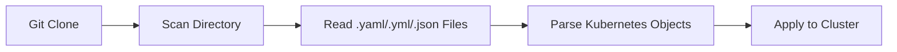

# How to Deploy Plain YAML Manifests with ArgoCD

Author: [nawazdhandala](https://github.com/nawazdhandala)

Tags: ArgoCD, GitOps, Kubernetes, YAML, Deployment

Description: Learn how to deploy plain Kubernetes YAML manifests with ArgoCD without Helm or Kustomize, using the directory source type for straightforward GitOps workflows.

---

Not every Kubernetes deployment needs Helm charts or Kustomize overlays. Sometimes plain YAML files in a Git directory are exactly the right approach - simple, explicit, and easy for anyone on the team to understand. ArgoCD handles plain YAML manifests natively through its directory source type, making it the simplest way to get started with GitOps.

## When Plain YAML Makes Sense

Plain YAML is the right choice when:

- You have a small number of resources that do not need templating
- You want maximum readability with no abstraction layers
- Your team is new to Kubernetes and does not need Helm or Kustomize complexity yet
- You are deploying one-off infrastructure components like monitoring agents or CRDs
- You want a quick proof-of-concept before adopting more sophisticated tooling

The trade-off is clear: you give up templating and reuse in exchange for simplicity and transparency.

## Setting Up a Plain YAML Directory

Create a directory in your Git repository containing standard Kubernetes manifests:

```
k8s-manifests/
  apps/
    web-app/
      namespace.yaml
      deployment.yaml
      service.yaml
      ingress.yaml
      configmap.yaml
```

Each file contains standard Kubernetes YAML. Here are examples:

```yaml
# namespace.yaml - Create the application namespace
apiVersion: v1
kind: Namespace
metadata:
  name: web-app
  labels:
    app: web-app
```

```yaml
# deployment.yaml - Application Deployment
apiVersion: apps/v1
kind: Deployment
metadata:
  name: web-app
  namespace: web-app
  labels:
    app: web-app
spec:
  replicas: 3
  selector:
    matchLabels:
      app: web-app
  template:
    metadata:
      labels:
        app: web-app
    spec:
      containers:
        - name: web-app
          image: nginx:1.25
          ports:
            - containerPort: 80
          resources:
            requests:
              cpu: 100m
              memory: 128Mi
            limits:
              cpu: 500m
              memory: 256Mi
```

```yaml
# service.yaml - ClusterIP Service
apiVersion: v1
kind: Service
metadata:
  name: web-app
  namespace: web-app
spec:
  selector:
    app: web-app
  ports:
    - port: 80
      targetPort: 80
  type: ClusterIP
```

```yaml
# configmap.yaml - Application configuration
apiVersion: v1
kind: ConfigMap
metadata:
  name: web-app-config
  namespace: web-app
data:
  APP_ENV: "production"
  LOG_LEVEL: "info"
  MAX_CONNECTIONS: "100"
```

## Creating the ArgoCD Application

Point an ArgoCD Application at your YAML directory:

```yaml
# argocd-app.yaml - ArgoCD Application for plain YAML
apiVersion: argoproj.io/v1alpha1
kind: Application
metadata:
  name: web-app
  namespace: argocd
spec:
  project: default
  source:
    repoURL: https://github.com/your-org/k8s-manifests.git
    targetRevision: main
    path: apps/web-app
    # No need to specify directory type - ArgoCD auto-detects
    # plain YAML when there are no Chart.yaml or kustomization.yaml
  destination:
    server: https://kubernetes.default.svc
    namespace: web-app
  syncPolicy:
    automated:
      prune: true
      selfHeal: true
    syncOptions:
      # Create the namespace if it does not exist
      - CreateNamespace=true
```

Apply it:

```bash
# Apply the ArgoCD Application
kubectl apply -f argocd-app.yaml

# Or create via CLI
argocd app create web-app \
  --repo https://github.com/your-org/k8s-manifests.git \
  --path apps/web-app \
  --dest-server https://kubernetes.default.svc \
  --dest-namespace web-app \
  --sync-policy automated \
  --auto-prune \
  --self-heal \
  --sync-option CreateNamespace=true
```

## How ArgoCD Processes Plain YAML

When ArgoCD detects a directory without `Chart.yaml` (Helm) or `kustomization.yaml` (Kustomize), it treats it as a plain YAML directory source. The processing pipeline is simple:



ArgoCD reads all files with `.yaml`, `.yml`, or `.json` extensions in the specified directory. Each file can contain one or more Kubernetes objects separated by `---`.

## Multi-Document YAML Files

You can put multiple resources in a single file using the `---` separator:

```yaml
# all-in-one.yaml - Multiple resources in one file
apiVersion: v1
kind: Namespace
metadata:
  name: web-app
---
apiVersion: apps/v1
kind: Deployment
metadata:
  name: web-app
  namespace: web-app
spec:
  replicas: 3
  selector:
    matchLabels:
      app: web-app
  template:
    metadata:
      labels:
        app: web-app
    spec:
      containers:
        - name: web-app
          image: nginx:1.25
          ports:
            - containerPort: 80
---
apiVersion: v1
kind: Service
metadata:
  name: web-app
  namespace: web-app
spec:
  selector:
    app: web-app
  ports:
    - port: 80
      targetPort: 80
```

Whether you use one file per resource or multi-document files is a matter of preference. Single files per resource are easier to review in pull requests and enable more precise Git blame, while multi-document files keep related resources together.

## Controlling Which Files ArgoCD Reads

By default, ArgoCD reads all YAML and JSON files in the directory. You can control this behavior with include and exclude patterns (covered in detail in our post on [including and excluding files](https://oneuptime.com/blog/post/2026-02-26-argocd-include-exclude-files-directory/view)):

```yaml
# Only include specific files
spec:
  source:
    path: apps/web-app
    directory:
      include: '*.yaml'
      exclude: 'test-*'
```

## Handling Namespaces

ArgoCD can either use the namespace specified in each manifest or override it at the Application level. With plain YAML, you have three options:

**Option 1: Namespace in each manifest** - Each YAML file specifies its own namespace:

```yaml
metadata:
  name: web-app
  namespace: web-app  # Explicit namespace in manifest
```

**Option 2: Application-level namespace** - ArgoCD applies the destination namespace to resources that do not specify one:

```yaml
# ArgoCD Application - namespace applied to resources without one
spec:
  destination:
    namespace: web-app  # Applied to resources missing namespace
```

**Option 3: Combine both** - Resources with explicit namespaces keep them, resources without get the destination namespace. Be careful with this approach as it can lead to confusion about which namespace a resource ends up in.

## Syncing and Managing Updates

With plain YAML, the deployment workflow is straightforward:

1. Edit YAML files in Git
2. Create a pull request
3. Review and merge
4. ArgoCD detects the change and syncs

```bash
# Check sync status
argocd app get web-app

# View what will be applied
argocd app diff web-app

# Manual sync if auto-sync is off
argocd app sync web-app

# View sync history
argocd app history web-app
```

## Ordering Resources with Sync Waves

Even with plain YAML, you can control the order resources are applied using ArgoCD annotations:

```yaml
# namespace.yaml - Apply first (wave -1)
apiVersion: v1
kind: Namespace
metadata:
  name: web-app
  annotations:
    argocd.argoproj.io/sync-wave: "-1"

---
# configmap.yaml - Apply second (wave 0, default)
apiVersion: v1
kind: ConfigMap
metadata:
  name: web-app-config
  namespace: web-app
  annotations:
    argocd.argoproj.io/sync-wave: "0"

---
# deployment.yaml - Apply third (wave 1)
apiVersion: apps/v1
kind: Deployment
metadata:
  name: web-app
  namespace: web-app
  annotations:
    argocd.argoproj.io/sync-wave: "1"
```

## Limitations of Plain YAML

While simple, plain YAML has clear limitations:

- **No templating** - You cannot parameterize values. Every environment needs its own copy of every file.
- **No variable substitution** - You cannot use variables for image tags, replica counts, or other values that change between deployments.
- **Code duplication** - Similar applications in different environments require duplicated YAML.
- **No dependency management** - There is no package manager or chart repository.

When these limitations start causing pain, consider migrating to Kustomize (for patching existing YAML) or Helm (for full templating). ArgoCD supports all three, so migration can be incremental.

## Best Practices

**One resource per file** - This makes Git diffs cleaner and easier to review.

**Use consistent naming** - Name files after the resource type: `deployment.yaml`, `service.yaml`, `configmap.yaml`.

**Include resource requests and limits** - Even in plain YAML, always specify resource requests and limits for containers.

**Add labels consistently** - Use a consistent labeling scheme across all resources so ArgoCD can track them properly.

**Keep directories focused** - Each ArgoCD Application should point to a directory containing resources for a single logical application. Do not mix unrelated resources.

For more on organizing your YAML files effectively, see our guide on [organizing plain YAML manifests for ArgoCD](https://oneuptime.com/blog/post/2026-02-26-argocd-organize-plain-yaml-manifests/view). If you have nested directories, check out [directory recursion in ArgoCD](https://oneuptime.com/blog/post/2026-02-26-argocd-directory-recursion/view).
