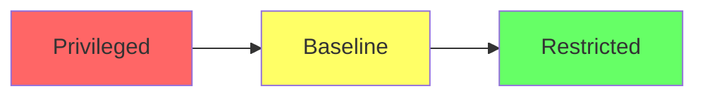

# How to Deploy PodSecurityPolicies with ArgoCD

Author: [nawazdhandala](https://github.com/nawazdhandala)

Tags: ArgoCD, GitOps, Kubernetes, Pod Security, Security Standards

Description: Learn how to deploy Pod Security Standards and admission controls with ArgoCD, including the migration from deprecated PodSecurityPolicies to Pod Security Admission.

---

PodSecurityPolicies (PSPs) were the original Kubernetes mechanism for controlling security-sensitive aspects of pod specifications. They were deprecated in Kubernetes 1.21 and removed in 1.25. The replacement is Pod Security Admission (PSA), which uses Pod Security Standards. This guide covers both approaches - PSA for modern clusters and the concepts behind PSPs for teams still migrating.

## The State of Pod Security in Kubernetes

Here is the timeline:

- **Kubernetes 1.0 to 1.24**: PodSecurityPolicies available
- **Kubernetes 1.21**: PSPs deprecated
- **Kubernetes 1.22**: Pod Security Admission (PSA) introduced as alpha
- **Kubernetes 1.23**: PSA moved to beta
- **Kubernetes 1.25**: PSPs removed, PSA is GA

If your cluster runs Kubernetes 1.25 or later, you should use Pod Security Admission exclusively.

## Pod Security Standards

Pod Security Admission defines three security levels:



- **Privileged**: No restrictions. Pods can do anything.
- **Baseline**: Prevents known privilege escalations. Blocks hostNetwork, hostPID, privileged containers, etc.
- **Restricted**: Heavily restricted. Requires running as non-root, read-only root filesystem, dropping all capabilities.

## Deploying Pod Security with ArgoCD

Apply Pod Security Standards at the namespace level using labels:

```yaml
# platform/namespaces/production.yaml
apiVersion: v1
kind: Namespace
metadata:
  name: production
  labels:
    # Enforce restricted policy - reject non-compliant pods
    pod-security.kubernetes.io/enforce: restricted
    pod-security.kubernetes.io/enforce-version: latest

    # Warn about baseline violations in audit logs
    pod-security.kubernetes.io/audit: restricted
    pod-security.kubernetes.io/audit-version: latest

    # Show warnings to users for baseline violations
    pod-security.kubernetes.io/warn: restricted
    pod-security.kubernetes.io/warn-version: latest
```

Manage namespace labels through ArgoCD:

```yaml
apiVersion: argoproj.io/v1alpha1
kind: Application
metadata:
  name: namespace-security
  namespace: argocd
spec:
  project: default
  source:
    repoURL: https://github.com/myorg/gitops
    targetRevision: main
    path: platform/namespaces
  destination:
    server: https://kubernetes.default.svc
  syncPolicy:
    automated:
      prune: false       # Never delete namespaces automatically
      selfHeal: true      # Revert label changes
```

The `selfHeal: true` is important here. If someone removes the security labels to bypass restrictions, ArgoCD restores them immediately.

## Different Security Levels Per Namespace

Use different security levels based on the namespace's purpose:

```yaml
# platform/namespaces/production.yaml - Strict
apiVersion: v1
kind: Namespace
metadata:
  name: production
  labels:
    pod-security.kubernetes.io/enforce: restricted
    pod-security.kubernetes.io/warn: restricted

---
# platform/namespaces/staging.yaml - Moderate
apiVersion: v1
kind: Namespace
metadata:
  name: staging
  labels:
    pod-security.kubernetes.io/enforce: baseline
    pod-security.kubernetes.io/warn: restricted

---
# platform/namespaces/monitoring.yaml - Some privileged needs
apiVersion: v1
kind: Namespace
metadata:
  name: monitoring
  labels:
    pod-security.kubernetes.io/enforce: baseline
    pod-security.kubernetes.io/warn: baseline

---
# platform/namespaces/kube-system.yaml - System level
apiVersion: v1
kind: Namespace
metadata:
  name: kube-system
  labels:
    pod-security.kubernetes.io/enforce: privileged
```

## Writing Pods That Pass Restricted Security

When enforcing `restricted` security, your pods must meet strict requirements. Here is a compliant Deployment:

```yaml
apiVersion: apps/v1
kind: Deployment
metadata:
  name: myapp
  namespace: production
spec:
  replicas: 3
  selector:
    matchLabels:
      app: myapp
  template:
    metadata:
      labels:
        app: myapp
    spec:
      # Required: Run as non-root
      securityContext:
        runAsNonRoot: true
        seccompProfile:
          type: RuntimeDefault

      containers:
        - name: myapp
          image: myapp:1.0.0
          ports:
            - containerPort: 8080
          securityContext:
            # Required: Explicitly non-root
            runAsNonRoot: true
            runAsUser: 1000
            runAsGroup: 1000

            # Required: No privilege escalation
            allowPrivilegeEscalation: false

            # Required: Drop all capabilities
            capabilities:
              drop:
                - ALL

            # Recommended: Read-only root filesystem
            readOnlyRootFilesystem: true

          # If the app needs writable directories, use emptyDir
          volumeMounts:
            - name: tmp
              mountPath: /tmp
            - name: cache
              mountPath: /app/cache

      volumes:
        - name: tmp
          emptyDir: {}
        - name: cache
          emptyDir: {}
```

## Handling Infrastructure Pods That Need Elevated Permissions

Some workloads legitimately need elevated permissions (monitoring agents, network plugins, storage drivers). These should run in namespaces with appropriate security levels:

```yaml
# Namespace for infrastructure DaemonSets
apiVersion: v1
kind: Namespace
metadata:
  name: infrastructure
  labels:
    pod-security.kubernetes.io/enforce: privileged
    pod-security.kubernetes.io/audit: baseline
    pod-security.kubernetes.io/warn: baseline
```

Infrastructure workload example:

```yaml
apiVersion: apps/v1
kind: DaemonSet
metadata:
  name: node-exporter
  namespace: infrastructure
spec:
  selector:
    matchLabels:
      app: node-exporter
  template:
    metadata:
      labels:
        app: node-exporter
    spec:
      hostNetwork: true
      hostPID: true
      containers:
        - name: node-exporter
          image: prom/node-exporter:v1.7.0
          ports:
            - containerPort: 9100
              hostPort: 9100
          securityContext:
            privileged: false
            capabilities:
              add: ["SYS_TIME"]
          volumeMounts:
            - name: proc
              mountPath: /host/proc
              readOnly: true
      volumes:
        - name: proc
          hostPath:
            path: /proc
```

## Using Kyverno or OPA Gatekeeper for Fine-Grained Control

Pod Security Admission is namespace-level and offers only three policy levels. For more granular control, use Kyverno or OPA Gatekeeper deployed through ArgoCD:

### Kyverno Policies

```yaml
# Deploy Kyverno through ArgoCD
apiVersion: argoproj.io/v1alpha1
kind: Application
metadata:
  name: kyverno
  namespace: argocd
spec:
  project: default
  source:
    repoURL: https://kyverno.github.io/kyverno
    chart: kyverno
    targetRevision: 3.1.0
  destination:
    server: https://kubernetes.default.svc
    namespace: kyverno
  syncPolicy:
    automated:
      prune: true
      selfHeal: true
---
# Custom policy: Require specific labels
apiVersion: kyverno.io/v1
kind: ClusterPolicy
metadata:
  name: require-labels
spec:
  validationFailureAction: Enforce
  rules:
    - name: require-app-label
      match:
        any:
          - resources:
              kinds:
                - Deployment
                - StatefulSet
      validate:
        message: "The label 'app' is required"
        pattern:
          metadata:
            labels:
              app: "?*"
---
# Custom policy: Disallow latest tag
apiVersion: kyverno.io/v1
kind: ClusterPolicy
metadata:
  name: disallow-latest-tag
spec:
  validationFailureAction: Enforce
  rules:
    - name: validate-image-tag
      match:
        any:
          - resources:
              kinds:
                - Deployment
                - StatefulSet
                - DaemonSet
      validate:
        message: "Using 'latest' tag is not allowed"
        pattern:
          spec:
            template:
              spec:
                containers:
                  - image: "!*:latest"
```

### OPA Gatekeeper Constraints

```yaml
# Deploy Gatekeeper
apiVersion: argoproj.io/v1alpha1
kind: Application
metadata:
  name: gatekeeper
  namespace: argocd
spec:
  project: default
  source:
    repoURL: https://open-policy-agent.github.io/gatekeeper/charts
    chart: gatekeeper
    targetRevision: 3.14.0
  destination:
    server: https://kubernetes.default.svc
    namespace: gatekeeper-system
  syncPolicy:
    automated:
      prune: true
      selfHeal: true
---
# Template for required labels
apiVersion: templates.gatekeeper.sh/v1
kind: ConstraintTemplate
metadata:
  name: k8srequiredlabels
spec:
  crd:
    spec:
      names:
        kind: K8sRequiredLabels
      validation:
        openAPIV3Schema:
          type: object
          properties:
            labels:
              type: array
              items:
                type: string
  targets:
    - target: admission.k8s.gatekeeper.sh
      rego: |
        package k8srequiredlabels
        violation[{"msg": msg}] {
          provided := {label | input.review.object.metadata.labels[label]}
          required := {label | label := input.parameters.labels[_]}
          missing := required - provided
          count(missing) > 0
          msg := sprintf("Missing required labels: %v", [missing])
        }
```

## Gradual Migration Strategy

If you are migrating from no security controls to restricted mode, use a gradual approach through ArgoCD:

```yaml
# Phase 1: Warn only (no enforcement)
labels:
  pod-security.kubernetes.io/enforce: privileged
  pod-security.kubernetes.io/warn: restricted
  pod-security.kubernetes.io/audit: restricted

# Phase 2: Enforce baseline, warn restricted
labels:
  pod-security.kubernetes.io/enforce: baseline
  pod-security.kubernetes.io/warn: restricted
  pod-security.kubernetes.io/audit: restricted

# Phase 3: Enforce restricted
labels:
  pod-security.kubernetes.io/enforce: restricted
```

Each phase is a Git commit, reviewed and approved before merging. ArgoCD applies the changes automatically.

## Summary

Pod security in modern Kubernetes is handled through Pod Security Admission labels on namespaces, replacing the deprecated PodSecurityPolicies. Managing these labels through ArgoCD gives you version-controlled, reviewable security policy changes with automatic enforcement through self-healing. Use the restricted level for application namespaces, baseline for shared services, and privileged only for system-level infrastructure. For fine-grained control beyond the three standard levels, deploy Kyverno or OPA Gatekeeper through ArgoCD as well. The gradual migration approach - starting with warnings and moving to enforcement - lets you adopt strong security without breaking existing workloads.
