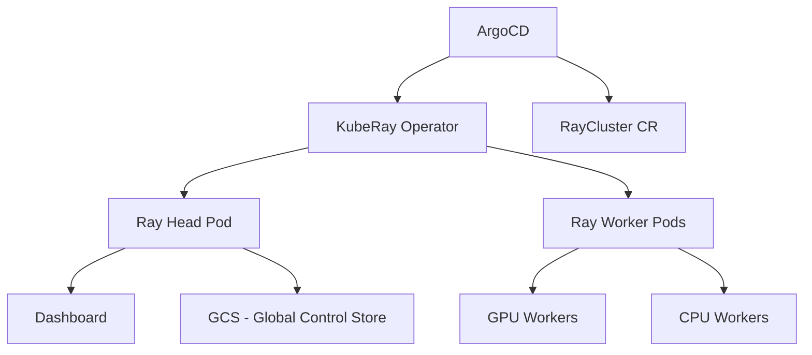

# How to Deploy Ray Clusters with ArgoCD

Author: [nawazdhandala](https://github.com/nawazdhandala)

Tags: ArgoCD, GitOps, Kubernetes, Ray, Distributed Computing

Description: Learn how to deploy and manage Ray clusters on Kubernetes using ArgoCD for distributed machine learning training, serving, and data processing workloads.

---

Ray is a distributed computing framework that has become the backbone of many ML platforms. It powers distributed training, hyperparameter tuning, model serving with Ray Serve, and data processing with Ray Data. Deploying Ray clusters on Kubernetes with ArgoCD gives you reproducible, version-controlled infrastructure for your distributed workloads.

This guide walks through deploying Ray clusters using the KubeRay operator, all managed through ArgoCD and GitOps.

## Architecture

A Ray deployment on Kubernetes consists of:



The KubeRay operator watches for RayCluster custom resources and manages the lifecycle of Ray head and worker nodes.

## Step 1: Deploy the KubeRay Operator

First, deploy the KubeRay operator through ArgoCD:

```yaml
# kuberay-operator-app.yaml
apiVersion: argoproj.io/v1alpha1
kind: Application
metadata:
  name: kuberay-operator
  namespace: argocd
spec:
  project: ml-infrastructure
  source:
    repoURL: https://ray-project.github.io/kuberay-helm/
    chart: kuberay-operator
    targetRevision: 1.1.0
    helm:
      values: |
        image:
          repository: quay.io/kuberay/operator
          tag: v1.1.0
        resources:
          limits:
            cpu: "2"
            memory: "2Gi"
          requests:
            cpu: "500m"
            memory: "512Mi"
        serviceAccount:
          create: true
        batchScheduler:
          enabled: false
  destination:
    server: https://kubernetes.default.svc
    namespace: kuberay-system
  syncPolicy:
    automated:
      prune: true
      selfHeal: true
    syncOptions:
      - CreateNamespace=true
      - ServerSideApply=true
```

The `ServerSideApply` option handles the large CRD definitions that KubeRay creates.

## Step 2: Define the RayCluster Custom Resource

Create a RayCluster specification in your Git repository:

```yaml
# ray-clusters/production/raycluster.yaml
apiVersion: ray.io/v1
kind: RayCluster
metadata:
  name: ml-cluster
  labels:
    environment: production
    team: ml-platform
spec:
  rayVersion: '2.9.0'
  enableInTreeAutoscaling: true
  autoscalerOptions:
    upscalingMode: Default
    idleTimeoutSeconds: 300
    resources:
      limits:
        cpu: "1"
        memory: "1Gi"
      requests:
        cpu: "500m"
        memory: "512Mi"
  headGroupSpec:
    rayStartParams:
      dashboard-host: '0.0.0.0'
      num-cpus: '0'  # Don't schedule tasks on head
    template:
      metadata:
        labels:
          ray-node: head
      spec:
        containers:
          - name: ray-head
            image: rayproject/ray-ml:2.9.0-py310-gpu
            ports:
              - containerPort: 6379
                name: gcs
              - containerPort: 8265
                name: dashboard
              - containerPort: 10001
                name: client
              - containerPort: 8000
                name: serve
            resources:
              limits:
                cpu: "4"
                memory: "16Gi"
              requests:
                cpu: "2"
                memory: "8Gi"
            volumeMounts:
              - name: ray-logs
                mountPath: /tmp/ray
        volumes:
          - name: ray-logs
            emptyDir: {}
  workerGroupSpecs:
    # GPU workers for training
    - groupName: gpu-workers
      replicas: 2
      minReplicas: 0
      maxReplicas: 8
      rayStartParams:
        num-gpus: '1'
      template:
        metadata:
          labels:
            ray-node: worker
            worker-type: gpu
        spec:
          nodeSelector:
            nvidia.com/gpu.present: "true"
          tolerations:
            - key: nvidia.com/gpu
              operator: Exists
              effect: NoSchedule
          containers:
            - name: ray-worker
              image: rayproject/ray-ml:2.9.0-py310-gpu
              resources:
                limits:
                  cpu: "8"
                  memory: "32Gi"
                  nvidia.com/gpu: "1"
                requests:
                  cpu: "4"
                  memory: "16Gi"
                  nvidia.com/gpu: "1"
              volumeMounts:
                - name: ray-logs
                  mountPath: /tmp/ray
                - name: shm
                  mountPath: /dev/shm
          volumes:
            - name: ray-logs
              emptyDir: {}
            - name: shm
              emptyDir:
                medium: Memory
                sizeLimit: 8Gi
    # CPU workers for data processing
    - groupName: cpu-workers
      replicas: 4
      minReplicas: 2
      maxReplicas: 20
      rayStartParams:
        num-cpus: '8'
      template:
        metadata:
          labels:
            ray-node: worker
            worker-type: cpu
        spec:
          containers:
            - name: ray-worker
              image: rayproject/ray-ml:2.9.0-py310
              resources:
                limits:
                  cpu: "8"
                  memory: "32Gi"
                requests:
                  cpu: "4"
                  memory: "16Gi"
              volumeMounts:
                - name: ray-logs
                  mountPath: /tmp/ray
          volumes:
            - name: ray-logs
              emptyDir: {}
```

Key configuration choices here:

- The head node has `num-cpus: '0'` to prevent task scheduling on it, keeping it available for cluster management
- GPU workers have shared memory mounts for distributed training with NCCL
- Autoscaling is enabled with separate min/max for each worker group
- CPU and GPU workers are separate groups so they can scale independently

## Step 3: Create Services for Ray

Expose the Ray dashboard and client endpoint:

```yaml
# ray-clusters/production/services.yaml
apiVersion: v1
kind: Service
metadata:
  name: ml-cluster-head-svc
spec:
  selector:
    ray-node: head
  ports:
    - name: dashboard
      port: 8265
      targetPort: 8265
    - name: client
      port: 10001
      targetPort: 10001
    - name: serve
      port: 8000
      targetPort: 8000
---
apiVersion: networking.k8s.io/v1
kind: Ingress
metadata:
  name: ray-dashboard
  annotations:
    nginx.ingress.kubernetes.io/auth-type: basic
    nginx.ingress.kubernetes.io/auth-secret: ray-basic-auth
spec:
  ingressClassName: nginx
  rules:
    - host: ray.example.com
      http:
        paths:
          - path: /
            pathType: Prefix
            backend:
              service:
                name: ml-cluster-head-svc
                port:
                  number: 8265
```

## Step 4: The ArgoCD Application

Wire everything together with an ArgoCD Application:

```yaml
apiVersion: argoproj.io/v1alpha1
kind: Application
metadata:
  name: ray-cluster-production
  namespace: argocd
  labels:
    team: ml-platform
    component: ray
spec:
  project: ml-infrastructure
  source:
    repoURL: https://github.com/myorg/ml-platform.git
    targetRevision: main
    path: ray-clusters/production
  destination:
    server: https://kubernetes.default.svc
    namespace: ray
  syncPolicy:
    automated:
      prune: true
      selfHeal: true
    syncOptions:
      - CreateNamespace=true
      - RespectIgnoreDifferences=true
  ignoreDifferences:
    - group: ray.io
      kind: RayCluster
      jsonPointers:
        - /spec/workerGroupSpecs/0/replicas
        - /spec/workerGroupSpecs/1/replicas
```

The `ignoreDifferences` configuration is critical. The Ray autoscaler modifies worker replica counts dynamically. Without ignoring these differences, ArgoCD would constantly fight with the autoscaler, resetting the replica count on every sync.

## Step 5: Deploy RayService for Model Serving

For serving ML models with Ray Serve, use the RayService resource:

```yaml
# ray-clusters/production/rayservice.yaml
apiVersion: ray.io/v1
kind: RayService
metadata:
  name: recommendation-service
spec:
  serviceUnhealthySecondThreshold: 300
  deploymentUnhealthySecondThreshold: 300
  serveConfigV2: |
    applications:
      - name: recommendation
        route_prefix: /recommend
        import_path: serve_app:app
        runtime_env:
          working_dir: "https://github.com/myorg/models/archive/v1.0.0.zip"
          pip:
            - torch==2.1.0
            - transformers==4.36.0
        deployments:
          - name: RecommendationModel
            num_replicas: 3
            ray_actor_options:
              num_gpus: 1
              num_cpus: 4
  rayClusterConfig:
    rayVersion: '2.9.0'
    headGroupSpec:
      rayStartParams:
        dashboard-host: '0.0.0.0'
      template:
        spec:
          containers:
            - name: ray-head
              image: rayproject/ray-ml:2.9.0-py310-gpu
              resources:
                requests:
                  cpu: "2"
                  memory: "8Gi"
    workerGroupSpecs:
      - groupName: gpu-workers
        replicas: 3
        minReplicas: 3
        maxReplicas: 10
        rayStartParams:
          num-gpus: '1'
        template:
          spec:
            nodeSelector:
              nvidia.com/gpu.present: "true"
            tolerations:
              - key: nvidia.com/gpu
                operator: Exists
                effect: NoSchedule
            containers:
              - name: ray-worker
                image: rayproject/ray-ml:2.9.0-py310-gpu
                resources:
                  limits:
                    nvidia.com/gpu: "1"
                    cpu: "8"
                    memory: "32Gi"
                  requests:
                    nvidia.com/gpu: "1"
                    cpu: "4"
                    memory: "16Gi"
```

## Handling Ray Version Upgrades

Upgrading Ray versions requires careful coordination. The recommended approach is:

1. Update the image tags in your Git repository
2. Let ArgoCD detect the change
3. ArgoCD will perform a rolling update of the cluster

For major version upgrades, consider creating a new RayCluster alongside the old one and migrating traffic:

```yaml
# Create a new cluster with the new version
apiVersion: ray.io/v1
kind: RayCluster
metadata:
  name: ml-cluster-v2
spec:
  rayVersion: '2.10.0'
  # ... same config with new image tags
```

## Monitoring Ray with ArgoCD

Add Prometheus monitoring for your Ray cluster:

```yaml
apiVersion: monitoring.coreos.com/v1
kind: ServiceMonitor
metadata:
  name: ray-metrics
spec:
  selector:
    matchLabels:
      ray-node: head
  endpoints:
    - port: dashboard
      path: /api/prometheus_health
      interval: 30s
```

## Best Practices

1. **Separate operator and cluster lifecycle** - Deploy the KubeRay operator as a separate ArgoCD Application from your RayCluster resources. This lets you upgrade the operator independently.

2. **Use ignore differences for autoscaled fields** - Always configure `ignoreDifferences` for replica counts that the autoscaler manages.

3. **Pin Ray versions** - Use specific version tags, not `latest`. Ray version mismatches between head and workers cause subtle bugs.

4. **Size your head node appropriately** - The head node runs the GCS (Global Control Store). For large clusters, it needs more memory.

5. **Monitor object store memory** - Ray's object store uses shared memory. If workers run out, tasks will spill to disk and slow down significantly.

Deploying Ray with ArgoCD gives you reproducible distributed computing infrastructure. Every configuration change goes through Git, making it easy to track what changed, roll back failed upgrades, and maintain consistency across environments.
