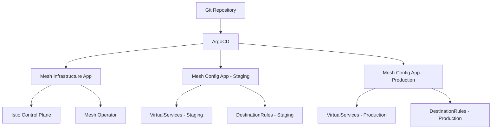

# How to Deploy Service Mesh Configuration with ArgoCD

Author: [nawazdhandala](https://github.com/nawazdhandala)

Tags: ArgoCD, GitOps, Kubernetes, Service Mesh, Istio

Description: Learn how to deploy and manage service mesh configurations like Istio and Linkerd using ArgoCD for consistent, version-controlled mesh management across clusters.

---

Service mesh configurations are notoriously complex. Between traffic routing rules, mutual TLS policies, retry budgets, and observability settings, there are dozens of custom resources that need to be deployed and kept in sync. Managing these manually with kubectl is a recipe for configuration drift and outages.

ArgoCD brings GitOps discipline to service mesh management, ensuring that every mesh configuration change is tracked in Git, reviewed through pull requests, and deployed consistently across environments.

## Why GitOps for Service Mesh

Service mesh configurations have characteristics that make them ideal for GitOps:

- **They are declarative** - CRDs like VirtualService, DestinationRule, and ServiceProfile are YAML manifests
- **They affect traffic flow** - misconfiguration can cause outages, so version control and review are critical
- **They span multiple namespaces** - centralized management through ArgoCD prevents inconsistencies
- **They need to be consistent across environments** - GitOps ensures staging mirrors production

## Architecture for Mesh Management

A common pattern is to separate mesh infrastructure from mesh configuration:



## Step 1: Deploy the Mesh Infrastructure

Start by managing the service mesh installation itself through ArgoCD. Here is an example with Istio using the Helm chart:

```yaml
# istio-base application
apiVersion: argoproj.io/v1alpha1
kind: Application
metadata:
  name: istio-base
  namespace: argocd
  annotations:
    argocd.argoproj.io/sync-wave: "0"
spec:
  project: infrastructure
  source:
    repoURL: https://istio-release.storage.googleapis.com/charts
    chart: base
    targetRevision: 1.21.0
    helm:
      releaseName: istio-base
  destination:
    server: https://kubernetes.default.svc
    namespace: istio-system
  syncPolicy:
    automated:
      selfHeal: true
    syncOptions:
      - CreateNamespace=true
---
# istiod application
apiVersion: argoproj.io/v1alpha1
kind: Application
metadata:
  name: istiod
  namespace: argocd
  annotations:
    argocd.argoproj.io/sync-wave: "1"
spec:
  project: infrastructure
  source:
    repoURL: https://istio-release.storage.googleapis.com/charts
    chart: istiod
    targetRevision: 1.21.0
    helm:
      releaseName: istiod
      valuesObject:
        meshConfig:
          accessLogFile: /dev/stdout
          enableTracing: true
          defaultConfig:
            tracing:
              zipkin:
                address: jaeger-collector.observability:9411
        pilot:
          resources:
            requests:
              cpu: 500m
              memory: 2Gi
  destination:
    server: https://kubernetes.default.svc
    namespace: istio-system
  syncPolicy:
    automated:
      selfHeal: true
```

## Step 2: Define Custom Health Checks

ArgoCD needs custom health checks for service mesh CRDs because it does not understand their status conditions out of the box:

```yaml
apiVersion: v1
kind: ConfigMap
metadata:
  name: argocd-cm
  namespace: argocd
data:
  # Istio VirtualService health check
  resource.customizations.health.networking.istio.io_VirtualService: |
    hs = {}
    if obj.spec ~= nil and obj.spec.hosts ~= nil then
      hs.status = "Healthy"
      hs.message = "VirtualService configured for " ..
        table.concat(obj.spec.hosts, ", ")
    else
      hs.status = "Degraded"
      hs.message = "No hosts configured"
    end
    return hs

  # Istio DestinationRule health check
  resource.customizations.health.networking.istio.io_DestinationRule: |
    hs = {}
    if obj.spec ~= nil and obj.spec.host ~= nil then
      hs.status = "Healthy"
      hs.message = "DestinationRule for " .. obj.spec.host
    else
      hs.status = "Degraded"
      hs.message = "No host configured"
    end
    return hs

  # Istio Gateway health check
  resource.customizations.health.networking.istio.io_Gateway: |
    hs = {}
    if obj.spec ~= nil and obj.spec.servers ~= nil then
      hs.status = "Healthy"
      hs.message = tostring(#obj.spec.servers) ..
        " server(s) configured"
    else
      hs.status = "Degraded"
      hs.message = "No servers configured"
    end
    return hs

  # Linkerd ServiceProfile health check
  resource.customizations.health.linkerd.io_ServiceProfile: |
    hs = {}
    if obj.spec ~= nil then
      hs.status = "Healthy"
      local routes = obj.spec.routes or {}
      hs.message = tostring(#routes) .. " route(s) defined"
    else
      hs.status = "Degraded"
      hs.message = "No spec defined"
    end
    return hs
```

## Step 3: Organize Mesh Configuration in Git

Structure your repository to separate mesh configs by environment:

```text
mesh-config/
  base/
    kustomization.yaml
    virtual-services/
      api-gateway.yaml
      web-frontend.yaml
    destination-rules/
      api-gateway.yaml
      web-frontend.yaml
    peer-authentication/
      default-strict-mtls.yaml
  overlays/
    staging/
      kustomization.yaml
      patches/
        api-gateway-routing.yaml
    production/
      kustomization.yaml
      patches/
        api-gateway-routing.yaml
        canary-weights.yaml
```

Base VirtualService example:

```yaml
# base/virtual-services/api-gateway.yaml
apiVersion: networking.istio.io/v1beta1
kind: VirtualService
metadata:
  name: api-gateway
spec:
  hosts:
    - api.example.com
  gateways:
    - istio-system/main-gateway
  http:
    - match:
        - uri:
            prefix: /v1
      route:
        - destination:
            host: api-v1
            port:
              number: 8080
    - match:
        - uri:
            prefix: /v2
      route:
        - destination:
            host: api-v2
            port:
              number: 8080
```

## Step 4: Create ArgoCD Applications for Mesh Config

```yaml
# Mesh config for staging
apiVersion: argoproj.io/v1alpha1
kind: Application
metadata:
  name: mesh-config-staging
  namespace: argocd
spec:
  project: mesh
  source:
    repoURL: https://github.com/your-org/mesh-config
    path: overlays/staging
    targetRevision: main
  destination:
    server: https://kubernetes.default.svc
    namespace: default
  syncPolicy:
    automated:
      selfHeal: true
      prune: true
    syncOptions:
      - ApplyOutOfSyncOnly=true

---
# Mesh config for production - manual sync required
apiVersion: argoproj.io/v1alpha1
kind: Application
metadata:
  name: mesh-config-production
  namespace: argocd
spec:
  project: mesh
  source:
    repoURL: https://github.com/your-org/mesh-config
    path: overlays/production
    targetRevision: main
  destination:
    server: https://production-cluster:6443
    namespace: default
  syncPolicy:
    # No automated sync for production mesh changes
    syncOptions:
      - ApplyOutOfSyncOnly=true
      - Validate=true
```

## Step 5: Sync Ordering for Mesh Resources

Mesh resources have dependencies. Use sync waves to ensure correct ordering:

```yaml
# Deploy CRDs first (wave -1)
apiVersion: networking.istio.io/v1beta1
kind: Gateway
metadata:
  name: main-gateway
  annotations:
    argocd.argoproj.io/sync-wave: "-1"
spec:
  selector:
    istio: ingressgateway
  servers:
    - port:
        number: 443
        name: https
        protocol: HTTPS
      tls:
        mode: SIMPLE
        credentialName: tls-secret
      hosts:
        - "*.example.com"

---
# Deploy VirtualServices after Gateway (wave 0)
apiVersion: networking.istio.io/v1beta1
kind: VirtualService
metadata:
  name: api-gateway
  annotations:
    argocd.argoproj.io/sync-wave: "0"
spec:
  hosts:
    - api.example.com
  gateways:
    - main-gateway
  http:
    - route:
        - destination:
            host: api-service

---
# Deploy DestinationRules last (wave 1)
apiVersion: networking.istio.io/v1beta1
kind: DestinationRule
metadata:
  name: api-service
  annotations:
    argocd.argoproj.io/sync-wave: "1"
spec:
  host: api-service
  trafficPolicy:
    connectionPool:
      tcp:
        maxConnections: 100
      http:
        h2UpgradePolicy: DEFAULT
    loadBalancer:
      simple: LEAST_REQUEST
```

## Handling Mesh Upgrades

When upgrading the service mesh version, use a progressive approach:

1. Update the control plane first (ArgoCD syncs the Helm chart version change)
2. Run data plane upgrades with rolling restarts
3. Validate traffic health between stages

```yaml
# Pre-sync hook to validate mesh health before upgrade
apiVersion: batch/v1
kind: Job
metadata:
  name: mesh-health-check
  annotations:
    argocd.argoproj.io/hook: PreSync
    argocd.argoproj.io/hook-delete-policy: HookSucceeded
spec:
  template:
    spec:
      containers:
        - name: check
          image: istio/istioctl:1.21.0
          command:
            - istioctl
            - analyze
            - --all-namespaces
      restartPolicy: Never
  backoffLimit: 1
```

## Summary

Managing service mesh configuration with ArgoCD brings version control, code review, and automated deployment to one of the most complex parts of your Kubernetes infrastructure. Separate mesh infrastructure from mesh configuration, use custom health checks so ArgoCD understands mesh resource status, and leverage sync waves to deploy resources in the correct order. This approach ensures consistent, auditable mesh management across all your clusters and environments.

For specific mesh implementations, see our guides on [managing Istio Virtual Services](https://oneuptime.com/blog/post/2026-02-26-argocd-manage-istio-virtual-services/view) and [managing Linkerd Service Profiles](https://oneuptime.com/blog/post/2026-02-26-argocd-manage-linkerd-service-profiles/view).
