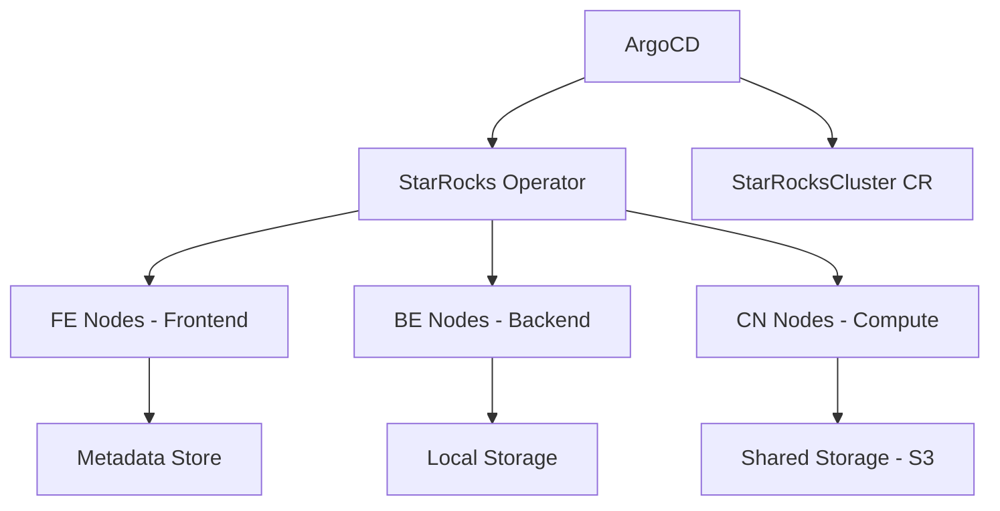

# How to Deploy StarRocks with ArgoCD

Author: [nawazdhandala](https://github.com/nawazdhandala)

Tags: ArgoCD, GitOps, Kubernetes, StarRocks, Analytics

Description: Learn how to deploy StarRocks on Kubernetes using ArgoCD and the StarRocks Operator for GitOps-managed real-time analytical data warehouse infrastructure.

---

StarRocks is a high-performance analytical database built for real-time, sub-second queries over large datasets. It supports both real-time ingestion and batch loading, making it a popular choice for analytics platforms that need to serve dashboards and ad-hoc queries simultaneously. Deploying StarRocks on Kubernetes with ArgoCD gives you a GitOps-managed analytical data warehouse where cluster configuration, scaling, and upgrades are all version-controlled.

This guide covers deploying StarRocks using the official StarRocks Operator, managed by ArgoCD.

## Architecture



StarRocks has three node types:

- **FE (Frontend)** - query parsing, planning, and metadata management
- **BE (Backend)** - data storage and query execution
- **CN (Compute Node)** - stateless compute for shared-data mode

## Step 1: Deploy the StarRocks Operator

```yaml
# starrocks-operator-app.yaml
apiVersion: argoproj.io/v1alpha1
kind: Application
metadata:
  name: starrocks-operator
  namespace: argocd
spec:
  project: data-infrastructure
  source:
    repoURL: https://starrocks.github.io/starrocks-kubernetes-operator
    chart: kube-starrocks
    targetRevision: 1.9.0
    helm:
      values: |
        operator:
          resources:
            requests:
              cpu: "200m"
              memory: "256Mi"
            limits:
              cpu: "1"
              memory: "512Mi"
        # Only install the operator, not the cluster
        starrocks:
          enabled: false
  destination:
    server: https://kubernetes.default.svc
    namespace: starrocks-operator
  syncPolicy:
    automated:
      prune: true
      selfHeal: true
    syncOptions:
      - CreateNamespace=true
      - ServerSideApply=true
```

## Step 2: Define the StarRocks Cluster

Deploy a production StarRocks cluster using the StarRocksCluster CR:

```yaml
# starrocks/production/cluster.yaml
apiVersion: starrocks.com/v1
kind: StarRocksCluster
metadata:
  name: analytics-warehouse
  labels:
    team: data-platform
spec:
  starRocksFeSpec:
    image: starrocks/fe-ubuntu:3.2.3
    replicas: 3
    limits:
      cpu: "8"
      memory: "16Gi"
    requests:
      cpu: "4"
      memory: "8Gi"
    storageVolumes:
      - name: fe-meta
        storageClassName: gp3
        storageSize: 100Gi
        mountPath: /opt/starrocks/fe/meta
    configMapInfo:
      configMapName: fe-config
      resolveKey: fe.conf
    service:
      type: ClusterIP
      ports:
        - name: http
          port: 8030
          containerPort: 8030
        - name: rpc
          port: 9020
          containerPort: 9020
        - name: query
          port: 9030
          containerPort: 9030

  starRocksBeSpec:
    image: starrocks/be-ubuntu:3.2.3
    replicas: 5
    limits:
      cpu: "16"
      memory: "64Gi"
    requests:
      cpu: "8"
      memory: "32Gi"
    storageVolumes:
      - name: be-data
        storageClassName: gp3-iops
        storageSize: 2000Gi
        mountPath: /opt/starrocks/be/storage
    configMapInfo:
      configMapName: be-config
      resolveKey: be.conf

  starRocksCnSpec:
    image: starrocks/cn-ubuntu:3.2.3
    replicas: 3
    limits:
      cpu: "16"
      memory: "32Gi"
    requests:
      cpu: "8"
      memory: "16Gi"
    autoScalingPolicy:
      minReplicas: 2
      maxReplicas: 10
      hpaPolicy:
        metrics:
          - type: Resource
            resource:
              name: cpu
              target:
                type: Utilization
                averageUtilization: 70
    configMapInfo:
      configMapName: cn-config
      resolveKey: cn.conf
```

## Step 3: Node Configurations

Each node type needs tuned configurations:

```yaml
# starrocks/production/fe-config.yaml
apiVersion: v1
kind: ConfigMap
metadata:
  name: fe-config
data:
  fe.conf: |
    LOG_DIR = ${STARROCKS_HOME}/log
    DATE = "$(date +%Y%m%d-%H%M%S)"
    JAVA_OPTS = "-Dlog4j2.formatMsgNoLookups=true -Xmx8g -XX:+UseG1GC -XX:G1HeapRegionSize=8m -XX:+UseGCOverheadLimit"

    # HTTP and RPC ports
    http_port = 8030
    rpc_port = 9020
    query_port = 9030
    edit_log_port = 9010

    # Metadata
    meta_dir = /opt/starrocks/fe/meta

    # Query settings
    max_query_retry_time = 2
    qe_slow_log_ms = 5000

    # Authentication
    authentication_ldap_simple_server_host = ""

    # Dynamic partition
    dynamic_partition_enable = true
    dynamic_partition_check_interval_seconds = 600
---
# starrocks/production/be-config.yaml
apiVersion: v1
kind: ConfigMap
metadata:
  name: be-config
data:
  be.conf: |
    LOG_DIR = ${STARROCKS_HOME}/log
    JAVA_OPTS = "-Dlog4j2.formatMsgNoLookups=true -Xmx4g -XX:+UseG1GC"

    be_port = 9060
    be_http_port = 8040
    heartbeat_service_port = 9050
    brpc_port = 8060

    # Storage
    storage_root_path = /opt/starrocks/be/storage

    # Memory
    mem_limit = 90%

    # Compaction
    base_compaction_num_threads_per_disk = 2
    cumulative_compaction_num_threads_per_disk = 4

    # Loading
    push_write_mbytes_per_sec = 100

    # Cache
    pagecache_enable = true
    file_cache_type = ""

    # Network
    thrift_server_max_worker_threads = 256
---
# starrocks/production/cn-config.yaml
apiVersion: v1
kind: ConfigMap
metadata:
  name: cn-config
data:
  cn.conf: |
    LOG_DIR = ${STARROCKS_HOME}/log
    JAVA_OPTS = "-Dlog4j2.formatMsgNoLookups=true -Xmx4g -XX:+UseG1GC"

    thrift_port = 9060
    be_http_port = 8040
    heartbeat_service_port = 9050
    brpc_port = 8060

    # Compute nodes are stateless
    mem_limit = 85%

    # Cache for shared data
    file_cache_type = "disk"
    starlet_cache_dir = /opt/starrocks/cn/cache
```

## Step 4: External Table Catalogs

Define external catalogs to query data lakes:

```yaml
# starrocks/production/init-catalogs.yaml
apiVersion: batch/v1
kind: Job
metadata:
  name: starrocks-init-catalogs
  annotations:
    argocd.argoproj.io/hook: PostSync
    argocd.argoproj.io/hook-delete-policy: HookSucceeded
spec:
  template:
    spec:
      restartPolicy: Never
      containers:
        - name: init
          image: starrocks/fe-ubuntu:3.2.3
          command:
            - /bin/bash
            - -c
            - |
              mysql -h analytics-warehouse-fe-service -P 9030 -u root <<'SQL'

              -- Create Hive catalog for data lake
              CREATE EXTERNAL CATALOG IF NOT EXISTS hive_catalog
              PROPERTIES (
                  "type" = "hive",
                  "hive.metastore.uris" = "thrift://hive-metastore:9083",
                  "aws.s3.access_key" = "${AWS_ACCESS_KEY}",
                  "aws.s3.secret_key" = "${AWS_SECRET_KEY}",
                  "aws.s3.region" = "us-east-1"
              );

              -- Create Iceberg catalog
              CREATE EXTERNAL CATALOG IF NOT EXISTS iceberg_catalog
              PROPERTIES (
                  "type" = "iceberg",
                  "iceberg.catalog.type" = "glue",
                  "aws.s3.region" = "us-east-1"
              );

              SQL
```

## Step 5: The ArgoCD Application

```yaml
apiVersion: argoproj.io/v1alpha1
kind: Application
metadata:
  name: starrocks-production
  namespace: argocd
  labels:
    team: data-platform
    component: starrocks
spec:
  project: data-infrastructure
  source:
    repoURL: https://github.com/myorg/data-platform.git
    targetRevision: main
    path: starrocks/production
  destination:
    server: https://kubernetes.default.svc
    namespace: starrocks
  syncPolicy:
    automated:
      prune: false
      selfHeal: true
    syncOptions:
      - CreateNamespace=true
      - RespectIgnoreDifferences=true
    retry:
      limit: 3
      backoff:
        duration: 1m
        factor: 2
        maxDuration: 10m
  ignoreDifferences:
    - group: starrocks.com
      kind: StarRocksCluster
      jsonPointers:
        - /status
        - /spec/starRocksCnSpec/replicas
```

The `ignoreDifferences` for CN replicas is important because the HPA changes the replica count dynamically.

## Step 6: Ingress for SQL and Web UI

```yaml
# starrocks/production/ingress.yaml
apiVersion: networking.k8s.io/v1
kind: Ingress
metadata:
  name: starrocks-ui
  annotations:
    nginx.ingress.kubernetes.io/auth-type: basic
    nginx.ingress.kubernetes.io/auth-secret: starrocks-basic-auth
    cert-manager.io/cluster-issuer: letsencrypt-prod
spec:
  ingressClassName: nginx
  tls:
    - hosts:
        - starrocks.example.com
      secretName: starrocks-tls
  rules:
    - host: starrocks.example.com
      http:
        paths:
          - path: /
            pathType: Prefix
            backend:
              service:
                name: analytics-warehouse-fe-service
                port:
                  number: 8030
```

## Monitoring StarRocks

StarRocks exposes Prometheus-compatible metrics:

```yaml
apiVersion: monitoring.coreos.com/v1
kind: ServiceMonitor
metadata:
  name: starrocks-fe-metrics
spec:
  selector:
    matchLabels:
      app.starrocks.io/component: fe
  endpoints:
    - port: http
      path: /metrics
      interval: 30s
---
apiVersion: monitoring.coreos.com/v1
kind: ServiceMonitor
metadata:
  name: starrocks-be-metrics
spec:
  selector:
    matchLabels:
      app.starrocks.io/component: be
  endpoints:
    - port: http
      path: /metrics
      interval: 30s
```

Key metrics to monitor:

- `starrocks_fe_query_latency_ms` - query performance
- `starrocks_be_compaction_score` - compaction health
- `starrocks_be_mem_tracker_bytes` - memory usage per BE node
- `starrocks_be_disk_usage_bytes` - storage utilization

## Best Practices

1. **Use Compute Nodes for elastic scaling** - CN nodes are stateless and can scale quickly based on query load.

2. **Separate storage types** - Use high-IOPS storage for BE data volumes. Query performance depends heavily on disk I/O.

3. **Size FE memory carefully** - FE holds all metadata in memory. Large numbers of tables and partitions require more FE memory.

4. **Enable dynamic partitioning** - Let StarRocks automatically manage time-based partitions to avoid manual partition management.

5. **Use external catalogs** - Query data lakes directly through Hive or Iceberg catalogs instead of loading everything into StarRocks.

6. **Ignore CN replica differences** - Since CN nodes autoscale, configure `ignoreDifferences` in ArgoCD to prevent sync conflicts.

Deploying StarRocks with ArgoCD gives you a fully GitOps-managed analytical data warehouse. Configuration changes, scaling decisions, and version upgrades all go through Git, providing full auditability and easy rollbacks.
