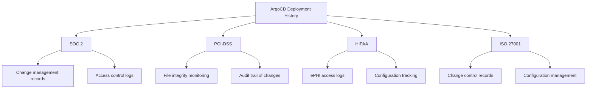

# How to Track Deployment History for Compliance with ArgoCD

Author: [nawazdhandala](https://github.com/nawazdhandala)

Tags: ArgoCD, GitOps, Kubernetes, Compliance, Deployment History

Description: Learn how to track and maintain complete deployment history in ArgoCD for compliance audits, regulatory requirements, and operational visibility.

---

Compliance auditors love paper trails. They want to know exactly what version of your software was running at any given point in time, who approved the deployment, and what changed between versions. With traditional deployment tools, building this trail is a nightmare of screenshots and manual logs. ArgoCD, combined with GitOps principles, makes deployment history tracking almost automatic.

In this guide, I will show you how to capture, store, and query deployment history in ArgoCD to satisfy compliance frameworks like SOC 2, PCI-DSS, HIPAA, and ISO 27001.

## ArgoCD Built-In History

ArgoCD automatically maintains a history of sync operations for each application. You can view this through the CLI or UI.

```bash
# View sync history for an application
argocd app history production-api

# Example output:
# ID  DATE                           REVISION
# 0   2026-01-15 10:30:00 +0000 UTC  a1b2c3d (main)
# 1   2026-01-16 14:15:00 +0000 UTC  e4f5g6h (main)
# 2   2026-01-20 09:45:00 +0000 UTC  i7j8k9l (main)
# 3   2026-02-01 11:00:00 +0000 UTC  m0n1o2p (main)
```

However, ArgoCD only keeps the last 10 revisions by default. For compliance, you need to increase this and supplement it with external storage.

```yaml
# argocd-cmd-params-cm.yaml
apiVersion: v1
kind: ConfigMap
metadata:
  name: argocd-cmd-params-cm
  namespace: argocd
data:
  # Increase revision history limit
  controller.status.processors: "50"
```

At the application level, you can control history retention.

```yaml
apiVersion: argoproj.io/v1alpha1
kind: Application
metadata:
  name: production-api
  namespace: argocd
spec:
  revisionHistoryLimit: 100  # Keep last 100 deployments
  # ... rest of spec
```

## Git as the Source of Truth for History

The strongest aspect of GitOps for compliance is that Git already provides an immutable, timestamped, authenticated record of every change. Every deployment in ArgoCD corresponds to a Git commit.

Structure your GitOps repository to make audit queries easy.

```
gitops-repo/
  apps/
    production/
      api/
        deployment.yaml
        service.yaml
        configmap.yaml
      frontend/
        deployment.yaml
        service.yaml
    staging/
      api/
        deployment.yaml
      frontend/
        deployment.yaml
  CHANGELOG.md
```

Use conventional commits to make history searchable.

```bash
# Good commit messages for compliance
git log --oneline --since="2026-01-01" --until="2026-02-01"

# Example output:
# m0n1o2p feat(api): upgrade to v2.3.1 - fixes CVE-2026-1234
# i7j8k9l fix(api): increase memory limits for production
# e4f5g6h feat(frontend): deploy v3.0.0 with new auth flow
# a1b2c3d chore(api): update configmap with new feature flags
```

## Capturing Detailed Deployment Records

Use ArgoCD notifications to capture detailed deployment records in an external system.

```yaml
# argocd-notifications-cm.yaml
apiVersion: v1
kind: ConfigMap
metadata:
  name: argocd-notifications-cm
  namespace: argocd
data:
  service.webhook.compliance-tracker: |
    url: https://compliance.internal.myorg.com/api/deployments
    headers:
      - name: Authorization
        value: Bearer $compliance-api-token
      - name: Content-Type
        value: application/json

  template.deployment-record: |
    webhook:
      compliance-tracker:
        method: POST
        body: |
          {
            "deployment_id": "{{.app.metadata.name}}-{{.app.status.operationState.syncResult.revision}}",
            "application": "{{.app.metadata.name}}",
            "project": "{{.app.spec.project}}",
            "cluster": "{{.app.spec.destination.server}}",
            "namespace": "{{.app.spec.destination.namespace}}",
            "git_repo": "{{.app.spec.source.repoURL}}",
            "git_revision": "{{.app.status.operationState.syncResult.revision}}",
            "git_path": "{{.app.spec.source.path}}",
            "status": "{{.app.status.operationState.phase}}",
            "started_at": "{{.app.status.operationState.startedAt}}",
            "finished_at": "{{.app.status.operationState.finishedAt}}",
            "initiated_by": "{{.app.status.operationState.operation.initiatedBy.username}}",
            "automated": {{.app.status.operationState.operation.initiatedBy.automated}},
            "resources": {{.app.status.operationState.syncResult.resources | toJson}},
            "images": [
              {{range $index, $img := .app.status.summary.images}}
              {{if $index}},{{end}}"{{$img}}"
              {{end}}
            ]
          }

  trigger.on-deployment-complete: |
    - when: app.status.operationState.phase in ['Succeeded']
      send: [deployment-record]
  trigger.on-deployment-failed: |
    - when: app.status.operationState.phase in ['Error', 'Failed']
      send: [deployment-record]
```

## Building a Compliance-Friendly Deployment Report

Create a script that generates deployment reports from Git history and ArgoCD.

```bash
#!/bin/bash
# generate-deployment-report.sh
# Generates a compliance report for a given date range

START_DATE=$1
END_DATE=$2
APP_NAME=$3

echo "=== Deployment Compliance Report ==="
echo "Application: $APP_NAME"
echo "Period: $START_DATE to $END_DATE"
echo "Generated: $(date -u)"
echo ""

# Get ArgoCD sync history
echo "=== Sync History ==="
argocd app history "$APP_NAME" --output json | \
  jq --arg start "$START_DATE" --arg end "$END_DATE" \
  '.[] | select(.deployedAt >= $start and .deployedAt <= $end)'

echo ""
echo "=== Git Commit History ==="
# Get git commits for the same period
git log --since="$START_DATE" --until="$END_DATE" \
  --format='{"hash":"%H","author":"%an","date":"%aI","message":"%s"}' \
  -- "apps/production/$APP_NAME/"

echo ""
echo "=== Image Versions Deployed ==="
argocd app get "$APP_NAME" -o json | \
  jq '.status.summary.images[]'
```

## Storing Deployment Artifacts

For strict compliance, store the exact manifests that were deployed, not just the Git revision.

```yaml
# post-sync-artifact-capture.yaml
apiVersion: batch/v1
kind: Job
metadata:
  name: capture-deployment-artifact
  annotations:
    argocd.argoproj.io/hook: PostSync
    argocd.argoproj.io/hook-delete-policy: HookSucceeded
spec:
  template:
    spec:
      serviceAccountName: artifact-capturer
      containers:
        - name: capture
          image: bitnami/kubectl:latest
          command:
            - /bin/sh
            - -c
            - |
              TIMESTAMP=$(date -u +%Y%m%d-%H%M%S)
              APP_NAME="production-api"
              NAMESPACE="production"

              # Capture all resources in the namespace
              kubectl get all -n "$NAMESPACE" -o yaml > "/artifacts/${APP_NAME}-${TIMESTAMP}.yaml"

              # Upload to S3 for long-term storage
              aws s3 cp "/artifacts/${APP_NAME}-${TIMESTAMP}.yaml" \
                "s3://compliance-artifacts/deployments/${APP_NAME}/${TIMESTAMP}.yaml"

              echo "Artifact captured: ${APP_NAME}-${TIMESTAMP}"
          volumeMounts:
            - name: artifacts
              mountPath: /artifacts
      volumes:
        - name: artifacts
          emptyDir: {}
      restartPolicy: Never
```

## Mapping to Compliance Frameworks

Different compliance frameworks have different requirements for deployment tracking.



For each framework, document how ArgoCD provides the required evidence.

**SOC 2 CC8.1 (Change Management)**: Git pull requests serve as change requests. ArgoCD sync logs show deployment execution. Git history provides rollback capability evidence.

**PCI-DSS 6.4 (Change Control)**: Git commits document all changes. ArgoCD Application history shows deployment timeline. Kubernetes audit logs capture API-level changes.

**HIPAA (Security Rule)**: ArgoCD SSO integration ties deployments to authenticated users. Notification webhooks create tamper-evident audit trails. Git signed commits provide non-repudiation.

## Querying Historical Deployments

Use the ArgoCD API to programmatically query deployment history.

```bash
# Get deployment history via API
curl -s -H "Authorization: Bearer $ARGOCD_TOKEN" \
  "https://argocd.myorg.com/api/v1/applications/production-api" | \
  jq '.status.history[] | {
    revision: .revision,
    deployedAt: .deployedAt,
    id: .id,
    source: .source
  }'

# Find when a specific revision was deployed
curl -s -H "Authorization: Bearer $ARGOCD_TOKEN" \
  "https://argocd.myorg.com/api/v1/applications/production-api" | \
  jq '.status.history[] | select(.revision | startswith("a1b2c3"))'
```

## Conclusion

Tracking deployment history for compliance with ArgoCD is largely about connecting the dots between existing capabilities. Git provides the change record, ArgoCD provides the deployment execution trail, Kubernetes audit logs provide the API-level detail, and notifications push all of this to your compliance platform. The key is setting up this pipeline before your first audit, not scrambling to reconstruct history after the fact. With the right configuration, you can answer any compliance question about your deployments in minutes rather than days.
