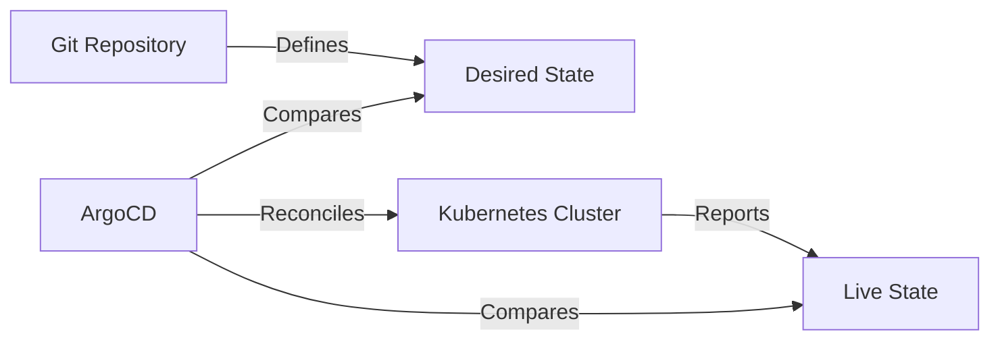

# What Does 'Desired State' Mean in ArgoCD?

Author: [nawazdhandala](https://github.com/nawazdhandala)

Tags: ArgoCD, GitOps, Kubernetes, Concepts

Description: A clear explanation of the desired state concept in ArgoCD covering how Git repositories define what should be running and how ArgoCD enforces it.

---

If you are getting started with ArgoCD, you will quickly encounter the term "desired state." It is one of the most fundamental concepts in both Kubernetes and GitOps, and understanding it properly makes everything else about ArgoCD click into place.

## The Simple Explanation

Desired state is what you want your Kubernetes cluster to look like. It is the set of resources, configurations, and settings that you have declared should exist. In ArgoCD's world, the desired state is defined by the YAML manifests stored in your Git repository.

Live state is what your cluster actually looks like right now - the real resources running with their current configurations.

ArgoCD's entire job is to compare these two states and take action when they differ.



## Desired State in Kubernetes Context

Kubernetes itself is built on the concept of desired state. When you create a Deployment, you are not saying "start three pods right now." You are saying "I desire three pods to be running." The Kubernetes controller manager then works to make that a reality.

```yaml
# This YAML declares a desired state
apiVersion: apps/v1
kind: Deployment
metadata:
  name: web-app
spec:
  replicas: 3  # "I want 3 pods"
  selector:
    matchLabels:
      app: web-app
  template:
    metadata:
      labels:
        app: web-app
    spec:
      containers:
      - name: web-app
        image: nginx:1.25  # "Running this specific image"
        ports:
        - containerPort: 80
        resources:
          requests:
            cpu: 100m     # "With these resources"
            memory: 128Mi
```

If one of the three pods crashes, Kubernetes notices that the live state (2 pods) does not match the desired state (3 pods) and starts a new pod. This reconciliation loop is the core of how Kubernetes works.

## ArgoCD Adds Git as the Source of Truth

ArgoCD extends this concept one level higher. Instead of the desired state being whatever someone last applied with kubectl, the desired state is whatever is in your Git repository.

This is a crucial distinction. Without ArgoCD:

1. Developer writes YAML
2. Developer runs `kubectl apply`
3. Kubernetes knows the desired state
4. But Git might have something different (if the developer forgot to commit)
5. Or someone else might run `kubectl edit` and change things
6. No one can definitively say what the "right" state is

With ArgoCD:

1. Developer writes YAML and commits it to Git
2. ArgoCD reads Git and determines the desired state
3. ArgoCD compares it with the live state in the cluster
4. ArgoCD applies changes to make the cluster match Git
5. Git is always the definitive source of truth

## How ArgoCD Determines Desired State

ArgoCD does not just read raw YAML files from Git. The desired state goes through a processing pipeline:

**Step 1: Fetch the source.** ArgoCD clones the Git repository and checks out the specified branch, tag, or commit. The Repo Server handles this.

**Step 2: Generate manifests.** Depending on what is in the repository path, ArgoCD runs the appropriate tool:

For plain YAML:
```bash
# ArgoCD reads all .yaml and .json files in the specified path
# and concatenates them into the desired state
```

For Helm charts:
```bash
# ArgoCD runs helm template with the specified values
helm template my-app ./chart \
  --values values.yaml \
  --values values-production.yaml \
  --set image.tag=v1.2.3
```

For Kustomize:
```bash
# ArgoCD runs kustomize build
kustomize build overlays/production
```

**Step 3: The output is the desired state.** Whatever YAML comes out of this process is what ArgoCD considers the desired state. It is a flat list of Kubernetes resource definitions.

## An Example Walk-through

Let us say your Git repository has this structure:

```text
my-app/
  base/
    deployment.yaml
    service.yaml
    kustomization.yaml
  overlays/
    production/
      kustomization.yaml
      replica-count.yaml
```

The base deployment:

```yaml
# base/deployment.yaml
apiVersion: apps/v1
kind: Deployment
metadata:
  name: my-app
spec:
  replicas: 1
  selector:
    matchLabels:
      app: my-app
  template:
    spec:
      containers:
      - name: my-app
        image: myregistry/my-app:v1.0.0
```

The production overlay increases replicas:

```yaml
# overlays/production/replica-count.yaml
apiVersion: apps/v1
kind: Deployment
metadata:
  name: my-app
spec:
  replicas: 5
```

When ArgoCD processes this through Kustomize, the desired state becomes a Deployment with 5 replicas running `myregistry/my-app:v1.0.0`, plus whatever the service definition is.

If the cluster currently has 3 replicas running `myregistry/my-app:v0.9.0`, ArgoCD sees two differences: the replica count and the image version. It reports the application as OutOfSync and, if auto-sync is enabled, applies the changes.

## Desired State Is Not Just About YAML

The desired state includes more than the resource specifications. It also encompasses:

**Which resources should exist.** If you remove a Deployment YAML from your Git repo, the desired state no longer includes that Deployment. If pruning is enabled, ArgoCD will delete it from the cluster.

**Which resources should NOT exist.** ArgoCD tracks which resources it manages. If it applied a ConfigMap during a previous sync and that ConfigMap is no longer in the desired state, ArgoCD knows it should be removed (with pruning enabled).

**The exact configuration of each resource.** Every field in the YAML matters. If you change an environment variable, a resource limit, a label, or an annotation in Git, that changes the desired state.

## What Desired State Does NOT Include

Some things are intentionally excluded from the desired state comparison:

**Server-generated fields.** Fields like `metadata.uid`, `metadata.creationTimestamp`, `metadata.resourceVersion`, and `status` are generated by Kubernetes and are not part of the desired state.

**Default values.** If Kubernetes applies a default value (like `imagePullPolicy: IfNotPresent`) and your manifest does not specify that field, ArgoCD understands they are equivalent.

**Managed fields metadata.** The `metadata.managedFields` section is ignored in comparisons.

You can configure additional fields to ignore using [diff customizations](https://oneuptime.com/blog/post/2026-01-25-customize-diffs-argocd/view) if your environment has fields that should not trigger OutOfSync.

## Changing the Desired State

In a GitOps workflow, the only way to change the desired state is to change what is in Git. This means:

1. **Create a pull request** with the manifest changes
2. **Review the changes** - team members can see exactly what will change in the cluster
3. **Merge the PR** - this updates the desired state
4. **ArgoCD detects the change** - either through polling or webhook
5. **ArgoCD syncs** - the cluster is updated to match the new desired state

```bash
# Example: updating the image tag in Git
git clone https://github.com/myorg/gitops-repo.git
cd gitops-repo

# Edit the manifest
vim apps/my-app/deployment.yaml
# Change: image: myregistry/my-app:v1.0.0
# To:     image: myregistry/my-app:v1.1.0

# Commit and push
git add .
git commit -m "Update my-app to v1.1.0"
git push origin main

# ArgoCD detects this change and updates the desired state
```

## Why Git as the Source of Desired State Matters

Having Git as the source of desired state gives you several powerful capabilities:

**Audit trail.** Every change to the desired state is a Git commit with an author, timestamp, and message. You can answer "who changed what and when?" for any resource.

**Rollback.** If a change breaks something, revert the Git commit. The desired state goes back to what it was before, and ArgoCD syncs the cluster to match.

**Review process.** Pull requests let you review desired state changes before they take effect. This is a natural approval mechanism built into your existing workflow.

**Disaster recovery.** If you lose an entire cluster, the desired state is still in Git. Set up a new cluster, point ArgoCD at the same Git repo, and everything gets recreated.

**Drift detection.** Because ArgoCD knows what the desired state should be, it can detect when someone (or something) changes the cluster state outside of Git. This is impossible without a defined source of truth.

## Common Misconceptions

**"Desired state means the cluster will always match Git."** Not automatically. If auto-sync is disabled, ArgoCD will report OutOfSync but not take action. You need to manually trigger a sync or enable automated sync.

**"If I kubectl apply something, it becomes the desired state."** No. In an ArgoCD-managed application, kubectl changes make the live state different from the desired state. ArgoCD will detect this as drift.

**"The desired state is the raw YAML files in Git."** Not exactly. For Helm and Kustomize, the desired state is the output of the rendering process, not the template files themselves.

## The Bottom Line

Desired state is the foundation of GitOps with ArgoCD. Your Git repository declares what should exist in the cluster, ArgoCD generates the desired state by processing those declarations, and then it continuously works to make the live cluster state match. This simple concept - declare what you want, and let the system figure out how to get there - is what makes ArgoCD (and Kubernetes itself) powerful.
