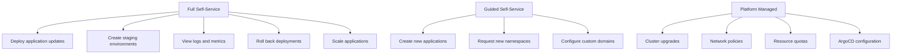
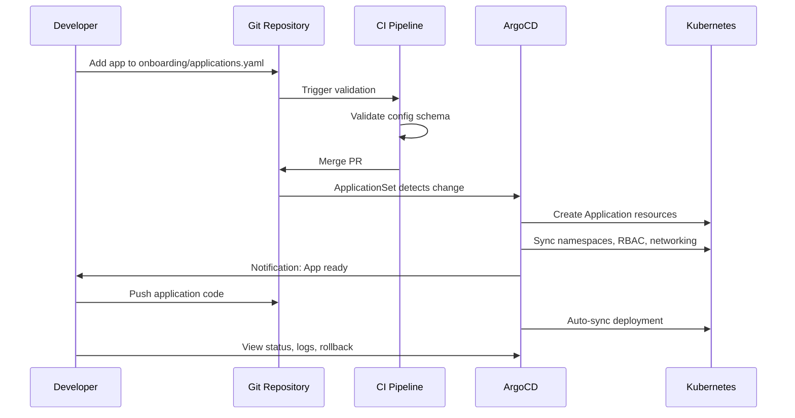

# How to Implement Developer Self-Service with ArgoCD

Author: [nawazdhandala](https://github.com/nawazdhandala)

Tags: ArgoCD, GitOps, Kubernetes, Platform Engineering, Self-Service

Description: Learn how to implement developer self-service deployment workflows with ArgoCD using ApplicationSets, RBAC, and automated onboarding for reduced lead times.

---

Developer self-service means teams can deploy, configure, and manage their applications without filing tickets or waiting for the platform team. ArgoCD is built for this model - its declarative approach lets developers define what they want in Git, and ArgoCD makes it happen. But enabling true self-service requires careful design of permissions, automation, and guardrails.

This guide covers building a self-service platform where developers can create new applications, manage environments, trigger deployments, and view logs without platform team involvement.

## The Self-Service Spectrum

Not everything should be self-service. Here is a practical breakdown:



## Step 1: Automated Application Onboarding

Use a Git-based onboarding flow where developers create a PR to register their application.

```yaml
# onboarding/applications.yaml
# Developers add entries here via PR
applications:
  - name: checkout-service
    team: commerce
    type: web-service
    environments:
      - staging
      - production
    repository: https://github.com/company/checkout-service
    port: 8080
    healthPath: /health

  - name: inventory-worker
    team: commerce
    type: worker-service
    environments:
      - staging
      - production
    repository: https://github.com/company/inventory-worker
```

An ApplicationSet reads this file and creates all the ArgoCD Applications automatically:

```yaml
# platform/applicationsets/self-service-apps.yaml
apiVersion: argoproj.io/v1alpha1
kind: ApplicationSet
metadata:
  name: self-service-apps
  namespace: argocd
spec:
  generators:
    - matrix:
        generators:
          - git:
              repoURL: https://github.com/company/platform-config.git
              revision: main
              files:
                - path: onboarding/applications.yaml
          - list:
              elementsYaml: "{{ .applications | toJson }}"
    - matrix:
        generators:
          - git:
              repoURL: https://github.com/company/platform-config.git
              revision: main
              files:
                - path: onboarding/applications.yaml
          - list:
              elementsYaml: |
                {{- range .applications }}
                {{- range .environments }}
                - name: {{ $.name }}
                  team: {{ $.team }}
                  type: {{ $.type }}
                  environment: {{ . }}
                  repository: {{ $.repository }}
                  port: {{ $.port }}
                  healthPath: {{ $.healthPath }}
                {{- end }}
                {{- end }}
  template:
    metadata:
      name: "{{team}}-{{name}}-{{environment}}"
      labels:
        team: "{{team}}"
        app: "{{name}}"
        environment: "{{environment}}"
        self-service: "true"
    spec:
      project: "{{team}}"
      source:
        repoURL: "{{repository}}"
        targetRevision: main
        path: "deploy/{{environment}}"
      destination:
        server: https://kubernetes.default.svc
        namespace: "{{team}}-{{environment}}"
      syncPolicy:
        automated:
          prune: true
          selfHeal: true
```

## Step 2: CLI-Based Self-Service

Give developers a CLI tool that wraps ArgoCD operations with team-aware defaults:

```bash
#!/bin/bash
# platform-deploy - Self-service deployment CLI

TEAM=$(git config --get platform.team)
ARGOCD_SERVER="argocd.company.com"

case "$1" in
  create)
    # Create a new application
    APP_NAME=$2
    APP_TYPE=${3:-web-service}

    echo "Creating application: $APP_NAME (type: $APP_TYPE)"

    # Generate config from template
    cat > /tmp/app-config.yaml << EOF
name: $APP_NAME
team: $TEAM
type: $APP_TYPE
environments:
  - staging
  - production
repository: https://github.com/company/$APP_NAME
port: 8080
healthPath: /health
EOF

    # Create PR to add application
    gh pr create \
      --repo company/platform-config \
      --title "Add application: $APP_NAME" \
      --body "Self-service application registration for $APP_NAME"

    echo "PR created. Application will be available after merge."
    ;;

  deploy)
    # Trigger a sync
    APP_NAME=$2
    ENV=${3:-staging}
    argocd app sync "${TEAM}-${APP_NAME}-${ENV}" \
      --server $ARGOCD_SERVER
    ;;

  status)
    # Check application status
    APP_NAME=$2
    ENV=${3:-staging}
    argocd app get "${TEAM}-${APP_NAME}-${ENV}" \
      --server $ARGOCD_SERVER
    ;;

  rollback)
    # Rollback to previous version
    APP_NAME=$2
    ENV=${3:-staging}
    argocd app rollback "${TEAM}-${APP_NAME}-${ENV}" 0 \
      --server $ARGOCD_SERVER
    ;;

  logs)
    # View application logs
    APP_NAME=$2
    ENV=${3:-staging}
    argocd app logs "${TEAM}-${APP_NAME}-${ENV}" \
      --server $ARGOCD_SERVER \
      --follow
    ;;

  scale)
    # Scale application replicas
    APP_NAME=$2
    ENV=$3
    REPLICAS=$4
    echo "Scaling ${TEAM}-${APP_NAME}-${ENV} to $REPLICAS replicas"
    # Update replicas in Git
    ;;

  *)
    echo "Usage: platform-deploy {create|deploy|status|rollback|logs|scale}"
    ;;
esac
```

## Step 3: Ephemeral Environment Self-Service

Let developers create temporary preview environments for pull requests:

```yaml
# platform/applicationsets/preview-envs.yaml
apiVersion: argoproj.io/v1alpha1
kind: ApplicationSet
metadata:
  name: preview-environments
  namespace: argocd
spec:
  generators:
    - pullRequest:
        github:
          owner: company
          repo: checkout-service
          labels:
            - preview
        requeueAfterSeconds: 60
  template:
    metadata:
      name: "preview-checkout-{{number}}"
      labels:
        preview: "true"
        pr: "{{number}}"
      annotations:
        # Auto-delete after 7 days
        platform.company.com/ttl: "7d"
    spec:
      project: commerce
      source:
        repoURL: https://github.com/company/checkout-service.git
        targetRevision: "{{branch}}"
        path: deploy/preview
        helm:
          values: |
            image:
              tag: pr-{{number}}
            ingress:
              host: pr-{{number}}.preview.company.com
      destination:
        server: https://kubernetes.default.svc
        namespace: "preview-{{number}}"
      syncPolicy:
        automated:
          prune: true
          selfHeal: true
        syncOptions:
          - CreateNamespace=true
```

## Step 4: Self-Service Secret Management

Developers need to manage application secrets without platform team help.

```yaml
# Integrate External Secrets Operator with a self-service pattern
# developers/secrets-template.yaml
apiVersion: external-secrets.io/v1beta1
kind: ExternalSecret
metadata:
  name: "{{.app.name}}-secrets"
  namespace: "{{.team}}-{{.environment}}"
spec:
  refreshInterval: 1h
  secretStoreRef:
    name: team-secret-store
    kind: ClusterSecretStore
  target:
    name: "{{.app.name}}-secrets"
  dataFrom:
    - extract:
        # Each team has their own secrets path
        key: "teams/{{.team}}/{{.environment}}/{{.app.name}}"
```

Developers manage their secrets through a simple CLI or web UI that writes to the secrets manager, and External Secrets syncs them to Kubernetes automatically.

## Step 5: Self-Service Domain Configuration

Let developers configure custom domains through Git:

```yaml
# teams/commerce/domains.yaml
domains:
  - host: checkout.company.com
    app: checkout-service
    environment: production
    tls: true

  - host: api.company.com
    app: checkout-service
    environment: production
    path: /checkout
    tls: true
```

An ApplicationSet or controller reads this and creates the Ingress resources:

```yaml
# Auto-generated from domains.yaml
apiVersion: networking.k8s.io/v1
kind: Ingress
metadata:
  name: checkout-service-ingress
  namespace: commerce-production
  annotations:
    cert-manager.io/cluster-issuer: letsencrypt-prod
    nginx.ingress.kubernetes.io/ssl-redirect: "true"
spec:
  ingressClassName: nginx
  tls:
    - hosts:
        - checkout.company.com
      secretName: checkout-tls
  rules:
    - host: checkout.company.com
      http:
        paths:
          - path: /
            pathType: Prefix
            backend:
              service:
                name: checkout-service
                port:
                  number: 8080
```

## Step 6: Self-Service Observability

Developers should be able to view their application's health without asking anyone:

```yaml
# Auto-generated ServiceMonitor per application
apiVersion: monitoring.coreos.com/v1
kind: ServiceMonitor
metadata:
  name: "{{ .app.name }}-monitor"
  namespace: "{{ .team }}-{{ .environment }}"
spec:
  selector:
    matchLabels:
      app.kubernetes.io/name: "{{ .app.name }}"
  endpoints:
    - port: http
      path: /metrics
      interval: 30s
```

Link to [OneUptime](https://oneuptime.com) dashboards that are auto-provisioned per application for unified monitoring.

## Self-Service Workflow



## Measuring Self-Service Success

Track these metrics to ensure self-service is working:

- **Time to first deployment**: How long from app registration to first deploy
- **Ticket reduction**: Platform team tickets should decrease
- **Deployment frequency per team**: Should increase as friction decreases
- **Failed deployments**: Should remain stable or decrease with guardrails

## Conclusion

Developer self-service with ArgoCD is achieved by combining ApplicationSets for automated onboarding, proper RBAC for scoped access, CLI tools for common operations, and ephemeral environments for preview workflows. The key insight is that self-service does not mean no governance. It means encoding governance into automation so that compliance happens automatically. Developers get speed, platform teams get control, and the organization gets faster software delivery.
